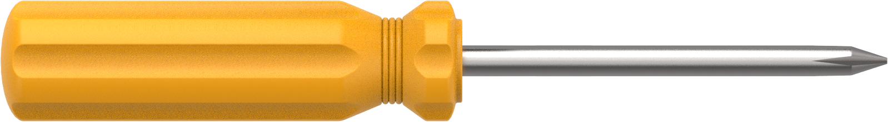
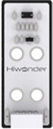

# 1. Getting Ready

## 1.1 MaxArm Introduction

Powered by `ESP32` microcomputer, MaxArm robotic arm with `Wi-Fi` and `Bluetooth` communication functions uses `Micro-Python` for programming. Besides the various operation functions of traditional desktop robotic arm, MaxArm is developed with expansion interfaces. It is easy and efficient to explore more secondary development projects with sensor kit and `Python` editor software.

Provide `Python` library files for various basic operations of `ESP32` microcomputer, various sensors and comprehensive application case programs for implement color sorting, ultrasonic detection and inverse kinematic operations. In the meantime, the provided abundant tutorial and open-source code get you experience MaxArm at once!

**1.1.1 Tutorial Overview**

Step 1: Learn about MaxArm Robotic Arm
Please go to folder **"1.Getting Ready"** to get basic understanding of MaxArm structure and its status after powering on.

Step 2: Quick User Experience
Learn about how to quickly control MaxArm by app and mouse in folder **"2. Remote Control"**.

Step 3: MaxArm PC Software Learning
In folder **"3. PC Software"**, learn PC software and action programming systematically. Master the operations of PC software, the programming of a simple action, call the programmed action via app and how to integrate actions and offline running.

Step 4: Secondary Development Learning
Please go to folder **"4.Secondary Development"** to learn library file and editor, then master the electronic module and basic programming knowledge through basic lesson. In addition, users who purchased the sensor kit are able to learn the combination of sensors and robotic arm for scenario simulation examples through PBL project programming.

Step 5: Advanced Lesson
In folder **"5. Advanced Lesson"**, learn how to drive the servo, air pump and other hardware knowledge, as well as through the study of inverse kinematics, you can understand the robot arm movement, path planning and other underlying knowledge.

## 1.2 Packing List

| NO.  | **Components**         | Quantity | **Picture**                                                  |
| ---- | ---------------------- | -------- | ------------------------------------------------------------ |
| 1    | Assembled robotic arm  | 1        |  |
| 2    | 4*4cm colored blocks   | 3        |  |
| 3    | Power adapter          | 1        |  |
| 4    | USB cable              | 1        |  |
| 5    | Suction cups           | 2        |  |
| 6    | Screwdriver            | 1        |  |
| 7    | Cables and accessory   | 1        |   |
| 8    | Color sensor           | 1        |  |
| 9    | Light sensor           | 1        |  |
| 10   | Luminescent ultrasonic | 1        |  |
| 11   | Touch sensor           | 1        |  |

## 1.3 First Start MaxArm

### 1.3.1 Suction Cups Assembly

After getting ArmMax, please assemble the suction cups first according to the following operation steps and fix robotic arm on a flat desktop.

* **Take out the suction cup accessory bag.**

(1) Assemble the suction cups into the four holes of the base, as shown in the figure below.

(2) Then fix the suction cups with bolts.

(3) The result of the suction cup assembly is shown in the figure below.

### 1.3.2 Power Adapter Connection

Use power adapter to supply robotic arm power. The specification of MaxArm adapter is 12V 5A. Connect the power adapter to the power port of control board, as shown in the figure below.

### 1.3.3 Connect USB Cable

Take out the provided USB cable. Connect the controller with your computer, as shown in the figure below.

### 1.3.4 Power on

After connecting, turn on the controller (push the switch to `ON`). At this time, the red indicator on controller will light up. When `LED1` keeps flashing and buzzer makes `DiDi` sound, MaxArm is powered on successfully, as shown in the figure below:

