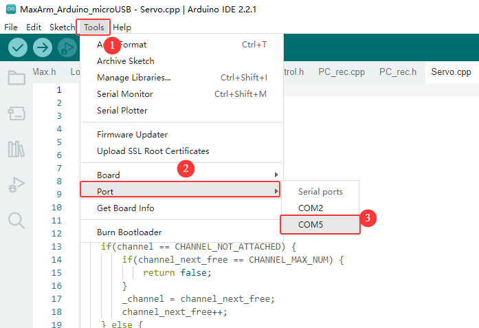

# 10. MaxArm Serial Communication

## 10.1 Principle of Device Master-Slave Communication

### 10.1.1 Preface

This chapter aims to introduce the detailed information about the master-slave relationship during the communication between MaxArm and various devices such as STM32, 51 microcontroller, Arduino, and Raspberry Pi, which can help users to master how MaxArm functions as a slave device to communicate with other devices and how other devices act as master controllers to control MaxArm.

Throughout this chapter, MaxArm serves as a slave device, communicating with other devices via UART serial communication for data transmission.

### 10.1.2 Master-Slave Relationship

* **The Functions of MaxArm as the Slave Device**

(1) Receive and parse the received signal from the master:

Waiting for serial port signals, if the data received from the serial port is not none, the serial data is parsed according to the communication protocol, and the corresponding functions can be invoked based on the data information.

(2) Call the functionalities of MaxArm according to the received data.

When the signals are parsed, the corresponding MaxArm requires to be invoked. For example, the motion control of bus servo, the motion control of the PWM servo at the end-effector, the working mode of the suction cup at the end-effector.

(3) Data encapsulation and feedback:

When a read command is received, the corresponding read function needs to be invoked. After reading the data, it is encapsulated into a data packet according to the communication protocol and send to the master device.

* **Other Devices as the Masters**

(1) Command Encapsulation and Transmission:

The master needs to encapsulate control commands and data into data packets according to the communication protocol and send them to the device.

(2) Control Coordination :

The master needs to manage the overall system’s collaborative operation, ensuring the smooth communication and operation between MaxArm and other devices, maintaining a goods working state.

(3) Receive Data:

When the master reads the servo status,it sends a read command and then receives status information send by MaxArm to ensure the integrity and correctness of the data. Consequently, it parses the data packet to extract the useful information.

### 10.1.3 Hardware Wiring

Here will use an example of MaxArm connected to a PC:

* **Connect the RXD, TXD, GND of USB adapter to IO32, IO33, GND ports of ESP32 expansion board respectively using Dupont wires.**


(1) Connect the USB adapter into your computer.


### 10.1.4 Data Transmission Format

The default UART serial port data transmission format for MaxArm is as follow:

| **Baud** **rate** | 9600 |
|:---:|:---:|
| **Data** **bits** | 8 |
| **Parity** **bit** | None |
| **Stop** **bit** | 1 |

### 10.1.5 Communication Protocol

| **Frame** **header** | **Function code** | **Data length** | **Data information** | **Check** **bit** |
|:---:|:---:|:---:|:---:|:---:|
| 0xAA 0x55 | func | len | data | check |

> Frame header: when the frame header is received, it indicates data is transmitting. The fixed frame header length is 2 bytes.
>
> Function code: Used to indicate the purpose of an information frame.
>
> Data length: Indicate the amount of the subsequent data.
>
> Data information: Represents the transmitted data.
>
> Parity bit: (Function Code + Data Length + Data) is negated and the low byte is taken.

### 10.1.6 Notice

* **The power source for the master and MaxArm robotic arm can be different, but they must share a common ground when connected to ensure the stable communication voltage levels.**

* **When connecting devices, please note that the TX and RX pins of UART serial port must be crossed, otherwise communication will not be possible.**

## 10.2 Underlying File Analysis

### 10.2.1 Slave End (MaxArm)

* **Low-level Parsing at the Slave End (Arduino Version)**

[Source Code]()

This lesson will explain the low-level program of MaxArm’s slave-side communication control functions, analyzing MaxArm's reception of data from other devices, parsing the data to control MaxArm, and implementing the functionality to send data to other devices.

(1) Communication Connection

① Hardware Connection

MaxArm’s serial communication supports two interfaces, one is the 4-pin interface, suitable for devices with pin interfaces for UART communication, commonly used with Arduino development boards and STM32 development board. The other interface is the micro-USB interface, suitable for devices with USB master interfaces, such as Raspberry Pi, Jetson Nano and others.

**The communication connection for the micro-USB interface is as follow:**


**The communication connection for 4Pin interfaces is as follow:**


② Communication Protocol

The communication protocol for both the master and slave devices in the MaxArm communication routines follows the following format:

| **Frame header** | **Function code** | **Data length** | **Data information** | **Check bit** |
|:---:|:---:|:---:|:---:|:---:|
| 0xAA 0x55 | func | len | data | check |

The annotations of each part of the protocol are as follows:

Frame header: if 0xAA and 0x55 are received sequentially, it indicates that there is data to be received, consisting of a fixed 2 bytes.

Function Code: Used to indicate the purpose of an information frame, consists of 1 byte.

Data Length: Indicates the number of data bits carried by the data frame.

Check Bit: Verifies the correctness of the data frame. If correct, the corresponding function is called; otherwise, the data frame is skipped.

The calculation method for the check bit is: calculate the sum of the function code, data length, and data, then take the complement, and finally, take the low byte, which serves as the checksum.

③ Functions and Corresponding Function Code Instructions

| **Function** **Name** | **Instruction** | **Function** **Code** |
|:---:|:---:|:---:|
| `FUNC_SET_ANGLE` | Set servo angle | 0x01 |
| `FUNC_SET_XYZ` | Set the robotic arm coordinate position | 0x03 |
| `FUNC_SET_PWMSERVO` | Control PWM servo for nozzle | 0x05 |
| `FUNC_SET_SUCTIONNOZZLE` | Control the air pump state | 0x07 |
| `FUNC_READ_ANGLE` | Control servo angle | 0x11 |
| `FUNC_READ_XYZ` | Read robotic arm coordinate position | 0x13 |

(2) Program Interface Parsing

The routines analyzed in this document are located in **“Communication Routine** **Low-Level** **Files** **(Arduino** **Version)->MaxArm_Arduino_microUSB”** in the same directory. The routines for communication using the micro-USB interface are provided, and similar routines for communication using the 4-pin interface are also available, with the difference being the use of different IO ports for communication. This section primarily analyzes the files **"PC_rec.h"** and **"PC_rec.c"**, which are the implementation files for the slave-level communication of MaxArm.

In the **"MaxArm_Arduino_microUSB.ino"** file, which serves as the entry point for the Arduino program, the program flow is as follows:

① Create a Serial Communication Control Object

Create a serial communication object globally, as shown in the following figure:

{lineno-start=}
```cpp
paste source code here.
```


The constructor of the object is invoked during its creation to initialize the serial port baud rate to 9600. This is implemented in the **"PC_rec.c"** file as shown below:

{lineno-start=}
```cpp
paste source code here.
```


② Initialize MaxArm Control Interface

In the `void setup()` function, the buzzer, bus servo interface, end effector interface, PWM servo interface, etc., are initialized, and the robotic arm is reset, as shown in the following figure:

{lineno-start=}
```cpp
paste source code here.
```


③ Receiving, Parsing, and Controlling

In the `void loop()` function, continuously call the `rec_data()` function in a loop to wait for serial port information reception and parse the information to control the MaxArm robotic arm.

**The `void rec_data(void)` function is implemented in the "PC_rec.c" file. Its function is to receive serial port information, parse the serial port information, and control MaxArm or return the read information based on the information. The function flow is as follows: Check if data is received on the serial port. If so, copy the data to the `pk_ctl.data[]` array.**

{lineno-start=}
```cpp
paste source code here.
```


Iterate through the bytes of data in `pk_ctl.data[]`, parse the data according to the communication protocol, and save the correctly received function code, data, etc., in the `pk_ctl.frame` structure variable. Part of the program is as follows:

{lineno-start=}
```cpp
paste source code here.
```


{lineno-start=}
```cpp
paste source code here.
```


Compare the received checksum value with the calculated checksum value to determine whether the received data frame is correct. If received correctly, pass the parsed content to the `deal_command()` function, as shown in the figure:

{lineno-start=}
```cpp
paste source code here.
```


The `deal_command()` function selects the corresponding function to execute based on the function code of the incoming information. The parsing programs for each function are as follows:

*   For the "Set Angle" function, the incoming bytes are converted into three angle values and one time value. Then, each of the three bus servos is controlled to move according to the specified angles.

{lineno-start=}
```cpp
paste source code here.
```


*   For the "Set XYZ Axis Coordinates" function, the incoming bytes are converted into spatial coordinate values and one time value. Then, the coordinate setting interface is called to set the end-point angle coordinates of MaxArm.

{lineno-start=}
```cpp
paste source code here.
```


*   When setting the pulse width of the end-point PWM servo, the incoming byte data is converted into PWM pulse width and time values. Subsequently, the PWM servo setting function is called to set the motion of the PWM servo.

{lineno-start=}
```cpp
paste source code here.
```


*   When setting the end effector nozzle function, the incoming bytes are converted into sub-function codes, and based on the sub-function code, the state of the nozzle is set.

{lineno-start=}
```cpp
paste source code here.
```


*   When reading angle values, the `read_angles()` function is called, and the read angle values are sent to the host device via the serial port.

{lineno-start=}
```cpp
paste source code here.
```


*   When reading XYZ values, the `read_position()` function is called, and the read coordinate values are sent to the host device via the serial port.

{lineno-start=}
```cpp
paste source code here.
```


* **Low-level Parsing at the Slave End (MicroPython Version)**

[Source Code]()

The lesson will explain the MicroPython version of low-level program of MaxArm’s slave-side communication control functions, analyzing MaxArm's reception of data from other devices, parsing the data to control MaxArm, and implementing the functionality to send data to other devices.

(1) Communication Connection

① Hardware Connection

MaxArm’s serial communication supports two interfaces, one is the 4-pin interface, suitable for devices with pin interfaces for UART communication, commonly used with Arduino development boards and STM32 development board. The other interface is the micro-USB interface, suitable for devices with USB master interfaces, such as Raspberry Pi, Jetson Nano and others.

**The communication connection for the micro-USB interface is as follow:**


**The communication connection for 4Pin interfaces is as follow:**


② Communication Protocol

The communication protocol for both the master and slave devices in the MaxArm communication routines follows the following format:

| **Frame header** | **Function code** | **Data length** | **Data information** | **Check** **bit** |
|:---:|:---:|:---:|:---:|:---:|
| 0xAA 0x55 | func | len | data | check |

The annotations of each part of the protocol are as follows:

Frame header: if 0xAA and 0x55 are received sequentially, it indicates that there is data to be received, consisting of a fixed 2 bytes.

Function Code: Used to indicate the purpose of an information frame, consists of 1 byte.

Data Length: Indicates the number of data bits carried by the data frame.

Check Bit: Verifies the correctness of the data frame. If correct, the corresponding function is called; otherwise, the data frame is skipped.

The calculation method for the check bit is: calculate the sum of the function code, data length, and data, then take the complement, and finally, take the low byte, which serves as the checksum.

③ Functions and Corresponding Function Code Instructions

| **Function** **Name** | **Instruction** | **Function** **Code** |
|:---:|:---:|:---:|
| `FUNC_SET_ANGLE` | Set servo angle | 0x01 |
| `FUNC_SET_XYZ` | Set the robotic arm coordinate position | 0x03 |
| `FUNC_SET_PWMSERVO` | Control PWM servo for nozzle | 0x05 |
| `FUNC_SET_SUCTIONNOZZLE` | Control the air pump state | 0x07 |
| `FUNC_READ_ANGLE` | Control servo angle | 0x11 |
| `FUNC_READ_XYZ` | Read robotic arm coordinate position | 0x13 |

(2) Program Interface Parsing

The routines analyzed in this document are located in **“Communication Routine** **Low-Level** **Files** **(MicroPython** **Version)** **File->MaxArm_microPython_microUSB”** in the same directory. This lesson will primary analyze the [“MaxArm_ctl.py”]() file, which is the program file implementing the underlying communication of the MaxArm robot's slave device.

① Constructor

`def _init_(self)` is the constructor of MaxArm message receiving class, where a protocol parser, a buffer for receiving data, a bus servo control object, and a MaxArm robotic arm control object are created, and initializes the protocol parser to start parsing from the first byte of the data packet.

{lineno-start=}
```python
paste source code here.
```


**Communication Protocol Format Enumeration**

This class mainly defines 6 constants, corresponding to the frame header, function code, data length, data and check bit of the communication protocol respectively. These constants are sued to provide parsing status when parsing the data packets.

{lineno-start=}
```python
paste source code here.
```


**Command Packet Construction**

Encapsulate control commands and data into a data packet, and subsequently communicate with the master directly in the form of data packets. In the constructor of this class, all variables created in the format of the communication protocol are initialized to 0x00.

{lineno-start=}
```python
paste source code here.
```


**Protocol Parser**

Construct variables related to protocol parsing and buffer:

**state:** Controls the current state of data packet parsing.

**frame:** An object representing a data packet, used for receiving or sending data packets.

**data_index:** Records the number of data processed.

**len:** Length of received data.

**Data:** buffer for receiving data.

{lineno-start=}
```python
paste source code here.
```


② Serial Port Activation Function

The `begin ()` function identifies the serial port to be activated based on the parameter “port” passed to it.

If the value is `PORT_FOR_USB`, it opens the serial port for MicroUSB, where the corresponding pins are: TX->10, RX->9.

If the value is `PORT_FOR_4Pin`, it opens the serial port for the 4-pin interface, where the corresponding pins are: TX->33, RX->32.

Finally, it creates an object for the air pump and sets the servo controlling the nozzle to rotate to the position of 1500 (i.e., the central position).

{lineno-start=}
```python
paste source code here.
```


**The enumeration for Selecting the Open Serial Port**

The value of the parameter **"port"** can be used to select one of two serial ports for activation, with the corresponding parameter values being:

0x01: Activate the USB serial port

0x03: Activate the serial port for the 4-pin interface

{lineno-start=}
```python
paste source code here.
```


③ Reception and Parsing Function

First, use `__uart.read()` to read the data packet from the serial port. If a non-empty data packet is received, assign the length of the received data packet to the variable `data_len`. Then, create two intermediate variables:

**index**: Index for reading the data packet, used to read the data packet sequentially.

**data_index**: Index for reading the data part, used to read the data part of the data packet sequentially.

{lineno-start=}
```python
paste source code here.
```


By using a while loop, start processing the received data packet byte by byte. First, two frame headers are processed. The current part of the data frame being processed is updated based on the state of `self.__pk_ctl.state`.

If the first data frame being processed is `CONST_STARTBYTE1` (that is, 0xAA), indicating it is identified successfully, and then the state is updated to `STARTBYTE2` (that is, switching to identify the second frame header). If failing to identify, the first frame header will be identified again.

{lineno-start=}
```python
paste source code here.
```


When recognizing the second frame header, if it is recognized successfully, the state is set as `FUNCTION` (which is the function code recognition state). If the recognition fails, it goes back to recognize the first frame header.

{lineno-start=}
```python
paste source code here.
```


If the current state is `FUNCTION` (e.i. function code recognition state), it enters the function code recognition state. Here, the state will be first updated to `LENGTH` (e.i. data length recognition state), and then through nested if statements, each function code is recognized one by one. If a valid function code is identified, it is temporarily stored in the variable `frame.function`. Otherwise, the state is updated back to recognizing the first frame header.

{lineno-start=}
```python
paste source code here.
```


If the current state is `LENGTH` (i.e., processing the frame header data length state), the data length in data frame is temporarily stored in the variable `frame.data_length`, then check if the data length is 0. If it is 0, it indicates that the data packet is empty, so the state is directly set as `CHEKSUM` ( processing checksum bit ), and then it jumps directly to the part of handling the checksum. If the data length is not 0, then set the state to `DATA` (processing the frame data state), and proceed to handle the data part.

{lineno-start=}
```python
paste source code here.
```


If the current state is `DATA`, it successfully enters the part of processing the frame data. According to the index variable, start reading the data byte by byte from the first data and store it in the variable `frame.data`. When `data_index` (i.e., the actual received data length) is greater than or equal to the sent data length, it indicates that the reception is complete. Then, set the state to `CHECKSUM` (i.e., processing the checksum state).

{lineno-start=}
```python
paste source code here.
```


When it comes to processing the checksum state, we first extract the checksum part from the data frame. Then, based on the previously read function code, data length, and the sum of all values in the data part, we calculate the checksum using the `checksum_crc8` function in the format of a checksum and assign it to the variable `crc`.

{lineno-start=}
```python
paste source code here.
```


If the calculated checksum matches the checksum in the received data frame, then the checksum is successful. We return the `frame` object to the robotic arm control function for control. After completing these operations, reset the state to the recognition of the first frame header state, and clear all data in the `frame` object to wait for the next data reception or transmission.

{lineno-start=}
```python
paste source code here.
```


If an error occurs during execution, reset the state to recognize the first frame header. Finally, after processing the content of a data frame, decrement the `data_len` variable (remaining data frame length) by one, and increment the index variable (data frame index during processing) by one.

{lineno-start=}
```python
paste source code here.
```


④ Robotic Arm Control Function

The `deal_command()` function has one parameter: `ctl_com`, which is an object representing a data packet in the same format as the communication protocol. It is used to control the robotic arm. At the beginning of the function, the length of the data in the packet is obtained to facilitate the subsequent data reading.

{lineno-start=}
```python
paste source code here.
```


Then, based on the function code in the data packet, the function determines the functionality that the current data packet implements.

{lineno-start=}
```python
paste source code here.
```


If the recognized function code is invalid, the function passes and exits.

**Set Servo Control Angle**

If the data length is 8, it is considered valid data. The function reads the angles of the three servos from the data packet using the `angles` array. In the `ctl_com.data`, indices 0, 2, 4 represent the low 8-bit values of the angles for each servo, while indices 1, 3, 5 represent the high 8-bit values of the angles for each servo. Indices 6 and 7 represent the low 8-bit and high 8-bit values of the servo rotation time, respectively.

Finally, the `arm.set_servo_in_range()` function is called to control the servos to rotate to the corresponding positions based on the read angles and time.

{lineno-start=}
```python
paste source code here.
```


**Control Servo by Setting Coordinates**

Convert the data at indices 0 to 6 of `ctl_com.data` to spatial coordinate values, then combine the data at indices 6 and 7 into a 16-bit runtime, and control the robotic arm to rotate in the spatial coordinate system using the `set_position()` function.

{lineno-start=}
```python
paste source code here.
```


**Control PWM Servo on Nozzle**

The data length for controlling PWM servos in the data packet is only 4. In `ctl_com.data`, indices 0 and 1 contain the low 8-bit and high 8-bit values of the servo rotation angle, respectively, while indices 2 and 3 contain the low 8-bit and high 8-bit values of the timing time. Finally, the data is output to the PWM servo using the `nozzle.set_pwmservo_pul()` function.

{lineno-start=}
```python
paste source code here.
```


**Control Air Pump**

We can categorize the pump into three states:

State 1: Pump on, in this state, the pump starts suction. Corresponding control command: `nozzle.on_uart()`.

State 2: Pump off while opening the air valve to release air. In this state, the pump releases air. Corresponding control command: `nozzle.on_uart1()`.

State 3: Close the air valve, and the pump is completely powered off. Corresponding control command: `nozzle.on_uart2()`.

{lineno-start=}
```python
paste source code here.
```


**Read Servo Angle**

When the function code is for reading servo angles, the `arm.read_angle()` function is used to read the positions of the servos. Then, the data is encapsulated into a data packet format according to the communication protocol, and this data packet is returned to the host.

{lineno-start=}
```python
paste source code here.
```


**Read Robotic Arm Coordinate Position**

When the recognized function code is for reading the position of the robotic arm in the coordinate system, we use the `arm.read_position()` function to read the position in the coordinate system. Then, we encapsulate it into a data packet format and send it back to the master.

{lineno-start=}
```python
paste source code here.
```


### 10.2.2 Master End

* **Arduino Development Board Communication Routine Analysis**

[Source Code]()

This lesson explains the Arduino-based low-level program for communication control as the host, analyzing the implementation of Arduino's encapsulation and transmission of data to MaxArm.

(1) Communication Connection

① Hardware Wiring

MaxArm has two types of serial communication interfaces: one is the 4-pin interface, which is suitable for devices with pin interfaces for UART communication, commonly used for Arduino development boards, STM32 development boards. The other is the microUSB interface, suitable for devices with USB host interfaces, such as Raspberry Pi, Jetson Nano, etc. Here, we need to connect to MaxArm's 4-pin interface for communication.

**The communication connection for 4Pin interfaces is as follow:**


The specific pin connections are as follow:

MaxArm's IO32 pin serves as the RX signal pin, connected to pin 6 of the Arduino development board.

MaxArm's IO33 pin serves as the TX signal pin, connected to pin 7 of the Arduino development board.

MaxArm's GND pin is connected to the GND pin of the Arduino development board.

② Communication Protocol

The communication protocol for both the master and slave devices in the MaxArm communication routines follows the following format:

| **Frame header** | **Function code** | **Data length** | **Data information** | **Check** **bit** |
|:---:|:---:|:---:|:---:|:---:|
| 0xAA 0x55 | func | len | data | check |

The annotations of each part of the protocol are as follows:

Frame header: if 0xAA and 0x55 are received sequentially, it indicates that there is data to be received, consisting of a fixed 2 bytes.

Function Code: Used to indicate the purpose of an information frame, consists of 1 byte.

Data Length: Indicates the number of data bits carried by the data frame.

Check Bit: Verifies the correctness of the data frame. If correct, the corresponding function is called; otherwise, the data frame is skipped.

The calculation method for the check bit is: calculate the sum of the function code, data length, and data, then take the complement, and finally, take the low byte, which serves as the checksum.

③ Functions and Corresponding Function Code Instructions

| **Function Name** | **Instruction** | **Function Code** |
|:---:|:---:|:---:|
| `FUNC_SET_ANGLE` | Set servo angle | 0x01 |
| `FUNC_SET_XYZ` | Set the robotic arm coordinate position | 0x03 |
| `FUNC_SET_PWMSERVO` | Control PWM servo for nozzle | 0x05 |
| `FUNC_SET_SUCTIONNOZZLE` | Control the air pump state | 0x07 |
| `FUNC_READ_ANGLE` | Control servo angle | 0x11 |
| `FUNC_READ_XYZ` | Read robotic arm coordinate position | 0x13 |

(2) Program Interface Parsing

The example routine analyzed in this document, demonstrated in the **"arduino_4Pin_MaxArm"** project in the same directory, primarily focuses on the **"MaxArm_ctl.h"** and **"MaxArm_ctl.c"** files. Their main purpose is to encapsulate and send control information to MaxArm.

① Instantiate Serial Port

In `MaxArm_ctl.h` file, define `rxPin` and `txPin` intefaces as 7 and 6 respectively.

{lineno-start=}
```cpp
paste source code here.
```


In the `MaxArm_ctl.cpp` file, instantiate a software serial port and set the communication baud rate to 9600.

{lineno-start=}
```cpp
paste source code here.
```


{lineno-start=}
```cpp
paste source code here.
```


② Calculate Checksum and Function

The function `checksum_crc8()` takes two parameters: `*buf`, which represents the data to be sent, and `len`, which indicates the length of the data. It calculates the checksum by summing up the values of the data bytes and adding the length of the data. Then, it takes the bitwise complement of the sum and extracts the lower 8 bits to obtain the checksum value.

{lineno-start=}
```cpp
paste source code here.
```


③ Encapsulate Data Packet

**Set Servo Angle**

The variable `msg[20]` represents the encapsulated data packet. First, the values of `CONST_STARTBYTE1` and `CONST_STARTBYTE2` are added as the frame header to the first two positions of the `msg` variable. The value of `CONST_STARTBYTE1` is 0xAA, and the value of `CONST_STARTBYTE2` is 0x55. Then, the servo function code and data length are added to the data packet (the function code for this functionality is `FUNC_SET_ANGLE`).

{lineno-start=}
```cpp
paste source code here.
```


Map the angles of each servo from the range of 0 to 240 to the range of 0 to 1000 using `map()` function, and add them to the data packet. Then, split the servo runtime into two bytes in low-high order and add them to the data packet. Finally, add the checksum to the data packet.

{lineno-start=}
```cpp
paste source code here.
```


The encapsulation of a data packet is now complete. By calling the `write()` function, the data packet can be sent via the serial port to the slave device.

{lineno-start=}
```cpp
paste source code here.
```


**Set Servo Angle**

The `set_xyz()` function takes two parameters: `*pos`, which represents the data value to be sent, and `time`, which indicates the time for controlling the servo rotation.

{lineno-start=}
```cpp
paste source code here.
```


In this function, first, the frame header, function code, and data length are stored in the data packet. Specifically, the function code is `FUNC_SET_XYZ`.

{lineno-start=}
```cpp
paste source code here.
```


Copy the position of the coordinate system to the data packet, and simultaneously add the servo runtime (`time`) and the `checksum_crc8` checksum to the data packet.

{lineno-start=}
```cpp
paste source code here.
```


Finally, use the `write` function to send the 13-byte data packet via the serial port to the slave device.

{lineno-start=}
```cpp
paste source code here.
```


**Set End-effector Servo Angle**

The `set_pwmservo()` function has two parameters: `angle` for the servo rotation angle, and `time` for the servo rotation time.

{lineno-start=}
```cpp
paste source code here.
```


First, add the frame header, function code, and data length to the data packet.

{lineno-start=}
```cpp
paste source code here.
```


Limit the servo angle to a valid range, where if the servo angle is greater than 180 degrees, it is set to 180 degrees.

{lineno-start=}
```cpp
paste source code here.
```


Map the servo angle from the range of 0 to 180 to the range of 500 to 2500. Then, store the servo angle and runtime in the data packet in the order of low 8 bits and high 8 bits. Finally, store the checksum in the data packet.

{lineno-start=}
```cpp
paste source code here.
```


Finally, use the `write` function to send the 9-byte data packet via the serial port to the slave device.

{lineno-start=}
```cpp
paste source code here.
```


**Set Nozzle Function**

The `set_SuctionNozzle()` function has one parameter, `func`, which represents the status of the suction nozzle. There are three states:

State 1: Turn on the air pump, it starts suction.

State 2: Turn off the air pump and open the air valve to release air, the pump is in the exhaust state.

State 3: Close the air valve, the pump is completely powered off.

The function encapsulates the air pump status into a data packet in the format of the communication protocol, including frame header, function code, data length, data, and checksum. The function code is `FUNC_SET_SUCTIONNOZZLE`.

{lineno-start=}
```cpp
paste source code here.
```


**Read Angle**

The `read_angles()` function takes one parameter, `*angle`, which stores the servo angles returned from the slave device. This function is mainly used to send a command to the slave device to read the angles, receive and parse the data from the slave device, and then store the parsed servo angle values in the `angle` variable.

{lineno-start=}
```cpp
paste source code here.
```


Here, a data packet with a function code of `FUNC_READ_ANGLE` is first sent, with a data length of 0.

{lineno-start=}
```cpp
paste source code here.
```


After sending the data packet, the function starts to receive the data packet from the slave device. It parses the data packet using the `rec_handle()` function and checks if the function code is 0x11 (0x11 is the function code for reading angles). If the read is successful and the function code is for reading angles, the data read is mapped from the range of 0 to 1000 to the range of 0 to 240 using the `map()` function, and then assigned to the `angle` array. Finally, if the read is successful, it returns true; otherwise, it returns false.

{lineno-start=}
```cpp
paste source code here.
```


**Read xyz**

The `read_xyz()` function takes one parameter, `*pos`, which stores the position of the spatial coordinate system returned from the slave device. This function is primarily used to send a command to the slave device to read the position of the spatial coordinate system, receive and parse the data returned from the slave device, and then store the parsed servo position values in the `pos` variable.

{lineno-start=}
```cpp
paste source code here.
```


Here, a data packet with a function code of `FUNC_READ_XYZ` is first sent, with a data length of 0.

{lineno-start=}
```cpp
paste source code here.
```


After sending the data packet, the function starts to receive the data packet returned from the slave device. It parses the data packet using the `rec_handle()` function and checks if the function code is 0x13 (0x13 is the function code for reading XYZ). If the read is successful and the function code is for reading XYZ, the data read is directly copied to the `pos` array. Finally, if the read is successful, it returns true; otherwise, it returns false.

{lineno-start=}
```cpp
paste source code here.
```


④ Parse Data Packet

The `rec_handle()` function primarily parses the data packets sent by the slave device. It takes two parameters: `*res` is used to store the received data portion, and `func` is used to identify the functionality of the received data packet.

{lineno-start=}
```cpp
paste source code here.
```


First, the function retrieves the length of the data in the serial port and limits the read data length to 30 bytes. It creates a variable `step` as a parsing stage variable and also creates `data[8]` as a buffer for receiving data. `index` is used as a pointer to specify a byte of data in the data packet during parsing.

{lineno-start=}
```cpp
paste source code here.
```


Through a while loop, the function starts parsing based on the length of the received data packet. It reads one byte of data into the variable `rd` and begins parsing according to the `step` variable. Initially, when `step = 0`, it is the phase for parsing the first frame header. If the data read is 0xAA, it is the first frame header, so `step` is incremented to move to the next phase, which is identifying the second frame header. If the identification fails, `step` is reset to 0 to restart the recognition process from the first phase.

{lineno-start=}
```cpp
paste source code here.
```


Here's the parsing for the function code, data length, and data content:

case 2: This phase is for identifying the function code. Based on the `func` parameter passed, it checks if it matches the specified function code. If it does, the function code is stored in the `data` data buffer. If not, `step` is set to 0, returning to phase 1.

case 3: This phase is for identifying the data length. If the received data length is 6 bytes, the value of the data length is stored in the `data` data buffer. Otherwise, it returns to phase 1.

case 4: This phase is for parsing the data content. The function directly stores the read data into the `data` variable. When the number of stored data reaches or exceeds 8 bytes, it moves to the next phase: identifying the checksum.

{lineno-start=}
```cpp
paste source code here.
```


In phase 5, the function calculates the checksum value for the previously obtained data length and data content using the `checksum_crc8()` checksum function. It then compares this checksum value with the checksum read from the received packet. If they are the same, the data parsing is successful; otherwise, it fails, and the function returns to phase 1 to restart the parsing process.

{lineno-start=}
```cpp
paste source code here.
```


* **Raspberry Pi Communication Routine Analysis**

[Source Code]()

(1) Communication Connection

① Hardware Wiring

Please ensure the MaxArm robotic arm connects to the USB port of Raspberry Pi.


② Communication Protocol

The communication protocol for both the master and slave devices in the MaxArm communication routines follows the following format:

| **Frame header** | **Function code** | **Data length** | **Data information** | **Check bit** |
|:---:|:---:|:---:|:---:|:---:|
| 0xAA 0x55 | func | len | data | check |

The annotations of each part of the protocol are as follows:

Frame header: if 0xAA and 0x55 are received sequentially, it indicates that there is data to be received, consisting of a fixed 2 bytes.

Function Code: Used to indicate the purpose of an information frame, consists of 1 byte.

Data Length: Indicates the number of data bits carried by the data frame.

Check Bit: Verifies the correctness of the data frame. If correct, the corresponding function is called; otherwise, the data frame is skipped.

The calculation method for the check bit is: calculate the sum of the function code, data length, and data, then take the complement, and finally, take the low byte, which serves as the checksum.

(2) Program Interface Parsing

The routines analyzed in this document are located in folder of **“Raspberry Pi Routines”**, utilizing examples of communication via microUSB interface. This section mainly analyzes the [“MaxArm_ctl.py”]() file, which is program file for the Raspberry Pi’s communication underlying implementation and has been encapsulated into Raspberry Pi communication class `MaxArm_ctl`:

{lineno-start=}
```python
paste source code here.
```


The usage and parsing of the member functions is as follow:

① Constructor

The constructor of `MaxArm_ctl` class can takes two parameters. Parameter 1 is the port number for the connection between Raspberry Pi and MaxArm, and parameter 2 is the communication baud rate, which is set to 9600.

{lineno-start=}
```python
paste source code here.
```


You can enter the command “`ls /dev/ttyUSB*`” in terminal of Raspberry Pi to view the port number for the connection between Raspberry Pi and MaxArm. When initializing this communication class, it is necessary to first select the appropriate port number for communication, otherwise, the communication fails.

② Function to Set the Angles of Three Bus Servos

The `set_angles()` function is used to set the angles of three bus servos on MaxArm, requiring two parameters. Parameter one is a collections of angles for three servos, and parameter 2 is the servo runtime.

This function decomposes the passed three angle values and runtime into control data of 8 bytes. It construct a complete control frame by adding a frame header, function code 0x01, data length 0x08, control data, and the calculated checksum to a byte array. Consequently, this frame data is sent to MaxArm via a serial port transmission function, enabling control of MaxArm movement.

{lineno-start=}
```python
paste source code here.
```


③ Function to Set End-effector’ XYZ Coordinates

The `set_xyz()` function sets the movement of MaxArm to specific XYZ coordinates, requiring two parameters. Parameter 1 is a collection of XYZ coordinates, and Parameter 2 is the duration of servo motion.

The function decomposes the passed XYZ coordinates and motion time into control data of 8 bytes. It constructs a complete control frame by adding a frame header, function code 0x03, data length 0x08, control data, and the calculated checksum to a byte array. This frame data is then sent to MaxArm via a serial port transmission function, enabling control of MaxArm movement to the corresponding XYZ axis coordinates.

{lineno-start=}
```python
paste source code here.
```


④ Function to Set the Position of PWM Servo at End-effector

The `set_pwmservo()`function sets the movement of end-effector’s PWM servo to the specific angle. It requires two parameters. Parameter 1 is represents the servo angle value, and Parameter 2 denotes the duration of servo motion.

The function transforms the passed servo angle value into the pulse width of the servo, and decomposes the duration of servo motion into control data of 4 bytes.

It constructs a complete control frame by adding a frame header, function code 0x05, data length 0x04, control data, and the calculated checksum to a byte array. This frame data is then sent to MaxArm via a serial port transmission function, enabling control of MaxArm to rotate to the corresponding angle.

{lineno-start=}
```python
paste source code here.
```


⑤ Function to Control the Working Status of the Suction Cup at End-effector

The `set_SuctioNnozzle()` function is used to control the working status of the end-effector’s suction cup. It requires one parameter only, which represents the sub-function code value of the working status of the suction cup. The value involves 1, 2 and 3 corresponding to opening the air pump, closing the air pump and opening the air valve, and closing the air value, respectively.

The sequence of operation the air pump is as follow: when the pump is opened, the suction cup will generate suction force. Then, when the pump is closed and the valve is opened, negative pressure still exists inside the suction cup after the pump is turned off. Opening the valve allows external air to enter, eliminating the negative pressure and completely eliminating the suction force. Finally, the valve is closed.

The function checks whether the passed sub-function code is correct. If correct, it constructs a complete control frame by adding a frame header, function code 0x07, data length 0x01, sub-function code, and the calculated checksum to a byte array. This frame data is then sent to MaxArm via a serial port transmission function, enabling control of the working status of the end effector's suction nozzle on MaxArm.

{lineno-start=}
```python
paste source code here.
```


⑥ Function to Read Bus Servo Angle

The `read_angles()` function reads the angles of the bus servos on MaxArm. This function returns a collection of angles containing three elements, each representing the angle of one bus servo.

The program flow of this function is as follows: first, it sends a command to read the angle values. After waiting for 0.1 seconds, it receives the data frame sent through the serial port. Then, it extracts and parses the angle values from the received data frame, and finally returns the results.

{lineno-start=}
```python
paste source code here.
```


⑦ Function to Read XYZ Coordinates of End-effector

The `read_xyz()` function reads the XYZ coordinates of the end effector on MaxArm. This function returns a collection with three elements representing the values of x, y, and z.

The program of this function is as follow:

1)  Send a command to request the XYZ coordinates from MaxArm.

2)  Wait for 0.1 seconds, and then receive the data frame sent via the serial port.

3)  Extract and parse the XYZ coordinates from the received data frame.

4)  Return the XYZ coordinates as a collection of three elements.

{lineno-start=}
```python
paste source code here.
```


## 10.3 Control Example

### 10.3.1 Raspberry Pi Control Routine

The document demonstrates the control of MaxArm’s bus servo angles, setting of XYZ coordinates, control of nozzle functionality, and reading of bus servo angles and XYZ coordinates using a Raspberry Pi.

* **Working Principle**

The source code of the program is located in [“10.Serial Communication/ Control Routine/ Raspberry Pi Control Routine/ Routine”`]()`. The specific underlying implementation can be view in the [“MaxArm_ctl.py”]() program file stored in [“10.Serial Communication/ Control Routine/ Raspberry Pi Routine Control/ Raspberry Pi Routine”]()`.

(1) After hardware connection, enter the command `ls /dev/ttyUSB*` via Raspberry Pi’s terminal to view the corresponding device port connecting to MaxArm. The following program uses **"/dev/ttyUSB0"** as an example.

(2) Import `MaxArm_ctl` library, then invoke the `MaxArm_ctl.MaxArm_ctl()` function. Input the device port checked in step 1, `“/dev/ttyUSB0”` and initialize the serial baud rate to 9600, otherwise communication cannot be established normally.

{lineno-start=}
```python
paste source code here.
```


(3) By calling the `ma.set_SuctioNnozzle()` function, the control of air pump and solenoid valve can be achieved. For example, take the code `ma.set_SuctioNnozzle(1)` as example, where the parameter **"1"** represents the current mode of operation as opening the air pump. The duration of the venting operation is very short, so the delay for the venting operation can be reduced.


(4) By calling the `ma.set_angles()` function, the control of the bus servo angles can be achieved. For example, using the code `ma_ctl.set_angles(angles , 1000)`, where the first parameter **"angles"** represents the rotation angles. This parameter is a list of length 3, corresponding to the angles required for the rotation of the 3 bus servos. The range of rotation angles is 0°-240°, and the second parameter "1000" represents the running time (in milliseconds), with a duration of 1000 milliseconds in this case.


(5) By calling the `ma.set_xyz()` function, you can set the XYZ coordinates. For example, using the code `ma.set_xyz(xyz , 1000)`, where the first parameter **"xyz"** represents the XYZ coordinates to be set, and it is a list of length 3, and the second parameter "1000" represents the duration of operation (in milliseconds), with a duration of 1000 milliseconds in this case.


(6) By calling the `ma.set_pwmservo()` function, you can control the angle of PWM servos. For example, using the code `ma.set_pwmservo(135, 1000)`, where the first parameter **"135"** represents the angle of rotation for the PWM servo, and the second parameter **"1000"** represents the duration of operation (in milliseconds), with a duration of 1000 milliseconds in this case.


(7) By calling the `ma.read_xyz()` function, you can obtain the current XYZ coordinates of MaxArm. Retrieve the current XYZ coordinate information and print it out.


(8) By calling the `ma.read_angles()` function, you can obtain the current angles of the three bus servos on MaxArm. Retrieve the current information of the bus servo angles and print it out.


* **Preparation**

Please ensure that MaxArm is connected to the USB port of Raspberry Pi.


* **Operation Instructions**

:::{Note}
* The entered command should be case sensitive and “Tab” can be used to complement key words.
:::

(1) Start MaxArm robotic arm and connect to Raspberry Pi system desktop via VNC. The, transfer the routine code to the [`/home/MaxArm/`]() directory.

(2) Click on  in the upper left corner of the desktop, or press “Ctrl+Alt+T” to open the LX terminal.

(3) Input the command to view the corresponding device port.
```bash
ls /dev/ttyUSB*
```

(4) Replace the device port number **"/dev/ttyUSB0"** in the [`main.py`]() file with the port number obtained in step 3).


(5) Enter the command and press Enter to access the directory where the program is stored.
```bash
cd /home/MaxArm
```

(6) Enter the command and press Enter to start the program.
```bash
cd /home/MaxArm
```

(7) If you want to close this file, enter “**Ctrl+C**” in the LX terminal. If the operation fails, you can try pressing "**Ctrl+C**" multiple times

* **Program Outcome**

While the program is running:

(1) Open the air pump to start suction of an object, then release the object after 2 seconds.

(2) Rotate the three bus servos to 90 degrees, then wait for 2 seconds before rotating them to 45, 90 , 90 degrees respectively.

(3) Change the XYZ coordinates of MaxArm to 120/-180/85, then wait for two seconds before changing the XYZ coordinates to -120, -180, 85.

(4) Rotate the PWM servo angle to 135 degrees, then wait for 2 seconds before rotating it to 45 degrees.

(5) Finally, print the current angles of the bus servos and XYZ coordinates in the serial port.

### 10.3.2 Arduino Control Routine

The document demonstrates the control of MaxArm’s bus servo angles, setting of XYZ coordinates, control of nozzle functionality, and reading of bus servo angles and XYZ coordinates using an Arduino controller.

* **Working Principle**

The source code of the program is located in [**“10.Serial Communication->Control Routine->Arduino Control Routine->Arduino Routine->arduino_and_MaxArm->arduino_and_MaxArm”**]()

The specific underlying implementation can be view in the [“MaxArm_ctl.cpp”]() program file stored in [**“10.Serial Communication->Control Routine->Arduino Routine Control->Arduino Routine->arduino_and_MaxArm->arduino_and_MaxArm”**]().

(1) Set the debugging print serial port baud rate to 115200, call the `ma_ctl.serial_begin()` function from the `MaxArm_ctl.h` library to initialize the software serial port communication at a baud rate of 9600.

{lineno-start=}
```cpp
paste source code here.
```


(2) By calling the `ma_ctl.set_angles()` function, you can control the angles of the bus servos. The example of `ma_ctl.set_angles(angles , 1000)` is involved in here.

The first parameter **"angles"** represents the rotation angles. This parameter is a one-dimensional array of length 3, corresponding to the rotation angle for the 3 bus servos. The rotation range is 0°-240°.

The second parameter **"1000"** represents the duration of operation (in milliseconds), with a duration of 1000 milliseconds in this case.

{lineno-start=}
```cpp
paste source code here.
```


(3) By calling the `ma_ctl.set_xyz()` function, the XYZ coordinates can be set. The example of `ma_ctl.set_xyz(xyz[0] , 1000)` is involved in here.

The first parameter **"xyz[0]"** represents the XYZ coordinates to be set, and it is a one-dimensional array of length 3.

The second parameter **"1000"** represents the duration of operation (in milliseconds), with a duration of 1000 milliseconds in this case.

{lineno-start=}
```cpp
paste source code here.
```


(4) The example of `ma_ctl.set_pwmservo(90,1000)` is involved in here.

The first parameter **"90"** represents the angle of rotation for the PWM servo.

The second parameter **"1000"** denotes the duration of operation (in milliseconds), set here to 1000 milliseconds.

{lineno-start=}
```cpp
paste source code here.
```


(5) Utilizing the `ma_ctl.set_SuctioNnozzle()` function enables the control of the air pump and solenoid valve. Consider the code `"ma_ctl.set_SuctioNnozzle(1)"` as an example, where the parameter **"1"** signifies the current operational mode as opening the pump. Given the brief duration of the venting operation, it is advisable to reduce the delay for the venting operation.

{lineno-start=}
```cpp
paste source code here.
```


(6) By invoking the `ma_ctl.read_angles()` function, you can retrieve the angle information of the three current bus servos on MaxArm. Store the read servo angles into the `"read_a"` array and then print them out via the serial port.

{lineno-start=}
```cpp
paste source code here.
```


(7) Utilizing the `ma_ctl.read_xyz()` function allows you to obtain the current XYZ coordinates of MaxArm. Store the retrieved XYZ coordinates into the **"read_x"** array and then print them out via the serial port.


* **Preparation**

(1) Hardware

MaxArm has two types of serial communication interfaces: one is the 4-pin interface, which is suitable for devices with pin interfaces for UART communication, commonly used for Arduino development boards, STM32 development boards. The other is the microUSB interface, suitable for devices with USB host interfaces, such as Raspberry Pi, Jetson Nano, etc. Here, we need to connect to MaxArm's 4-pin interface for communication.The communication connection for 4Pin interfaces is as follow:


The specific pin connections are as follow:

MaxArm's IO32 pin serves as the RX signal pin, connected to pin 6 of the Arduino development board.

MaxArm's IO33 pin serves as the TX signal pin, connected to pin 7 of the Arduino development board.

MaxArm's GND pin is connected to the GND pin of the Arduino development board.

(2) Software

Connect MaxArm robotic arm to Arduino editor according to **“4. Underlying Program Learning->Arduino Development->Set Arduino Development Environment”**.

* **Program Download**

[Source Code]()

(1) Double click to open Arduino IDE.


(2) Click **“File->Open”** in sequence.


(3) Select the program [“arduino_and_MaxArm.ino”]() in the folder [“Serial Communication/ Control Routine/ Arduino Control Routine/ Arduino Routine/ arduino_and_MaxArm”]()`, then click “Open”.


(4) Select the correct model for development board. Click **“Tool->Development Board”** to select **“arduino_and_MaxArm”**. (If the development board model and port number have already been configured in the development environment, you can skip the step.)


(5) Choose the corresponding port number for ESP32 controller in **“Tool -> Port”**. (In this case, the port number of COM5 is used as example. It may vary on different computers, so it is necessary to select the correct one according to your own computer. Do not choose COM1if it appears in here, as it is typically the system communication port instead of the actual port of the development board.)



(6) If you're unsure about the port number, you can right-click on **"This PC"**, then click on **"Properties -> Device Manager"**, and check the port number corresponding to the control board (the one with CH340 is our device).


(7) After the selection, confirm the development board model of **“ESP32 Dev Module”** and port number of **“COM5”** at bottom right corner.


(8) Once confirmed, click on  to verify the program. If the program is error-free, the status area will sequentially display **"Compiling project -> Compilation complete"**. After compilation, it will display information such as the number of bytes used by the current project and program storage space.


(9) After compiling without errors, we click on  to upload the program to the development board. The status area will sequentially display **"Compiling project -> Uploading -> Upload successful"**. Once the upload is successful, the status area will stop printing upload information.


* **Project Outcome**

While the program is running:

(1) Three bus servo rotate to 120, 100 and 120 degrees, respectively.

(2) Change MaxArm’s coordinates to 120/-180/85, and then change to -120/-180/85 after 1.5 seconds.

(3) The PWM servo smoothly transitions its angle from 90 to 45 degrees, and then to 135 degrees.

(4) After a delay of 1.5 seconds, the air pump is activated to start suctioning the object, and after 1.5 seconds, the object is released.

(5) Finally, print the current angles of the bus servos and XYZ coordinates in the serial port.

### 10.3.3 PC Control Routine

The document demonstrates the control of MaxArm’s bus servo angles, setting of XYZ coordinates, control of nozzle functionality, and reading of bus servo angles and XYZ coordinates using an Arduino controller.

* **Working Principle**

(1) After MaxArm is serially connected to TTL, and then connected to a PC for serial communication, enabling serial control of MaxArm through the serial port.

(2) Communication protocol:

> Following uses communication protocols as examples. The format of the protocol instruction packet is as follow:

| **Frame header** | **Function code** | **Data length** | **Data information** | **Check bit** |
|:---:|:---:|:---:|:---:|:---:|
| 0xAA 0x55 | func | len | data | check |

Frame header: if 0xAA and 0x55 are received sequentially, it indicates that there is data to be received, consisting of a fixed 2 bytes.

Function code: Used to indicate the purpose of a message frame.

Data length: Indicates the amounts of the consequent data

Data information: indicate the transmission data information.

Checksum: The checksum is calculated by taking the complement of the sum of the Function Code, Data Length, and Data, and then taking the lower byte.

* **Preparation**

(1) Hardware

Please make sure to properly connect MaxArm robotic arm to PC, otherwise, it will affect the normal communication.

① Connect the RXD, TXD, and GND pins of the USB adapter to the IO32, IO33, and GND interfaces of the ESP32 expansion board, respectively, using Dupond wires.


② Connect the USB adapter to the computer.


(2) Software

Please ensure that the baud rate of the serial port assistant is set to 9600, parity is set to NONE, data bits are set to 8, stop bits are set to 1, and hexadecimal sending is selected, as shown in the configuration below:


* **Project Outcome**

Control MaxArm by sending hexadecimal commands:

(1) **Command** **name**: `FUNC_SET_ANGLE`, command value 0x01,data length 8:

**Description**: Controls the rotation of the bus servos of MaxArm

**Data information**: First, set the angles of the three bus servos, followed by the servo's operating time, totaling 4 values. Each value is split into 2 bytes, with the low byte first and the high byte last.

**Example**: Taking the hexadecimal sequence AA 55 01 08 c8 00 f4 01 f4 01 d0 07 6d as an example, the data information is c8 00 f4 01 f4 01 d0 07. Among them, c8 00 represents servo 1 rotating to position 200, the following two f4 01 correspond to servo 2 and 3 rotating to position 500 respectively, and d0 07 indicates the operating time is 2000ms.


(2) Command Name: `FUNC_SET_XYZ`, command value 0x03, data length 8:

**Description**: Controls the XYZ coordinates of MaxArm.

**Data Information**: First are the coordinates corresponding to XYZ, followed by the operating time, totaling 4 values. Each value is split into 2 bytes, with the low byte first and the high byte last.

**Example**: Taking the hexadecimal sequence AA 55 03 08 78 00 4c ff 55 00 e8 03 f1 as an example, the data information is 78 00 4c ff 55 00 e8 03. Among them, 78 00 represents X coordinate as 120, 4c ff represents Y coordinate as -180, 55 00 represents Z coordinate as 85, and e8 03 represents the operating time as 1000ms.


(3) **Command** **Name**: `FUNC_SET_PWMSERVO`, command value 0x05, data length 4:

**Description**: Controls the rotation of the PWM servo.

**Data** **Information**: There are 2 parameters in total. The first parameter is the angle of rotation for the PWM servo, followed by the operating time, totaling 2 values. Each value is split into 2 bytes, with the low byte first and the high byte last.

**Example**: Taking the hexadecimal sequence AA 55 05 04 D0 07 e8 03 34 as an example, the data information is D0 07 e8 03. Among them, D0 07 represents the servo rotating to position 2000, and e8 03 represents the operating time as 1000ms.


(4) **Command** **Name**: `FUNC_SET_SUCTIONNOZZLE`, command value 0x07, data length 1:

**Description**: Controls the suction nozzle function.

**Data Information**: 1 indicates turning on the vacuum pump, 2 indicates turning off the vacuum pump and opening the air valve, 3 indicates closing the air valve.

**Example**: Taking the hexadecimal sequence AA 55 07 01 02 f6 as an example, the data information is 02, which indicates that the suction nozzle will perform the operation of turning off the air pump and opening the air valve.


(5) **Command** **Name**: `FUNC_READ_ANGLE`, command value 0x11, data length 0:

**Description**: Reads the current angles of the bus servos on MaxArm.

**Data Information**: Since it is a read operation, there is no data information.

**Example:** Taking the hexadecimal sequence AA 55 11 00 EE as an example.


> After sending the data, MaxArm returns the current angles of the three bus servos. Taking the received data AA 55 11 06 60 03 9A 01 C9 02 20 as an example, the data information is 60 03 9A 01 C9 02. Here, 60 03 represents the current position of servo 1 as 873, 9A 01 represents the current position of servo 2 as 410, and C9 02 represents the current position of servo 3 as 713.


(6) **Instruction Name**: `FUNC_READ_XYZ`, command value 0x13, data length 0:

**Description**: Reads the current XYZ coordinates of MaxArm.

**Data Information**: Since it is a read operation, there is no data information.

**Example**: Taking the hexadecimal sequence AA 55 13 00 EC as an example.


After sending the data, MaxArm returns the current XYZ coordinates. Taking the received data AA 55 13 06 61 FF FA FF 60 00 2E as an example, the data information is 61 FF FA FF 60 00. Here, 61 FF represents the X-axis as -159, FA FF represents the Y-axis as -6, and 60 00 represents the Z-axis as 96.

