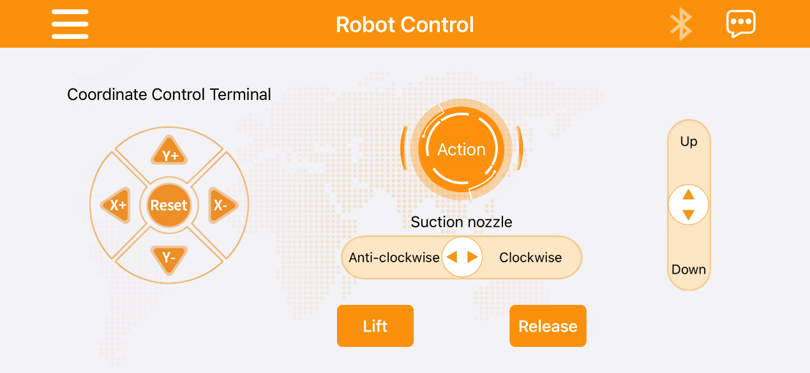
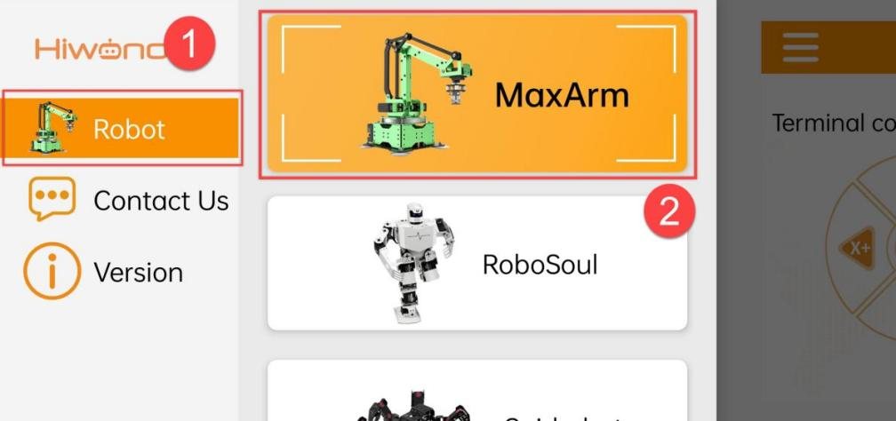
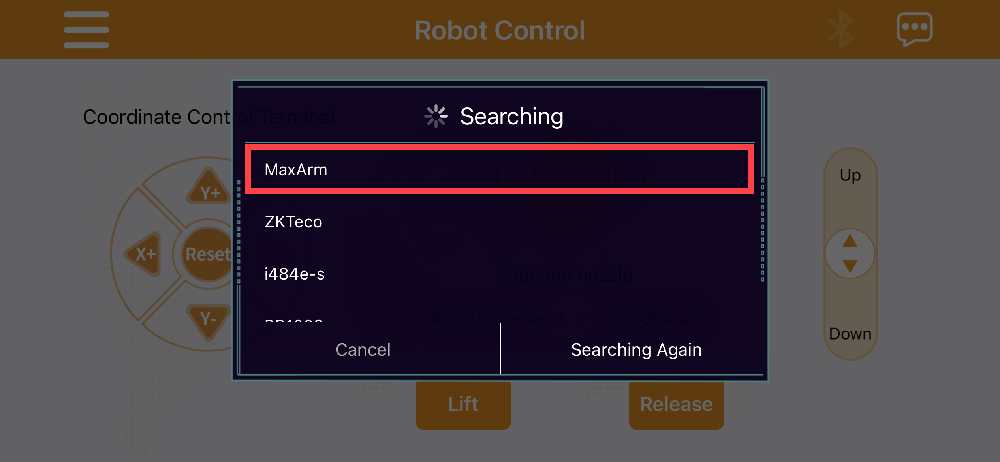
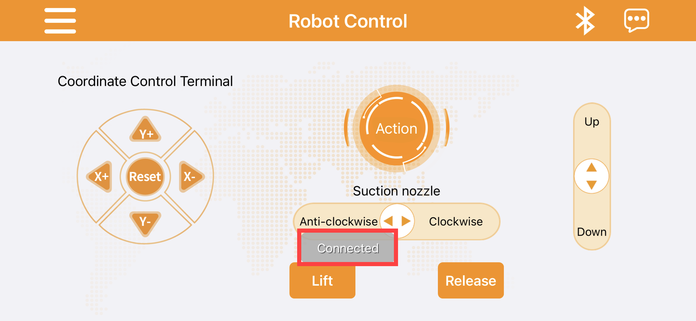
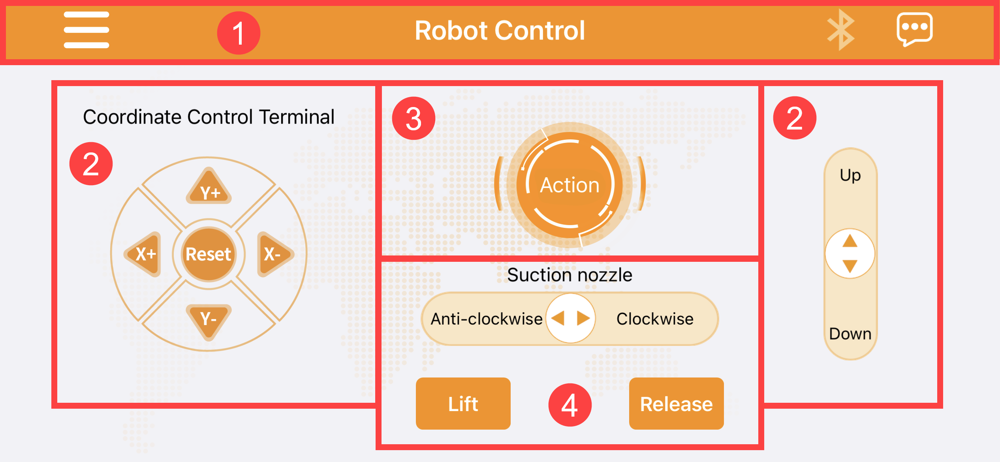
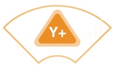
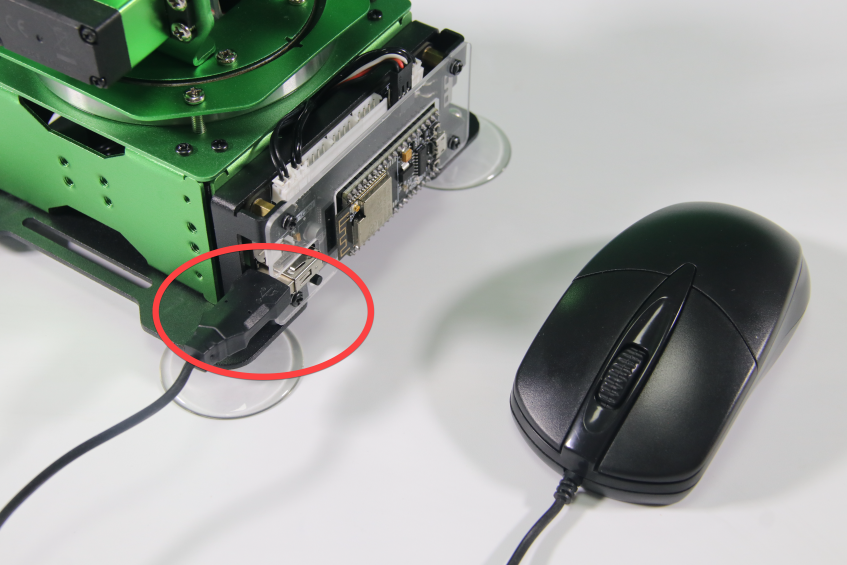

# 2. Remote Control

## 2.1 APP Control

### 2.1.1 App Installation

Android user: you can find the installation package under the same directory and transfer it to your phone to install.

iOS user: please download and install **"Wonderbot Robot"** in App Store.

### 2.1.2 Device Connection
:::{Note}
* Please enable Bluetooth and GPS services in your phone settings before using app.
* Please use the Bluetooth button in app to pair and connect with the device.
* Android user must enable all permissions for app in phone settings, otherwise it may affect the function implementation!
* This lesson takes Android system as example. The requirement for system version: Android 5.0 and above, iOS9.0 and above.
:::

* **Turn on MaxArm and open "Wonderbot". The app main interface is shown in figure below:**

(1) If the main interface does not show up, please click on  icon and click **"Robot"** to select MaxArm.

(2) Click on the flashing Bluetooth icon in the main interface to enter device searching status.

(3) Wait for a moment, then select **"MaxArm"**.

(4) When the Bluetooth icon stops flashing and keeps on, and the prompt **"Bluetooth is connected"** appears, which means robot has been connected successfully.

### 2.1.3 Button Instruction
The app interface consists of four parts, which are menu bar, end effector coordinate control area, action calling area, suction nozzle control area.

* **Menu Bar**
<table>
<colgroup>
<col style="width: 51%" />
<col style="width: 48%" />
</colgroup>
<tbody>
<tr>
<td style="text-align: center;">Icon</td>
<td style="text-align: center;">Function</td>
</tr>
<tr>
<td style="text-align: center;"></td>
<td style="text-align: left;">
Product selection button

Click to select corresponding robot
</td>
</tr>
<tr>
<td style="text-align: center;"></td>
<td style="text-align: left;">
Bluetooth connection button

If icon keeps flashing, Bluetooth is not connected.

If icon keeps on, Bluetooth is connected.
</td>
</tr>
<tr>
<td style="text-align: center;"></td>
<td style="text-align: left;">
Help button

Click on it to check Hiwonder e-mail address and official website.
</td>
</tr>
</tbody>
</table>
(1) End Effector Coordinate Control Area

The left and right sides of the main interface are the **"End Effector coordinate control"** area. Click the corresponding button to control robotic arm to move up and down, left and right, forward and backward. (Long press button for quick movement while short press for slight adjustment. When the robotic arm moves to the limited position, buzzer will alarm. After clicking **"reset"** button, buzzer will make sound and robotic arm will return to the initial position.)

<table>
<colgroup>
<col style="width: 51%" />
<col style="width: 48%" />
</colgroup>
<tbody>
<tr>
<td style="text-align: center;">Icon</td>
<td style="text-align: center;">Function</td>
</tr>
<tr>
<td style="text-align: center;"></td>
<td style="text-align: center;">Control robotic arm to return to the initial posture</td>
</tr>
<tr>
<td style="text-align: center;"></td>
<td style="text-align: center;">
Increase the value of x-axis

MaxArm rotates horizontally to the left
</td>
</tr>
<tr>
<td style="text-align: center;"></td>
<td style="text-align: center;">
Decrease the value of x-axis

MaxArm rotates horizontally to the right
</td>
</tr>
<tr>
<td style="text-align: center;"></td>
<td style="text-align: center;">
Increase the value of y-axis

MaxArm rotates backward
</td>
</tr>
<tr>
<td style="text-align: center;"></td>
<td style="text-align: center;">
Decrease the value of y-axis

MaxArm rotates forward
</td>
</tr>
<tr>
<td style="text-align: center;"></td>
<td style="text-align: center;">
Up: control the robotic arm to move up

Down: control the robotic arm to move down
</td>
</tr>
</tbody>
</table>
(2) Action Calling Area

The upper middle part of interface is **"action group"** area. Click on it to call the action group files downloaded to the robotic arm.

| | |
|:--:|:--:|
| Icon | Function |
|  | Run the custom action group file |

(3) Suction Nozzle Control Area

The lower part of interface is **"suction nozzle control"** area. Click on it to control the rotation and status of suction nozzle.

<table>
<colgroup>
<col style="width: 51%" />
<col style="width: 48%" />
</colgroup>
<tbody>
<tr>
<td style="text-align: center;">Icon</td>
<td style="text-align: center;">Function</td>
</tr>
<tr>
<td style="text-align: center;"></td>
<td style="text-align: left;">
Clockwise: suction nozzle rotates clockwise

Anti-clockwise:suction nozzle rotates counterclockwise
</td>
</tr>
<tr>
<td style="text-align: center;"></td>
<td style="text-align: left;">The air pump starts pumping</td>
</tr>
<tr>
<td style="text-align: center;"></td>
<td style="text-align: left;">The air pump stops pumping</td>
</tr>
</tbody>
</table>

## 2.2 Mouse Control
### 2.2.1 Preparation
* **Refer to [1.Getting Ready->Lesson 2 Start MaxArm]() to turn on robot arm.**

(1) Please prepare a mouse (wired or wireless). Connect mouse cable to USB port on expansion board, as shown in the figure below:

### 2.2.2 Operation Instruction
The operation instruction is shown in the following table:

<table>
<colgroup>
<col style="width: 50%" />
<col style="width: 50%" />
</colgroup>
<tbody>
<tr>
<td style="text-align: center;"><strong>Operation</strong></td>
<td style="text-align: center;"><strong>Outcome</strong></td>
</tr>
<tr>
<td style="text-align: center;">Move mouse in any directions</td>
<td style="text-align: center;">The suction nozzle moves with the mouse</td>
</tr>
<tr>
<td style="text-align: center;">Press left mouse button + move left and right</td>
<td style="text-align: center;">The suction nozzle rotates counterclockwise or clockwise</td>
</tr>
<tr>
<td style="text-align: center;">Scroll mouse wheel up and down</td>
<td style="text-align: center;">The suction nozzle moves up and down along z-axis</td>
</tr>
<tr>
<td style="text-align: center;">Press right mouse button + move in any directions</td>
<td style="text-align: center;">
The air pump starts to pumping

(Right-click mouse to stop pumping)
</td>
</tr>
</tbody>
</table>