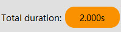
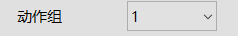
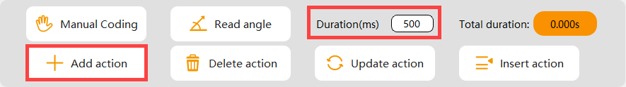
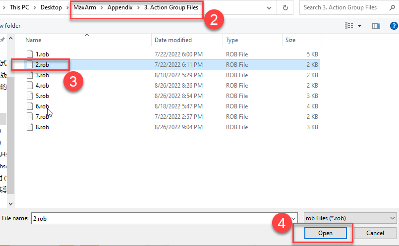

# 3. PC Software

## 3.1 PC Software Interface Introduction

The PC software can control the rotation of individual servo, display the current coordinate, customize the action, etc.

Through PC software, we can control individual servo, control the rotation of robotic arm and edit action group to generate a action group file.

The interface of PC software consists of five parts: status bar, robotic arm control area, action data list, action editing area, action setting area.

### 3.1.1 Status Bar

| Icon | Function |
|:---:|:---:|
|  | Language selection box Select interface language in drop-down list |
|  | Terminal status bar Select device terminal. When the indicator icon is green, it means device is connected. |

### 3.1.2 Robotic Arm Control Area

In this area, control the movement of robotic arm and the status of nozzle suction by setting the values in x, y, and z axes.

The function of each button is shown in the following list:

| Icon | Function |
|:---:|:---:|
|  | Control the robotic arm to return to initial posture |
|  | Increase the value of x-axis MaxArm will rotate horizontally to the left |
|  | Decrease the value of x-axis MaxArm will rotate horizontally to the left |
|  | Decrease the value of y-axis MaxArm will rotate forward |
|  | Increase the value of y-axis MaxArm will rotate backward |
|  | Increase the value of z-axis MaxArm will be lifted |
|  | Decrease the value of z-axis MaxArm will be lowered |
|  | Select the increasing or decreasing value in x, y and z axes. |
|  | Display the real-time coordinate of MaxArm |
|  | Drag slider to control the left and right rotation of suction nozzle. The rotation range is between -90 and 90. |
|  | Control the air pump |

### 3.1.3 Action Data List

The servo value and running time of each action can be viewed in action data list, as shown in the image below:

The parameter instruction is shown in the following list:

| Icon | Function |
|:--:|:--:|
|  | Action number |
|  | Running time of each action (ms) |
|  | The current x-axis value of suction cup |
|  | The current y-axis value of suction cup |
|  | The current z-axis value of suction cup |
|  | The current rotation angle of suction cup (-90°~90°) |
|  | The current status of suction cup (1 for sucking, 0 for releasing) |

### 3.1.4 Action Editing Area

In this area, the edited action can be modified.

The function of each button in action editing area is shown in the following list:

| Icon | Function |
|:---:|:---:|
|  | Loose robot' joints so you can manually deign action. |
|  | Read the angle information of the edited action (use with **"Manual Coding"** button) |
|  | The running time of single action. You can click  to modify. |
|  | The total running time of action group |
|  | Add the current servo value in servo operation area as the last action in action data list |
|  | Delete the selected action in action data list |
|  | Replace the selected value in action data list. (The selected servo values are replaced with the current servo values om servo operation area. ) |
|  | Insert an action in front of the selected action |

### 3.1.5 Action Setting Area

The action group setting area allows you to set the edited action group to run, save, and integrate.

The function of each button in action group setting area is shown in the following list:

| **Icon** | **Function** |
|:---:|:---:|
|  | Click on this button to run all actions in action data list once. If click **"Loop"**, MaxArm will run actions repeatedly. |
|  | Click it to select action group and load it to action data list. |
|  | Save actions displayed in action data list into the specified path. |
|  | After opening an action group, click **"Integrate action file"** to open another action file to integrate them into a new action group |
|  | Action group selection box. Display the action group downloaded to MaxArm in PC software |
|  | Download action group to MaxArm |
|  | Delete the action group file in current action selection box. |
|  | (Caution) Delete all the action group files |
|  | Execute the selected action group once |
|  | Stop running action group |

## 3.2 Import and Download Action

### 3.2.1 Purpose

Import the action group file to PC software interface, and download it to MaxArm.

### 3.2.2 Operation Steps

* **Import Action Group**

(1) Turn on MaxArm.

(2) Double-click  icon and open MaxArm PC software. Then connect device. When the indicator icon turns green, it means MaxArm has been connected.

(3) Click **"Open action file"** in action settings area.

(4) Select action group No.1 saved in the path [**"MaxArm/Appendix/3.MaxArm Action File"**](Appendix.md), and click **"Open"**.

(5) At this time, view the running time and coordinate value of each action of No.1 action group in action data list. (The following screenshot only shows part of actions)

(6) Select the first action in action data list, and then click **"Run"** to run the imported action group.

* **Download Action Group**

(1) After importing action group file, download it to MaxArm. The specific operation steps are as follow:

(2) Click the action selection box in action setting area, and select the action number downloaded to MaxArm in drop-down list. The action number can be selected between 0 and 230.

:::{Note}
The action group No.100 defaults to online running action. The related content can refer to [**"3. PC Software Learning->Lesson 5 Offline Running"**](#anchor_3_5).
:::

(3) Then select 1 as action number (It is recommended that the action name corresponds to action number when downloading action group, for example, No.1 action group is downloaded to 1)

(4) Click **"Download"**.

(5) When the prompt **"Action group is downloaded"** appears, it means action group file has been downloaded to MaxArm.

(6) Click **"Run"** to run the downloaded action group.

(7) If want to delete the downloaded action group, click **"Erase"**. Click **"Erase all"** to delete all action group files saved in 0-230.

## 3.3 Editing Actions

### 3.3.1 Edit Action with PC Software

* **Purpose**

(1) Program an action to make MaxArm suck the block and place it to the side.

(2) This lesson aims to help you master how to program action. If want to refer to the standard action, please view the provided action group file in folder [**"Appendix/3.MaxArm Action Group File"**](Appendix.md).

* **Action Realization**

(1) Action Design

① Turn on MaxArm and connect it to computer with USB cable. Then open PC software.

② Click **"Reset"** to make MaxArm return to the initial posture.

③ Change the running time to **"500"** ms, and click **"Add action"** to add the initial posture of robotic arm as the first action.

④ Click **"Z-"** in end coordinate control area to get MaxArm lower to above the block.

⑤ Place the mouse cursor over **"Z-"** button and hold down the left button to lower MaxArm quickly. Click to make fine adjustments.

⑥ Set the running time to 800ms and click **"Add action"** to add current action to action data list.

⑦ Set the running time to 800ms and click **"Z-"** to lower MaxArm to the top of block. Then click **"Add action"**.

⑧ Click **"Suck"** in nozzle suction control area and set the running time to 500ms. Then click **"Add action"**.

⑨ After sucking the block, click **"Z+"** to lift MaxArm and set the running time to 800ms. Then click **"Add action"**.

⑩ Adjust the value of x and y axes to make MaxArm turn to the left. Set the running time to 1500ms and click **"Add action"**.

⑪ Adjust the value of z-axis to lower MaxArm. Set the running time to 800ms and click **"Add action"**.

⑫ Add a transition action. Set the running time to 200ms and click **"Add action"**.

⑬ Click **"Release"** in suction nozzle control area to put down the block.

(14) Set the running time to 500ms and click **"Add action"**.

(15) Click **"Z+"** to lift MaxArm. Set the running time to 800ms and click **"Add action"**.

(16) Click **"Reset"** ans set the initial posture as the ending action. Then set the running time to 1200ms and click **"Add action"**.

(17) The following table are the compete data of action group. If want to adjust an individual action, you can directly double click the corresponding parameters to modify.

* **Run Action Group**

(1) After action programming , click on running icon, as shown in the image below, to check the running effect of action group.

* **Save and Download Action**

(1) Click **"Save action file"** to save the action file for later debugging. Here the action group file is named with **"20"**.

(2) After saving the action file, download action group to the corresponding action group number. Select **"20"** in action group selection box and click **"Download"**.

(3) After downloading, the prompt **"Action group is downloaded"** will pop up.

### 3.3.2 Manual Coding

* **Purpose**

(1) Through manual coding, program an action to make MaxArm to suck the bloak and place it to the front.

(2) This lesson aims to help you master how to program action. If want to refer to the standard action, please view the provided action group file in folder [**"Appendix/3.MaxArm Action Group File"**](Appendix.md).

* **Action Realization**

* **Action Design**

(1) Turn on MaxArm and connect it to computer with USB cable. Then open PC software.

(2) Click **"Reset"** to make MaxArm return to the initial posture.

(3) Click **"Add action"** to add the initial posture of robotic arm as the first action.

(4) Click **"Manual coding"** to starting editing action. (If the servo can't be twisted, please click **"Manual coding"** again. Do not twist it violently!) Here takes a simple action as example.

(5) Manually lower robotic Arm until the suction nozzle stops at the top of the block. Then click **"Read angle"**.

(6) Set the running time to 200ms and click **"Read angle"** to add a transition action.

(7) Click **"Suck"** in the suction nozzle control area. Then set the running time to 500ms and click **"Read angle"**.

(8) Manually lift the robotic arm and set the running time to 800ms. Then click **"Read angle"**.

(9) Manually stretch the robotic arm to the front. Set the running time to 800ms and click **"Read angle"**.

(10) Set the running time to 200ms and click **"Read angle"** to add a transition action.

(11) Click **"Release"** in the suction nozzle control area to put down the block. Then set running time to 200ms and click **"Read angle"**.

(12) Click **"Reset"** to add the initial posture of robotic arm as the ending action and set the running time to 1000ms. Then click **"Read angle"**.

(13) The following table are the compete data of action group. If want to adjust an individual action, you can directly double click the corresponding parameters to modify.

* **Run Action Group**

(1) After action programming, click on running icon, as shown in the image below, to check the running effect of action group.

* **Save and Download Action**

(1) Click **"Save action file"** to save the action file for later debugging. Here the action group file is named with **"21"**.

(2) After saving the action file, download action group to the corresponding action group number. Select **"21"** in action group selection box and click **"Download"**.

(3) After downloading, the prompt **"Action group is downloaded"** will pop up.

## 3.4 Integrate Action File

### 3.4.1 Purpose
Integrate two action group files into a new action group file.

This lesson will integrate No.2 and No.3 action groups in [**"Action Group File"**](Appendix.md) in Appendix as example.

### 3.4.2 Operation Steps

(1) Turn on MaxArm.

(2) Double-click  icon and open MaxArm PC software. Then connect device. When the indicator icon turns green, it means MaxArm has been connected.

(3) Click **"Integrate action file"** in action setting area, and select and open No.3 action in folder [**"MaxArm/Appendix/3.MaxArm Action Files"**](Appendix.md).

(4) At this time, the parameters of action group can be viewed in action data list.

(5) Click **"Integrate action file"** to select No.2 action group, and double-click to open.

(6) Now, No.2 action group has been integrated.

(7) The prompt **"Files are integrated"** shows up in interface.

(8) Select No.1 action and click **"Run"** to run the new integrated action group once.

(9) Click **"Save action file"** to save the new action group for future debugging, and name the action. (The action name here is **"6"**)

:::{Note}
* It is recommended to name action group with number. Do not have English or Chinese to avoid failure saving.
* The function of **"Integrate action file"** can integrate more action group files.
:::

## 3.5 Offline Running

### 3.5.1 Purpose

MaxArm can be controlled to execute action by pressing offline running button instead of PC software control.

### 3.5.2 Operation Steps

(1) Connect adapter, and connect MaxArm to computer with USB cable. Then turn on MaxArm and open PC software.

(2) Open an action group file ([**5.Appendix/1.MaxArm Action Group File**](Appendix.md)) and import No.2 action group file as example.

(3) Select **"100"** action group number and click **"Download"**.

:::{Note}
* No.100 action group has been set as an offline running action group by default. Other action group numbers are invalid.
:::

(4) After downloading action, the prompt will pop up.

(5) Turn on MaxArm and press the elastic button on expansion board to run No.100 action group. The button position is circled in the following image:

## 3.6 APP Custom

### 3.6.1 Purpose

Execute **"2"** action group file in folder [**"Appendix/MaxArm Action Group File"**](Appendix.md) by app custom function

### 3.6.2 Operation Steps

* **Notices**

(1) Please make sure Bluetooth and GPS services are enabled.

(2) Please confirm No.2 action group has been downloaded to MaxArm. The specific operation method can refer to [**"3.PC Software Learning->Lesson 2 Import and Download Action Group"**](#anchor_3_2).

* **Operation**

(1) Turn on MaxArm and open **"Wonderbot"**.

(2) Refer to [**"2. Remote Control->Lesson 4 App Control"**](2.Remote_Control_formatted.md#app-control) to connect device.

(3) Enter **"Remote Control"** interface.

(4) Click **"Action group"** in the main interface. Then click **"Add"** in the popup window.

(5) Input the name and number of action group in popup window.

:::{Note}
**The action group name can be input arbitrarily but the action group number must be correct. Otherwise the action group can not be executed.**
:::

(6) After adding, click **"Action group"** and click its name to perform once.

(7) This step will be different between iOS and Android user. If want to modify or delete action group, long press its name and click **"Delete"** (Android user). If you're iOS user, swipe the action group name to the left.

