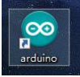
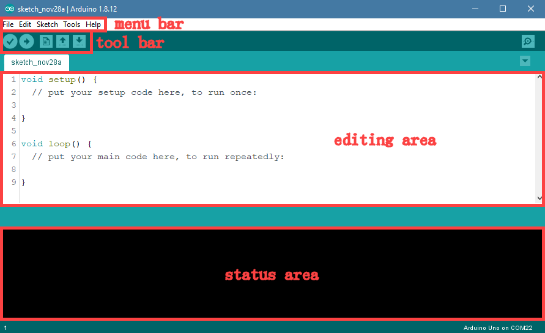
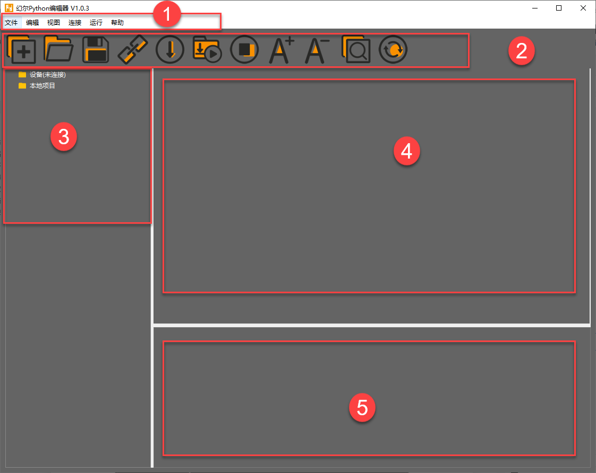
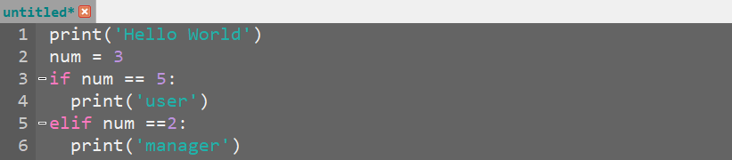

# 4. Underlying Program Learning

## 4.1 Secondary Development Guide

* **Secondary Development Introduction**

(1) Based on the current programs and functions, secondary development is to modify and expand its function and add content to development more application forms.

(2) MaxArm supports `ESP32` and `Arduino` controller so you can choose one of them for secondary development.

(3) Connect the secondary development board to MaxArm first before starting secondary development, then import the library files of the external sensor to MaxArm so as to control MaxArm.

* **Preparation for Secondary Development**

(1) Assembly controller for secondary development. (MaxArm comes with ESP32 controll. No need to install by yourself)

(2) Set development environment. According to the programming environment (Arduino or Python), user can select the corresponding programming software to install. The path to software installation package is [4. Underlying Program/Arduino Development (or Python Development)/ Lesson 1 Set Development Environment](#anchor_4_2).

* **Game Projects**

If you purchased sensor development kit, please go to folder [6. Secondary Development Project](6.Secondary_Development_checked.md) to learn the content about sensor development.

## 4.2 Set Arduino Development Environment

### 4.2.1 Install and Configure Arduino Software

`Arduino IDE` is a powerful software specially designed for Arduino microcontrollers. Regardless of the version, the installation process is the same. This section takes the windows version of the `arduino-1.8.12` as an example.

* **Install Software**

(1) Navigate to the installation package in the folder **"Arduino Installation Package"**, and then double click to install.

(2) Click **"I Agree"**.

(3) Check all the options by default, and click **"Next"** to enter the next step.

(4) Click **"Browser"** and select the path to install. Then click **"Install"**

(5) Wait for the installation to complete.

(6) If you’re prompted to install the chip driver, please click **"Install"**.

(7) After installing, click **"Close"**.

* **Configure Development Board**

After installing software for programming, the development board is required be configured (Please do this while connected to the Internet). Here will provide two configuration methods. Method 1 can directly install the development board package with one-click, which which greatly improves the success rate of installation. Method 2 can online download the development board package so that user can select the different versions of development board package.

(1) Method 1

① Double click on the icon to open the edit interface.

② Then click **"File"**->**"Preference"**.

③ In the opened page, find to the box **"Additional Board Manager URLs"** and paste the link [https://www.arduino.cn/package_esp32_index.json](https://www.arduino.cn/package_esp32_index.json), and then click **"Ok"**.

④ Close the current edit interface (Do not skip this step, otherwise you may fail to configure).

⑤ Find the ESP32 Development Board Package under the same path.

⑥ Then double click to install.

⑦ Wait for the installation to complete, double click top open Arduino software. (If it has been opened already, please close and open it again)

⑧ Click **"Tool"**, and then select **"ESP32 Dev Module"** in the boards options.

All the configurations have been done till now.

:::{Note}
After configuring, the ESP32 development board shown in the above figure can not be found when closing and opening the programming interface again. Please repeat the above steps.
:::

(2) Method 2

① Double click to open the programming software.

② Then click **"File"**->**"Preference"** in sequence.

③ In the opened page, find to the box **"Additional Board Manager URLs"** and paste the link [https://www.arduino.cn/package_esp32_index.json](https://www.arduino.cn/package_esp32_index.json), and then click **"OK"**.

④ Then click **"Tool"**->**"Board"**->**"Boards Manger"**.

⑤ Scroll down to find `esp32` and select the version of development board package in the drop-down list of the version options (it is recommended to select the version above 1.0.5, and here take 2.0.4 version as an example), and then click **"Install"**.

⑥ After installing, click **"Close"**. (It need to take some time to install, please wait patiently. If fail to install, you can repeatedly click **"Install"**.)

### 4.2.2 Open Project

* **Arduino IDE Interface**

(1) Double click to open `Arduino IDE`.

The interface of `Arduino IDE` interface is as follow:

Menu bar: it includes File, Edit, Sketch, Tools and Help.

Tool bar:

| Icon | Function |
|:----:|:----:|
|  | Compile |
|  | Upload button is used for downloading the program to the controller |
|  | Create new program |
|  | Open program |
|  | Save sketch |
|  | Serial monitor is used for viewing the printed content and feedback information |
|Editing area: write the program.|
|Status area: Displays the information such as program compilation and upload. If the program fails, you can scroll up to view the cause of the error.||

* **Compile and Download Program**

(1) Click **"File"**->**"Open"**.

(2) Please go the folder [5. MaxArm Hardware Basic Learning/Arduino Development/ Game Programs](5.Hardware_Basic_Learnig_formatted.md#) or [Appendix/6.Hardware Basic Programs/Arduino Development](), and select the game program suffixed with `.ino`.

(3) Then select the port number in the interface of the opened program. (Here take the port **"COM3"** as example. Please select the port based on your computer. If `COM1` appears, please do not select because it is the system communication port but not the actual port of the development port.)

(4) If you are not sure the port number, please open the **"This PC"** and click **"Properties"**->**"Device Manger"** in turns to check the corresponding port number.

(5) After setting, click on the verify icon in the upper left corner. If the program is correct, wait for a while, the prompt **"Compile complete"** will appear in the lower left corner. In the meantime, the information such as the current used bytes, and occupied program storage space will be displayed in the debug prompt area.

(6) After compiling, click on upload icon. Then check the prompt in the lower left corner.

## 4.3 Python Development

### 4.3.1 Set Development Environment

* **Install Driver**

(1) Open python editor under the same directory, or find in folder [Appendix/4. Software Installtion Package/Python Development](Appendix.md), and then click **"Help"**->**"Install Driver"**.

(2) Find the following content in pop-up website and select driver file according to your Windows system version. Here take WIN10 for example.

(3) Extract the downloaded driver file and double click to open driver program. Take WIN10 64-bit for example.

(4) Then install the driver program according to the prompt.

* **Device Connection**

(1) Connect the adapter to MaxArm.

(2) Connect the ESP32 main chip to your computer with micro-USB cable, and then turn on MaxArm.

(3) Open the Python editor.

(4) Click on the **connect** icon to connect device. After connecting, the **connect** icon will turn green and the prompt will be showed on the lower right corner, as shown in the image below.

:::{Note}
If multiple devices are connected to your computer through serial ports, and the failure connection is prompted, please go to **"Control Panel"**->**"Device Management"** on your computer to check the connection port of ESP32. The name with `CH340` is our device.
:::

(5) Then, back to the editor, and click **"connect"** in menu bar, and then select ESP32 port. In addition. If `COM1` appears, do not select it. (`COM1` is the system communication port in general).

(6) If fail to connect, please refer to the method in tutorial [Appendix/5.Restore ESP32 Board Firmware](Appendix.md) to download the firmware again. After downloading, connect the device.

* **Function Instruction**

| No. | Name | Function |
|:--:|:--:|:--:|
| 1 | Menu bar | It includes File, Edit, View, Connect, Run, Help |
| 2 | Tool bar | It includes some shortcut buttons. |
| 3 | File list | The files includes device file and local file. The contend of the project file (folder, source code, etc) can be displayed and operated. |
| 4 | Coding area | Display source code and the coding area. |
| 5 | Terminal | Used for message log display and debugging functions. When the device is not connected, it can only be used to view message log, and cannot be debugged. |

* **Operation Instruction**
  
(1) Import Local Project

① When importing the local project at the very first time, right click **"Workspace"** to view the file selection list. (You can directly right click **"Workspace"**->**"Change Workspace"** at the next import.)

② Select **"Underlying Program"** in **"5.Appendix"**, and click **"select Folder"**.

③ The files in folder will be automatically added into the workspace. You can view in **"Workspace"**.

:::{Note}
File import is to import the file from your computer to editor, not ESP32 controller.
:::

(2) View the Imported File/Program

Double click the program file in file list to view the detailed code. Take file [ADC->main.py](Appendix.md) as an example:

(3) Download and Run Program

Program download is the interaction between editor and device. Take [ADC->main.py](Appendix.md) as example.

① Open the program `ADC/main.py` in Workspace. Click on the **download** icon in menu bar, or directly right click and select **"download"** the program file.

② The download process and complete status can be viewed in terminal interface.

③ After downloading, the program is saved in the list of **"device"**.

:::{Note}
You can not directly create file in **"device"**, and the files in the **"device"** can only be downloaded to save the modified content.
:::

④ Click on the **reset** icon or press the reset button on ESP32 controller.

⑤ If want to stop the program, click on the **stop** icon. Then the terminal will print the information.

(4) Write and Save Code
  
① Notices

The coding area on the left side of interface supports the functions, such as code create, view, edit, modify and save. There are some tips for you before coding:

**You cannot create file in "device" directly. After editing the file in "device", the modified contend can only be saved by downloading. If need to back up, it is recommended to copy the file to the workshop first.**

Please do not modify the action group file with `.rob` suffix in editor to avoid unknown format errors. It is recommended to do it in PC software.

② Create Program

This section takes writing **"Hello World"** as example to instruct some basic operations:

Click the new file icon in the upper left corner or press `Ctrl+N` to create new file.Input the code `print('Hello World')`, as the figure shown below:

:::{Note}
Please use English punctuation.
:::

Input the following code, as the figure shown below.

:::{Note}
The editor supports automatic indentation of code. In the displayed code, the editor also supports associative reminders, which can be completed by pressing **"Tab"** or **"Enter"**. At the same time, you can find that the key words, such as `if`, `elif`, are highlighted for quick visit.
:::

If need to comment the code, you can select all the codes and then press `Ctrl+/` to comment all. Then select all and press `Ctrl+/` again to uncomment all.

Press `Ctrl` with releasing and scroll mouse wheel to zoom out or zoom in the code.

If need to delete part of code, select and press `Delete` to delete it.

After coding, you can click the check grammar icon to check grammar. Then the checking result will be displayed in terminal interface.

Reminder:It is recommended to check grammar after coding to examine mistake!
  
If need to save code, press `Ctrl+S` shortcut key. Then fill in file name in pop-up window and click "**Ok**". It is recommended to name the file according to the specification of variable naming. Do not use Chinese and spaces to avoid parsing issues after downloading to the device.

:::{Note}
If want to save it as main function `main.py`, it is recommended to name it to other name first, such as `test_main.py`. so that if it gets stuck when debugging the program (shortcut keys `Ctrl+C` and `Ctrl+D` are not working), you just need to reset the control board, delete and re-download the required program.
:::
  
The program file is saved to workspace by default and do not support other saving path. You can right click "**workspace**" , then select **"show in explorer"** to open the directory where the file is located.

If need to change the file location, you can directly copy the file to the corresponding directory.
  
After saving, refer to **"Download and Run Program"**.

(5) Terminal Usage Method (Debugging)

Terminal is the function area integrating information window and debugging window. But it need to be explained that if do not connect device, terminal is for viewing information, not for editing and debugging.

About viewing information, it has been mentioned above. Here we are going to introduce you debugging function.

① The terminal supports code input. Input `print(123)` in terminal and press **"Enter"**. 

The effect is as follow:
  

② In addition, the terminal supports auto-indentation as well. When inputting python statement ending with colon (for example, `if`, `for`, `while`), the prompt will change to **"..."** and the cursor will be indented 4 spaces. When pressing **"Enter"**, the next line will continue to indent 4 spaces as a regular statement based on the previous line, or indent at different level. If press backspace, it will undo one level of indentation.

③ If need to copy the code, right-click to operate in terminal after selecting the target code.
  

Please note that, since the terminal has auto-indentation function, you need to press `Ctrl+E` to enter editing mode before pasting code. Otherwise, indentation error will occur during debugging.

As the figure shown below, it is the correct copied indentation format.

The following figure shows the wrong indentation format:

If need to exit the editing mode, you can press `Ctrl+C`. In addition, if accidentally write an endless loop, you can press `Ctrl+C` to exit.

Reminder: In terminal, the shortcut keys `Ctrl+C` can only be used to interrupt the running program instead of copying, and`Ctrl+V` has no pasting function.

④ When entering command in terminal, **"Tab"** key can be used to automatically fill the code. For example, entering `os` and then pressing **"Tab"** key. The effect is as follow:

If there are multiple types, they will be listed; if there is only one type, it will be automatically filled; If the situations both do not exist, it will be useless.

⑤ After entering commands in terminal, you can view records through pressing **"↑"** **"↓"** on keyboard, which can save the time of entering commands.
  
More commands and command instruction, please visit [http://docs.micropython.org/en/latest/library/uos.html](http://docs.micropython.org/en/latest/library/uos.html).

### 4.3.2 Underlying Program Overview

* **Underlying Program Composition**

The following programs and library files must be contained to implement the complete function of MaxArm.

| `boot.py` | `main.py` | `BusServo.py` | `Key.py` |
|:---:|:---:|:---:|:---:|
| `Buzzer.py` | `Led.py` | `PWMServo.py` | `RobotControl.py` |
| `USBDevice.py` | `SuctionNozzle.py` | `__espmax.mpy` | `espmax.py` |

* **Program Starting Process**

When turning on MaxArm, that it, power on ESP32 controller, it will experience the following steps:

(1) `boot` program is started first. It is the first executed file after starting the system, which is usually an initialization process. If boot is null, just skip it.

(2) Then execute main program and create Bluetooth object. The function libraries in `main.py` are called. When enabling Bluetooth service, the initialization process takes about 10s, which is normal.

(3) After executing the main program, the LED on main controller will flash blue.

:::{Note}
* **All the functions of MaxArm need to be started by `main.py` including reset and boot up operations. If this program is stuck, no other operations can be performed later!**
* **If user want to develop other functions, it is recommended to modify the program name first, such as `Test_main.py`, and run this file manually every time.**
* **Therefore, if some special stuck phenomenon happen (pressing `Ctrl+C` and `Ctrl+D` do not work it out), then you only need to reset controller and delete this program in** **"device"** **list, re-edit and download it!**
:::

* **Program Function Distribution**

The following table is the corresponding function of the underlying programs, which is for reference. Please refer to the detailed code for secondary development.

| **Program** | **Function** |
|:--:|:--:|
| `boot.py` | Initialization Program |
| `main.py` | Main program: use amount of function libraries |
| `BusServo.py` | Control bus servo: based on bus servo bus servo communication protocol |
| `Buzzer.py` | Control buzzer |
| `Key.py` | Control key |
| `Led.py` | Control LED |
| `PWMServo.py` | Control PWM servo |
| `RobotControl.py` | Call the action group of robotic arm |
| `USBDevice.py` | Controller USB driver program: parse serial data |
| `SuctionNozzle.py` | Control suction nozzle |
| `__espmax.mpy` | Kinematics base library: get solution through kinematics |
| `espmax.py` | Kinematic package library: call kinematics base library to get solution and drive servo |