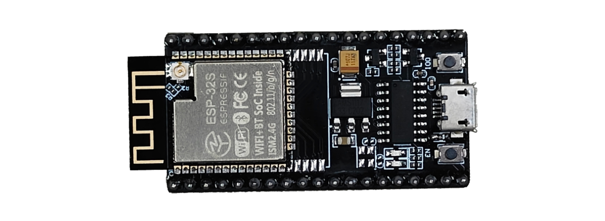
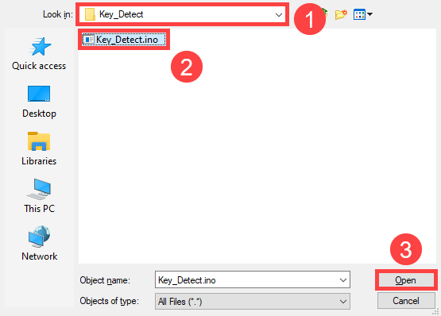
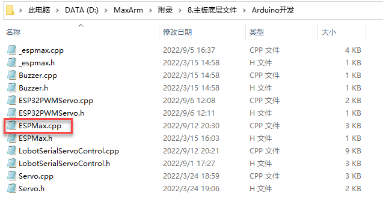
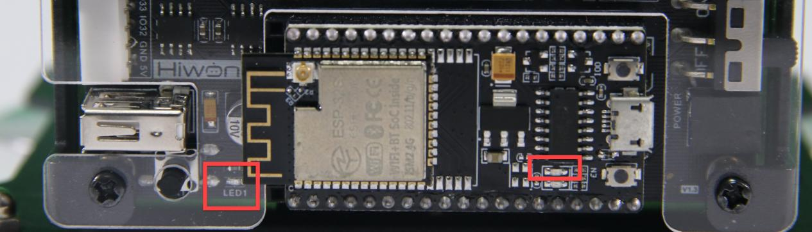
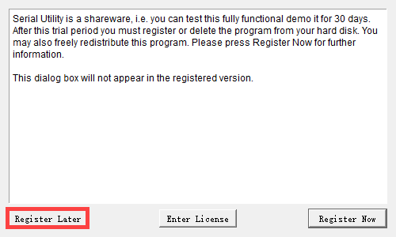
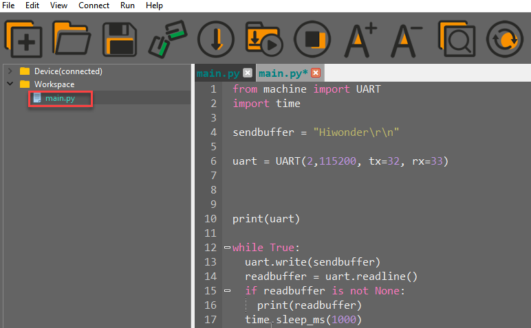
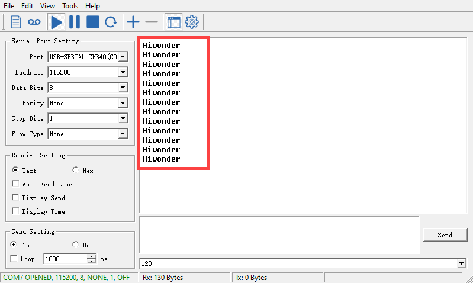

# 5. Hardware Basic Learnig

## 5.1 Arduino Development

### 5.1.1 What is the Inverse Kinematics

This lesson aims at helping users basically learning about the principle of inverse kinematics. The further learning and practical application of the inverse kinematics of robotic arm is available in the folder **"7. Inverse Kinematics Lesson"**

* **What is it?**

Forward kinematics refers to process of obtaining position and velocity of end effector, given the known joint angles and angular velocities. In other word, the position information of end effector can be obtained when then joint angle and linkages parameters are known.

Inverse Kinematics is the inverse function or algorithm of Forward Kinematics. According to the position and post of the end effector along with linkages parameters, the joint position can be calculated, i.e., Given the robot's end-effector positions, inverse kinematics can determine an appropriate joint configuration.

* **Establish Coordinate System**

A coordinate system must be established to describe the motion of an object. MaxArm uses x-y-z axes coordinate system (unit:mm) and takes the the base centre of robotic arm as original point (0,0,0), as the figure shown below.


The correspondence relationship between the movement orientation of end effector and the values of x-y-z axes is shown below (user per se as reference):

| Coordinate axis | control orientation |
|:---:|:---|
| x | Control the end effector of robotic arm to move left or right (As the x value is positive, it moves to the right. As the x value is negative, it moves to the left. ) |
| y | Control the end effector of robotic arm to move forward and backward. (As the y value is negative,it moves backward. As the y value is positive, it moves forward.) |
| z | Control the end effector of robotic arm to move up and down (As the z value is negative, it moves up. As the z value is positive, it moves down.) |

* **Project Operation**

After learning about the principle and spatial concept of inverse kinematics, the control method of inverse kinematics can be mastered by a simple routine. You can follow the steps below to run the game.

(1) Install and connect Arduino. (Please refer to the tutorial in folder **"4. Underlying Files Learning/ Arduino Development/ Lesson 1 Set Development Environment"**)

(2) Double click to open Arduino IDE .


(3) Click **"File->Open"**.


(4) Select the program **"kinematics_demo.ino"** in the folder **"5.MaxArm Hardware Basics Learning/ Arduino Development/ Game Programs/ Program Files/ kinematics_demo"**, and click **"Open"**.


(5) Check the board model. Click **"Tools->Board"** and select **"ESP 32 Dev Module"**. (If the model of development board has been configured when setting the development environment, you can skip this step.)


(6) Select the corresponding port of ESP32 controller in **"Tools->Port"**. (Here take the port **"COM5"** as example. Please select the port based on your computer. If COM1 appears, please do not select because it is the system communication port but not the actual port of the development port.)


(7) If you are not sure the port number, please open the **"This PC"** and click **"Properties->Device Manger"** in turns to check the corresponding port number (the device is with CH340).


(8) After selecting, confirm the board **"ESP32 Dev Module"** in the lower right corner and the port number **"COM5"** (it is an example here, please refer to the actual situation).


(9) Then click on  icon to verify the program. If no error, the status area will display **"Compiling--Compile complete"** in turn. After compiling, the information such as the current used bytes, and occupied program storage space will be displayed.


(10) After compiling, click on  icon to upload the program to the development board. The status area will display **"Compiling--Uploading--Complete"** in turn. After uploading, the status area will stop printing the uploading information.


* **Project Analysis**

[Source Code](../_static/source_code/MaxArm_Hardware_Basic.zip)

The complete program is as follow:

{lineno-start=1}

```c++
#include "ESPMax.h"
#include "_espmax.h"

// Basic inverse kinematics example routine

void setup(){
    ESPMax_init();
    go_home(2000); // Move the robotic arm to the initial position
    Serial.begin(9600);
    Serial.println("start...");
}

bool start_en = true;
void loop(){
  if(start_en){
    float x,y,z;
    float pos[3];
    // Initial XYZ position of the robotic arm
    x = 0;
    y = -(L1 + L3 + L4);
    z = (L0 + L2);
    // Print XYZ coordinates to the serial monitor in millimeters
    Serial.print(x);
    Serial.print("; ");
    Serial.print(y);
    Serial.print("; ");
    Serial.println(z);

    // The initial position is already at the edge of the movable workspace, so move down first; otherwise, the arm cannot move along X and Y axes（
    // set_position(pos,t), pos={x,y,z}; x: X coordinate, y: Y coordinate, z: Z coordinate t: total move time in milliseconds (longer time → slower speed)
    
    pos[0] = x; pos[1] = y; pos[2] = z-100;
    set_position(pos,2000); // Move down 100mm along Z axis relative to initial position
    delay(2000);
    pos[0] = x; pos[1] = y; pos[2] = z;
    set_position(pos,2000); // Restore the arm to its initial posture
    delay(1000);

    start_en = false;
  }
  else{
    delay(500); // Delay 500 milliseconds
  }
}
```

(1) Import function library

Before the robotic arm starts to move, the encapsulation library and underlying library of inverse kinematics need to be imported.

{lineno-start=1}
```C++
#include "ESPMax.h"
#include "_espmax.h"
```
(2) Calculate the initial position of robotic arm

According to the linkage parameters of L0-L4 defined in kinematics underlying library.

{lineno-start=1}
```C++
#ifndef _ESPMAX_H
#define _ESPMAX_H

#define L0      84.4
#define L1      8.14
#define L2      128.4
#define L3      138.0
#define L4      16.8
```


Calculate the initial position of the end effector. (Use the L0-L4 values to get x=0, y=162.94, z=212.8)

{lineno-start=18}
```python
    // Initial XYZ position of the robotic arm
    x = 0;
    y = -(L1 + L3 + L4);
    z = (L0 + L2);
```

(3) Control robotic arm

Use the function `set_position()` to control the end effector to move.

Take the code `set_position(pos,2000)` as example.

{lineno-start=32}
```C++
    pos[0] = x; pos[1] = y; pos[2] = z-100;
    set_position(pos,2000); // Move down 100mm along Z axis relative to initial position
    delay(2000);
    pos[0] = x; pos[1] = y; pos[2] = z;
    set_position(pos,2000); // Restore the arm to its initial posture
    delay(1000);
```

The first parameter **"pos"** is a set of valuea representing the position values of the end effector on x-y-z axis.

① **"pos[0]"** represents the x-axis value of the initial position of the end-effector.

② **"pos[1]"** represents the the y-axis value of the initial position of the end-effector.

③ **"pos[2]"** represents the end-effector moves down to 100mm. And the position of the end effector can be set by modifying the x,y and z values.

④ For example, if want to control the end-effector to move 200mm to the left. (its position relative to the original moves to 200mm to the left), set x value plus 200. If want to move to 200 to the right, set x-200.

⑤ If want to directly move to the set position, for example, move to 200mm on x axis, you just need to set x=200.

⑥ The second parameter **"2000"** is the running time and the unit is ms.

* **Inverse kinematics library analysis**

The path to the inverse kinematics library: [Appendix/8. Controller Underlying Files/ Arduino Development/ espmax.py](Appendix.md)


(1) Import head file and define pin

{lineno-start=1}
```c++
#include "ESPMax.h"
#include "_espmax.h"
#include "LobotSerialServoControl.h"
```

Import the inverse kinematics and servo head files.

{lineno-start=5}
```c++
#define SERVO_SERIAL_RX   35
#define SERVO_SERIAL_TX   12
#define receiveEnablePin  13
#define transmitEnablePin 14
HardwareSerial HardwareSerial(2);
LobotSerialServoControl BusServo(HardwareSerial,receiveEnablePin,transmitEnablePin);
```

Define the serial communication pin.

(2) Initialization

{lineno-start=12}
```C++
float ORIGIN[3] ={ 0, -(L1 + L3 + L4), (L0 + L2)};
float positions[3];

void ESPMax_init(){
    BusServo.OnInit();
    HardwareSerial.begin(115200,SERIAL_8N1,SERVO_SERIAL_RX,SERVO_SERIAL_TX);
}
```

`ORIGIN[3]` is the initial position of the end effector calculating from the linkage length.

The function `ESPMax_init()` is used for initialization

The function `BusServo.OnInit()` is the servo configuration initialization. `HardwareSerial.begin()` is serial communication configuration. **"115200"** is the baud rate. **"SERIAL_8N1"** refers to the working mode. **"SERVO_SERIAL_RX"** is the pin number of RX port. **"SERVO_SERIAL_TX"** is the pin number of TX port.

(3) Control a single servo

{lineno-start=20}
```C++
int set_servo_in_range(int servo_id, int p, int duration){
    if(servo_id == 3 & p < 470) p = 470;
    if(servo_id == 2 & p > 700) p = 700;
    BusServo.LobotSerialServoMove(servo_id, p, duration);
    return int(1);
}
```

The function `set_servo_in_range()` is used to control the movement of a single servo, and limit the position of servo ID2 and ID3. The ID3 Servo can not be less than 470 impulse and the No.4 can not be less than 700. The parameter **"servo_id"** is servo ID number and the parameter **"p"** is servo impulse. The parameter **"duration"** is the running time.

The function `BusServo.LobotSerialServoMove()` in BusServo library controls a single servo to move.

(4) Calculate servo pulse

{lineno-start=27}
```C++
float* position_to_pulses(float pos[3], float* pul){
    float angles[3];
    inverse(pos,angles);
    deg_to_pulse(angles,pul);
    return pul;
}
```

The function `position_to_pulses()` is used to calculate the servo pulse. The parameter **"position"** is position coordinate. **"”angles”"** is servo angle. **"pulse"** is servo pulse. Then the value of servo pulse will be returned.

The function `inverse()` is used to calculate the servo angle according to the coordinates.

The function `deg_to_pulse()` is used to calculate the servo pulse according to the servo angle.

(5) Calculate robotic arm position

{lineno-start=34}
```C++
float* pulses_to_position(float pul[3], float* pos){
    float joints[3];
    pulse_to_deg(pul,joints);
    forward(joints,pos);
    return pos;
}
```

The function `pulses_to_position()` is used to calculate the coordinate of robotic arm position. The parameter `pul[3]` is servo pulse. The coordinate of robotic arm is calculated according to the servo pulses, and then the coordinate value is returned.

(6) The movement of robotic arm

{lineno-start=41}
```c++
int set_position(float pos[3], int duration){
    float x = pos[0];
    float y = pos[1];
    float z = pos[2];
    if(z > 255) z = 255;
    if(sqrt(x*x + y*y) < 50) return int(0);
    float angles[3];
    inverse(pos,angles);
    float pul[3];
    deg_to_pulse(angles,pul);
    for(int i=0; i<3; i++){
        positions[i] = pul[i];
        BusServo.LobotSerialServoMove(i+1,pul[i],duration);
        delay(2);
    }
    return int(1);
}
```

The function `set_position()` is used to control the robotic arm to move, and add the position limit. The parameter **"position"** is the position coordinate and the **"duration"** is the running time.

Use judgement statement to limit the robotic arm position. The coordinate of z-axis can not be greater than 225. The root of the sum of the squares of the x and y axes coordinates should be greater than 50, which means the end effector should be outside the circle with the coordinate origin as the center and the radius of 50. The unit is millimeter.

Then use **"for"** to control the ID1, ID2 and ID3 servos to rotate.

(7) Back to the initial position

{lineno-start=83}
```C++
void go_home(int duration){
    set_position(ORIGIN, duration);
}
```

The function `go_home()` is used to get robotic arm back to the initial position. The parameter **"duration"** is the running time and the parameter `self.set_position()` is to control robotic arm to move. The parameter **"ORIGIN"** is the coordinate of the initial position set in program.

(8) Read position coordinate

{lineno-start=93}
```C++
float* read_position(float* pos){
    float pul[3];
    for(int i=0; i<3; i++){
        pul[i] = BusServo.LobotSerialServoReadPosition(i+1);
    }
    pulses_to_position(pul,pos);
}
```

Use the function `self.bus_servo.get_position()` to get the pulse value of servo ID1, ID2, and ID3.

Get the x,y,z position coordinate by calculating the robotic arm position function `pulses_to_position()`. Then the x, y and z values are obtained.

### 5.1.2 About Servo

MaxArm uses three HTS-35HV and one LFD-01M digital servos in total.

* **HTS-35H Bus Servo**

(1) Servo Introduction


HTS-35H bus servo is controlled by serial port commands. The serial port baud rate is 115200. Servo parameters and ID are required to be set before controlling.

The interface of this servo is a half-duplex UART asynchronous serial interface so that the signal terminal can send and receive signals. It is widely applicable to different robotic arm joints.

(2) The Reason for Using HTS-35H Servo

MaxArm is linkage mechanism in machine construction so it needs to use strong torque and single shaft servo with high precision positioning capability. HTS-35H high voltage servo can totally meet these requirements and reduce the current by 60％ to increase the battery lift and insist on environmental friendly principle.

(3) Port Instruction

The port uses anti-reverse plug so do not insert it violently. The pin instruction is shown in the following list:

| **PIN** | **PIN Instruction** |
|:---:|:---|
| GND | GND |
| VIN | Power input |
| SIG | Signal terminal, half-duplex UART asynchronous serial interface |

(4) Parameter Instruction

| | |
|:---:|:---:|
| Working voltage | DC 9-12.6V |
| Rotation speed | 0.18sec/60°(DC 11.1V) |
| Torque | 35kg.cm (DC 11.1V) |
| Maximum static torque | 35kg.cm (DC 11.1V) |
| Rotation range | 0~ 240° |
| No-load current | 100mA |
| Stall current | 3A |
| Servo accuracy | 0.2° |
| Angle control range | 0-1000 corresponds to 0~ 240° |
| Control method | UARTUART serial port command |
| Communication baud rate | 115200 |
| Storage | Servo settings are automatically saved when power off |
| Servo ID | 0-253 can be set by user. It defaults to ID1. |
| Readback function | Support angle readback |
| Protection | Avoid stalling and overheat |
| Parameter feedback | Temperature, voltage and position |
| Working mode | Servo mode and gear motor mode |
| Gear type | Metal gear |
| Servo Wire | 20cm, other lengths can be selected |
| Plug-in model | PH2.0-3P |
| Weight | 64g |
| Size | 54.38mm*20.14mm*45.5mm |
| Application | All kinds of bionic robot joints |

(5) Communication Protocol

Servo uses asynchronous serial bus communication method. Theoretically, up to 253 robot servos can be connected into chain through the bus and they can be you can be uniformly controlled through the UART asynchronous serial interfaces. Each servo can be set as a different node address so multiple servos can be unified or controlled independently.

Communicating with user's host computer software(controller or PC) through the asynchronous serial interface, you can set parameters and control function. Sending instructions to servo through the asynchronous serial interface, the servo can be set to the motor control mode or position control mode. In the motor control mode, servo can be used as a DC geared motor with adjustable speed; In the position control mode, servo can rotates between 0 and 240 degrees with Plus ± 30 ° deviation adjustable range. Within this range, servo has precise position control performance and adjustable speed.

* **LFD-01M Servo**

(1) Servo Introduction


Compared with other 9g servos on the market, Hiwonder LFD-01M 9g servo has a built-in anti-blocking protection algorithm to prevent burning out caused by locked-rotor or collision, which significantly extends the service life. All metal gears of this servo are optimized to be smooth and durable.

It is widely applicable in DIY design for smart car, robot and robotic arm.

(2) The Reason for Using LFD-01M Servo

When controlling the position of nozzle suction, MaxArm should be stable and smooth. All gears of LFD-01M servo are optimized to be smooth and durable, which can get better user experience.

(3) Port Instruction

| **PIN** | **Instruction** |
|:---|:---|
| Brown cable | Ground cable |
| Red cable | Positive pole of power supply |
| Orange cable | Signal cable |


(4) Parameter Instruction

| | |
|:---:|:---:|
| Working Voltage | DC 4.8-6V |
| No-load Current | 50mA |
| Stall Current | 700mA |
| Control Method | PWM pulse width control |
| PWM Pulse Width | 500~2500μs corresponds to 0~180° |
| Rotation Speed | 0.12sec/60°4.8V 0.10sec/60°6V |
| Stall Torque | 1.5KG.cm 4.8V 1.8KG.cm 6V |
| Rotation Range | 0~180° |
| Gear Material | Metal Gear |
| Servo Wire | 26cm |
| Size | 32.5mm*12mm*29.85mm |
| Weight | 14g |
| Applicable to | All kinds of bionic robot joints |

### 5.1.3 Controller Introduction

* **Overview**

The ESP32 as the main controller of MaxArm integrates 2.4 GHz Wi-Fi and dual-mode Bluetooth chip, and is manufactured by TSMC using their 40 nm process, thus it features high RF performance, versatility, reliability and ultra-low power consumption to meet different power consumption requirements for various application scenarios.

The ESP32 uses the ESP-32S module, which is a general-purpose Wi-Fi+BT+BLE MCU module with extendible and adaptive features, two CPU cores that can be controlled individually, and a clock frequency adjustment range of 80MHz to 240MHz.



MaxArm supports Mircro-Python and Arduino programming to meet different development requirements.

* **The Instruction of Electronic Module**


| **Electronic Module** | **Instruction** |
|:---:|:---:|
| DC motor port | Used to connect and drive the external motor |
| Bus servo port | Connect and drive the bus servo, then read its status |
| PWM servo port | Connect and drive the PWM servo |
| Buzzer | Programmed to make sound |
| Power port | Connect the power adapter |
| Power switch | Turn on/off the device |
| Key K1 | For secondary development |
| LED1 |
| GPIO port | For secondary development |
| I2C port |
| USB port | Connect with the PS2 handle |

### 5.1.4 Control a Single PWM Servo

* **Working Principle**

A single PWM servo can be controlled by sending pulse signal so that you can modify servo port, rotation angle and rotation time in program to control servo.

The path to the source code of the program is [5. MaxArm Hardware Basic Learning/Arduino Development/Game Programs/Control a Single PWM Servo/Single_PWMServo/Single_PWMServo.ino](../_static/source_code/MaxArm_Hardware_Basic.zip)

{lineno-start=1}

```C++
#include "ESP32PWMServo.h" // Include library file 

// Example: Control a single PWM servo 

void setup() {
  PWMServo_init(); // Initialize PWM servo library 
  Serial.begin(9600); // Set serial baud rate 
  Serial.println("start...");  // Print "start..." to serial 
  delay(200);               // Delay 200ms 
  
}

bool start_en = true;
void loop() {
  // put your main code here, to run repeatedly:
  if(start_en){
    SetPWMServo(1,500,2000);  // Set servo #1 pulse width to 500, run time 2000ms 
    delay(200);               // Delay 200ms 
    SetPWMServo(1,2500,2000); // Set servo #1 pulse width to 2500, run time 2000ms 
    delay(200);               // Delay 200ms 
    SetPWMServo(1,500,2000);  // Set servo #1 pulse width to 500, run time 2000ms 
    start_en = false;
  }
  else{
    delay(500); // Delay 500ms 
  }
}
```

PWM servo mainly calls `SetPWMServo()` function in `PWMServo` library. Take the code **"pwm.run(1, 500, 1000)"** as example.

The first parameter **"1"** is the port number of PWM servo. Here is No.1 port.

The second parameter **"500"** is the rotation position which is converted by pulse width data (pulse width=11.1×angle+500, the formula just for your information). Therefore, the parameter 500 corresponds to 0°rotation angle.

The third parameter **"1000"** is the rotation time (unit: ms). The parameter here is 1000, i.e, 1000ms.

* **Preparation**

(1) Hardware

Connect a single PWM servo to PWM servo port on MaxArm controller. Take connecting LFD-01 servo (5V) to No.1 port as example (The suction nozzle is controlled by LFD-01M servo). The wiring method is as follow:


:::{Note}
* Please note the direction of servo cable, otherwise servo may burn out (S pin is signal terminal).
:::

(2) Software

Please connect MaxArm to the Arduino editor according to the tutorial in folder **"4. MaxArm Underlying Program Learning/Python Development/Lesson 1 Set Development Environment"**.

* **Program Download**

[Source Code](../_static/source_code/MaxArm_Hardware_Basic.zip)

(1) Double click on  icon to open Arduino IDE.


(2) Click **"File->Open"** in turn.


(3) Select the program **"Single_PWMServo.ino"** in the folder **"5.MaxArm Hardware Basic Learning/Arduino Development/Game Programs/Control a Single PWM servo/Single_PWMServo"**.


(4) Check the board model. Click **"Tools->Board"** and select **"ESP 32 Dev Module"**. (If the model of development board has been configured when setting the development environment, you can skip this step.)


(5) Select the corresponding port of ESP32 controller in **"Tools->Port"**. (Here take the port **"COM5"** as example. Please select the port based on your computer. If COM1 appears, please do not select because it is the system communication port but not the actual port of the development port.)


(6) If you are not sure the port number, please open the **"This PC"** and click **"Properties->Device Manger"** in turns to check the corresponding port number (the device is with CH340).


(7) After selecting, confirm the board **"ESP32 Dev Module"** in the lower right corner and the port number **"COM5"** (it is an example here, please refer to the actual situation).


(8) Then click on  icon to verify the program. If no error, the status area will display **"Compiling--Compile complete"** in turn. After compiling, the information such as the current used bytes, and occupied program storage space will be displayed.


(9) After compiling, click on  icon to upload the program to the development board. The status area will display **"Compiling--Uploading--Complete"** in turn. After uploading, the status area will stop printing the uploading information.


* **Program Outcome**

When running program, LFD-01 servo will rotate from 90°to 0°, and then to 180°. After the program stops, exit the program automatically.

* **Function Extension**

The servo port set in program is No.1 port. If want to change the port, you can modify the port through the code. This section takes changing No.1 port to No.2 port as example. The specific operation steps are as follow.

Find the following program:


(1) Change the first parameter of `SetPWMServo()` function to 2, as shown in the image below:


(2) After modifying, click on  icon to verify the program. If no error, the status area will display **"Compiling--Compile complete"** in turn. After compiling, the information such as the current used bytes, and occupied program storage space will be displayed.


(3) Click on  icon to upload the program to the development board, and then check the outcome.

### 5.1.5 Control PWM Servo Speed

* **Working Principle**

A single PWM servo can be controlled by sending pulse signal so that you can change servo port, rotation angle and rotation time in program to control servo.

The path to source code of program is [5. MaxArm Hardware Basics Learning/Arduino Development/Game Programs/Control PWM Servo Speed/PWMServo_speed/PWMServo_speed.ino](../_static/source_code/MaxArm_Hardware_Basic.zip)

{lineno-start=13}

```C++
bool start_en = true;
void loop() {
  // put your main code here, to run repeatedly:
  if(start_en){
    SetPWMServo(1,500,2000);  // Set servo #1 pulse width to 500, run time 2000ms 
    delay(200);               // Delay 200ms 
    int t[2]= {500, 2000};
    for(int i=0; i<2; i++){ // Run one cycle with different times, longer time = slower speed 
      SetPWMServo(1,500,t[i]); // Set servo #1 pulse width to 500 
      delay(200);               // Delay 200ms 
      SetPWMServo(1,2500,t[i]);  // Set servo #1 pulse width to 2500 
      delay(200);               // Delay 200ms 
      SetPWMServo(1,500,t[i]); // Set servo #1 pulse width to 500 
      delay(200);               // Delay 200ms 
    }   
    start_en = false;
  }
  else{
    delay(500); // Delay 500ms 
  }
}
```

PWM servo mainly calls `SetPWMServo()` function in `PWMServo` library. Take the code **"SetPWMServo(1,500,1000)"** as example.

The first parameter **"1"** is the port number of PWM servo. Here is No.1 port.

The second parameter **"500"** is the rotation position which is converted by pulse width data (pulse width=11.1×angle+500, the formula just for your information). Therefore, the parameter 500 corresponds to 0°rotation angle.

The third parameter **"t"** is the rotation time (unit:ms). The parameter for the first rotation is 500, i.e, 500ms. The second round of rotation is 2000, i.e. 2000ms.

* **Preparation**

(1) Hardware

Connect a single PWM servo to PWM servo port on MaxArm controller. Take connecting LFD-01 servo (5V) to No.1 port as example. The wiring method is as follow:


:::{Note}
* Please note the direction of servo cable, otherwise servo may burn out (S pin is signal terminal).
:::

(2) Software

Please connect MaxArm to the Arduino editor according to the tutorial in folder **"4. MaxArm Underlying Program Learning/Python Development/Lesson 1 Set Development Environment"**.

* **Program Download**

[Source Code](../_static/source_code/MaxArm_Hardware_Basic.zip)

(1) Double click on  icon to open Arduino IDE.


(2) Click **"File->Open"** in turn.


(3) Select the program **"PWMServo_speed.ino"** in the folder **"5.MaxArm Hardware Basic Learning/Arduino Development/Game Programs/Control PWM Speed/\PWMServo_speed"**.


(4) Check the board model. Click **"Tools->Board"** and select **"ESP 32 Dev Module"**. (If the model of development board has been configured when setting the development environment, you can skip this step.)


(5) Select the corresponding port of ESP32 controller in **"Tools->Port"**. (Here take the port **"COM5"** as example. Please select the port based on your computer. If COM1 appears, please do not select because it is the system communication port but not the actual port of the development port.)


(6) If you are not sure the port number, please open the **"This PC"** and click **"Properties->Device Manger"** in turns to check the corresponding port number (the device is with CH340).


(7) After selecting, confirm the board **"ESP32 Dev Module"** in the lower right corner and the port number **"COM5"** (it is an example here, please refer to the actual situation).


(8) Then click on  icon to verify the program. If no error, the status area will display **"Compiling--Compile complete"** in turn. After compiling, the information such as the current used bytes, and occupied program storage space will be displayed.


(9) After compiling, click on  icon to upload the program to the development board. The status area will display **"Compiling--Uploading--Complete"** in turn. After uploading, the status area will stop printing the uploading information.


* **Program Outcome**

When running program, LFD-01M servo will rotate from **"0°to 180°, and then to 0°"**. This process will repeat twice and the second rotation will be much faster than the first rotation. After the servo stops rotating, exit the program automatically.

* **Function Extension**

(1) The first rotation speed set in program is faster than the second one. If want to modify its rotation speed, please modify the corresponding code. Here the **"t"** parameter value is changed from (500,2000) to (2000,500). The specific operation steps are as follow:

Find the following program code:


(2) Change the first parameter of **"t"** to 2000 and the second parameter to 500, as shown in the image below:


(3) After modifying, click on  icon to verify the program.


(4) Click on  icon to upload the program to the development board, and then check the outcome.

### 5.1.6 Control Multiple PWM Servos

* **Working Principle**

PWM servo can be controlled by sending pulse signal so that you can change servo port, rotation angle and rotation time in program to control servo.

The path to the source code of the program is [5. MaxArm Hardware Basic Learning/Arduino Development/Game Programs/Control Multiple PWM Servos/Multi_PWMServo\Multi_PWMServo.ino](../_static/source_code/MaxArm_Hardware_Basic.zip)

{lineno-start=5}

```C++
void setup() {
  PWMServo_init();    // Initialize PWM servo library 
  Serial.begin(9600); // Set serial baud rate 
  Serial.println("start...");  // Serial print "start..." 
  delay(200);                  // Delay 200 ms 
  
}

bool start_en = true;
void loop() {
  // put your main code here, to run repeatedly:
  if(start_en){
    SetPWMServo(1,500,2000);  // Set PWM servo 1 pulse width to 500, run time 2000 ms 
    SetPWMServo(2,500,2000);  // Set PWM servo 2 pulse width to 500, run time 2000 ms 
    delay(200);               // Delay 200 ms 
    SetPWMServo(1,2500,2000); // Set PWM servo 1 pulse width to 2500, run time 2000 ms 
    SetPWMServo(2,2500,2000); // Set PWM servo 2 pulse width to 2500, run time 2000 ms 
    delay(200);               // Delay 200 ms 
    SetPWMServo(1,500,2000);  // Set PWM servo 1 pulse width to 500, run time 2000 ms 
    SetPWMServo(2,500,2000);  // Set PWM servo 2 pulse width to 500, run time 2000 ms 
    start_en = false;
  }
  else{
    delay(500); // Delay 500 ms 
  }
}
```

PWM servo mainly calls `SetPWMServo()` function in `PWMServo` library. Take the code **"SetPWMServo(1,500,1000)"** as example.

The first parameter **"1"** is the port number of PWM servo. Here is No.1 port.

The second parameter **"500"** is the rotation position which is converted by pulse width data (pulse width=11.1×angle+500, the formula just for your information). Therefore, the parameter 500 corresponds to 0°rotation angle.

The third parameter **"1000"** is the rotation time (unit: ms). The parameter here is 1000, i.e, 1000ms.

* **Preparation**

(1) Hardware

Connect a single PWM servo to PWM servo port on MaxArm controller. Take connecting LFD-01 servo (5V) to No.1 port as example. The wiring method is as follow:


:::{Note}
* Please note the direction of servo cable, otherwise servo may burn out (S pin is signal terminal).
:::

(2) Software

Please connect MaxArm to the Arduino editor according to the tutorial in folder **"4. MaxArm Underlying Program Learning/Python Development/Lesson 1 Set Development Environment"**.

* **Program Download**

[Source Code](../_static/source_code/MaxArm_Hardware_Basic.zip)

(1) Double click on  icon to open Arduino IDE.


(2) Click **"File->Open"** in turn.


(3) Select the program **"Multi_PWMServo.ino"** in the folder **"5.MaxArm Hardware Basic Learning/Arduino Development/Game Programs/Control Multiple PWM Servos/Multi_PWMServo"**.


(4) Check the board model. Click **"Tools->Board"** and select **"ESP 32 Dev Module"**. (If the model of development board has been configured when setting the development environment, you can skip this step.)


(5) Select the corresponding port of ESP32 controller in **"Tools->Port"**. (Here take the port **"COM5"** as example. Please select the port based on your computer. If COM1 appears, please do not select because it is the system communication port but not the actual port of the development port.)


(6) If you are not sure about the port number, please open the **"This PC"** and click **"Properties->Device Manger"** in turns to check the corresponding port number (the device is with CH340).


(7) After selecting, confirm the board **"ESP32 Dev Module"** in the lower right corner and the port number **"COM5"** (it is an example here, please refer to the actual situation).


(8) Then click on  icon to verify the program. If no error, the status area will display **"Compiling--Compile complete"** in turn. After compiling, the information such as the current used bytes, and occupied program storage space will be displayed.


(9) After compiling, click on  icon to upload the program to the development board. The status area will display **"Compiling--Uploading--Complete"** in turn. After uploading, the status area will stop printing the uploading information.


* **Project Outcome**

When running program, two LFD-01M servos will rotate from 0°to 180°, and then to 0°. After the servos stop rotating, exit program automatically.

* **Function Extension**

The rotation position set in program is from 0°to 180°, and then to 0°. You can modify the rotation position by modifying the corresponding code. Here the second parameter of `run()` function of No.1 servo is changed from 500 to 2500, and the second parameter of the `run()` function of No.2 servo is changed from 2500 to 500. The specific operation steps are as follow:

Find the following program code:


(1) Change the second parameter of `run()` function of No.1 servo from 500 to 2500, and the second parameter of the `run()` function of No.2 servo from 2500 to 500, as shown in the image below:


(2) After modifying, click on  icon to verify the program.

(3) Click on  icon to upload the program to the development board, and then check the outcome.

### 5.1.7 Control Bus Servo

* **Working Principle**

According to the communication protocol, servo is controlled to rotate by sending the commands including servo ID, rotation angle and time.

The path to the source code of the program is [5. MaxArm Hardware Basic Learning/Arduino Development/Game Programs/Control BUS Servo/ BusServo_turn/BusServo_turn.ino](../_static/source_code/MaxArm_Hardware_Basic.zip)

{lineno-start=13}

```c++
 bool start_en = true;
void loop() {
  // put your main code here, to run repeatedly:
  if(start_en){
    SetPWMServo(1,500,2000);  // Set PWM servo 1 pulse width to 500, run time 2000 ms 
    SetPWMServo(2,500,2000);  // Set PWM servo 2 pulse width to 500, run time 2000 ms 
    delay(200);               // Delay 200 ms 
    SetPWMServo(1,2500,2000); // Set PWM servo 1 pulse width to 2500, run time 2000 ms 
    SetPWMServo(2,2500,2000); // Set PWM servo 2 pulse width to 2500, run time 2000 ms 
    delay(200);               // Delay 200 ms 
    SetPWMServo(1,500,2000);  // Set PWM servo 1 pulse width to 500, run time 2000 ms 
    SetPWMServo(2,500,2000);  // Set PWM servo 2 pulse width to 500, run time 2000 ms 
    start_en = false;
  }
  else{
    delay(500); // Delay 500 ms 
  }
}
```

Control bus servo by calling `BusServo.LobotSerialServoMove()` function in `LobotSerialServoControl.h` library. Take the code **"bus_servo.run(1, 500, 1000)"** as example.

The first parameter **"1"** is the servo ID. Here is ID1 servo.

The second parameter **"500"** represents the rotation position. The parameter is the data converted by angle.

The third parameter **"1000"** represents the rotation time (unit is ms). Here the time is 1000ms.

The rotation range of bus servo is between 0 and 1000 pulse width which corresponds to 0°-240°, i.e, 1°is roughly equal to 4.2 pulse width. The conversion formula for angle and pulse width is: pulse width=4.2×angle (just for reference).

* **Preparation**

(1) Hardware

Please make sure the bus servo is individually connected to bus servo port on MaxArm controller.

The wiring method is as follow:


:::{Note}
* The servo cable uses anti-reverse plug. Please do not insert it violently.
:::

(2) Software

Please connect MaxArm to the Arduino editor according to the tutorial in folder **"4. MaxArm Underlying Program Learning/Python Development/Lesson 1 Set Development Environment"**.

* **Program Download**

[Source Code](../_static/source_code/MaxArm_Hardware_Basic.zip)

(1) Double click on  icon to open Arduino IDE.


(2) Click **"File->Open"** in turn, and then select the program **"BusServo_turn.ino"** in the folder **"5.MaxArm Hardware Basic Learning/Arduino Development/ Game Programs/Control Bus Servo/ BusServo_turn"**.


(3) Check the board model. Click **"Tools->Board"** and select **"ESP 32 Dev Module"**. (If the model of development board has been configured when setting the development environment, you can skip this step.)


(4) Select the corresponding port of ESP32 controller in **"Tools->Port"**. (Here take the port **"COM5"** as example. Please select the port based on your computer. If COM1 appears, please do not select because it is the system communication port but not the actual port of the development port.)


(5) If you are not sure about the port number, please open the **"This PC"** and click **"Properties->Device Manger"** in turns to check the corresponding port number (the device is with CH340).


(6) After selecting, confirm the board **"ESP32 Dev Module"** in the lower right corner and the port number **"COM5"** (it is an example here, please refer to the actual situation).


(7) Then click on  icon to verify the program. If no error, the status area will display **"Compiling--Compile complete"** in turn. After compiling, the information such as the current used bytes, and occupied program storage space will be displayed.


(8) After compiling, click on  icon to upload the program to the development board. The status area will display **"Compiling--Uploading--Complete"** in turn. After uploading, the status area will stop printing the uploading information.


* **Project Outcome**

When running program, ID1 servo will rotate 45°to the right, then 90°to the left, finally 45°to the right to return to the initial position. After the servo stops rotating, exit the program automatically.

The rotation range of bus servo is between 0 and 1000 pulse width which corresponds to 0°-240°, i.e, 1°is roughly equal to 4.2 pulse width. The conversion formula of angle and pulse width is pulse with=4.2×angle (just for reference).

* **Function Extension**

If want to modify servo rotation angle, you can modify the corresponding code. In this section, the pulse width position of the first rotation will be changed from 700 to 800. The specific operation steps are as follow:

(1) Find the following program:


(2) Change the second parameter of `bus_servo.run()` function to 800, as shown in the figure below:


(3) After modifying, click on  icon to verify the program.


(4) Click on  icon.

(5) Refer to the steps 6-8 in **"3. Program Download"** to download the program and check the outcome.

### 5.1.8 Control Bus Servo Speed

* **Working Principle**

According to the communication protocol, servo is controlled to rotate by sending the commands including servo ID, rotation angle and time.

The path to the source code of the program is [5. MaxArm Hardware Basic Learning/Arduino Development/Game Programs/Control BUS Servo Speed/ BusServo_turn/BusServo_speed.ino](../_static/source_code/MaxArm_Hardware_Basic.zip)

{lineno-start=13}

```C++
  if(start_en){
    BusServo.LobotSerialServoMove(1,500,1000); // Set servo #1 to pulse width 500, run time 1000 ms 
    delay(1000); // Delay 1000 ms 
  
    BusServo.LobotSerialServoMove(1,700,1000); // Set servo #1 to pulse width 700, run time 1000 ms 
    delay(1000); // Delay 1000 ms 
  
    BusServo.LobotSerialServoMove(1,300,2000); // Set servo #1 to pulse width 300, run time 2000 ms 
    delay(2000); // Delay 2000 ms 
  
    BusServo.LobotSerialServoMove(1,500,1000); // Set servo #1 to pulse width 500, run time 1000 ms 
    delay(1000); // Delay 1000 ms 
    start_en = false;
  }
  else{
    delay(500); // Delay 500 ms 
  }
}
```

Control bus servo by calling `BusServo.LobotSerialServoMove()` in `LobotSerialServoControl.h` library.

Take the code **"BusServo.LobotSerialServoMove(1,500,t[i])"** as example.

The first parameter **"1"** is the servo ID. Here is ID1 servo.

The second parameter **"500"** represents the rotation position. The parameter is the data converted by angle.

The third parameter **"1000"** represents the rotation time (unit is ms). Here the time is 1000ms.

The rotation range of bus servo is between 0 and 1000 pulse width which corresponds to 0°-240°, i.e, 1°is roughly equal to 4.2 pulse width. The conversion formula for angle and pulse width is: pulse width=4.2×angle (just for reference).

* **Preparation**

(1) Hardware

Please make sure the bus servo is individually connected to bus servo port on MaxArm controller. The wiring method is as follow:


:::{Note}
* The servo cable uses anti-reverse plug. Please do not insert it violently.
:::

(2) Software

Please connect MaxArm to the Arduino editor according to the tutorial in folder **"4. MaxArm Underlying Program Learning/Python Development/Lesson 1 Set Development Environment"**.

* **Program Download**

[Source Code](../_static/source_code/MaxArm_Hardware_Basic.zip)

(1) Double click on  icon to open Arduino IDE.


(2) Click **"File->Open"** in turn, and then select the program **"BusServo_speed.ino"** in the folder **"5.MaxArm Hardware Basic Learning/Arduino Development/Game Programs/Control Bus Servo Speed/BusServo_speed.ino"**.


(3) Select the board model. Click **"Tools->Board"** and select **"ESP 32 Dev Module"**. (If the model of development board has been configured when setting the development environment, you can skip this step.)


(4) Select the corresponding port of ESP32 controller in **"Tools->Port"**. (Here take the port **"COM5"** as example. Please select the port based on your computer. If COM1 appears, please do not select because it is the system communication port but not the actual port of the development port.)


(5) If you are not sure about the port number, please open the **"This PC"** and click **"Properties->Device Manger"** in turns to check the corresponding port number (the device is with CH340).


(6) After selecting, confirm the board **"ESP32 Dev Module"** in the lower right corner and the port number **"COM5"** (it is an example here, please refer to the actual situation).


(7) Then click on  icon to verify the program. If no error, the status area will display **"Compiling--Compile complete"** in turn. After compiling, the information such as the current used bytes, and occupied program storage space will be displayed.


(8) After compiling, click on  icon to upload the program to the development board. The status area will display **"Compiling--Uploading--Complete"** in turn. After uploading, the status area will stop printing the uploading information.


* **Project Outcome**

When running program, ID1 servo will rotate 25°to the right, then 45°to the left, finally 25°to the right to return to the initial position. This process will repeat twice and the first rotation will be faster than the first rotation. After the servo stops rotating, exit the program automatically.

The rotation range of bus servo is between 0 and 1000 pulse width which corresponds to 0°-240°, i.e, 1°is roughly equal to 4.2 pulse width. The conversion formula of angle and pulse width is pulse with=4.2×angle (just for reference).

* **Function Extension**

The first rotation speed set in program is faster than the second one. If want to change its rotation speed, you can modify the corresponding code to implement. Here the **"t"** parameter value is changed from (500,2000) to (2000,500). The specific operation steps are as follow:

(1) Find the following program:


(2) Change the first parameter of **"t"** to 2000 and the second parameter to 500, as shown in the image below:


(3) After modifying, click on  icon to verify the program.


(4) Click on  icon.

(5) Refer to the steps 6-8 in **"3. Program Download"** to download the program and check the outcome.

### 5.1.9 Read Bus Servo Status

* **Working Principle**

Bus servo has voltage, temperature, angle feedback and other functions so that we can read its status in real time.

The path to the source code of the program is [5.MaxArm Hardware Basic Learning/Arduino Development/Game Programs/Read Bus Servo Status/BusServo_status/BusServo_status.ino](../_static/source_code/MaxArm_Hardware_Basic.zip)

{lineno-start=12}

```C++
void setup() {
  // put your setup code here, to run once:
  Serial.begin(9600); // Set serial baud rate 
  Serial.println("start...");  // Print "start..." via serial 
  BusServo.OnInit(); // Initialize bus servo library 
  HardwareSerial.begin(115200,SERIAL_8N1,SERVO_SERIAL_RX,SERVO_SERIAL_TX);
  delay(500); // Delay 500 ms 
  BusServo.LobotSerialServoMove(1,500,1500); // Set servo 1 to move to 500 pulse width, duration 1500 ms 
  delay(1500); // Delay 1500 ms 
}

bool start_en = true;
```

Firstly, define the serial pin and set the baud rate. Then get the servo position and voltage by `BusServo.LobotSerialServoReadPosition()` and `BusServo.LobotSerialServoReadVin()` function. Finally, the value of position and voltage is printed in serial monitor by `Serial.print()` function.

According to the following [circuit diagram](../_static/source_code/MaxArm_Hardware_Basic.zip), 12 and 32 on the expansion board have serial ports function.


* **Preparation**

(1) Hardware

Please make sure the bus servo is individually connected to bus servo port on MaxArm controller (The bus servo had been assembled before you received MaxArm). The wiring method is as follow:


:::{Note}
* The servo cable uses anti-reverse plug. Please do not insert it violently.
:::

(2) Software

Please connect MaxArm to the Arduino editor according to the tutorial in folder **"4. MaxArm Underlying Program/Python Development/Lesson 1 Set Development Environment"**.

* **Program Download**

[Source Code](../_static/source_code/MaxArm_Hardware_Basic.zip)

(1) Double click to open Arduino IDE.


(2) Click **"File->Open"** in turn.


(3) Select the program **"BusServo_status.ino"** in the folder **"5.MaxArm Hardware Basic Learning/Arduino Development/Game Programs/Read Bus Servo Status/ BusServo_status"**.


(4) Select the board model. Click **"Tools->Board"** and select **"ESP 32 Dev Module"**. (If the model of development board has been configured when setting the development environment, you can skip this step.)


(5) Select the corresponding port of ESP32 controller in **"Tools->Port"**. (Here take the port **"COM5"** as example. Please select the port based on your computer. If COM1 appears, please do not select because it is the system communication port but not the actual port of the development port.)


(6) If you are not sure about the port number, please open the **"This PC"** and click **"Properties->Device Manger"** in turns to check the corresponding port number (the device is with CH340).


(7) After selecting, confirm the board **"ESP32 Dev Module"** in the lower right corner and the port number **"COM5"** (it is an example here, please refer to the actual situation).


(8) Then click on  icon to verify the program. If no error, the status area will display **"Compiling--Compile complete"** in turn. After compiling, the information such as the current used bytes, and occupied program storage space will be displayed.


(9) After compiling, click on  icon to upload the program to the development board. The status area will display **"Compiling--Uploading--Complete"** in turn. After uploading, the status area will stop printing the uploading information.


(10) Then click on the serial monitor icon in the upper right corner.


(11) Select **"115200 baud rate"** in the pop-up window.


* **Project Outcome**

When running program, the terminal will print the current position and voltage information.


* **Function Extension**

The program is set to read the information of ID1 servo. If want to read others, you can change to the corresponding code to implement. This lesson will change to read the information of ID2 servo. The specific operation steps are as follow:

(1) Find the following code:

{lineno-start=25}

```C++
    Serial.println(BusServo.LobotSerialServoReadPosition(1)); // Get position of servo 1 and print via serial 
    delay(200); // Delay 
    Serial.print("Vin: ");
    Serial.print(BusServo.LobotSerialServoReadVin(1)/1000.0); // Get voltage of servo 1 and print via serial 
    Serial.println(" V");
    start_en = false;
```

(2) Change the ID number from 1 to 2, as shown in the figure below:


(3) After modifying, click on  icon. In the meantime, the terminal will show the following prompt.


(4) Click on  icon.

(5) Refer to the steps 6-8 in **"3. Program Download"** to download the program and check the position and voltage information of ID2 servo.

### 5.1.10 ADC Detect Voltage

* **Working Principle**

ADC is short for A/D Converter. In microcontroller applications, the input analog signal usually needs to be converted to a digital signal that can be recognized by the microcontroller, and the technology to convert continuously changing analog signals to digital signals is called A/D conversion technology.

When the analog signal is input into the control board, it is converted into a digital signal by ADC and then numerical analysis and processing is performed to calculate the voltage value.

The path to the source code of the program is [5. MaxArm Hardware Basic Learning/Arduino Development/Game Programs/ADC Detect Voltage/ Detecting_Voltage\Detecting_Voltage.ino](../_static/source_code/MaxArm_Hardware_Basic.zip)

{lineno-start=3}

```C++
#define DetectingPin 39 // Detection pin 

void setup() {
  // put your setup code here, to run once:
  Serial.begin(115200);        // Set serial baud rate 
  Serial.println("start...");  // Serial print "start..." 
  delay(500); // Delay 500 ms 
}

void loop() {
  // put your main code here, to run repeatedly:
  // Read the value from the detection voltage pin using 12-bit ADC conversion, range 0~4095 
  float ReadValue = analogRead(DetectingPin); 
  // The full scale of the pin detection is 3.3V, the actual measured value is 3.2V, so the detection circuit uses voltage division with a ratio of 0.25 
  // Total voltage = Divided voltage / Division ratio 
  float VoltageValue = ((ReadValue / 4095) * 3.2) / 0.25; // Calculate the total voltage according to the formula 
  Serial.println(VoltageValue); // Serial print the total voltage 
  delay(2000); // Delay 2000 ms 
}
```

Firstly, define ADC pin, and get the digital signal of voltage through `analogRead()` function, and then calculate the current voltage. Finally, print the voltage value in serial monitor.

According to the following the circuit diagram, IO39 on ESP32 expansion board has ADC function.


* **Preparation**

(1) Hardware

MaxArm robotic arm, power adapter, USB cable.

(2) Software

Please connect MaxArm to the Arduino editor according to the tutorial in folder **"4. MaxArm Underlying Program/Python Development/Lesson 1 Set Development Environment"**.

* **Program Download**

[Source Code](../_static/source_code/MaxArm_Hardware_Basic.zip)

(1) Double click on icon to open Arduino IDE.


(2) Click **"File->Open"** in turn.


(3) Select the program **"Detecting_Voltage.ino"** in the folder **"5.MaxArm Hardware Basic Learning/Arduino Development/Game Programs/ADC Detect Voltage/ Detecting_Voltage"**.


(4) Check the board model. Click **"Tools->Board"** and select **"ESP 32 Dev Module"**. (If the model of development board has been configured when setting the development environment, you can skip this step.)


(5) Select the corresponding port of ESP32 controller in **"Tools->Port"**. (Here take the port **"COM5"** as example. Please select the port based on your computer. If COM1 appears, please do not select because it is the system communication port but not the actual port of the development port.)


(6) If you're not sure about the port number, please open the **"This PC"** and click **"Properties->Device Manger"** in turns to check the corresponding port number (the device is with CH340).


(7) After selecting, confirm the board **"ESP32 Dev Module"** in the lower right corner and the port number **"COM5"** (it is an example here, please refer to the actual situation).


(8) Then click on  icon to verify the program. If no error, the status area will display **"Compiling--Compile complete"** in turn. After compiling, the information such as the current used bytes, and occupied program storage space will be displayed.


(9) After compiling, click on  icon to upload the program to the development board. The status area will display **"Compiling--Uploading--Complete"** in turn. After uploading, the status area will stop printing the uploading information.


(10) Then click on the serial monitor icon in the upper right corner.


(11) Select **"115200 baud rate"** in the pop-up window.


* **Project Outcome**

The serial monitor will constantly print the input voltage of the robotic arm.


### 5.1.11 Button Detection

* **Working Principle**

The path to the source code of the program is [5. MaxArm Hardware Basic Learning/Arduino Development/Game Programs/Button Detection/ Key_Detect/Key_Detect.ino](../_static/source_code/MaxArm_Hardware_Basic.zip).

{lineno-start=3}

```C++
int pushButton = 25;  // Define button pin 
void setup() {
  Serial.begin(9600);  // Set serial baud rate 
  Serial.println("start...");
  pinMode(pushButton, INPUT);  // Set button pin mode to input 
}

void loop() {
  int buttonState = digitalRead(pushButton);  // Read button value 
  if (buttonState == 0) {                     // When button is pressed, it is low level 
    delay(10);                                // Delay 10ms to eliminate debounce 
    if (buttonState == 0) {                   // Check again if the button is pressed 
      Serial.println("hello world");          // Serial output "hello world" 
      delay(500);
    }
  }
  delay(10);
}
```

Firstly, define the pin of button, and then read the current button state through `digitalRead()` function (It is low level when the button is pressed), and determine whether the button is pressed by the judgment statement. Finally, the serial monitor will print **"hello world"** after the button is pressed.

The following figure is the pin information of ESP32 main chip. The K1 key on expansion board is connected to IO25, as shown in the image below.


* **Preparation**

(1) Hardware

There is a K1 key on the main controller of MaxArm, circled in the image below.


(2) Software

Please refer to the material in folder **"4.MaxArm Underlying Program/Lesson 1 Set Development Environment"** to connect ESP32 controller to Arduino Editor.

* **Program Download**

[Source Code](../_static/source_code/MaxArm_Hardware_Basic.zip)

(1) Double click to open Arduino IDE.


(2) Click **"File->Open"** in turn.


(3) Select the program **"Key_Detect.ino"** in the folder **"5.MaxArm Hardware Basic Learning/Arduino Development/Game Programs/Button Detection/ Key_Detect"**



(4) Check the board model. Click **"Tools->Board"** and select **"ESP 32 Dev Module"**. (If the model of development board has been configured when setting the development environment, you can skip this step.)


(5) Select the corresponding port of ESP32 controller in **"Tools->Port"**. (Here take the port **"COM18"** as example. Please select the port based on your computer. If COM1 appears, please do not select because it is the system communication port but not the actual port of the development port.)


(6) If you're not sure about the port number, please open the **"This PC"** and click **"Properties->Device Manger"** in turns to check the corresponding port number (the device is with CH340).


(7) After selecting, confirm the board **"ESP32 Dev Module"** in the lower right corner and the port number **"COM5"** (it is an example here, please refer to the actual situation).


(8) Then click on  icon to verify the program. If no error, the status area will display **"Compiling--Compile complete"** in turn After compiling, the information such as the current used bytes, and occupied program storage space will be displayed.


(9) After compiling, click on  icon to upload the program to the development board. The status area will display **"Compiling--Uploading--Complete"** in turn. After uploading, the status area will stop printing the uploading information.


(10) Then click on the serial monitor icon in the upper right corner.


(11) Select **"115200 baud rate"** in the pop-up window.


* **Project Outcome**

When pressing K1, the serial monitor window will print **"hello world"**.


### 5.1.12 LED Flashing

* **Working Principle**

The path to the source code of the program is [5. MaxArm Hardware Basic Learning/Arduino Development/Game Programs/LED/LED_Blink/LED_Blink.ino](../_static/source_code/MaxArm_Hardware_Basic.zip)

{lineno-start=3}

```c++
#define LED_BUILTIN 2 // Define LED control pin 
void setup() {
  // Initialize LED_BUILTIN pin as output mode 
  pinMode(LED_BUILTIN, OUTPUT); 
}

void loop() {
  digitalWrite(LED_BUILTIN, HIGH);   // Turn on LED (HIGH means high voltage level) 
  delay(1000);                       // Delay 1000 ms 
  digitalWrite(LED_BUILTIN, LOW);    // Turn off LED 
  delay(1000);                       // Delay 1000 ms 
}
```

By defining the pin information of the LED, the `digitalWrite()` function is called to set the level signal of the pin. When the pin is high, the LED lights up, and when it is low, the LED is off.

The following image shows the pin information of ESP32 control chip, and the LED light is connected to IO2.


* **Preparation**

(1) Hardware

MaxArm robotic arm, power adapter, USB cable.

(2) Software

Please refer to the material in folder **"4.MaxArm Underlying Program/Arduino Development/Lesson 1 Set Development Environment"** to connect ESP32 controller to Arduino Editor.

* **Program Download**

[Source Code](../_static/source_code/MaxArm_Hardware_Basic.zip)

(1) Double click on  icon to open Arduino IDE.


(2) Click **"File->Open"** in turn.


(3) Select the program **"LED_Blink.ino"** in the folder **"5.MaxArm Hardware Basic Learning/Arduino Development/Game Programs/LED/ LED_Blink"**.


(4) Check the board model. Click **"Tools->Board"** and select **"ESP 32 Dev Module"**. (If the model of development board has been configured when setting the development environment, you can skip this step.)


(5) Select the corresponding port of ESP32 controller in **"Tools->Port"**. (Here take the port **"COM5"** as example. Please select the port based on your computer. If COM1 appears, please do not select because it is the system communication port but not the actual port of the development port.)


(6) If you're not sure about the port number, please open the **"This PC"** and click **"Properties->Device Manger"** in turns to check the corresponding port number (the device is with CH340).


(7) After selecting, confirm the board **"ESP32 Dev Module"** in the lower right corner and the port number **"COM5"** (it is an example here, please refer to the actual situation).


(8) Then click on  icon to verify the program. If no error, the status area will display **"Compiling-Compile complete"** in turn. After compiling, the information such as the current used bytes, and occupied program storage space will be displayed.


(9) After compiling, click on  icon to upload the program to the development board. The status area will display **"Compiling--Uploading--Complete"** in turn. After uploading, the status area will stop printing the uploading information.


* **Project Outcome**

The LED on ESP32 control chip flashes.


### 5.1.13 Timer

* **Working Principle**

Timer as a hardware inside many microcontrollers is used to measure time, generally consisting of a time base generator and a counter. Time base is the basic unit of time. The time base generator generates a signal with a time base as the period, and the counter counts the number of signals generated by the time base generator.

The timer can make the microcontroller perform a specified operation at a specified interval or calculate the exact time interval between events.

For example, if the timebase is 1 second, the timebase generator will generate one signal per second and the counter will add 1 per second, when the counter value is equal to the set value, the microcontroller will perform the corresponding operation.

The following image shows the pin information of ESP32 expansion board.


The path to the source code of the program is [5. MaxArm Hardware Basic Learning/Arduino Development/Game Programs/Timer/Timer/Timer.ino](../_static/source_code/MaxArm_Hardware_Basic.zip)

{lineno-start=4}

```C++
#define led1_pin  26   // Define pin for LED1 
#define led2_pin  2    // Define pin for LED2 
hw_timer_t * timer = NULL;    //Declare a timer 

void IRAM_ATTR onTimer() {    //Interrupt function 
  digitalWrite(led1_pin, !digitalRead(led1_pin));  // Toggle LED1 state (e.g., from HIGH to LOW) 
  digitalWrite(led2_pin, !digitalRead(led2_pin));  // Toggle LED2 state (e.g., from HIGH to LOW) 
}
 
void setup() {
  Serial.begin(115200);                         // Set baud rate for serial communication 
  Serial.println("start...");                   // Print "start..." to serial monitor     
  pinMode(led1_pin, OUTPUT);                    // Set LED1 pin as output 
  pinMode(led2_pin, OUTPUT);                    // Set LED2 pin as output 
  digitalWrite(led1_pin, LOW);                  // Set LED1 pin to LOW 
  digitalWrite(led2_pin, LOW);                  // Set LED2 pin to LOW 
  timer = timerBegin(0, 80, true);              // Initialize timer 0 (one of 4 timers, starting from 0), prescaler set to 80                  
  timerAttachInterrupt(timer, &onTimer, true);  // Attach the interrupt function 
  timerAlarmWrite(timer, 1000000, true);        // Set trigger time (in microseconds, 1000000 µs = 1s) 
  timerAlarmEnable(timer);                      // Enable the timer 
}
```

* **Preparation**

(1) Hardware

MaxArm robotic arm, power adapter, USB cable.

(2) Software

Please refer to the material in folder **"4.MaxArm Underlying Program Learning/ Arduino Development/Lesson 1 Set Development Environment"** to connect ESP32 controller to Arduino Editor.

* **Program Download**

[Source Code](../_static/source_code/MaxArm_Hardware_Basic.zip)

(1) Double click on  icon to open Arduino IDE.


(2) Click **"File->Open"** in turn.


(3) Select the program **"Timer.ino"** in the folder **"5.MaxArm Hardware Basic Learning/Arduino Development/Game Programs/Timer"**.


(4) Check the board model. Click **"Tools->Board"** and select **"ESP 32 Dev Module"**. (If the model of development board has been configured when setting the development environment, you can skip this step.)


(5) Select the corresponding port of ESP32 controller in **"Tools->Port"**. (Here take the port **"COM5"** as example. Please select the port based on your computer. If COM1 appears, please do not select because it is the system communication port but not the actual port of the development port.)


(6) If you're not sure about the port number, please open the **"This PC"** and click **"Properties->Device Manger"** in turns to check the corresponding port number (the device is with CH340).


(7) After selecting, confirm the board **"ESP32 Dev Module"** in the lower right corner and the port number **"COM5"** (it is an example here, please refer to the actual situation).


(8) Then click on  icon to verify the program. If no error, the status area will display **"Compiling--Compile complete"** in turn. After compiling, the information such as the current used bytes, and occupied program storage space will be displayed.


* **Project Outcome**

The LED lights on controller turn on and off alternately.

### 5.1.14 Control Buzzer

* **Working Principle**

Control the buzzer to sound after powering on by setting level.

The path to the source code of the program is [5. MaxArm Hardware Basic Learning/Arduino Development/Game Programs/Buzzer Control/ Buzzer_Control/Buzzer_Control.ino](../_static/source_code/MaxArm_Hardware_Basic.zip)

{lineno-start=5}

```c++
void setup(){
    Buzzer_init(); // Initialize buzzer driver library 
}

bool start_en = true;
void loop(){
  if(start_en){
    setBuzzer(100); // Set buzzer to sound for 100 ms 
    delay(1000);  // Delay 1000 ms 
    setBuzzer(300); // Set buzzer to sound for 300 ms 
    delay(1000);
    start_en = false;
  }
  else{
    delay(500); // Delay 500 ms 
  }
}
```

The `setBuzzer()` function in `Buzzer.h` library is called to set the sounding time of the buzzer. In the code **"setBuzzer(100)"**, **"100"** represents the sounding time and its unit is ms.

* **Preparation**

(1) Hardware

There is a buzzer on MaxArm controller, as shown in the figure below:


(2) Software

Please refer to the material in folder **"4.MaxArm Underlying Program Learning/Arduino Development/Lesson 1 Set Development Environment"** to connect ESP32 controller to Arduino Editor.

* **Program Download**

[Source Code](../_static/source_code/MaxArm_Hardware_Basic.zip)

(1) Double click on  icon to open Arduino IDE.


(2) Click **"File->Open"** in turn, and select the program **"Buzzer_Control"** in the folder **"5.MaxArm Hardware Basic Learning/Arduino Development/Game Programs/Control Buzzer/ Buzzer_Control"**.


(3) Check the board model. Click **"Tools->Board"** and select **"ESP 32 Dev Module"**. (If the model of development board has been configured when setting the development environment, you can skip this step.)


(4) Select the corresponding port of ESP32 controller in **"Tools->Port"**. (Here take the port **"COM5"** as example. Please select the port based on your computer. If COM1 appears, please do not select because it is the system communication port but not the actual port of the development port.)


(5) If you're not sure about the port number, please open the **"This PC"** and click **"Properties->Device Manger"** in turns to check the corresponding port number (the device is with CH340).


(6) After selecting, confirm the board **"ESP32 Dev Module"** in the lower right corner and the port number **"COM5"** (it is an example here, please refer to the actual situation).


(7) Then click on  icon to verify the program. If no error, the status area will display **"Compiling--Compile complete"** in turn. After compiling, the information such as the current used bytes, and occupied program storage space will be displayed.


(8) After compiling, click on  icon to upload the program to the development board. The status area will display **"Compiling--Uploading--Complete"** in turn. After uploading, the status area will stop printing the uploading information.


* **Project Outcome**

When the program is running, the buzzer will sound for 0.1s first following by being silent for 2s, then sound for 0.3s. Finally, automatically exit the program.

* **Function Extension**

The buzzer originally set in program will sound for 0.1s first following by being silent for 2s, then sound for 0.3s. If want to change the sounding time, you can modify the time parameter in `setBuzzer()` function. This section will change the time parameter 100 and 300 to 1000. The specific operation steps are as follow:

(1) Find the following program code.


(2) Change the time parameter 100 and 300 to 1000, as shown in the figure below:


(3) After modifying, click on  icon to verify the program. At this time, the terminal will show the following prompt.


(4) Click on  icon.

(5) Refer to the steps 6-8 in **"3. Program Download"** to download the program and check the outcome.

### 5.1.15 Control Air Pump

* **Working Principle**

By setting the level of air pump, it can be controlled to suck the block after powering on.

The path to the source code of the program is [5.MaxArm Hardware Basic Learning/Arduino Development/Game Programs/Control Air Pump/ Nozzle_Control/Nozzle_Control.ino](../_static/source_code/MaxArm_Hardware_Basic.zip)

{lineno-start=5}

```C++
void setup() {
  // put your setup code here, to run once:
  Nozzle_init(); // Initialize driver library 
  Serial.begin(9600); // Set serial baud rate 
  Serial.println("start...");
}

bool start_en = true;
void loop() {
  // put your main code here, to run repeatedly:
  if(start_en){
    Pump_on(); // Turn on pump 
    delay(2000); // Delay 2000 ms 
    Valve_on(); // Turn on solenoid valve, turn off pump 
    delay(500);
    Valve_off(); // Turn off solenoid valve 
    delay(2000);
    start_en = false;
  }
  else{
    delay(500); // Delay 500 ms 
  }
}
```

The air pump is controlled to suck object by calling `on()` function in `SuctionNozzle` library file and to release object by calling `off()` function.

* **Preparation**

(1) Hardware

Use the built-in air pump and the solenoid valve of MaxArm. (Air pump is connected to M1 port and the solenoid valve to M2 port). The position of ports are shown in the following image:


(2) Software

Please refer to the material in folder **"4.MaxArm Underlying Program Learning /Arduino Development/Lesson 1 Set Development Environment"** to connect ESP32 controller to Arduino Editor.

* **Operation Steps**

(1) Double click on  icon to open Arduino IDE.


(2) Click **"File->Open"** in turn, and select the program **"Nozzle_Control.ino"** in the folder **"5.MaxArm Hardware Basic Learning/Arduino Development/Game Programs/Control Air Pump/Nozzle_Control"**.


(3) Select the corresponding port of ESP32 controller in **"Tools->Port"**. (Here take the port **"COM5"** as example. Please select the port based on your computer. If COM1 appears, please do not select because it is the system communication port but not the actual port of the development port.)


(4) If you're not sure about the port number, please open the **"This PC"** and click **"Properties->Device Manger"** in turns to check the corresponding port number (the device is with CH340).


(5) After selecting, confirm the board **"ESP32 Dev Module"** in the lower right corner and the port number **"COM5"** (it is an example here, please refer to the actual situation).


(6) Then click on  icon to verify the program. If no error, the status area will display **"Compiling--Compile complete"** in turn. After compiling, the information such as the current used bytes, and occupied program storage space will be displayed.


(7) After compiling, click on  icon to upload the program to the development board. The status area will display **"Compiling--Uploading--Complete"** in turn. After uploading, the status area will stop printing the uploading information.


* **Project Outcome**

When the program is running, the air pump will start pumping so that the suction cup can suck the object. Then the air pump stops pumping to release the block after 2s. After the program stops running, exit the program automatically.

### 5.1.16 Serial Communication

:::{Note}
* please prepare your own USB adapter and the female-to-female Dupont line.
:::

* **Working Principle**

The path to the source code of the program is [5. MaxArm Hardware Basic Learning/Arduino Development/Serial Communication/Uart/Uart.ino](../_static/source_code/MaxArm_Hardware_Basic.zip)

{lineno-start=6}

```c++
void setup() {
  // put your setup code here, to run once:
  uart.begin(115200,SERIAL_8N1,33,32); // Initialize UART, baud rate 115200; rx:33; tx:32 
}

void loop() {
  // put your main code here, to run repeatedly:
  uart.println("Hiwonder");   // UART prints "Hiwonder" 
  int len = uart.available(); // Returns the number of bytes available in the receive buffer 
  if(len){                    // Check if data has been received 
    byte buf[len];            // Define a buffer variable 
    for(int i=0; i<len; i++){ 
      buf[i] = uart.read();   // Read incoming data byte by byte 
    }
    uart.write(buf, len);     // Send data back byte by byte 
  }
  delay(1000);   // Delay 1000ms 
}
```

Among the pins, `TXD` is the output of the serial port, and `RXD` is the input of the serial port, i.e, the `TXD` of chip 1 should be connected to the `RXD` of chip 2. TTL communicate is used between them and the data can be sent according to the agreed data format.

The following image shows the pin information of ESP32 expansion board.


Firstly, import UART in machine. Then create the message to be sent, and initialize the serial 2, set the baud rate to 115200, and set the 32pin to TX, the 33pin to RX.

When communicating, the serial port will send a string of characters every second and the received data will be printed out in the form of bytes.

* **Preparation**

(1) Hardware

MaxArm robotic arm, power adapter , USB cable, USB adapter, four female-to-female dupond line.

(2) Software

Please refer to the material in folder **"4.MaxArm Underlying Program/Arduino Development/Lesson 1 Set Development Environment"** to connect ESP32 controller to Arduino Editor.

* **Program Download**

[Source Code](../_static/source_code/MaxArm_Hardware_Basic.zip)

(1) Double click on  icon to open Arduino IDE.


(2) Click **"File->Open"** in turn.


(3) Select the program **"Uart.ino"** in the folder **"5.MaxArm Hardware Basic Learning/Arduino Development/Game Programs/Serial Communication/ Uart"**.


(4) Check the board model. Click **"Tools->Board"** and select **"ESP 32 Dev Module"**. (If the model of development board has been configured when setting the development environment, you can skip this step.)


(5) Select the corresponding port of ESP32 controller in **"Tools->Port"**. (Here take the port **"COM5"** as example. Please select the port based on your computer. If COM1 appears, please do not select because it is the system communication port but not the actual port of the development port.)


(6) If you're not sure about the port number, please open the **"This PC"** and click **"Properties->Device Manger"** in turns to check the corresponding port number (the device is with CH340).


(7) After selecting, confirm the board **"ESP32 Dev Module"** in the lower right corner and the port number **"COM5"** (it is an example here, please refer to the actual situation).


(8) Then click on  icon to verify the program. If no error, the status area will display **"Compiling--Compile complete"** in turn. After compiling, the information such as the current used bytes, and occupied program storage space will be displayed.


(9) After compiling, click on  icon to upload the program to the development board. The status area will display **"Compiling--Uploading--Complete"** in turn. After uploading, the status area will stop printing the uploading information.


* **Project Outcome**

(1) Connect the TXD, RXD and GND of USB adapter to IO32, IO33 and GND ports with Dupont wire.


(2) Connect the USB adapter to computer.


(3) Select the corresponding port of ESP32 controller in **"Tools->Port"**. (Here take the port **"COM8"** as example. Please select the port based on your computer. If COM1 appears, please do not select because it is the system communication port but not the actual port of the development port.)


(4) Open the serial monitor.


(5) Select the baud rate **"115200"**. (If select a wrong baud rate, the serial monitor will print the garbled message, as shown in the figure below.


(6) After setting the baud rate, the serial monitor will print **"Hiwonder"**.


## 5.2 Python Development

### 5.2.1 What is the Inverse Kinematics

This lesson aims at helping users basically learning about the principle of inverse kinematics. The further learning and practical application of the inverse kinematics of robotic arm is available in the folder **"7. Inverse Kinematics Lesson"**

* **What is it?**

Forward kinematics refers to process of obtaining position and velocity of end effector, given the known joint angles and angular velocities. In other word, the position information of end effector can be obtained when then joint angle and linkages parameters are known.

Inverse Kinematics is the inverse function or algorithm of Forward Kinematics. According to the position and post of the end effector along with linkages parameters, the joint position can be calculated, i.e., Given the robot's end-effector positions, inverse kinematics can determine an appropriate joint configuration.

* **Establish Coordinate System**

A coordinate system must be established to describe the motion of an object. MaxArm uses x-y-z axes coordinate system (unit:mm) and takes the the base centre of robotic arm as original point (0,0,0), as the figure shown below.


The correspondence relationship between the movement orientation of end effector and the values of x-y-z axes is shown below (user per se as reference):

| Coordinate axis | control orientation |
|:---:|:---|
| x | Control the end effector of robotic arm to move left or right (As the x value is positive, it moves to the right. As the x value is negative, it moves to the left. ) |
| y | Control the end effector of robotic arm to move forward and backward. (As the y value is negative,it moves backward. As the y value is positive, it moves forward.) |
| z | Control the end effector of robotic arm to move up and down (As the z value is negative, it moves up. As the z value is positive, it moves down.) |

* **Project Operation**

After learning about the principle and spatial concept of inverse kinematics, the control method of inverse kinematics can be mastered by a simple routine. You can follow the steps below to run the game.

(1) Install and connect Arduino. (Please refer to the tutorial in folder **"4. Underlying Files Learning/ Arduino Development/ Lesson 1 Set Development Environment"**)

(2) Double click to open Arduino IDE .


(3) Click **"File->Open"**.


(4) Select the program **"kinematics_demo.ino"** in the folder **"5.MaxArm Hardware Basics Learning/ Arduino Development/ Game Programs/ Program Files/ kinematics_demo"**, and click **"Open"**.


(5) Check the board model. Click **"Tools->Board"** and select **"ESP 32 Dev Module"**. (If the model of development board has been configured when setting the development environment, you can skip this step.)


(6) Select the corresponding port of ESP32 controller in **"Tools->Port"**. (Here take the port **"COM5"** as example. Please select the port based on your computer. If COM1 appears, please do not select because it is the system communication port but not the actual port of the development port.)


(7) If you are not sure the port number, please open the **"This PC"** and click **"Properties->Device Manger"** in turns to check the corresponding port number (the device is with CH340).


(8) After selecting, confirm the board **"ESP32 Dev Module"** in the lower right corner and the port number **"COM5"** (it is an example here, please refer to the actual situation).


(9) Then click on  icon to verify the program. If no error, the status area will display **"Compiling->Compile complete"** in turn. After compiling, the information such as the current used bytes, and occupied program storage space will be displayed.


(10) After compiling, click on  icon to upload the program to the development board. The status area will display **"Compiling->Uploading->Complete"** in turn. After uploading, the status area will stop printing the uploading information.


* **Project Analysis**

[Source Code](../_static/source_code/MaxArm_Hardware_Basic.zip)

The complete program is as follow:

{lineno-start=1}

```c++
#include "ESPMax.h"
#include "_espmax.h"

// Basic inverse kinematics example routine

void setup(){
    ESPMax_init();
    go_home(2000); // Move the robotic arm to the initial position
    Serial.begin(9600);
    Serial.println("start...");
}

bool start_en = true;
void loop(){
  if(start_en){
    float x,y,z;
    float pos[3];
    // Initial XYZ position of the robotic arm
    x = 0;
    y = -(L1 + L3 + L4);
    z = (L0 + L2);
    // Print XYZ coordinates to the serial monitor in millimeters
    Serial.print(x);
    Serial.print("; ");
    Serial.print(y);
    Serial.print("; ");
    Serial.println(z);

    // The initial position is already at the edge of the movable workspace, so move down first; otherwise, the arm cannot move along X and Y axes（
    // set_position(pos,t), pos={x,y,z}; x: X coordinate, y: Y coordinate, z: Z coordinate t: total move time in milliseconds (longer time → slower speed)
    
    pos[0] = x; pos[1] = y; pos[2] = z-100;
    set_position(pos,2000); // Move down 100mm along Z axis relative to initial position
    delay(2000);
    pos[0] = x; pos[1] = y; pos[2] = z;
    set_position(pos,2000); // Restore the arm to its initial posture
    delay(1000);

    start_en = false;
  }
  else{
    delay(500); // Delay 500 milliseconds
  }
}
```

(1) Import function library

Before the robotic arm starts to move, the encapsulation library and underlying library of inverse kinematics need to be imported.

{lineno-start=1}
```c++
#include "ESPMax.h"
#include "_espmax.h"
```
(2) Calculate the initial position of robotic arm

According to the linkage parameters of L0-L4 defined in kinematics underlying library.

{lineno-start=1}
```python
#ifndef _ESPMAX_H
#define _ESPMAX_H

#define L0      84.4
#define L1      8.14
#define L2      128.4
#define L3      138.0
#define L4      16.8
```
Calculate the initial position of the end effector. (Use the L0-L4 values to get x=0, y=162.94, z=212.8)

{lineno-start=18}
```python
    // Initial XYZ position of the robotic arm
    x = 0;
    y = -(L1 + L3 + L4);
    z = (L0 + L2);
```


(3) Control robotic arm

Use the function `set_position()` to control the end effector to move.

Take the code `set_position(pos,2000)` as example.

{lineno-start=33}
```python
    pos[0] = x; pos[1] = y; pos[2] = z-100;
    set_position(pos,2000); // Move down 100mm along Z axis relative to initial position
    delay(2000);
    pos[0] = x; pos[1] = y; pos[2] = z;
    set_position(pos,2000); // Restore the arm to its initial posture
    delay(1000);
```


The first parameter **"pos"** is a set of valuea representing the position values of the end effector on x-y-z axis.

① **"pos[0]"** represents the x-axis value of the initial position of the end-effector.

② **"pos[1]"** represents the the y-axis value of the initial position of the end-effector.

③ **"pos[2]"** represents the end-effector moves down to 100mm. And the position of the end effector can be set by modifying the x,y and z values.

④ For example, if want to control the end-effector to move 200mm to the left. (its position relative to the original moves to 200mm to the left), set x value plus 200. If want to move to 200 to the right, set x-200.

⑤ If want to directly move to the set position, for example, move to 200mm on x axis, you just need to set x=200.

⑥ The second parameter **"2000"** is the running time and the unit is ms.

* **Inverse kinematics library analysis**

The path to the inverse kinematics library: [Appendix/8. Controller Underlying Files/ Arduino Development/ espmax.py](Appendix.md)



(1) Import head file and define pin

{lineno-start=1}
```python
#include "ESPMax.h"
#include "_espmax.h"
#include "LobotSerialServoControl.h"
```

Import the inverse kinematics and servo head files.

{lineno-start=5}
```python
#define SERVO_SERIAL_RX   35
#define SERVO_SERIAL_TX   12
#define receiveEnablePin  13
#define transmitEnablePin 14
HardwareSerial HardwareSerial(2);
LobotSerialServoControl BusServo(HardwareSerial,receiveEnablePin,transmitEnablePin);
```

Define the serial communication pin.

(2) Initialization

{lineno-start=12}
```python
float ORIGIN[3] ={ 0, -(L1 + L3 + L4), (L0 + L2)};
float positions[3];

void ESPMax_init(){
    BusServo.OnInit();
    HardwareSerial.begin(115200,SERIAL_8N1,SERVO_SERIAL_RX,SERVO_SERIAL_TX);
}
```

`ORIGIN[3]` is the initial position of the end effector calculating from the linkage length.

The function `ESPMax_init()` is used for initialization

The function `BusServo.OnInit()` is the servo configuration initialization. `HardwareSerial.begin()` is serial communication configuration. **"115200"** is the baud rate. **"SERIAL_8N1"** refers to the working mode. **"SERVO_SERIAL_RX"** is the pin number of RX port. **"SERVO_SERIAL_TX"** is the pin number of TX port.

(3) Control a single servo

{lineno-start=20}
```python
int set_servo_in_range(int servo_id, int p, int duration){
    if(servo_id == 3 & p < 470) p = 470;
    if(servo_id == 2 & p > 700) p = 700;
    BusServo.LobotSerialServoMove(servo_id, p, duration);
    return int(1);
}
```
The function `set_servo_in_range()` is used to control the movement of a single servo, and limit the position of servo ID2 and ID3. The ID3 Servo can not be less than 470 impulse and the No.4 can not be less than 700. The parameter **"servo_id"** is servo ID number and the parameter **"p"** is servo impulse. The parameter **"duration"** is the running time.

The function `BusServo.LobotSerialServoMove()` in BusServo library controls a single servo to move.

(4) Calculate servo pulse

{lineno-start=27}
```python
float* position_to_pulses(float pos[3], float* pul){
    float angles[3];
    inverse(pos,angles);
    deg_to_pulse(angles,pul);
    return pul;
}
```
The function `position_to_pulses()` is used to calculate the servo pulse. The parameter **"position"** is position coordinate. **"”angles”"** is servo angle. **"pulse"** is servo pulse. Then the value of servo pulse will be returned.

The function `inverse()` is used to calculate the servo angle according to the coordinates.

The function `deg_to_pulse()` is used to calculate the servo pulse according to the servo angle.

(5) Calculate robotic arm position

{lineno-start=34}
```python
float* pulses_to_position(float pul[3], float* pos){
    float joints[3];
    pulse_to_deg(pul,joints);
    forward(joints,pos);
    return pos;
}
```
The function `pulses_to_position()` is used to calculate the coordinate of robotic arm position. The parameter `pul[3]` is servo pulse. The coordinate of robotic arm is calculated according to the servo pulses, and then the coordinate value is returned.

(6) The movement of robotic arm

{lineno-start=41}
```python
int set_position(float pos[3], int duration){
    float x = pos[0];
    float y = pos[1];
    float z = pos[2];
    if(z > 255) z = 255;
    if(sqrt(x*x + y*y) < 50) return int(0);
    float angles[3];
    inverse(pos,angles);
    float pul[3];
    deg_to_pulse(angles,pul);
    for(int i=0; i<3; i++){
        positions[i] = pul[i];
        BusServo.LobotSerialServoMove(i+1,pul[i],duration);
        delay(2);
    }
    return int(1);
}
```
The function `set_position()` is used to control the robotic arm to move, and add the position limit. The parameter **"position"** is the position coordinate and the **"duration"** is the running time.

Use judgement statement to limit the robotic arm position. The coordinate of z-axis can not be greater than 225. The root of the sum of the squares of the x and y axes coordinates should be greater than 50, which means the end effector should be outside the circle with the coordinate origin as the center and the radius of 50. The unit is millimeter.

Then use **"for"** to control the ID1, ID2 and ID3 servos to rotate.

(7) Back to the initial position

{lineno-start=83}
```python
void go_home(int duration){
    set_position(ORIGIN, duration);
}
```
The function `go_home()` is used to get robotic arm back to the initial position. The parameter **"duration"** is the running time and the parameter `self.set_position()` is to control robotic arm to move. The parameter **"ORIGIN"** is the coordinate of the initial position set in program.

(8) Read position coordinate

{lineno-start=93}
```python
float* read_position(float* pos){
    float pul[3];
    for(int i=0; i<3; i++){
        pul[i] = BusServo.LobotSerialServoReadPosition(i+1);
    }
    pulses_to_position(pul,pos);
}
```
Use the function `self.bus_servo.get_position()` to get the pulse value of servo ID1, ID2, and ID3.

Get the x,y,z position coordinate by calculating the robotic arm position function `pulses_to_position()`. Then the x, y and z values are obtained.

### 5.2.2 About Servo

MaxArm uses three HTS-35HV and one LFD-01M digital servos in total.

* **HTS-35H Bus Servo**

(1) Servo Introduction


HTS-35H bus servo is controlled by serial port commands. The serial port baud rate is 115200. Servo parameters and ID are required to be set before controlling.

The interface of this servo is a half-duplex UART asynchronous serial interface so that the signal terminal can send and receive signals. It is widely applicable to different robotic arm joints.

(2) The Reason for Using HTS-35H Servo

MaxArm is linkage mechanism in machine construction so it needs to use strong torque and single shaft servo with high precision positioning capability. HTS-35H high voltage servo can totally meet these requirements and reduce the current by 60％ to increase the battery lift and insist on environmental friendly principle.

(3) Port Instruction

The port uses anti-reverse plug so do not insert it violently. The pin instruction is shown in the following list:

| **PIN** | **PIN Instruction** |
|:---:|:---|
| GND | GND |
| VIN | Power input |
| SIG | Signal terminal, half-duplex UART asynchronous serial interface |

(4) Parameter Instruction

| | |
|:---:|:---:|
| Working voltage | DC 9-12.6V |
| Rotation speed | 0.18sec/60°(DC 11.1V) |
| Torque | 35kg.cm (DC 11.1V) |
| Maximum static torque | 35kg.cm (DC 11.1V) |
| Rotation range | 0~ 240° |
| No-load current | 100mA |
| Stall current | 3A |
| Servo accuracy | 0.2° |
| Angle control range | 0-1000 corresponds to 0~ 240° |
| Control method | UARTUART serial port command |
| Communication baud rate | 115200 |
| Storage | Servo settings are automatically saved when power off |
| Servo ID | 0-253 can be set by user. It defaults to ID1. |
| Readback function | Support angle readback |
| Protection | Avoid stalling and overheat |
| Parameter feedback | Temperature, voltage and position |
| Working mode | Servo mode and gear motor mode |
| Gear type | Metal gear |
| Servo Wire | 20cm, other lengths can be selected |
| Plug-in model | PH2.0-3P |
| Weight | 64g |
| Size | 54.38mm*20.14mm*45.5mm |
| Application | All kinds of bionic robot joints |

(5) Communication Protocol

Servo uses asynchronous serial bus communication method. Theoretically, up to 253 robot servos can be connected into chain through the bus and they can be you can be uniformly controlled through the UART asynchronous serial interfaces. Each servo can be set as a different node address so multiple servos can be unified or controlled independently.

Communicating with user's host computer software(controller or PC) through the asynchronous serial interface, you can set parameters and control function. Sending instructions to servo through the asynchronous serial interface, the servo can be set to the motor control mode or position control mode. In the motor control mode, servo can be used as a DC geared motor with adjustable speed; In the position control mode, servo can rotates between 0 and 240 degrees with Plus ± 30 ° deviation adjustable range. Within this range, servo has precise position control performance and adjustable speed.

* **LFD-01M Servo**

(1) Servo Introduction


Compared with other 9g servos on the market, Hiwonder LFD-01M 9g servo has a built-in anti-blocking protection algorithm to prevent burning out caused by locked-rotor or collision, which significantly extends the service life. All metal gears of this servo are optimized to be smooth and durable.

It is widely applicable in DIY design for smart car, robot and robotic arm.

(2) The Reason for Using LFD-01M Servo

When controlling the position of nozzle suction, MaxArm should be stable and smooth. All gears of LFD-01M servo are optimized to be smooth and durable, which can get better user experience.

(3) Port Instruction

| **PIN** | **Instruction** |
|:---|:---|
| Brown cable | Ground cable |
| Red cable | Positive pole of power supply |
| Orange cable | Signal cable |


(4) Parameter Instruction

| | |
|:---:|:---:|
| Working Voltage | DC 4.8-6V |
| No-load Current | 50mA |
| Stall Current | 700mA |
| Control Method | PWM pulse width control |
| PWM Pulse Width | 500~2500μs corresponds to 0~180° |
| Rotation Speed | 0.12sec/60°4.8V 0.10sec/60°6V |
| Stall Torque | 1.5KG.cm 4.8V 1.8KG.cm 6V |
| Rotation Range | 0~180° |
| Gear Material | Metal Gear |
| Servo Wire | 26cm |
| Size | 32.5mm*12mm*29.85mm |
| Weight | 14g |
| Applicable to | All kinds of bionic robot joints |

### 5.2.3 Controller Introduction

* **Overview**

The ESP32 as the main controller of MaxArm integrates 2.4 GHz Wi-Fi and dual-mode Bluetooth chip, and is manufactured by TSMC using their 40 nm process, thus it features high RF performance, versatility, reliability and ultra-low power consumption to meet different power consumption requirements for various application scenarios.

The ESP32 uses the ESP-32S module, which is a general-purpose Wi-Fi+BT+BLE MCU module with extendible and adaptive features, two CPU cores that can be controlled individually, and a clock frequency adjustment range of 80MHz to 240MHz.


MaxArm can compatible with STM32 and Arduino as the main chip.

* **The Instruction of Electronic Module**


| **Electronic Module** | **Instruction** |
|:---:|:---:|
| DC motor port | Control the air pump and the solenoid valve |
| Bus servo port | Connect and drive the bus servo, then read its status |
| PWM servo port | Connect and drive the PWM servo |
| Buzzer | Programmed to make sound |
| Power port | Connect the power adapter |
| Power switch | Turn on/off the device |
| Key K1 | For secondary development |
| LED1 |
| GPIO port | For secondary development |
| I2C port |
| USB port | Connect with the PS2 handle |

### 5.2.4 Control a Single PWM Servo

* **Working Principle**

A single PWM servo can be controlled by sending pulse signal so that you can modify servo port, rotation angle and rotation time in program to control servo.

The path to the source code of the program is [5. Hardware Basic Learning/ Python Development/Program Files/Control a Single PWM Servo /main.py](../_static/source_code/MaxArm_Hardware_Basic.zip)

{lineno-start=1}

```python
import time
from PWMServo import PWMServo

# Control a single PWM servo 

pwm = PWMServo()
pwm.work_with_time()

if __name__ == '__main__':
  pwm.run(1, 500, 1000) # Set PWM servo 1 pulse width to 500, run time 1000 ms (PWM servos cannot read their current position, so the first run time is uncontrollable) 
  time.sleep_ms(2000) # Delay 2000 ms 
  
  pwm.run(1, 2500, 2000) # Set PWM servo 1 pulse width to 2500, run time 2000 ms 
  time.sleep_ms(2000)
  
  pwm.run(1, 500, 2000) # Set PWM servo 1 pulse width to 500, run time 2000 ms 
  time.sleep_ms(2000)
```

PWM servo mainly uses `run()` function in `PWMServo` library. Take the code **"pwm.run(1, 500, 1000)"** as example.

The first parameter **"1"** is the port number of PWM servo. Here is No.1 port.

The second parame        ter **"500"** is the rotation position which is converted by pulse width data (pulse width=11.1×angle+500, the formula just for your information). Therefore, the parameter 500 corresponds to 0°rotation angle.

The third parameter **"1000"** is the rotation time (unit: ms). The parameter here is 1000, i.e, 1000ms.

* **Preparation**

Connect a single PWM servo to PWM servo port on MaxArm controller. Take connecting LFD-01M servo (5V) to No.1 port as example (The servo used to control the suction nozzle is LFD-01M, do not need to assemble by yourself).

 The wiring method is as follow:


:::{Note}
* Please no                                                                                                          te the direction of servo cable, otherwise servo may burn out (S pin is signal terminal).
:::

* **Operation Steps**

(1) Please connect MaxArm to Python editor according to the tutorial in folder **"4. Underlying Program Learning/Python Development/Lesson 1 Set Development Environment"**.


(2) After connecting, change the path of Workspace to **"5. Hardware Basic Learning/Python Development"** and select **"Program Files"**.


(3) Double click folder **"Control a Single PWM Servo"**, and then double click **"main.py"** to open program.


(4) Click on the download icon to download program to ESP32 controller.


(5) When the terminal prints the prompt, as shown in the image below, it means download completed.


(6) After downloading, click on the reset icon or press the reset button on ESP32 controller to run program.


* **Project Outcome**

When running program, LFD-01M servo will rotate from **"90°to 0°, and then to 180°"**. After the servo stops rotating, exit program automatically.

* **Function Extension**

The servo connection port set in program is No.1. If want to change connection port, please modify the corresponding code. Here the parameter of servo port is changed from No.1 to No.2. The specific operation steps are as follow:

Find the following program code:


(1) Change the first parameter of `run()` function to 2, as shown in the image below:


(2) After modifying, click on  icon to check grammar. In the mean time, the terminal will show the following prompt.


(3) Click on  icon and connect PWM servo to No.2 port.


(4) Refer to **"3.Operation steps 4-6"**, download and run the program to check the project outcome.

### 5.2.5 Control PWM Servo Speed

* **Working Principle**

A single PWM servo can be controlled by sending pulse signal so that you can change servo port, rotation angle and rotation time in program to control servo.

The path to the source code of the program is [5.Hardware Basic Learning/ Python Development/Program Files/Control PWM Servo Speed/main.py](../_static/source_code/MaxArm_Hardware_Basic.zip)

{lineno-start=1}

```python
import time
from PWMServo import PWMServo

# Control PWM servo speed 

pwm = PWMServo()
pwm.work_with_time()

if __name__ == '__main__':
  pwm.run(1, 500, 1000) # Set PWM servo 1 pulse width to 500, run time 1000 ms (PWM servos cannot read current position, so first run time is unpredictable) 
  time.sleep_ms(2000) # Delay 2000 ms 
  
  for t in (500, 2000): # Run one cycle with different durations; longer time means slower speed 
    pwm.run(1, 500, t) # Set PWM servo 1 pulse width to 500 
    time.sleep_ms(t)
    
    pwm.run(1, 2500, t) # Set PWM servo 1 pulse width to 2500 
    time.sleep_ms(t)
    
    pwm.run(1, 500, t) # Set PWM servo 1 pulse width to 500 
    time.sleep_ms(t)
```

PWM servo mainly calls `run()` function in `PWMServo` library. Take the code **"pwm.run(1, 500, t)"** as example.

The first parameter **"1"** is the port number of PWM servo. Here is No.1 port.

The second parameter **"500"** is the rotation position which is converted by pulse width data (pulse width=11.1×angle+500, the formula just for your information). Therefore, the parameter 500 corresponds to 0°rotation angle.

The third parameter **"t"** is the rotation time (unit:ms). The parameter for the first rotation is 500, i.e, 500ms. The second round of rotation is 2000, i.e. 2000ms.

* **Preparation**

Connect a single PWM servo to PWM servo port on MaxArm controller. Take connecting LFD-01M servo (5V) to No.1 port as example (The servo used to control the suction nozzle is LFD-01M, do not need to assemble by yourself). The wiring method is as follow:


:::{Note}
* Please note the direction of servo cable, otherwise servo may burn out (S pin is signal terminal).
:::

* **Operation Steps**

(1) Please connect MaxArm to Python editor according to the tutorial in folder **"4. Underlying Program Learning/Python Development/Lesson 1 Set Development Environment"**.


(2) After connecting, change the path of Workspace to **"5.Hardware Basic Learning/ Python Development"** and select **"Program Files"**.


(3) Double click folder **"Control PWM Servo Speed"**, and then double click **"main.py"** to open program.


(4) Click on the download icon to download program to ESP32 controller.


(5) When the terminal prints the prompt, as shown in the image below, it means download completed.


(6) After downloading, click on the reset icon or press the reset button on ESP32 controller to run program.


* **Project Outcome**

When running program, LFD-01M servo will rotate from **"0°to 180°, and then to 0°"**. This process will repeat twice and the second rotation will be much slower than the first rotation. After the servo stops rotating, exit the program automatically.

* **Function Extension**

The first rotation speed set in program is faster than the second one. If want to modify its rotation speed, please modify the corresponding code. Here the **"t"** parameter value is changed from (500,2000) to (2000,500). The specific operation steps are as follow:

(1) Find the following program code:


(2) Change the first parameter of **"t"** to 2000 and the second parameter to 500, as shown in the image below:


(3) After modifying, click on  icon to check grammar. In the mean time, the terminal will show the following prompt.


(4) Click on  icon and refer to **"Operation Steps 4-6"** to download and run the program.

### 5.2.6 Control Multiple PWM Servos

* **Working Principle**

PWM servo can be controlled by sending pulse signal so that you can change servo port, rotation angle and rotation time in program to control servo.

The path to the source code of the program is [5.Hardware Basic Learning/ Python Development/Program Files/Control Multiple PWM Servos /main.py]()

{lineno-start=1}

```python
import time
from PWMServo import PWMServo

# Control multiple PWM servos 

pwm = PWMServo()
pwm.work_with_time()

if __name__ == '__main__':
  pwm.run(1, 500, 1000) # Set PWM servo 1 pulse width to 500, run time 1000 ms 
  pwm.run(2, 500, 1000) # Set PWM servo 2 pulse width to 500, run time 1000 ms 
  time.sleep_ms(2000)    # Delay 2000 ms 
  
  pwm.run(1, 2500, 2000) # Set PWM servo 1 pulse width to 2500, run time 2000 ms 
  pwm.run(2, 2500, 2000) # Set PWM servo 2 pulse width to 2500, run time 2000 ms 
  time.sleep_ms(2000)    # Delay 2000 ms 
  
  pwm.run(1, 500, 2000) # Set PWM servo 1 pulse width to 500, run time 2000 ms 
  pwm.run(2, 500, 2000) # Set PWM servo 2 pulse width to 500, run time 2000 ms 
  time.sleep_ms(2000)    # Delay 2000 ms 
```

PWM servo mainly calls `run()` function in `PWMServo` library. Take the code **"pwm.run(1, 500, 1000)"** as example.

The first parameter **"1"** is the port number of PWM servo. Here is No.1 port.

The second parameter **"500"** is the rotation position which is converted by pulse width data (pulse width=11.1×angle+500, the formula just for your information). Therefore, the parameter 500 corresponds to 0°rotation angle.

The third parameter **"1000"** is the rotation time (unit: ms). The parameter here is 1000, i.e, 1000ms.

* **Preparation**

Connect two PWM servos to PWM servo ports on MaxArm controller. Take connecting two LFD-01 servos (5V servo) to No.1 and No.2 ports as example. The wiring method is as follow:


:::{Note}
* Please note the direction of servo cable, otherwise servo may burn out (S pin is signal terminal).
:::

* **Operation Steps**

(1) Please connect MaxArm to Python editor according to the tutorial in folder **"4. Underlying Program Learning/Python Development/Lesson 1 Set Development Environment"**.


(2) After connecting, change the path of Workspace to **"5.Hardware Basic Learning/Python Development"** and select **"Program Files"**.


(3) Double click folder **"Control Multiple PWM Servos"**, and then double click **"main.py"** to open program.


(4) Click on the download icon to download program to ESP32 controller.


(5) When the terminal prints the prompt, as shown in the image below, it means download completed.


(6) After downloading, click on the reset icon or press the reset button on ESP32 controller to run program.


* **Project Outcome**

When running program, two LFD-01M servos will rotate from 0°to 180°, and then to 0°. After the servos stop rotating, exit program automatically.

* **Function Extension**

The rotation position set in program is from 0°to 180°, and then to 0°. You can modify the rotation position by modifying the corresponding code. Here the second parameter of `run()` function of No.1 servo is changed from 500 to 2500, and the second parameter of the `run()` function of No.2 servo is changed from 2500 to 500. The specific operation steps are as follow:

Find the following program code:


(1) Change the second parameter of `run()` function of No.1 servo from 500 to 2500, and the second parameter of the `run()` function of No.2 servo from 2500 to 500, as shown in the image below:


(2) After modifying, click on  icon to check grammar. In the mean time, the terminal will show the following prompt.


(3) Click on  icon and refer to **"Operation Steps 4-6"** to download and run the program.

### 5.2.7 Control Bus Servo

* **Working Principle**

According to the communication protocol, servo is controlled to rotate by sending the commands including servo ID, rotation angle and time.

The path to the source code of the program is [5.Hardware Basic Learning/Python Development/Program Files/Control Bus Servo/main.py](../_static/source_code/MaxArm_Hardware_Basic.zip)

{lineno-start=1}

```python
import time
from BusServo import BusServo

# Control bus servo movement 

bus_servo = BusServo() 

if __name__ == '__main__':
  bus_servo.run(1, 500, 1000) # Move servo 1 to pulse 500, run time 1000 ms 
  time.sleep_ms(1000)         # Delay 1000 ms 
  
  bus_servo.run(1, 700, 1000) # Move servo 1 to pulse 700, run time 1000 ms 
  time.sleep_ms(1000)
  
  bus_servo.run(1, 300, 2000) # Move servo 1 to pulse 300, run time 2000 ms 
  time.sleep_ms(2000)
  
  bus_servo.run(1, 500, 1000) # Move servo 1 to pulse 500, run time 1000 ms 
  time.sleep_ms(1000)
```

Control bus servo by calling `run()` function in `BusServo` library. Take the code **"bus_servo.run(1, 500, 1000)"** as example.

The first parameter **"1"** is the servo ID. Here is ID1 servo.

The second parameter **"500"** represents the rotation position. The parameter is the data converted by angle.

The third parameter **"1000"** represents the rotation time (unit is ms). Here the time is 1000ms.

The rotation range of bus servo is between 0 and 1000 pulse width which corresponds to 0°-240°, i.e, 1°is roughly equal to 4.2 pulse width. The conversion formula for angle and pulse width is: pulse width=4.2×angle (just for reference).

* **Preparation**

Please make sure the bus servo is individually connected to bus servo port on MaxArm controller. The wiring method is as follow:


:::{Note}
* The servo cable uses anti-reverse plug. Please do not insert it violently.
:::

* **Operation Steps**

(1) Please connect MaxArm to Python editor according to the tutorial in folder **"4. Underlying Program learning/Python Development/Lesson 1 Set Development Environment"**.


(2) After connecting, change the path of Workspace to **"5.Hardware Basic Learning/Python Development"** and select **"Program Files"**.


(3) Double click folder **"Control Bus Servo"**, and then double click **"main.py"** to open program.


(4) Click on the download icon to download program to ESP32 controller.


(5) When the terminal prints the prompt, as shown in the image below, it means download completed.


(6) After downloading, click on the reset icon or press the reset button on ESP32 controller to run program.


* **Project Outcome**

When running program, ID1 servo will rotate 45°to the right, then 90°to the left, finally 45°to the right to return to the initial position. After the servo stops rotating, exit the program automatically.

The rotation range of bus servo is between 0 and 1000 pulse width which corresponds to 0°-240°, i.e, 1°is roughly equal to 4.2 pulse width. The conversion formula of angle and pulse width is pulse with=4.2×angle (just for reference).

* **Function Extension**

If want to modify servo rotation angle, you can modify the corresponding code. In this section, the pulse width position of the first rotation will be changed from 700 to 800. The specific operation steps are as follow:

(1) Find the following program:


(2) Change the second parameter of `bus_servo.run()` function to 800, as shown in the figure below:


(3) After modifying, click on  icon to check grammar. In the mean time, the terminal will show the following prompt.


(4) Click on  icon.

(5) Refer to **"Operation Steps 4-6"** to download and run the program.

### 5.2.8 Control Bus Servo Speed

* **Working Principle**

According to the communication protocol, servo is controlled to rotate by sending the commands including servo ID, rotation angle and time.

The path to the source code of the program is [5.Hardware Basic Learning/Python Development/Program Files/Control Bus Servo Speed/ main.py](../_static/source_code/MaxArm_Hardware_Basic.zip)

{lineno-start=1}

```python
import time
from BusServo import BusServo

# Control bus servo movement 

bus_servo = BusServo() 

if __name__ == '__main__':
  bus_servo.run(1, 500, 1000) # Move servo 1 to pulse 500, run time 1000 ms 
  time.sleep_ms(1000)         # Delay 1000 ms 
  
  bus_servo.run(1, 700, 1000) # Move servo 1 to pulse 700, run time 1000 ms 
  time.sleep_ms(1000)
  
  bus_servo.run(1, 300, 2000) # Move servo 1 to pulse 300, run time 2000 ms 
  time.sleep_ms(2000)
  
  bus_servo.run(1, 500, 1000) # Move servo 1 to pulse 500, run time 1000 ms 
  time.sleep_ms(1000)
```

Control bus servo by calling `run()` function in `BusServo` library. Take the code **"bus_servo.run(1, 500, 1000)"** as example.

The first parameter **"1"** is the servo ID. Here is ID1 servo.

The second parameter **"500"** represents the rotation position. The parameter is the data converted by angle.

The third parameter **"1000"** represents the rotation time (unit is ms). Here the time is 1000ms.

The rotation range of bus servo is between 0 and 1000 pulse width which corresponds to 0°-240°, i.e, 1°is roughly equal to 4.2 pulse width. The conversion formula for angle and pulse width is: pulse width=4.2×angle (just for reference).

* **Preparation**

Please make sure the bus servo is individually connected to bus servo port on MaxArm controller. The wiring method is as follow:


:::{Note}
* The servo cable uses anti-reverse plug. Please do not insert it violently.
:::

* **Operation Steps**

(1) Please connect MaxArm to Python editor according to the tutorial in folder **"4. Underlying Program Learning/Python Development/Lesson 1 Set Development Environment"**.


(2) After connecting, change the path of Workspace to **"5.Hardware Basic Learning/Python Development"** and select **"Program Files"**.


(3) Double click folder **"Control Bus Servo Speed"**, and then double click **"main.py"** to open program.


(4) Click on the download icon to download program to ESP32 controller.


(5) When the terminal prints the prompt, as shown in the image below, it means download completed.


(6) After downloading, click on the reset icon or press the reset button on ESP32 controller to run program.


* **Project Outcome**

When running program, ID1 servo will rotate 25°to the right, then 45°to the left, finally 25°to the right to return to the initial position. This process will repeat twice and the first rotation will be faster than the first rotation. After the servo stops rotating, exit the program automatically.

The rotation range of bus servo is between 0 and 1000 pulse width which corresponds to 0°-240°, i.e, 1°is roughly equal to 4.2 pulse width. The conversion formula of angle and pulse width is pulse with=4.2×angle (just for reference).

* **Function Extension**

The first rotation speed set in program is faster than the second one. If want to change its rotation speed, you can modify the corresponding code to implement. Here the **"t"** parameter value is changed from (500,2000) to (2000,500). The specific operation steps are as follow:

Find the following program:


(1) Change the first parameter of **"t"** to 2000 and the second parameter to 500, as shown in the image below:


(2) After modifying, click on  icon to check grammar. In the mean time, the terminal will show the following prompt.


(3) Click on  icon.

(4) Refer to **"Operation Steps 4-6"** to download and run the program.

### 5.2.9 Read Bus Servo Status

* **Working Principle**

Bus servo has voltage, temperature, position feedback and other functions so that we can read its status in real time.

The path to the source code of the program is [5.Hardware Basic Learning/Python Development/Program Files/Read Bus Servo Status/ main.py](../_static/source_code/MaxArm_Hardware_Basic.zip)

{lineno-start=1}

```python
import time
from BusServo import BusServo

# Read bus servo status 

bus_servo = BusServo() 

if __name__ == '__main__':
  
  print('Position:', bus_servo.get_position(1)) # Get servo 1 position 
  
  print('Vin:', bus_servo.get_vin(1)/1000)      # Get servo 1 voltage 
  
  print('Offset:', bus_servo.get_offset(1))     # Get servo 1 angle offset 
```

o

* **Preparation**

Connect the bus servo to the MaxArm controller. The wiring method is as follow:


* **Operation Steps**

Please connect MaxArm to Python editor according to the tutorial in folder **"4. Underlying Program Learning/Python Development/Lesson 1 Set Development Environment"**.


(1) After connecting, change the path of Workspace to **"5.Hardware Basic Learning/Python Development"** and select **"Program Files"**.


(2) Click the folder **"Read Bus Servo Status"**, and then click **"main.py"** to open the program.


(3) Click on the download icon to download program to ESP32 controller.


(4) Click on the download icon to download program to ESP32 controller.


(5) When the terminal prints the prompt, as shown in the image below, it means download completed.


* **Project Outcome**

When running program, the terminal will print the current position, voltage and offset information.


* **Function Extension**

The program is set to read the information of ID1 servo. If want to read others, you can change to the corresponding code to implement. This lesson will change to read the information of ID2 servo. The specific operation steps are as follow:

(1) Find the following code:


(2) Change the ID number from 1 to 2, as shown in the figure below:


(3) After modifying, click on  icon to check grammar. In the mean time, the terminal will show the following prompt.


(4) Click on  icon.

(5) Refer to **"Operation Steps 4-6"** to download and run the program to check the position, voltage, offset and other information.

### 5.2.10 ADC Detect Voltage

* **Project Overview**

ADC, also known as analog to digital converter, refers to an electronic element converting analog signal into digital signal. Since only binary numbers can be converted into digital information that can be recognized by ADC.

It is commonly applicable to convert a changing voltage into a digital signal

* **Working Principle**

The path to the source code of the program is [5.Hardware Basic Learning /Python Development/Program Files/ADC/ main.py](../_static/source_code/MaxArm_Hardware_Basic.zip)

{lineno-start=1}

```py
from machine import Pin,ADC
import time
# Only IO33 and IO32 on our expansion board support ADC 
adc = ADC(Pin(39))
# Set attenuation for full-scale voltage ~3.6V 
adc.atten(ADC.ATTN_11DB)
# Set data width to 10 bits, full scale 0~1023 
adc.width(ADC.WIDTH_10BIT)
# Continuously read ADC value in a loop 
while True:
  print(adc.read() / 1023 * 3.3 * 4)
  time.sleep_ms(100)
```

First, build an ADC object. Then, configure the attenuator to increase the accuracy range. Finally, just loop through and print the obtained ADC values.

According to the following the circuit diagram, you can find that IO33、IO32 on ESP32 expansion board have ADC function.


* **Preparation**

(1) Hardware

MaxArm robotic arm, power adapter, USB cable.

(2) Software

Please refer to the material in folder **"4.Underlying Program Learning /Lesson 1 Set Development Environment"** to connect ESP32 controller to Python Editor.

* **Program Download**

[Source Code](../_static/source_code/MaxArm_Hardware_Basic.zip)

(1) Please connect MaxArm to Python editor according to the tutorial in folder **"4. Underlying Program Learning/Python Development/Lesson 1 Set Development Environment"**.


(2) After connecting, change the path of Workspace to **"5.Hardware Basic Learning/Python Development"** and select **"Program Files"**.


(3) Double click the folder **"ADC"**, and then double click **"main.py"** to open program.


(4) Click on the download icon to download program to ESP32 controller.


(5) When the terminal prints the prompt, as shown in the image below, it means download completed.


(6) After downloading, click on the reset icon or press the reset button on ESP32 controller to run program.


* **Project Outcome**

The terminal will constantly print the input voltage value of the interface.


### 5.2.11 Button Detection

* **Project Overview**

A control system usually consists of input, output, microcomputer, memory and etc, and the button, as one of the most commonly used input devices, can used to connect or control the circuit so as to achieve the purpose of [triggering control](../_static/source_code/MaxArm_Hardware_Basic.zip).

* **Working Principle**

The path to the source code of the program is [5.Hardware Basic Learning/ Python Development/Program Files/KEY/main.py](../_static/source_code/MaxArm_Hardware_Basic.zip)

{lineno-start=1}

```python
from machine import Pin
import time
# The K1 button on the ESP32 expansion board is connected to IO25, and when K1 is pressed, it outputs a low level. Therefore, you need to set the IO25 pin to 
# pull-up input mode. 
key = Pin(25, Pin.IN, Pin.PULL_UP)
# Enter an infinite loop to continuously check whether the button is pressed. 
while True:
  # When the button is pressed, the level is low.
  if key.value() == 0:
    # Delay 10ms to eliminate debounce. 
    time.sleep_ms(10)
    # Check again whether the button is pressed.
    if key.value() == 0:
      # Output "hello world" via serial port. 
      print("hello world")
      # Exit the loop to end the program. 
      led = Pin(2,Pin.OUT)
# To turn on the onboard LED, call the on() function to set IO2 high, and the LED will light up. 
      led.on()
      break
```

Firstly, Pin module imported to machine library is needed because the corresponding pin will output the low level when pressing button. Therefore, we set the pin of IO13 as pull-up input mode.

Then, detect whether the button is pressed through condition setting to control the LED based on the determined result and output the feedback string.

According to the following circuit diagram, you can learn about the pin information of buttons on ESP32 expansion board.


* **Preparation**

(1) Hardware

MaxArm robotic arm, power adapter, USB cable.

(2) Software

Please refer to the material in folder **"4.Underlying Program Learning/Python Development/Lesson 1 Set Development Environment"** to connect ESP32 controller to Python Editor.

* **Program Download**

[Source Code](../_static/source_code/MaxArm_Hardware_Basic.zip)

(1) Please connect MaxArm to Python editor according to the tutorial in folder **"4. Underlying Program Learning/Python Development/Lesson 1 Set Development Environment"**.


(2) After connecting, change the path of Workspace to **"5. Hardware Basic Learning/Python Development"** and select **"Program Files"**.


(3) Double click the folder **"KEY"**, and then double click **"main.py"** to open program.


(4) Click on the download icon to download program to ESP32 controller.


(5) When the terminal prints the prompt, as shown in the image below, it means download completed.


(6) After downloading, click on the reset icon or press the reset button on ESP32 controller to run program.


* **Project Outcome**

When pressing the button **"K1"**, LED1 on the controller will keep on and the terminal will print **"hello world"**.


### 5.2.12 LED Flashing

* **Project Overview**

The LED light on ESP32 controller will light up when receiving a high level, and turn off when receiving a low level.

* **Working Principle**

The path to the source code of the program is [5. Hardware Basic Learning/ Python Development/Program Files/LED/main.py](../_static/source_code/MaxArm_Hardware_Basic.zip)

{lineno-start=1}

```python
import time
from machine import Pin

# The onboard LED on the ESP32 is connected to IO2, so we need to set IO2 as output mode 
led = Pin(2, Pin.OUT)
for i in range(3):  # Loop 3 times 
    # To turn on the LED, call the on function to set IO2 high, the LED lights up 
    led.on()
    time.sleep(1)  #Delay 1 second 
    led.off()  # Turn off the LED 
    time.sleep(1)  # Delay= 1 second 
```

By defining the pin information of LED, `led.on()` function is called to make IO2 output a high level to light up LED. Then `led.off()` function is called tp make IO2 output a low level to turn off LED, which LED can flash.

According to the following circuit diagram, you can learn about the pin information of buttons on ESP32 expansion board.


* **Preparation**

(1) Hardware

MaxArm robotic arm, power adapter, USB cable.

(2) Software

Please refer to the material in folder **"4.Underlying Program Learning/Python Development/Lesson 1 Set Development Environment"** to connect ESP32 controller to Python Editor.

* **Program Download**

[Source Code](../_static/source_code/MaxArm_Hardware_Basic.zip)

(1) Please connect MaxArm to Python editor according to the tutorial in folder **"4. Underlying Program Learning/Python Development/Lesson 1 Set Development Environment"**.


(2) After connecting, change the path of Workspace to **"5.Hardware Basic Learning/Python Development"** and select **"Program Files"**.


(3) Double click the folder **"LED"**, and then double click **"main.py"** to open program.


(4) Click on the download icon to download program to ESP32 controller.


(5) When the terminal prints the prompt, as shown in the image below, it means download completed.


(6) After downloading, click on the reset icon or press the reset button on ESP32 controller to run program.


* **Project Outcome**

The LED on ESP32 main chip flashes.


### 5.2.13 Timer

* **Project Overview**

Timer is used for timing, which is widely used in microcomputer chip. In this lesson, we're going to learn how to use ESP32 in timer.

* **Working Principle**

The path to the source code of the program is [5. Hardware Basic Learning/ Python Development/Program Files/Timer/main.py](../_static/source_code/MaxArm_Hardware_Basic.zip)

{lineno-start=1}

```py
from machine import Pin,Timer
import time
# Two LEDs are used for visual effect: the expansion board LED is led1, the ESP32 onboard LED is led2 
led1 = Pin(26,Pin.OUT)
led2 = Pin(2,Pin.OUT)
# Set the initial state of the two LEDs 
led1.value(1)
led2.value(1)
time.sleep_ms(100)
# Define a callback function to invert the output of led1 and led2 
def fun(tim):
  led1.value(not led1.value())
  led2.value(not led2.value())
# Start an RTOS timer with ID 2 
tim = Timer(2)
# period is the cycle time, period=1000 means execute every 1000ms; mode is the execution mode 
# Timer.PERIODIC means repeated execution; callback is the callback function; callback=fun means fun is called after each period 
tim.init(period=1000, mode=Timer.PERIODIC,callback=fun) 
# Only sleep in the infinite loop 
while True:
  time.sleep_ms(10)
```

Firstly, set the LED lights on expansion board and ESP32 controller to different status. Then flip the output of LED1 and LED2 by defining callback function. Finally, turn on the timer to make LED1 and LED2 alternatively light up, i.e, in this way, one is turned on and the other is turned off in one cycle, and the status of this two LEDs will be reversed in the next cycle, and so on.

According to the following circuit diagram, you can learn about the pin information of buttons on ESP32 expansion board.


There are two operation modes in ESP32：

(1) The timer runs with auto-reload. Interrupt-triggered callback events occur at intervals is based on a time value.

(2) The timer runs under single mode, i.e, only run once.

RTOS timer is built in ESP32, so we just need to import Timer to use it easily.

* **Preparation**

(1) Hardware

MaxArm robotic arm, power adapter, USB cable.

(2) Software

Please refer to the material in folder **"4.Underlying Program Learning/Python Development/Python Development/Lesson 1 Set Development Environment"** to connect ESP32 controller to Python Editor.

* **Program Download**

[Source Code](../_static/source_code/MaxArm_Hardware_Basic.zip)

(1) Please connect MaxArm to Python editor according to the tutorial in folder **"4. Underlying Program Learning/Python Development/Lesson 1 Set Development Environment"**.


(2) After connecting, change the path of Workspace to **"5.Hardware Basic Learning/Python Development"** and select **"Program Files"**.


(3) Double click the folder **"Timer"**, and then double click **"main.py"** to open program.


(4) Click on the download icon to download program to ESP32 controller.


When the terminal prints the prompt, as shown in the image below, it means download completed.


(5) After downloading, click on the reset icon or press the reset button on ESP32 controller to run program.


* **Project Outcome**

The LED lights on controller turn on and off alternately.



### 5.2.14 Control Buzzer

* **Working Principle**

Control the buzzer to sound after powering on by setting level.

The path to the source code of the program is [5.Hardware Basic Learning/ Python Development/Program Files/Control Buzzer/main.py](../_static/source_code/MaxArm_Hardware_Basic.zip)

{lineno-start=1}

```python
import time
from Buzzer import Buzzer

# Control the buzzer 

buzzer = Buzzer()

if __name__ == '__main__':
  buzzer.setBuzzer(100)  # Set the buzzer to sound for 100 ms 
  time.sleep_ms(1000)    # Delay 1000 ms 
  buzzer.setBuzzer(300)  # Set the buzzer to sound for 300 ms 
```

Set the sounding time of the buzzer by calling `setBuzzer()` function in the Buzzer library file. In the code **"setBuzzer(100)"**, **"100"** represents the sounding time and its unit is ms.

* **Preparation**

There is a buzzer on MaxArm controller, as shown in the figure below:


* **Operation Steps**

(1) Please connect MaxArm to Python editor according to the tutorial in folder **"4. Underlying Program Learning/Python Development/Lesson 1 Set Development Environment"**.


(2) After connecting, change the path of Workspace to **"5.Hardware Basic Learning/Python Development"** and select **"Program Files"**.


(3) Double click the folder **"Buzzer Control"**, and then double click **"main.py"** to open program.


(4) Click on the download icon to download program to ESP32 controller.


(5) When the terminal prints the prompt, as shown in the image below, it means download completed.


(6) After downloading, click on the reset icon or press the reset button on ESP32 controller to run program.


* **Project Outcome**

When the program is running, the buzzer will sound for 0.1s first following by being silent for 2s, then sound for 0.3s. Finally, automatically exit the program.

* **Function Extension**

The buzzer originally set in program will sound for 0.1s first following by being silent for 2s, then sound for 0.3s. If want to change the sounding time, you can modify the time parameter in `setBuzzer()` function. This section will change the time parameter 100 and 300 to 1000. The specific operation steps are as follow:

(1) Find the following program code.


(2) Change the time parameter 100 and 300 to 1000, as shown in the figure below:


(3) After modifying, click on  icon to check grammar. In the mean time, the terminal will show the following prompt.


(4) Click on  icon.

(5) Refer to **"Operation Steps 4-6"** to download and run the program.

### 5.2.15 Control Air Pump

* **Working Principle**

By setting the level of air pump, it can be controlled to suck the block after powering on.

The path to the source code of the program is [5.Hardware Basic Learning/ Python Development/Program Files/Control Air Pump/main.py](../_static/source_code/MaxArm_Hardware_Basic.zip)

{lineno-start=1}

```python
import time
from SuctionNozzle import SuctionNozzle

# Control the air pump 

nozzle = SuctionNozzle()

if __name__ == '__main__':
  
  nozzle.on()          # Turn on the pump, close the solenoid valve at the same time 
  time.sleep_ms(2000)  # Delay 2000 ms 
  nozzle.off()         # Turn off the pump, open the solenoid valve at the same time 
```

The air pump is controlled to suck object by calling `on()` function in `SuctionNozzle` library file and to release object by calling `off()` function.

* **Preparation**

Use the built-in air pump and the solenoid valve of MaxArm. (Air pump is connected to M1 port and the solenoid valve to M2 port). The position of ports are shown in the following image:


* **Operation Steps**

Please connect MaxArm to Python editor according to the tutorial in folder **"4. Underlying Program Learning/Python Development/Lesson 1 Set Development Environment"**.


(1) After connecting, change the path of Workspace to **"5.Hardware Basic Learning/Python Development"** and select **"Program Files"**.


(2) Double click folder **"Control Air Pump"**, and then double click **"main.py"** to open program.


(3) Click on the download icon to download program to ESP32 controller.


(4) When the terminal prints the prompt, as shown in the image below, it means download completed.


(5) After downloading, click on the reset icon or press the reset button on ESP32 controller to run program.


* **Project Outcome**

When the program is running, the air pump will start pumping so that the suction cup can suck the object. Then the air pump stops pumping to release the block after 2s. After the program stops running, exit the program automatically.

### 5.2.16 Serial Communication

:::{Note}
* please prepare your own USB adapter and the female-to-female dupont line.
:::

* **Project Overview**

The serial port is a way to communicate. The data can be transmitted by serial communication between MCU and the print debugging can be realized by serial communication between MCU and computer.

* **Working Principle**

The path to the source code of program is **"Appendix/5.Hardware Basic Learning/ Python Development/Program Files/ESP32/UART/main.py"**

{lineno-start=1}

```py
from machine import UART
import time
# Create the message to send 
sendbuffer = "Hiwonder\r\n"
# Note: UART0 is occupied by REPL and cannot be used. UART1 is not exposed. UART2 pins: tx=32, rx=33 
uart = UART(2,115200, tx=32, rx=33)
# Please purchase a USB-to-serial module. Connect the module's TX to the ESP32's RX, 
# and the module's RX to the ESP32's TX. UART2 pins: tx=32, rx=33
# To modify UART parameters, refer to the following, which are the default parameters.
# UART(2, baudrate=115201, bits=8, parity=None, stop=1, tx=32, rx=33,
# rts=-1, cts=-1, txbuf=256, rxbuf=256, timeout=0, timeout_char=1)
# Print UART configuration 
print(uart)
# In a loop, every 1000 ms, send "Hiwonder" and print any received data in bytes. 
while True:
  uart.write(sendbuffer)
  readbuffer = uart.readline()
  if readbuffer is not None:
    print(readbuffer)
  time.sleep_ms(1000)
```

According to the following circuit diagram, you can learn about the pin information of buttons on ESP32 expansion board.


Among the pins, `TxD` is the output port of serial port, and `RxD` is the input port of serial port, i,e, the `TxD` of chip 1 should be connected to the `RxD` of chip 2, and the `RxD` of chip 1 should be connected to the `TxD` of chip 2, and both of them uses TTL communication according to the agreed data format.

* **Preparation**

(1) Hardware

MaxArm robotic arm, power adapter , USB cable, USB adapter, four female-to-female dupond line.

① Connect the RX, TX, and GND of USB adapter to IOS23, IO33, GND of ESP32 ports of expansion board correspondingly with dupond line.


② Connect the USB adapter to your computer.


(2) Software

① **Install and Start the Serial Port Debug Tool**

a. Double click the following executable file under the same directory.


b. Select the installation language: English

c. Select **"I Agree"**, and click **"Next"**.


d. Select **"Create a desktop shortcut"**.


e. Click **"Resister Later"**.



f. After installing, click on  icon and select the COM port starting with **"CH340"**. And set the baud rate to 115200.


g. Click on the following button to start serial communication. At this time, the serial port number will be displayed in the lower left corner.


② **Connect Python Editor**

Please refer to the material in folder **"4.MaxArm Underlying Program Learning/Lesson 1 Set Development Environment"** to connect ESP32 controller to Python Editor.

* **Program Download**

[Source Code](../_static/source_code/MaxArm_Hardware_Basic.zip)

(1) After connecting, change the path of Workspace to **"5.Hardware Basic Learning/Python Development"** and select **"Program Files"**.


(2) Double click the folder **"UART"**, and then double click **"main.py"** to open program.



(3) Click on the download icon to download program to ESP32 controller.


(4) When the terminal prints the prompt, as shown in the image below, it means download completed.


(5) After downloading, click on the reset icon or press the reset button on ESP32 controller to run program.


* **Project Outcome**

(1) In the window of the serial port debug tool, **"Hiwonder"** sent by ESP32 controller can be viewed, as shown in the image below:



(2) The tool can also send a paragraph of english or number characters to ESP32 controller. This section will send **"123"** as example.


(3) At this time, the received characters can be viewed in the terminal of editor.

