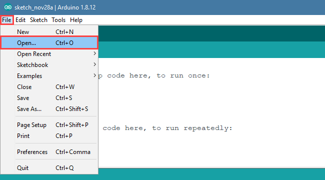
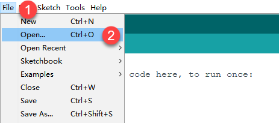
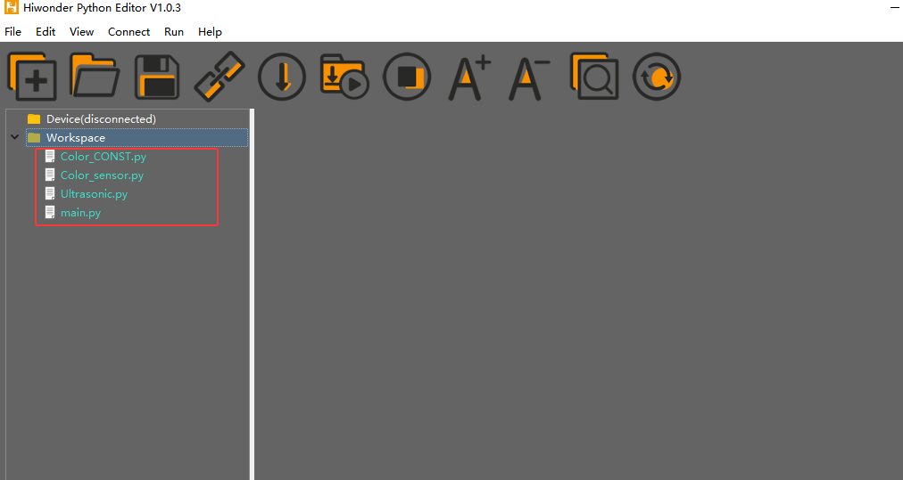
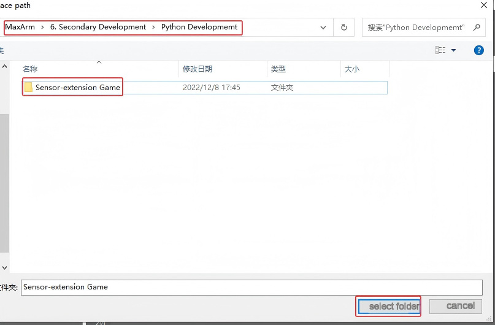

# 6. Secondary Development

## 6.1 Arduino Development

### 6.1.1 What is the Inverse Kinematics

This lesson aims at helping users basically learning about the principle of inverse kinematics. The further learning and practical application of the inverse kinematics of robotic arm is available in the folder "**7. Inverse Kinematics Lesson**"

* **What is it?**

Forward kinematics refers to process of obtaining position and velocity of end effector, given the known joint angles and angular velocities. In other word, the position information of end effector can be obtained when then joint angle and linkages parameters are known.

Inverse Kinematics is the inverse function or algorithm of Forward Kinematics. According to the position and post of the end effector along with linkages parameters, the joint position can be calculated, i.e., Given the robot’s end-effector positions, inverse kinematics can determine an appropriate joint configuration.

(1) Establish Coordinate System

A coordinate system must be established to describe the motion of an object. MaxArm uses x-y-z axes coordinate system (unit:mm) and takes the the base centre of robotic arm as original point (0,0,0), as the figure shown below.


The correspondence relationship between the movement orientation of end effector and the values of x-y-z axes is shown below (user per se as reference):

| **Coordinate axis** | **control orientation** |
| :---: | :---: |
| x | Control the end effector of robotic arm to move left or right (As the x value is positive, it moves to the right. As the x value is negative, it moves to the left. ) |
| y | Control the end effector of robotic arm to move forward and backward. (As the y value is negative,it moves backward. As the y value is positive, it moves forward.) |
| z | Control the end effector of robotic arm to move up and down (As the z value is negative, it moves up. As the z value is positive, it moves down.) |

(2) Project Operation

After learning about the principle and spatial concept of inverse kinematics, the control method of inverse kinematics can be mastered by a simple routine. You can follow the steps below to run the game.

① Install and connect Arduino. (Please refer to the tutorial in folder ["**4. Underlying Files Learning--Arduino Development--Lesson 1 Set Development Environment**"](4.Underlying_Program_Learning_checked.md#set-arduino-development-environment))

② Double click to open **"Arduino IDE"** .


③ Click **"File"--"Open".**


④ Select the program "**kinematics_demo.ino**" in the folder ["**5.MaxArm Hardware Basics Learning--Arduino Development--Game Programs--Program Files--kinematics_demo**"](Appendix.md), and click "**Open**".


⑤ Check the board model. Click **"Tools"**--**"Board"** and select **"ESP 32 Dev Module"**. (If the model of development board has been configured when setting the development environment, you can skip this step.)


⑥ Select the corresponding port of ESP32 controller in **"Tools"** -- **"Port"**. (Here take the port **"COM5"** as example. Please select the port based on your computer. If COM1 appears, please do not select because it is the system communication port but not the actual port of the development port.)


⑦ If you are not sure the port number, please open the "**This PC**" and click "**Properties**"--"**Device Manger**" in turns to check the corresponding port number (the device is with CH340).


⑧ After selecting, confirm the board "**ESP32 Dev Module**" in the lower right corner and the port number "**COM5**" (it is an example here, please refer to the actual situation).


⑨ Then click on  icon to verify the program. If no error, the status area will display **"Compiling"**--**"Compile complete"** in turn. After compiling, the information such as the current used bytes, and occupied program storage space will be displayed.


⑩ After compiling, click on  icon to upload the program to the development board. The status area will display **"Compiling"**--**"Uploading"**--**"Complete"** in turn. After uploading, the status area will stop printing the uploading information.


(3) Project Analysis

[Source Code](../_static/source_code/Secondary_Development.zip)

The complete program is as follow:

{lineno-start=1}
```python
#include "ESPMax.h"
#include "_espmax.h"

// Inverse kinematics basic example 

void setup(){
    ESPMax_init();
    go_home(2000); // Move the robotic arm back to the initial position 
    Serial.begin(9600);
    Serial.println("start...");
}

bool start_en = true;
void loop(){
  if(start_en){
    float x,y,z;
    float pos[3];
    // XYZ position of the robotic arm’s initial pose 
    x = 0;
    y = -(L1 + L3 + L4);
    z = (L0 + L2);
    // Print XYZ position via serial, unit: millimeter
    Serial.print(x);
    Serial.print("; ");
    Serial.print(y);
    Serial.print("; ");
    Serial.println(z);

    // Since the initial position of the robotic arm is already at the edge of its reachable workspace, it must first move downward along the Z-axis. Otherwise, the arm will not be able to 
    // move along the X or Y axes.
    // set_position(pos,t), pos={x,y,z}; x: X-axis coordinate, y: Y-axis coordinate, z: Z-axis coordinate, t: total movement time (the longer the time, the slower the speed) 
    
    pos[0] = x; pos[1] = y; pos[2] = z-100;
    set_position(pos,2000); // Move Z-axis 100mm down relative to the initial position 
    delay(2000);
    pos[0] = x; pos[1] = y; pos[2] = z;
    set_position(pos,2000); // Reset robotic arm to initial pose 
    delay(1000);

    start_en = false;
  }
  else{
    delay(500); // Delay 500 ms 
  }
```

① Import function library

Before the robotic arm starts to move, the encapsulation library and underlying library of inverse kinematics need to be imported.

{lineno-start=1}
```C++
#include "ESPMax.h"
#include "_espmax.h"
```

② Calculate the initial position of robotic arm

According to the linkage parameters of L0-L4 defined in kinematics underlying library.

{lineno-start=1}
```C++
#ifndef _ESPMAX_H
#define _ESPMAX_H

#define L0      84.4
#define L1      8.14
#define L2      128.4
#define L3      138.0
#define L4      16.8
```


Calculate the initial position of the end effector. (Use the L0-L4 values to get x=0, y=162.94, z=212.8)

{lineno-start=18}
```C++
    // XYZ position of the robotic arm’s initial pose 
    x = 0;
    y = -(L1 + L3 + L4);
    z = (L0 + L2);
```

③ Control robotic arm

Use the function `set_position()` to control the end effector to move.

Take the code `set_position(pos,2000)` as example.

{lineno-start=34}
```C++
    pos[0] = x; pos[1] = y; pos[2] = z-100;
    set_position(pos,2000); // Move Z-axis 100mm down relative to the initial position 
    delay(2000);
    pos[0] = x; pos[1] = y; pos[2] = z;
    set_position(pos,2000); // Reset robotic arm to initial pose 
    delay(1000);
```

The first parameter "**pos**" is a set of valuea representing the position values of the end effector on x-y-z axis.

Among them, `pos[0]` represents the x-axis value of the initial position of the end-effector.

`pos[1]` represents the the y-axis value of the initial position of the end-effector.

**"pos[2]"** represents the end-effector moves down to 100mm. And the position of the end effector can be set by modifying the x,y and z values.

For example, if want to control the end-effector to move 200mm to the left. (its position relative to the original moves to 200mm to the left), set x value plus 200. If want to move to 200 to the right, set x-200.

If want to directly move to the set position, for example, move to 200mm on x axis, you just need to set x=200.

The second parameter "2000" is the running time and the unit is ms.

(4) Inverse kinematics library analysis

The path to the inverse kinematics library: [Appendix--8. Controller Underlying Files--Arduino Development--ESPMax.cpp](Appendix.md)


① Import head file and define pin

{lineno-start=1}
```c++
#include "ESPMax.h"
#include "_espmax.h"
#include "LobotSerialServoControl.h"
```

Import the inverse kinematics and servo head files.

{lineno-start=5}
```c++
#define SERVO_SERIAL_RX   35
#define SERVO_SERIAL_TX   12
#define receiveEnablePin  13
#define transmitEnablePin 14
HardwareSerial HardwareSerial(2);
LobotSerialServoControl BusServo(HardwareSerial,receiveEnablePin,transmitEnablePin);
```

Define the serial communication pin.

② Initialization

{lineno-start=12}
```c++
float ORIGIN[3] ={ 0, -(L1 + L3 + L4), (L0 + L2)};
float positions[3];

void ESPMax_init(){
    BusServo.OnInit();
    HardwareSerial.begin(115200,SERIAL_8N1,SERVO_SERIAL_RX,SERVO_SERIAL_TX);
}
```

`ORIGIN[3]` is the initial position of the end effector calculating from the linkage length.

The function `ESPMax_init()` is used for initialization

The function `BusServo.OnInit()` is the servo configuration initialization. `HardwareSerial.begin()` is serial communication configuration. "**115200**" is the baud rate. "**SERIAL_8N1**" refers to the working mode. `SERVO_SERIAL_RX` is the pin number of RX port. `SERVO_SERIAL_TX` is the pin number of TX port.

③ Control a single servo

{lineno-start=20}
```c++
int set_servo_in_range(int servo_id, int p, int duration){
    if(servo_id == 3 & p < 470) p = 470;
    if(servo_id == 2 & p > 700) p = 700;
    BusServo.LobotSerialServoMove(servo_id, p, duration);
    return int(1);
}
```

The function `set_servo_in_range()` is used to control the movement of a single servo, and limit the position of servo ID2 and ID3. The ID3 Servo can not be less than 470 impulse and the No.4 can not be less than 700. The parameter `servo_id` is servo ID number and the parameter "p" is servo impulse. The parameter "duration" is the running time.

The function `BusServo.LobotSerialServoMove()` in BusServo library controls a single servo to move.

④ Calculate servo pulse

{lineno-start=27}
```c++
float* position_to_pulses(float pos[3], float* pul){
    float angles[3];
    inverse(pos,angles);
    deg_to_pulse(angles,pul);
    return pul;
}
```

The function `position_to_pulses()` is used to calculate the servo pulse. The parameter "**position**" is position coordinate. "**angles**" is servo angle. "**pulse**" is servo pulse. Then the value of servo pulse will be returned.

The function `inverse()` is used to calculate the servo angle according to the coordinates.

The function `deg_to_pulse()` is used to calculate the servo pulse according to the servo angle.

⑤ Calculate robotic arm position

{lineno-start=34}
```c++
float* pulses_to_position(float pul[3], float* pos){
    float joints[3];
    pulse_to_deg(pul,joints);
    forward(joints,pos);
    return pos;
}
```

The function `pulses_to_position()` is used to calculate the coordinate of robotic arm position. The parameter `pul[3]` is servo pulse. The coordinate of robotic arm is calculated according to the servo pulses, and then the coordinate value is returned.

⑥ The movement of robotic arm

{lineno-start=41}
```c++
int set_position(float pos[3], int duration){
    float x = pos[0];
    float y = pos[1];
    float z = pos[2];
    if(z > 255) z = 255;
    if(sqrt(x*x + y*y) < 50) return int(0);
    float angles[3];
    inverse(pos,angles);
    float pul[3];
    deg_to_pulse(angles,pul);
    for(int i=0; i<3; i++){
        positions[i] = pul[i];
        BusServo.LobotSerialServoMove(i+1,pul[i],duration);
        delay(2);
    }
    return int(1);
}
```

The function `set_position()` is used to control the robotic arm to move, and add the position limit. The parameter "**position**" is the position coordinate and the "**duration**" is the running time.

Use judgement statement to limit the robotic arm position. The coordinate of z-axis can not be greater than 225. The root of the sum of the squares of the x and y axes coordinates should be greater than 50, which means the end effector should be outside the circle with the coordinate origin as the center and the radius of 50. The unit is millimeter.

Then use "for" to control the ID1, ID2 and ID3 servos to rotate.

⑦ Back to the initial position

{lineno-start=83}
```c++
void go_home(int duration){
    set_position(ORIGIN, duration);
}
```

The function `go_home()` is used to get robotic arm back to the initial position. The parameter "duration" is the running time and the parameter `self.set_position()` is to control robotic arm to move. The parameter `ORIGIN` is the coordinate of the initial position set in program.

⑧ Read position coordinate

{lineno-start=93}
```c++
float* read_position(float* pos){
    float pul[3];
    for(int i=0; i<3; i++){
        pul[i] = BusServo.LobotSerialServoReadPosition(i+1);
    }
    pulses_to_position(pul,pos);
}
```

Use the function `self.bus_servo.get_position()` to get the pulse value of servo ID1, ID2, and ID3.

Get the x,y,z position coordinate by calculating the robotic arm position function `pulses_to_position()`. Then the x, y and z values are obtained.

<p id="anchor_6_1_2"></p>

### 6.1.2 Ultrasonic Detection and Digital Tube Display

* #### Ultrasonic Sensor Assembly


* **Project Principle**

In this lesson, ultrasonic sensor will be used to detect object and the detection result will be displayed on digital tube.

The used glowing ultrasonic ranging module integrates ultrasonic transmitting circuits, ultrasonic receiving circuits, digital processing circuits, etc. inside the ranging chip. The module adopts IIC communication interface, and can read the measured distance through IIC communication.


Ultrasonic sensors have two main components: the transmitter and the receiver.

The module will automatically send eight 40khz square waves and detect if there are signals are sent back. If there are signals back, output a high level. Then the duration time is time when the ultrasonic waves are sent and returns.

Measured distance(L) =(high level time* the speed of time(340M/S))/2.

The ultrasonic probes integrates two RGB lights, not only can adjust the light brightness, but also through the red (R), green (G), blue (B) three color channel changes and their superposition on each other to achieve colorful color changes.


The digital tube has a 4-digit red LED for displaying numbers, decimal points and some special characters. This module is compact and easy to use, you can apply this module in robotics projects for displaying sensor values such as speed, time, fraction, temperature, distance, etc.

Firstly, import corresponding libraries and initialize ultrasonic sensor, buzzer, servo and digital tube module.

Then set the distance measurement conditions,three threshold intervals are set in program. Different intervals is distinguished with different colors.

(1) Preparation

① Hardware

Please assemble ultrasonic sensor and digital tube to the corresponding position on MaxArm according to the tutorial in folder ["Lesson 1 Module Assembly"](https://drive.google.com/drive/folders/163jyDz9PPCgfqxb5LVVTDQdGs1Vb1gCu?usp=sharing) under the same directory.

② Software

Please connect MaxArm to **"Arduino IDE"** according to the tutorial in folder ["**4. MaxArm Underlying Program Learning--Arduino Development--Lesson 1 Set Development Environment**"](4.Underlying_Program_Learning_checked.md#anchor_4_2).

(2) Program Download

[Source Code](../_static/source_code/Secondary_Development.zip)

① Click on  icon to open **"Arduino IDE"**.


② Click "File"--"Open" in turn.


③ Open the program "Ultrasound_display.ino" in the folder ["**6.Secondary Development--Arduino Development--Sensor-extension Game--Program Files--Ultrasonic Detection and Digital Tube Disply--Ultrasound_display**"](../_static/source_code/Secondary_Development.zip).


④ Select the corresponding port of Arduino controller in "Tools"--"Port". (Here take the port "COM5" as example. Please select the port based on your computer. If COM1 appears, please do not select because it is the system communication port but not the actual port of the development port.)


⑤ If you’re not sure about the port number, please open the "This PC" and click "Properties"--"Device Manger" in turns to check the corresponding port number (the device is with CH340). Then select the correct port on **"Arduino IDE"**.


⑥ After selecting, confirm the board "ESP32 Dev Module" in the lower right corner and the port number "COM5" (it is an example here, please refer to the actual situation).


⑦ Then click on  icon to verify the program. If no error, the status area will display **"Compiling"**--**"Compile complete"** in turn. After compiling, the information such as the current used bytes, and occupied program storage space will be displayed.


⑧ After compiling, click on  icon to upload the program to the development board. The status area will display **"Compiling"**--**"Uploading"**--**"Complete"** in turn. After uploading, the status area will stop printing the uploading information.


(3) Project Outcome

Place a block or other objects in front of ultrasonic sensor, and then the corresponding distance will be displayed on digital tube. If the distance between sensor and object is less than 50cm, red light is on. If the distant is between 50cm and 100cm, green light is on. When the distance is farther than 100cm, blue light is on.

(4) Program Instruction

① Import Function Library

Firstly, call ultrasonic sensor library, PWM servo library, buzzer library and other related libraries.

{lineno-start=1}
```c++
#include "ESPMax.h"
#include "Buzzer.h"
#include "TM1640.h"
#include "Ultrasound.h"
#include "SuctionNozzle.h"
```
② Ultrasonic Detection

Then set variables to read the measured distance.

{lineno-start=32}
```c++
void loop() {
  char text[6];
  int distance = ultrasound.GetDistance();  // Read distance from ultrasound
  Serial.println(distance);  // Print distance in mm to Serial 
  sprintf(text, "%4d", distance);  // Convert distance to string 
```
③ LED Display

Display the distance value on digital tube.

{lineno-start=37}
```c++
module.setDisplayToString(text);  // Display distance on digital display 
```
④ Light color setting

If the distance between sensor and object is less than 50cm, green light is on.

If the distant is between 50cm and 100cm, red light is on.

When the distance is farther than 100cm, blue light is on.

{lineno-start=32}
```c++
void loop() {
  char text[6];
  int distance = ultrasound.GetDistance();  // Read distance from ultrasound
  Serial.println(distance);  // Print distance in mm to Serial 
  sprintf(text, "%4d", distance);  // Convert distance to string 
  module.setDisplayToString(text);  // Display distance on digital display 
  if (distance > 0 && distance <= 50)
    ultrasound.Color(0, 255, 0, 0, 255, 0); //Green
  else if (distance > 50 && distance <= 100)
    ultrasound.Color(255, 0, 0, 255, 0, 0); //Red
  else if (distance > 100)
    ultrasound.Color(0, 0, 255, 0, 0, 255); //Blue
  delay(300);  // Delay 300 ms 
```

<p id="anchor_6_1_3"></p>

### 6.1.3 Ultrasonic Detection and Sucking

* #### Ultrasonic Sensor Assembly

  

  

* **Working Principle**

Ultrasonic sensors is a sensor that converts ultrasonic signals into other energy signals (usually electrical signals). There are two probes on ultrasonic sensor for receiving and transmitting ultrasound.

Firstly, import the corresponding library and initialize ultrasonic sensor, buzzer, servo and action groups.

Next, the object is detected by ultrasonic sensor and the measured distance is read by I2C protocol. After determining the distance, MaxArm will perform the corresponding action based on the determined result.

Then, execute the functions for controlling action group, starting buzzer and air pump to suck the object to the side.

The path to the source code of the program is [6.Secondary Development--Arduino Development--Sensor Development--Program Files--Ultrasonic Detection and Suction--Ultrasound_clamp--Ultrasound_clamp.ino](../_static/source_code/Secondary_Development.zip)

{lineno-start=8}

```c++
Ultrasound ultrasound;  //Instantiate Ultrasound class 

void setup(){
    Buzzer_init();
    ESPMax_init();
    Nozzle_init();
    Valve_on();
    go_home(2000);
    delay(2000);
    Valve_off();
    Serial.begin(115200);
    Serial.println("start...");
    ultrasound.Breathing(30, 50, 60, 20, 30, 50); // Ultrasound RGB breathing mode 
```

(1) Preparation

① Hardware

Please assemble the ultrasonic sensor to the corresponding position on MaxArm according to the tutorial in folder ["**Lesson 1 Sensor Assembly**"](https://drive.google.com/drive/folders/1POUNWLcJIw78PuDaLR4BYaeipkhMTGSK?usp=sharing) under the same directory.

② Software

Please connect MaxArm to **"Arduino IDE"** according to the tutorial in folder ["**4. Underlying Program Learning--Arduino Development--Lesson 1 Set Development Environment**"](4.Underlying_Program_Learning_checked.md#anchor_4_2).

(2) Program Download

[Source Code](../_static/source_code/Secondary_Development.zip)

① Click on  icon to open **"Arduino IDE"**.


② Click **"File"--"Open"** in turn.


③ Select the program **"Ultrasound_clamp.ino"** in the folder ["**6.Secondary Development--Arduino Development--Sensor-extension Game--Program Files--Ultrasonic Detection and Suction--Ultrasound_clamp**"](../_static/source_code/Secondary_Development.zip).


④ Select the corresponding port of Arduino controller in **"Tools"--"Port"**. (Here take the port **"COM5"** as example. Please select the port based on your computer. If COM1 appears, please do not select because it is the system communication port but not the actual port of the development port.)


⑤ If you’re not sure about the port number, please open the **"This PC"** and click "Properties"--"Device Manger" in turns to check the corresponding port number (the device is with CH340). Then select the correct port on **"Arduino IDE"**.


⑥ After selecting, confirm the board "ESP32 Dev Module" in the lower right corner and the port number **"COM5"** (it is an example here, please refer to the actual situation).


⑦ Then click on  icon to verify the program. If no error, the status area will display **"Compiling"--"Compile complete"** in turn. After compiling, the information such as the current used bytes, and occupied program storage space will be displayed.


⑧ After compiling, click on  icon to upload the program to the development board. The status area will display **"Compiling"--"Uploading"--"Complete"** in turn. After uploading, the status area will stop printing the uploading information.


(3) Project Outcome

After putting the block on the fixed detection position, the buzzer will beep after the block is detected by the ultrasonic sensor. MaxArm will move to the front of the block and start the air pump to suck it, and moves to the left. Then placing the block and stopping the air pump. Finally, MaxArm is reset.

(4) Program Instruction

① Import Library File

Firstly, the ultrasonic sensor, PWM servo, buzzer and other related library files are called.

{lineno-start=1}
```c++
#include "ESPMax.h"
#include "Buzzer.h"
#include "Ultrasound.h"
#include "SuctionNozzle.h"
```
② Ultrasonic Detection

Then read the measured distance by setting the variable. To reduce errors, take the average.

{lineno-start=25}
```c++
void loop(){
    float pos[3];
    int distance = 0;
    for(int i=0; i<5; i++){
        distance += ultrasound.GetDistance(); //Read distance from ultrasound 
        delay(200);
    }
    int dis = int(distance/5); //Take average value 
```
③ Detection Feedback

Set a distance range with another if judgement statement. When the measured distance meets the set conditions, the buzzer will sound for 100ms.

{lineno-start=33}
```c++
    if(60 < dis & dis < 80){  //Check if distance is within 60~80mm 
        setBuzzer(100); //Set buzzer to sound for 100ms 
```
④ Control Robotic Arm

By setting the position parameter, MaxArm will carry the block to the corresponding position.

{lineno-start=35}
```c++
        pos[0] = 0;pos[1] = -160;pos[2] = 100;
        set_position(pos,1500); //Move above the color block 
        delay(1500);
        pos[0] = 0;pos[1] = -160;pos[2] = 85;
        set_position(pos,800);  //Suction the color block 
        Pump_on();  //Turn on pump 
        delay(1000);
        pos[0] = 0;pos[1] = -160;pos[2] = 200;
        set_position(pos,1000);  //Lift robot arm 
        delay(1000);
        pos[0] = 160;pos[1] = 0;pos[2] = 200;
        set_position(pos,1500);   //Move above placement area 
        delay(1500);
        pos[0] = 160;pos[1] = 0;pos[2] = 90+overlay*40;
        set_position(pos,1000);   //Move to placement area 
        delay(1000);
        Valve_on();   //Close pump and open valve 
        pos[0] = 160;pos[1] = 0;pos[2] = 200;
        set_position(pos,1000);  //Lift robot arm 
        delay(1000);
        Valve_off();   //Close valve 
```
This section uses `set_position()` function to control the robotic arm. Take the code `set_position(pos,1500)` as example.

The first parameter "pos" represents the position of the robotic arm on x, y and z axes. Among them, `pos[0]` represents the coordinate of x axis, `pos[1]` represents the coordinate of y axis, and `pos[2]` represents the coordinate of z-axis.

The second parameter "1500" represents the running time and its unit is ms.

Use `Pump_on()` function to turn on the air pump, `Valve_on()` function to turn off the air pump and turn on the solenoid valve, and `Valve_off()` function to turn off the solenoid valve.

<p id="anchor_6_1_4"></p>

### 6.1.4 Ultrasonic Detection and Stacking

* #### Touch Sensor Assembly


Please connect the touch sensor to IO23 IO22 port on controller with 20cm 4Pin cable,as shown in the figure below.


* **Working Principle**

Ultrasonic sensor can convert ultrasonic signals into other energy signals (usually electrical signals). There are two probes on ultrasonic sensor for receiving and transmitting ultrasound.

The path to the source code of the program is [6.Secondary Development--Arduino Development--Program Files--Ultrasonic Detection and Stacking--Ultrasound_palletize--Ultrasound_palletize.ino](../_static/source_code/Secondary_Development.zip).

{lineno-start=33}

```c++
    if(60 < dis & dis < 80){  //Check if distance is within 60~80mm 
        setBuzzer(100); //Set buzzer to sound for 100ms 
        pos[0] = 0;pos[1] = -160;pos[2] = 100;
        set_position(pos,1500); //Move above the color block 
        delay(1500);
        pos[0] = 0;pos[1] = -160;pos[2] = 85;
        set_position(pos,800);  //Suction the color block 
        Pump_on();  //Turn on pump 
        delay(1000);
        pos[0] = 0;pos[1] = -160;pos[2] = 200;
        set_position(pos,1000);  //Lift robot arm 
        delay(1000);
        pos[0] = 160;pos[1] = 0;pos[2] = 200;
        set_position(pos,1500);   //Move above placement area 
        delay(1500);
        pos[0] = 160;pos[1] = 0;pos[2] = 90+overlay*40;
        set_position(pos,1000);   //Move to placement area 
        delay(1000);
        Valve_on();   //Close pump and open valve 
        pos[0] = 160;pos[1] = 0;pos[2] = 200;
        set_position(pos,1000);  //Lift robot arm 
        delay(1000);
        Valve_off();   //Close valve 
        go_home(1500); //Reset robotic arm 
        delay(1500);
```

Firstly, import the corresponding library and initialize ultrasonic sensor, buzzer, servo and action groups.

Next, the object is detected by ultrasonic sensor and the measured distance is read by I2C protocol. After determining the distance, MaxArm will perform the corresponding action based on the determined result.

Then, execute the functions for controlling action group, buzzer and air pump to suck the detected object to the side and stack it.

(1) Preparation

① Hardware

Please assemble the ultrasonic sensor to the corresponding position on MaxArm according to the tutorial in folder ["**Lesson 1 Sensor Assembly**"](https://drive.google.com/drive/folders/1VBOyzV1UHNolWDobSpLVHHroOgz4vAZ1?usp=sharing) under the same directory.

② Software

Please connect MaxArm to **"Arduino IDE"** according to the tutorial in folder ["**4. Underlying Program Learning--Arduino Development--Lesson 1 Set Development Environment**"](4.Underlying_Program_Learning_checked.md#anchor_4_2).

(2) Program Download

[Source Code](../_static/source_code/Secondary_Development.zip)

① Click on  icon to open **"Arduino IDE"**.


② Click "File"--"Open" in turn.


③ Select the program **"Ultrasound_palletize.ino"** in the folder ["6.Secondary Development--Arduino Development--Sensor-extension Game--Program Files--Ultrasonic Detection and Suction--Ultrasound_clamp"](../_static/source_code/Secondary_Development.zip).


④ Select the model of the development board. Click **"Tools"--" Board"** and select **"ESP 32 Dev Module"** (If the model of the development board has been configured when setting the development environment, you can skip this step).


⑤ Select the corresponding port of Arduino controller in **"Tools"--"Port"**. (Here take the port **"COM5"** as example. Please select the port based on your computer. If COM1 appears, please do not select because it is the system communication port but not the actual port of the development port.)


⑥ If you’re not sure about the port number, please open the **"This PC"** and click **"Properties"--"Device Manger"** in turns to check the corresponding port number (the device is with CH340). Then select the correct port on **"Arduino IDE"**.


⑦ After selecting, confirm the board **"ESP32 Dev Module"** in the lower right corner and the port number **"COM5"** (it is an example here, please refer to the actual situation).


⑧ Then click on  icon to verify the program. If no error, the status area will display **"Compiling"--"Compile complete"** in turn. After compiling, the information such as the current used bytes, and occupied program storage space will be displayed.


⑨ After compiling, click on  icon to upload the program to the development board. The status area will display **"Compiling"--"Uploading"--"Complete"** in turn. After uploading, the status area will stop printing the uploading information.


(3) Project Outcome

After the block is detected by the ultrasonic sensor, the buzzer will beep once. Then, the suction nozzle will move to the block and suck it after turning on the air pump, and carry the block to the stacking area for stacking. After performing the stacking action three times, MaxArm will return to the initial posture.

(4) Program Instruction

① Import library file

The path to the source code of the program is [6.Secondary Development--Arduino Development--Sensor-extension Game--Program Files--Ultrasonic Detection and Stacking--Ultrasound_palletize--Ultrasound_palletize.ino](../_static/source_code/Secondary_Development.zip)

Before running program, the ultrasonic sensor, buzzer, PWM servo, bus servo and air pump and other related library files are called.

{lineno-start=1}
```c++
#include "ESPMax.h"
#include "Buzzer.h"
#include "Ultrasound.h"
#include "SuctionNozzle.h"
```

② Ultrasonic Detection

Use the `ultrasound.getDistance()` function to measure the distance, and then take the average of five detected distance values.

{lineno-start=27}
```c++
    for(int i=0; i<5; i++){
        distance += ultrasound.GetDistance(); //Read distance from ultrasound 
        delay(200);
    }
    int dis = int(distance/5); //Take average value 
```
③ Control Robotic Arm

Determine the distance of the front object first. If the object is between 60 and 80mm, MaxArm will perform the corresponding action.

{lineno-start=33}
```c++
    if(60 < dis & dis < 80){  //Check if distance is within 60~80mm 
        setBuzzer(100); //Set buzzer to sound for 100ms 
        pos[0] = 0;pos[1] = -160;pos[2] = 100;
        set_position(pos,1500); //Move above the color block 
        delay(1500);
        pos[0] = 0;pos[1] = -160;pos[2] = 85;
        set_position(pos,800);  //Suction the color block 
        Pump_on();  //Turn on pump 
        delay(1000);
        pos[0] = 0;pos[1] = -160;pos[2] = 200;
        set_position(pos,1000);  //Lift robot arm 
        delay(1000);
        pos[0] = 160;pos[1] = 0;pos[2] = 200;
        set_position(pos,1500);   //Move above placement area 
        delay(1500);
        pos[0] = 160;pos[1] = 0;pos[2] = 90+overlay*40;
        set_position(pos,1000);   //Move to placement area 
        delay(1000);
        Valve_on();   //Close pump and open valve 
        pos[0] = 160;pos[1] = 0;pos[2] = 200;
        set_position(pos,1000);  //Lift robot arm 
        delay(1000);
        Valve_off();   //Close valve 
        go_home(1500); //Reset robotic arm 
        delay(1500);
```
The buzzer is controlled by using the `setBuzze()` function. Take the code `setBuzzer(100)` as example.

The first parameter "100" is the sounding time of buzzer and the unit is ms.

The robotic arm is controlled by `set_position()` function. Take the code `set_position(pos,1000)` as example.

The first parameter "pos" represents the position of the robotic arm on x, y and z axes. Among them, `pos[0]` represents the coordinate of x axis, `pos[1]` represents the coordinate of y axis, and `pos[2]` represents the coordinate of z-axis.

The second parameter "1000" represents the running time and its unit is ms.

### 6.1.5 Touch Detection and Placement

* **Working Principle**

This lesson uses touch sensor based on the principle of capacitive sensing. After supplying the touch sensor power, the touching will be sensed when our fingers or metal touch the metal sensing plate. In the meantime, the signal terminal OUT will output low level signal, vice verse. According to this characteristics, the robotic arm can be controlled to carry out the corresponding action.

The path to the source code of the program is [6.Secondary Development--Arduino Development--Sensor Development--Program Files--Touch Detection and Placement--TouchSensor_put--TouchSensor_put.ino](../_static/source_code/Secondary_Development.zip).

{lineno-start=6}

```c++
#include "LobotSerialServoControl.h"

// Touch placement 

#define sensor_pin  23 // Define touch sensor pin 

void setup(){
    // Initialize libraries 
    Buzzer_init();
    ESPMax_init();
    Nozzle_init();
    PWMServo_init();
    pinMode(sensor_pin, INPUT_PULLUP); // Set sensor pin to internal pull-up mode 
    Serial.begin(9600);
    Serial.println("start...");
    setBuzzer(100); // Set buzzer to sound for 100 ms 
    go_home(2000); // Move robotic arm to initial position 
    SetPWMServo(1,1500,2000); // Set suction nozzle servo to initial position 
```

Firstly, import the corresponding libraries and initialize buzzer, servo and action group.

Next, create the functions of buzzer and touch control. Set the buzzer to make sound feedback and the robotic arm to perform the corresponding action when short press the touch sensor.

Then, execute the function for controlling action, buzzer, and air pump to suck the detected object to the side and place it.

(1) Preparation

① Hardware

Please assemble the touch sensor to the corresponding position on MaxArm according to the tutorial in folder ["**Lesson 1 Sensor Assembly**"](https://drive.google.com/drive/folders/1S33PUmc7MYvAOPMxJzt9IelzsKt9nBYn?usp=sharing) under the same directory.

② Software

Please connect MaxArm to **"Arduino IDE"** according to the tutorial in folder ["**4. Underlying Program Learning--Arduino Development--Lesson 1 Set Development Environment**"](4.Underlying_Program_Learning_checked.md#anchor_4_2).

(2) Program Download

[Source Code](****)

① Click on  icon to open **"Arduino IDE"**.


② Click **"File"--"Open"** in turn.


③ Select the program **"TouchSensor_put.ino"** in the folder ["6.Secondary Development--Arduino Development--Sensor-extension Game--Program Files--Button Detection and Placement--TouchSensor_put"](../_static/source_code/Secondary_Development.zip).


④ Select the model of the development board. Click **"Tools"--" Board"** and select **"ESP 32 Dev Module"** (If the model of the development board has been configured when setting the development environment, you can skip this step).


⑤ Select the corresponding port of Arduino controller in **"Tools"--"Port"**. (Here take the port **"COM5"** as example. Please select the port based on your computer. If COM1 appears, please do not select because it is the system communication port but not the actual port of the development port.)


⑥ If you’re not sure about the port number, please open the **"This PC"** and click **"Properties"--"Device Manger"** in turns to check the corresponding port number (the device is with CH340). Then select the correct port on **"Arduino IDE"**.


⑦ After selecting, confirm the board **"ESP32 Dev Module"** in the lower right corner and the port number **"COM5"** (it is an example here, please refer to the actual situation).


⑧ Then click on  icon to verify the program. If no error, the status area will display **"Compiling"--"Compile complete"** in turn. After compiling, the information such as the current used bytes, and occupied program storage space will be displayed.


⑨ After compiling, click on  icon to upload the program to the development board. The status area will display **"Compiling"--"Uploading"--"Complete"** in turn. After uploading, the status area will stop printing the uploading information.


(3) Project Outcome

After the buzzer beeps once, the robotic arm will suck and place the blocks in a line. When three blocks are placed completely, the buzzer will make **"DiDi"** sound as a feedback, and then a round of placement is finished.

(4) Program Instruction

The path to the source code of the program is [6.Secondary Development--Arduino Development--Sensor-extension Game--Program Files--Touch Detection and Placement--TouchSensor_put--TouchSensor_put.ino](../_static/source_code/Secondary_Development.zip) (The source code of the library files can be found under the same path).

If the program is modified, you can find the backup files in Appendix.

① Import Function library

Before executing the program, the Python function libraries related to the buzzer, PWM servo, bus servo and air pump need to be imported.

{lineno-start=1}
```c++
#include "Buzzer.h"
#include "ESPMax.h"
#include "_espmax.h"
#include "ESP32PWMServo.h"
#include "SuctionNozzle.h"
#include "LobotSerialServoControl.h"
```
② Define the Pin of Sensor

Firstly, define the P23 pin of the main chip as the as the access terminal of the touch sensor.

{lineno-start=10}
```c++
#define sensor_pin  23 // Define touch sensor pin 
```
③ Initialization Setting

Initialize the driver library and set the pin of sensor as pull-up mode.

{lineno-start=12}
```c++
void setup(){
    // Initialize libraries 
    Buzzer_init();
    ESPMax_init();
    Nozzle_init();
    PWMServo_init();
    pinMode(sensor_pin, INPUT_PULLUP); // Set sensor pin to internal pull-up mode 
    Serial.begin(9600);
    Serial.println("start...");
    setBuzzer(100); // Set buzzer to sound for 100 ms 
    go_home(2000); // Move robotic arm to initial position 
    SetPWMServo(1,1500,2000); // Set suction nozzle servo to initial position 
```
④ Touch detection

When touching the metal surface of the sensor, the signal terminal will output low level and the buzzer will sound for 100ms.

{lineno-start=36}
```c++
    if(sensor_state == 0.0){ // Touch sensor sets pin LOW when detecting target 
      Serial.print("num: ");
      Serial.println(num+1);
      setBuzzer(100); //Set buzzer to sound for 100 ms 
```
The buzzer is controlled by `buzzer.setBuzze()` function. Take the code `buzzer.setBuzzer(100)` as example.

The parameter **"100"** represents the sounding time of buzzer and the unit is ms.

⑤ Placement Setting

By setting the position parameter, MaxArm will transport the block to the corresponding position.

{lineno-start=41}
```c++
        set_position(pos,1500); //Move above the block 
      delay(1500);
      pos[0] = 0;pos[1] = -160;pos[2] = 85;
      set_position(pos,800);  //Suction the color block 
      Pump_on();  //Turn on pump 
      delay(1000);
      pos[0] = 0;pos[1] = -160;pos[2] = 180;
      set_position(pos,1000);  //Lift the arm 
      delay(1000);
      pos[0] = 120;pos[1] = (-20-60*num);pos[2] = 180;
      set_position(pos,1500);   //Move above placement area 
      Serial.println(angle_pul[num]);
      delay(100);
      SetPWMServo(1,angle_pul[num],1000); // Angle compensation to align block 
      delay(500);
      pos[0] = 120;pos[1] = (-20-60*num);pos[2] = (83+num);
      set_position(pos,1000);   //Move to placement area 
      delay(1200);
      Valve_on();   //Turn off pump, open valve
      pos[0] = 120;pos[1] = (-20-60*num);pos[2] = 200;
      set_position(pos,1000);  //Lift the arm 
      delay(1000);
      Valve_off();   //Close valve    
```
This section uses `arm.set_position()` function to control the robotic arm to move on the set axes. Take the code `set_position(pos,1500)` as example.

The first parameter **"pos"** represents the position of the robotic arm on x, y and z axes. Among them, `pos[0]` represents the coordinate of x axis, `pos[1]` represents the coordinate of y axis, and `pos[2]` represents the coordinate of z-axis.

The second parameter **"1500"** represents the running time and its unit is ms.

The `Pump_on()` function is used to turn on the air pump, and the `Valve_on()` function is used to turn off the air pump.

### 6.1.6 Infrared Detection and Control

* **Working Principle**

Infrared obstacle avoidance is a photoelectric sensor integrating IR transmitter and IR receiver. Featuring long detection distance and low interference from visible light , it is widely used in robot and assembly line piecework, etc.

This sensor detects obstacle by transmitting and receiving infrared. When the infrared transmitted by the sensor meets the obstacle ahead, the infrared will be reflected to the receiving terminal.


The path of the program file: [6.Secondary Development--Arduino Development--Sensor-extension Game--Program Files--Infrared Detection and Control--InfraredSensor_contro--InfraredSensor_control.ino](../_static/source_code/Secondary_Development.zip)

{lineno-start=34}

```c++
    if(sensor_state == 0.0){ // Infrared sensor detects target, pin goes low 
      setBuzzer(100); //Set buzzer to sound for 100ms 
      pos[0] = 0;pos[1] = -160;pos[2] = 100;
      set_position(pos,1500); //Move above the color block 
      delay(1500);
      pos[0] = 0;pos[1] = -160;pos[2] = 85;
      set_position(pos,800);  //Suction the color block 
      Pump_on();  //Turn on the pump 
      delay(1000);
      pos[0] = 0;pos[1] = -160;pos[2] = 200;
      set_position(pos,1000);  //Lift the arm 
      delay(1000);
      pos[0] = 70;pos[1] = -150;pos[2] = 200;
      set_position(pos,800);   //Move above the placement area 
      delay(800);
      SetPWMServo(1, 2200, 500);
      delay(200);
      pos[0] = 70;pos[1] = -150;pos[2] = 90;
      set_position(pos,800);   //Move to placement area 
      delay(800);
      pos[0] = 130;pos[1] = -150;pos[2] = 88;
      set_position(pos,500);   //Push slightly to the left 
      delay(500);
      Valve_on();   //Close the pump, open the solenoid valve 
      pos[0] = 130;pos[1] = -150;pos[2] = 200;
      set_position(pos,1000);  //Lift the arm 
      delay(1000);
      Valve_off();   //Close the solenoid valve 
      go_home(1500);
```

When the sensor detects this signal, it will send it to the microcontroller for processing. The closer the obstacle is, the stronger the reflection intensity; the farther the obstacle is, the weaker the reflection intensity. Different surface color has different reflection intensity. White is the strongest and black is the weakest.

Then, the object is detected by the infrared sensor and buzzer will make sound. MaxArm will perform the corresponding action.

Finally, execute the function for controlling action, buzzer, air pump to suck and place the object.

(1) Preparation

① Hardware

Please assemble the infrared sensor to the corresponding position on MaxArm according to the tutorial in folder ["**Lesson 1 Sensor Assembly**"](https://drive.google.com/drive/folders/1t1lAAC1WoEwiIFtmzEJD88fvmnsiiKd8?usp=sharing) under the same directory.

② Software

Please connect MaxArm to **"Arduino IDE"** according to the tutorial in folder ["**4. Underlying Program Learning--Arduino Development--Lesson 1 Set Development Environment**"](4.Underlying_Program_Learning_checked.md#anchor_4_2).

(2) Program Download

[Source Code](../_static/source_code/Secondary_Development.zip)

① Click on  icon to open **"Arduino IDE"**.


② Click **"File"--"Open"** in turn.


③ Select the program **"InfraredSensor_control.ino"** in the folder ["**6.Secondary Development--Arduino Development--Sensor-extension Game--Program Files--Infrared Detection and Control--InfraredSensor_control**"](../_static/source_code/Secondary_Development.zip).


④ Select the model of the development board. Click **"Tools"--" Board"** and select **"ESP 32 Dev Module"** (If the model of the development board has been configured when setting the development environment, you can skip this step).


⑤ Select the corresponding port of Arduino controller in **"Tools"--"Port"**. (Here take the port **"COM5"** as example. Please select the port based on your computer. If COM1 appears, please do not select because it is the system communication port but not the actual port of the development port.)


⑥ If you’re not sure about the port number, please open the **"This PC"** and click **"Properties"--"Device Manger"** in turns to check the corresponding port number (the device is with CH340). Then select the correct port on **"Arduino IDE"**.


⑦ After selecting, confirm the board **"ESP32 Dev Module"** in the lower right corner and the port number **"COM5"** (it is an example here, please refer to the actual situation).


⑧ Then click on  icon to verify the program. If no error, the status area will display **"Compiling"--"Compile complete"** in turn. After compiling, the information such as the current used bytes, and occupied program storage space will be displayed.


⑨ After compiling, click on  icon to upload the program to the development board. The status area will display **"Compiling"--"Uploading"--"Complete"** in turn. After uploading, the status area will stop printing the uploading information.


(3) Project Outcome

When the colored block is detected by infrared sensor, the robotic arm will move to the block and suck it, then transfer and place the block to the placement area. Finally, turn off the air pump.

(4) Program Instruction

① Import and Initialize

The path to the source code of the program is [6.Secondary Development--Arduino Development--Sensor-extension Game--Program Files--Infrared Detection and Control--InfraredSensor_contro--InfraredSensor_control.ino](../_static/source_code/Secondary_Development.zip) (The source code of the library files can be found under the same path).

If the program is modified, you can find the backup files in Appendix.

Before running the program, the buzzer, kinematics, kinematics encapsulation library, PWM servo, suction nozzle and other related library files need to be imported.

{lineno-start=1}
```c++
#include "Buzzer.h"
#include "ESPMax.h"
#include "_espmax.h"
#include "ESP32PWMServo.h"
#include "SuctionNozzle.h"
#include "LobotSerialServoControl.h"
```

Then, initialize the library file and the robotic arm.

{lineno-start=10}
```c++
#define sensor_pin  23 // Define the infrared sensor pin 

void setup(){
    // Initialize driver libraries 
    Buzzer_init();
    ESPMax_init();
    Nozzle_init();
    PWMServo_init();
    pinMode(sensor_pin, INPUT_PULLUP); // Set sensor pin to internal pull-up mode 
    Serial.begin(115200);
    Serial.println("start...");
    setBuzzer(100); // Set buzzer to sound for 100ms 
    go_home(2000); // Move the arm to the initial position 
    SetPWMServo(1,1500,2000); // Set suction nozzle servo to initial position 
}
```
② Infrared Detection

Use the `digitalRead()` function to read the detected value of the infrared sensor and then use the `for()` function to detect several times.

When the object is detected by infrared sensor, `sensor_pin` is 0, otherwise, it is 1. Then the value of the detected value plus `sensor_state` is assigned to `sensor_state`. If the `sensor_state` is equal to 0.0 after five rounds, the object is detected, otherwise, no object is detected.

{lineno-start=26}
```c++
void loop(){
    float pos[3];
    // Multiple detections 
    float sensor_state = 0.0;
    for(int i=0; i<5; i++){ 
      sensor_state += digitalRead(sensor_pin);
      delay(50); // Delay 50ms 
    }
```
③ Control Robotic Arm

When the object is detected by infrared sensor, MaxArm will perform the corresponding action.

{lineno-start=34}
```c++
    if(sensor_state == 0.0){ // Infrared sensor detects target, pin goes low 
      setBuzzer(100); //Set buzzer to sound for 100ms 
      pos[0] = 0;pos[1] = -160;pos[2] = 100;
      set_position(pos,1500); //Move above the color block 
      delay(1500);
      pos[0] = 0;pos[1] = -160;pos[2] = 85;
      set_position(pos,800);  //Suction the color block
      Pump_on();  //Turn on the pump 
      delay(1000);
      pos[0] = 0;pos[1] = -160;pos[2] = 200;
      set_position(pos,1000);  //Lift the arm 
      delay(1000);
      pos[0] = 70;pos[1] = -150;pos[2] = 200;
      set_position(pos,800);   //Move above the placement area 
      delay(800);
      SetPWMServo(1, 2200, 500);
      delay(200);
      pos[0] = 70;pos[1] = -150;pos[2] = 90;
      set_position(pos,800);   //Move to placement area
      delay(800);
      pos[0] = 130;pos[1] = -150;pos[2] = 88;
      set_position(pos,500);   //Push slightly to the left 
      delay(500);
      Valve_on();   //Close the pump, open the solenoid valve 
      pos[0] = 130;pos[1] = -150;pos[2] = 200;
      set_position(pos,1000);  //Lift the arm 
      delay(1000);
      Valve_off();   //Close the solenoid valve 
      go_home(1500); //Reset the arm to initial position 
```

The buzzer is controlled by `setBuzze()` function. Take the code `setBuzzer(100)` as example.

The parameter **"100"** is the sounding time of the buzzer and the unit is ms.

The robotic arm is controller by `set_position()` function. Take the code `set_position(pos,1500)` as example.

The first parameter **"pos"** represents the position of the robotic arm on x, y and z axes. Among them, `pos[0]` represents the coordinate of x axis, `pos[1]` represents the coordinate of y axis, and `pos[2]` represents the coordinate of z-axis.

The second parameter **"1500"** is the running time and the unit is ms.

Use `Pump_on()` function to turn on the air pump, `Valve_on()` function to turn off the air pump,and `Valve_off()` function to turn off the solenoid valve.

Finally, use `go_home()` function to make robotic arm return to the initial posture. Take the code `go_home(1500)` as example.

The parameter **"1500"** is the time for the robotic arm to reset and the unit is ms.

### 6.1.7 Dual Infrared Detection and Sorting

* **Working Principle**

Infrared obstacle avoidance is a photoelectric sensor integrating IR transmitter and IR receiver. Featuring long detection distance and low interference from visible light , it is widely used in robot and assembly line piecework, etc.

This sensor detects obstacle by transmitting and receiving infrared. When the infrared transmitted by the sensor meets the obstacle ahead, the infrared will be reflected to the receiving terminal.


The path of the program file: ["**6.Secondary Development--Sensor-extension Game--Arduino Development--Program Files--Dual Infrared Detection and Sorting--InfraredSensor_sorting--InfraredSensor_sorting.ino**"](../_static/source_code/Secondary_Development.zip)

{lineno-start=34}

```c++
  if (sensor_left == 0.0) {  // Left sensor detects target, pin goes low 
    Serial.println("infrared_left");
    setBuzzer(100);  //Set buzzer to sound for 100ms 
    pos[0] = 70;
    pos[1] = -165;
    pos[2] = 120;
    set_position(pos, 1500);  //Move above the color block 
    delay(1500);
    pos[0] = 70;
    pos[1] = -165;
    pos[2] = 86;
    set_position(pos, 800);  //Suction the color block 
    Pump_on();               //Turn on the pump 
    delay(1000);
    pos[0] = 70;
    pos[1] = -165;
    pos[2] = 200;
    set_position(pos, 1000);  //Lift the arm 
    delay(1000);
    pos[0] = 150;
    pos[1] = -35;
    pos[2] = 200;
    set_position(pos, 800);  //Move above placement area 
    delay(800);
    SetPWMServo(1, 1800, 500);
```

When the signal is detected by infrared sensors, it will travel to microcontroller for processing. The closer the obstacle is, the stronger the reflection intensity; the farther the obstacle is, the weaker the reflection intensity. Different surface color has different reflection intensity. White is the strongest and black is the weakest.

Then, the object is detected by the infrared sensor and buzzer will make sound. MaxArm will perform the corresponding action.

Finally, execute the function for controlling action, buzzer, air pump to pick up and place the object.

:::{Note}
* For better recognition effect, the sensitive of infrared sensor will be adjusted high, but also more susceptible to the impact of objective factors such as ambient light. If you need to adjust the sensitivity, you can refer to the content in **"6. Sensitivity Adjustment"** in this lesson.
:::

(1) Preparation

① Hardware

Please refer to ["**Lesson 1 Sensor Assembly**"](https://drive.google.com/drive/folders/1Lbevt8HJlGXFVZKr797nfBonQkSB-0Kg?usp=sharing) to assemble infrared sensors to the corresponding position on MaxArm.

② Software

Please connect MaxArm to **"Arduino IDE"** according to the tutorial in folder ["**4. Underlying Program Learning--Arduino Development--Lesson 1 Set Development Environment**"](4.Underlying_Program_Learning_checked.md#anchor_4_2).

(2) Program Download

[Source Code](../_static/source_code/Secondary_Development.zip)

① Click on  icon to open **"Arduino IDE"**.


② Click **"File"--"Open"** in turn.



③ Open the program **"InfraredSensor_sorting.ino"** in the folder ["**6.Secondary Development--Arduino Development--Sensor-extension Game--Program Files--Dual Infrared Detection and Sorting--InfraredSensor_sorting**."](../_static/source_code/Secondary_Development.zip)


④ Select the model of the development board. Click **"Tools"--" Board"** and select **"ESP 32 Dev Module"** (If the model of the development board has been configured when setting the development environment, you can skip this step).


⑤ Select the corresponding port of Arduino controller in **"Tools"--"Port"**. (Here take the port **"COM5"** as example. Please select the port based on your computer. If COM1 appears, please do not select because it is the system communication port but not the actual port of the development port.)


⑥ If you’re not sure about the port number, please open the **"This PC"** and click **"Properties"--"Device Manger"** in turns to check the corresponding port number (the device is with CH340). Then select the correct port on **"Arduino IDE"**.


⑦ After selecting, confirm the board **"ESP32 Dev Module"** in the lower right corner and the port number **"COM5"** (it is an example here, please refer to the actual situation).


⑧ Then click on  icon to verify the program. If no error, the status area will display **"Compiling"--"Compile complete"** in turn. After compiling, the information such as the current used bytes, and occupied program storage space will be displayed.


⑨ After compiling, click on  icon to upload the program to the development board. The status area will display **"Compiling"--"Uploading"--"Complete"** in turn. After uploading, the status area will stop printing the uploading information.


(3) Project Outcome

When the block is detected, MaxArm will rotate to the corresponding position and turn on air pump to pick up the block, and then place it to placement area in the same side. After the whole process is done, turn off the air pump.

:::{Note}
* If there are blocks placed in front of the two infrared sensors, according to the program setting, MaxArm will first pick up the color block on the left side (Take robot arm as the first person view).
:::

(4) Program Instruction

① Import function library and Initialize

The path of the program file: ["**6. Secondary Development--Arduino Development--Program Files--Dual Infrared Detection and Sorting--InfraredSensor_sorting--InfraredSensor_sorting.ino**"](../_static/source_code/Secondary_Development.zip). If the program is modified, you can find a backup file in Appendix.

Before running the program, the buzzer, kinematics, kinematics encapsulation library, PWM servo, suction nozzle and other related library files need to be imported first.

{lineno-start=1}
```c++
#include "Buzzer.h"
#include "ESPMax.h"
#include "_espmax.h"
#include "ESP32PWMServo.h"
#include "SuctionNozzle.h"
#include "LobotSerialServoControl.h"
```
Then, initialize the library file and the robotic arm.

{lineno-start=10}
```c++
#define infrared_left 23   // Define left infrared sensor pin 
#define infrared_right 32  // Define right infrared sensor pin 

void setup() {
  // Initialize driver libraries 
  Buzzer_init();
  ESPMax_init();
  Nozzle_init();
  PWMServo_init();
  pinMode(infrared_left, INPUT_PULLUP);  // Set sensor pin to internal pull-up mode 
  pinMode(infrared_right, INPUT_PULLUP);
  Serial.begin(115200);
  Serial.println("start...");
  setBuzzer(100);              // Set buzzer to sound for 100ms 
  go_home(2000);               // Move the arm to initial position 
  SetPWMServo(1, 1500, 2000);  // Set suction nozzle servo to initial position 
}
```
② Infrared Detection

Use the `digitalRead()` function to read the detected value and use the `for()` function to detect several times to get accurate result. Take the left infrared sensor as example. When object is detected by the left infrared sensor, `infrared_left` is 0, otherwise, it is 1. Then the detected value plus `sensor_left` is assigned to `sensor_left`. If the `sensor_left` is equal to 0.0 after five rounds, the object is detected, otherwise, no object is detected.

{lineno-start=28}
```c++
void loop() {
  float pos[3];
  // Multiple detections 
  float sensor_left = 0.0;
  float sensor_right = 0.0;

  for (int i = 0; i < 5; i++) {
    sensor_left += digitalRead(infrared_left); //Read left sensor value 
    sensor_right += digitalRead(infrared_right);
    delay(50);  // Delay 50ms 
  }
```
③ Infrared Detection Feedback

When an object is detected by infrared sensor, MaxArm will execute the corresponding action. Here take the left infrared sensor for example.

{lineno-start=40}
```c++
  if (sensor_left == 0.0) {  // Left sensor detects target, pin goes low 
    Serial.println("infrared_left");
    setBuzzer(100);  //Set buzzer to sound for 100ms 
    pos[0] = 70;
    pos[1] = -165;
    pos[2] = 120;
    set_position(pos, 1500);  //Move above the color block 
    delay(1500);
    pos[0] = 70;
    pos[1] = -165;
    pos[2] = 86;
    set_position(pos, 800);  //Suction the color block 
    Pump_on();               //Turn on the pump 
    delay(1000);
    pos[0] = 70;
    pos[1] = -165;
    pos[2] = 200;
    set_position(pos, 1000);  //Lift the arm 
    delay(1000);
    pos[0] = 150;
    pos[1] = -35;
    pos[2] = 200;
    set_position(pos, 800);  //Move above placement area 
    delay(800);
    SetPWMServo(1, 1800, 500);
    delay(200);
    pos[0] = 150;
    pos[1] = -35;
    pos[2] = 90;
    set_position(pos, 800);  //Move to placement area 
    delay(800);
    pos[0] = 150;
    pos[1] = 10;
    pos[2] = 88;
    set_position(pos, 500);  //Move slightly to place 
    delay(500);
    Valve_on();  //Close pump, open solenoid valve 
    pos[0] = 150;
    pos[1] = 10;
    pos[2] = 200;
    set_position(pos, 1000);  //Lift the arm 
    delay(1000);
    Valve_off();    //Close solenoid valve 
    go_home(1500);  //Reset arm to initial position 
    delay(200);
    SetPWMServo(1, 1500, 500);
    delay(1500);
```
Take `setBuzze()` function, `set_position()` function, `Pump_on()` function and `go_home()` for example.

The `setBuzze()` is a function to control buzzer. Call **"Buzzer.h"** function in the same directory as **"InfraredSensor_sorting.ino"** program. Fill in the parentheses with the duration time of buzzer, and the unit is ms. The code `setBuzzer(100)` means that the buzzer will respond for 100ms after the infrared sensor detects an object, and then the next `set_potision()` function will be executed.

{lineno-start=42}
```c++
    setBuzzer(100);  //Set buzzer to sound for 100ms 
```
The `set_position()` is a function to call robotic arm. Call **"ESPMax.h"** function in the same folder as **"InfraredSensor_sorting.ino"** program. Fill in the parentheses with the coordinate values and duration time. Take the code `set_position(pos,1500)` for example, `pos[0]`, `pos[1]`, `pos[2]` is the representative of the robot arm corresponding to the position on the XYZ axis, 1500 is the running time, the unit is milliseconds (ms). After that, the `Pump_on()` function is executed in the next step.

{lineno-start=43}
```c++
    pos[0] = 70;
    pos[1] = -165;
    pos[2] = 120;
    set_position(pos, 1500);  //Move above the color block 
```
The `Pump_on()` is a function to control air pump. `Pump_on()` function is to control the air pump on; `Valve_on()` function is used to turn off air pump and open solenoid valve; `Valve_off()` function to turn off the solenoid valve. Call **"InfraredSensor_sorting.ino"** function in the same folder as the **"SuctionNozzle.h"** function, after the implementation of the next `go_home()` function.

{lineno-start=52}
```c++
    Pump_on();               //Turn on the pump 
```
{lineno-start=76}
```c++
    Valve_on();  //Close pump, open solenoid valve 
```
{lineno-start=82}
```c++
    Valve_off();    //Close solenoid valve 
```
The `go_home()` is a function to reset robotic arm. Cal **"ESPMax.h"** function in the same folder as **"InfraredSensor_sorting.ino"** function.Fill in the parentheses with the action duration time, and the unit is ms. Take the code `go_home(1500)` for example. The parameter "1500" is the time it takes to complete the reset action. When this function is finished, the program will execute 1500ms delay function and then end this recognition and sorting actions and wait for the next recognition signal.

{lineno-start=83}
```c++
    go_home(1500);  //Reset arm to initial position 
```

(5) Adjust Sensitivity

There is an adjustable potentiometer knob on infrared obstacle avoidance sensor for adjusting the measuring distance. When performing the related games, if the measurement effect it not good enough, the measurement sensitivity of sensor can be adjusted by adjusting the knob.

It is recommended to use phillips screwdriver. Rotate the knob clockwise, as the figure shown below, to increase the infrared emission intensity and the measurement distance; rotate it counterclockwise to weaken the infrared emission intensity and decrease the measurement distance.


Please take notice of the following two tips:

① Since the warm light (incandescent light, sunlight, etc) contains more infrared component, there will be a certain interference between infrared to affect the detection outcome. When using it, special attention should be paid to the surrounding environment. Therefore, you can not adjust the sensitivity alone.

② The sensitivity adjustment has is set a threshold, which you can regard it as a critical point. If the sensitivity exceeds the critical point, its value will return to the initial state.

③ Sensitivity adjustment needs to be based on the actual needs of the project. It is better to be adjusted to the most suitable conditions.

### 6.1.8 Color Recognition

* **Working Principle**

The color sensor is a sensor with various functions such as recognizing the color of objects, detecting the brightness of the surrounding environment, realizing object proximity detection and non-contact gesture detection, etc.

This lesson will use the color sensor for recognizing and comparing the RGB value of object. These sensors generally determine whether the detected color is consistent with the set one by using RGB (red, green, and blue) LED light sources and the ratio of R, G, and B wavelengths in the reflected light of an object.

The path of the program file: ["**6.Secondary Development--Sensor-extension Game--Arduino Development--Program Files--Color Recognition--Color_Detect--Color_Detect.ino**"](../_static/source_code/Secondary_Development.zip)

{lineno-start=66}

```c++
void loop() {
  if (ColorDetect()) { // Check if the color sensor detects a color 
    float color_num = 0.0;
    for (int i = 0; i < 5; i++) { 
      color_num += ColorDetect(); // Multiple detections to avoid misreading 
      delay(80);
    }
    color_num = color_num / 5.0; // Take the average of the results; if not integer, detection is unstable 
    if (color_num == 1.0) {
      Serial.println("Red"); // Red detected, print 'Red' 
      ultrasound.Color(255, 0, 0, 255, 0, 0); // Turn ultrasound module red 
    }
    else if (color_num == 2.0) {
      Serial.println("Green"); // Green detected, print 'Green' 
      ultrasound.Color(0, 255, 0, 0, 255, 0); // Turn ultrasound module green 
    }
    else if (color_num == 3.0) {
      Serial.println("Blue"); // Blue detected, print 'Blue' 
      ultrasound.Color(0, 0, 255, 0, 0, 255); // Turn ultrasound module blue 
    }
    else { // If result is not an integer, do nothing 
      ultrasound.Color(255, 255, 255, 255, 255, 255); 
    }
  }
```

Firstly, import the corresponding libraries and initialize ultrasonic sensor and color sensor.

Then read and calculate the RGB value of the object, and print out the color result.

Finally, the ultrasonic sensor emits light of the corresponding color.

(1) Preparation

① Hardware

Please assemble the color sensor and ultrasonic sensor to the corresponding position on MaxArm according to the tutorial in folder ["**Lesson 1 Sensor Assembly**"](https://drive.google.com/drive/folders/1Vh8iTJdAVLZHvT1g2vKul3au7pNEhoFW?usp=sharing) under the same directory.

② Software

Please connect MaxArm to **"Arduino IDE"** according to the tutorial in folder ["**4. Underlying Program Learning--Arduino Development--Lesson 1 Set Development Environment**"](4.Underlying_Program_Learning_checked.md#anchor_4_2).

(2) Program Download

[Source Code](../_static/source_code/Secondary_Development.zip)

① Click on  icon to open **"Arduino IDE"**.


② Click **"File"--"Open"** in turn.


③ Select the program **"InfraredSensor_control.ino"** in the folder ["**6.Secondary Development--Sensor-extension Game--Arduino Development--Program Files--Infrared Detection and Control--InfraredSensor_control**"](../_static/source_code/Secondary_Development.zip).


④ Select the model of the development board. Click **"Tools"**--**" Board"**and select **"ESP 32 Dev Module"** (If the model of the development board has been configured when setting the development environment, you can skip this step).


⑤ Select the corresponding port of Arduino controller in **"Tools"--"Port"**. (Here take the port **"COM5"** as example. Please select the port based on your computer. If COM1 appears, please do not select because it is the system communication port but not the actual port of the development port.)


⑥ If you’re not sure about the port number, please open the **"This PC"** and click **"Properties"**--**"Device Manger"** in turns to check the corresponding port number (the device is with CH340). Then select the correct port on **"Arduino IDE"**.


⑦ After selecting, confirm the board **"ESP32 Dev Module"** in the lower right corner and the port number **"COM5"** (it is an example here, please refer to the actual situation).


⑧ Then click on  icon to verify the program. If no error, the status area will display **"Compiling"**--**"Compile complete"** in turn. After compiling, the information such as the current used bytes, and occupied program storage space will be displayed.


⑨ After compiling, click on  icon to upload the program to the development board. The status area will display **"Compiling"**--**"Uploading"**--**"Complete"** in turn. After uploading, the status area will stop printing the uploading information.


⑩ Then click on the serial port monitor icon in the upper right corner.


⑪ Select the baud rate to **"115200"** in the pop-up window.


(3) Project Outcome

After the colored block is detected by the color sensor, the glowing ultrasonic sensor will emit the corresponding color light.

(4) Program Instruction

① Import Function Library

Before executing the program, the I2C protocol, ultrasonic sensor, color sensor, buzzer, PWM servo, bus servo, infrared sensor and air pump and other related Python function libraries need to be imported.

{lineno-start=1}
```python
import time
from machine import Pin, I2C
from Ultrasonic import ULTRASONIC
from Color_sensor import COLOR
from Buzzer import Buzzer
from espmax import ESPMaX
from PWMServo import PwMServo
from BusServo import BusServo
from RobotControl import RobotControl
from SuctionNozzle import SuctionNozzle
```
② Color detection

Use `apds.readRedLight()`, `apds.readGreenLight()` and `apds.readBlueLight()` functions to detect the value of RGB channel of object, and calculate.

{lineno-start=51}
```python
    # Analyze the data from the color sensor
	c = apds.readAmbientLight()
	r = apds.readRedLight()
	g = apds.resdGreenLight()
    b = apds.readBlueLight()
    r = int(255 * (r - r_f) / (R_F - r_f)) 
    g = int(255 * (g - g_f) / (G_F - g_f))
    b = int(255 * (b - b_f) / (B_F - b_f))
```
③ Control the LED of Ultrasonic Sensor

After calculating the value of RGB channel of object color, determine the color of the object.

{lineno-start=59}
```python
if r > 25 and r > g and r > b: 
  color = RED
  print('color: red')
```
Then, the ultrasonic sensor will emit the corresponding light.

{lineno-start=60}
```python
  color = RED
  print('color: red')
  hwsr06.setRGBValue(bytes([255,0,0,255,0,0]))
elif g >25 andg > r andg > b:
  color = GREEN
  print('color: green')
  hwsr06.setRGBValue(bytes([0,255,0,0,255,0]))
elif b > 25 and b > g and b > r:
  color = BLUE
  print('color: blue')
  hwsr06.setRGBValue(bytes([0,0,255,0,0,255]))
else:
  color = 0
  print('')
  hwsr06.setRGBValue(bytes([255,255,255,255,255,255])）
```
Use `hwsr06.setRGBValue(bytes())` function to control the LED of the ultrasonic sensor. Take the code `hwsr06.setRGBValue(bytes([255,0,0, 255,0,0]))` as example.

The first three parameters **"255,0,0"** are the color thresholds for the LED on the right side of the senor.

The last three parameters **"255,0,0"** are the color thresholds for the left LED of the sensor.

At this time, the LED emits red light.

### 6.1.9 Color Sorting

* **Working Principle**

The color sensor is a sensor with various functions such as recognizing the color of objects, detecting the brightness of the surrounding environment, realizing object proximity detection and non-contact gesture detection, etc.

This lesson will use the color sensor for recognizing and comparing the RGB value of object. These sensors generally determine whether the detected color is consistent with the set one by using RGB (red, green, and blue) LED light sources and the ratio of R, G, and B wavelengths in the reflected light of an object.

The path of the program file: ["**6.Secondary Development--Sensor-extension Game--Arduino Development--Program Files--Color Sorting--Color_Sorting--Color_Sorting.ino**"](../_static/source_code/Secondary_Development.zip)

{lineno-start=136}

```c++
    if (60 < dis & dis < 80) { //Check if distance is within 60~80mm 
      if (detect_color) {
        setBuzzer(100); //Buzzer on 100ms 
        delay(1000);
        pos[0] = 0; pos[1] = -160; pos[2] = 100;
        set_position(pos, 1500); //Move above block 
        delay(1500);
        pos[0] = 0; pos[1] = -160; pos[2] = 85;
        set_position(pos, 800); //Suction the color block 
        Pump_on();  //Turn on the pump 
        delay(1000);
        pos[0] = 0; pos[1] = -160; pos[2] = 180;
        set_position(pos, 1000); //Lift the robotic arm 
        delay(1000);
        pos[0] = x; pos[1] = y; pos[2] = 180;
        set_position(pos, 1500);  //Move above the placement area 
        delay(1500);
        SetPWMServo(1, angle_pul, 800); //Set angle compensation 
        delay(200);
        pos[0] = x; pos[1] = y; pos[2] = z;
        set_position(pos, 1000);  //Move to the placement area 
        delay(1000);
        Valve_on();   //Turn off the pump and open solenoid valve 
        pos[0] = x; pos[1] = y; pos[2] = 200;
        set_position(pos, 1000); // Lift the robotic arm 
        delay(1000);
```

Firstly, import the corresponding libraries and initialize ultrasonic sensor and color sensor.

Then read and calculate the RGB value of the object, and print out the color result.

Finally, the ultrasonic sensor emits corresponding light, and the functions for controlling servo and air pump are executed. MaxArm will suck and place the object to the corresponding position according to the color.

(1) Preparation

① Hardware

Please assemble the color sensor and the ultrasonic sensor to the corresponding position on MaxArm according to the tutorial in folder ["**Lesson 1 Infrared Sensor Assembly**"](https://drive.google.com/drive/folders/14M0CnRQe3gW9m5uAB3L4Z2MG7iSl2Vct?usp=sharing) under the same directory.

② Software

Please connect MaxArm to **"Arduino IDE"** according to the tutorial in folder ["**4. Underlying Program Learning--Arduino Development--Lesson 1 Set Development Environment**"](4.Underlying_Program_Learning_checked.md#anchor_4_2).

(2) Program Download

[Source Code](../_static/source_code/Secondary_Development.zip)

① Click on  icon to open **"Arduino IDE"**.


② Click **"File"--"Open"** in turn.


③ Select the program **"InfraredSensor_control.ino"** in the folder ["**6.Secondary Development--Sensor-extension Game--Arduino Development--Program Files--Infrared Detection and Control--InfraredSensor_control**"](../_static/source_code/Secondary_Development.zip)


④ Select the model of the development board. Click **"Tools"--" Board"** and select **"ESP 32 Dev Module"** (If the model of the development board has been configured when setting the development environment, you can skip this step).


⑤ Select the corresponding port of Arduino controller in **"Tools"--"Port"**. (Here take the port **"COM5"** as example. Please select the port based on your computer. If COM1 appears, please do not select because it is the system communication port but not the actual port of the development port.)


⑥ If you’re not sure about the port number, please open the **"This PC"** and click **"Properties"--"Device Manger"** in turns to check the corresponding port number (the device is with CH340). Then select the correct port on **"Arduino IDE"**.


⑦ After selecting, confirm the board **"ESP32 Dev Module"** in the lower right corner and the port number **"COM5"** (it is an example here, please refer to the actual situation).


⑧ Then click on  icon to verify the program. If no error, the status area will display **"Compiling"**--**"Compile complete"** in turn. After compiling, the information such as the current used bytes, and occupied program storage space will be displayed.


⑨ After compiling, click on  icon to upload the program to the development board. The status area will display **"Compiling"**--**"Uploading"**--**"Complete"** in turn. After uploading, the status area will stop printing the uploading information.


(3) Project Outcome

After the color sensor recognizes the color of the block and the ultrasonic sensor detects that the block is placed in the placement area, MaxArm will sort the block based on the recognized color, and suck and transport the block to the corresponding position.

(4) Program Instruction

① Import Function Library

Before executing the program, the I2C protocol, ultrasonic sensor, color sensor, buzzer, PWM servo, bus servo, infrared sensor, air pump and other ralated Python function libraries need to be imported.

{lineno-start=1}
```python
import time
from machine import Pin, I2C
from Ultrasonic import ULTRASONIC
from Color_sensor import COLOR
from Buzzer import Buzzer
from espmax import ESPMaX
from PWMServo import PwMServo
from BusServo import BusServo
from RobotControl import RobotControl
from SuctionNozzle import SuctionNozzle
```
② Color Detection

Use `apds.readRedLight()`, `apds.readGreenLight()` and `apds.readBlueLight()` functions of color sensor to detect the value of RGB channel of object, and then calculate the value.

{lineno-start=52}
```python
	# Analyze the data from the color sensor
	c = apds.readAmbientLight()
	r = apds.readRedLight()
	g = apds.resdGreenLight()
    b = apds.readBlueLight()
    r = int(255 * (r - r_f) / (R_F - r_f)) 
    g = int(255 * (g - g_f) / (G_F - g_f))
    b = int(255 * (b - b_f) / (B_F - b_f))
```

③ Control the LED Light of Ultrasonic Sensor

After calculating the value of RGB channel of object color, determine the color of the object.

{lineno-start=60}
```python
if r > 25 and r > g and r > b:t = RED # Output the detected results
elif g >25 and g > r and g > b:t = GREEN
elif b >25 and b > g and b > r:t = BLUE
else:t =0
```
And the block with different color is set to place in the different position.

{lineno-start=65}
```python
if t > 0:
	buzzer.setBuzzer(100)
	color =t
	print('color:',color)
	ifcolor =1:
		angle =-45
		(x,y,2) =·(120,-140,85)
```
Then, the ultrasonic sensor emits the corresponding color light.

{lineno-start=69}
```python
if color == 1:
  angle =-45
  (x,Y,z） =:(120,-140,85)
  hwsr06.setRGBValue(bytes([255,0,0，255,0,0]))
elif color =2:
  angle = -25
  (x,Y,z） =:(120,-80,85)
  hwsr06.setRGBValue(bytes([0,255,0，0,255,0]))
elif color == 3:
  angle =.0
  (x,Y,z) = (120，-20，82)
  hwsr06.setRGBValue(bytes（[0,0,255,0,0,255]))
```
Use `hwsr06.setRGBValue(bytes())` function to control the LED light of the ultrasonic sensor. Take the code `hwsr06.setRGBValue(bytes([255,0,0, 255,0,0]))` as example.

The first three parameters **"255,0,0"** are the color thresholds for the LED on the right side of the senor.

The last three parameters **"255,0,0"** are the color thresholds for the left LED of the sensor.

At this time, the LED emits red light.

④ Ultrasonic detection

If the block is detected, use `hwsr06.getDistance()` function to measure distance. Then use `print()` function to print out the measured distance.

{lineno-start=82}
```python
if color >0:
  Distance = hwsr06.getDistance()
  print('distance:',Distance)
```
⑤ Control Robotic Arm

Determine whether there are objects at the distance between 70 and 80, and then execute the corresponding action.

{lineno-start=85}
```python
if 70<Distance <80: 
  buzzer.setBuzzer(100)
  time.sleep_ms(1000)
  arm.set_position((0,-160,85),1500)
  nozzle.on() 
  time.sleep_ms(1600)
  arm.set_position((0,-160,180),1000)
  time.sleep_ms(1000)
  arm.set_position((x,y,180),1000)
  time.sleep_ms(1000)
  nozzle.set_angle(angle,800) 
  arm.set_position((x,y,z),800)
  time.sleep_ms(1000)
  nozzle.off()
  arm.set_position((x,y,200),1000)
  time.sleep_ms(1000)
  arm.go_home()
```
Use `buzzer.setBuzze()` function to control the buzzer. Take the code `buzzer.setBuzzer(100)` as example.

The first parameter **"100"** represents the sounding time of buzzer and the unit is ms.

Use `arm.set_position()` function to control robotic arm. Take the code `arm.set_position((0,-160,85),1500)` as example.

The first parameter **"(0,-160,85)"** represents is the position of the suction nozzle on x, y and z axes.

The second parameter **"1500"** is the running time and the unit is ms.

Use `nozzle.set_angle()` function to control the rotation of the suction nozzle. Take the code `nozzle.set_angle(0,800)` as example.

The first parameter **"0"** is the angle of PWM servo.

The second parameter **"800"** is the running time and the unit is ms.

### 6.1.10 Sound Detection and Placement

* **Project Principle**

Sound sensor has a in-built capacitive microphone. Sound waves cause the diaphragm in the microphone to vibrate, resulting in capacitance change, which in turn produces a correspondingly small change in voltage. This voltage is then converted into a voltage in the range of 0-5 V and compared with an adjustable voltage with adjusted sensitivity by means of a comparator.

Then it is received by the data collector through the A/D conversion of module, and the range is 0-1023. The value is higher as the sound intensity increases, so the detected sound is proportional to the output analog quantity.


The path of the program file: ["**6. Secondary Development--Arduino Development--Sensor-extension Game--Program Files--Sound Detection and Placement--SoundSensor_put--SoundSensor_put.ino**"](../_static/source_code/Secondary_Development.zip)

{lineno-start=35}

```c++
  while (true) {
    float soundValue = analogRead(sensor_pin);
    if (soundValue > 50) {
      if (num == 0 | (millis() - time_ms) < 1000) {
        time_ms = millis();
        delay(80);
        num += 1;
      }
      Serial.println(soundValue);
    }

    if (num > 0 & (millis() - time_ms) > 1500) {
      if (num > 3) num = 3;
      num_st = true;
      Serial.println(num);
    }

    if (num_st) {    
      setBuzzer(100);  //Turn on buzzer for 100ms 
      pos[0] = 0;
      pos[1] = -160;
      pos[2] = 100;
      set_position(pos, 1500);  //Move above the color block 
      delay(1500);
      pos[0] = 0;
      pos[1] = -160;
      pos[2] = 86;
      set_position(pos, 800);  //Suction the color block 
      Pump_on();               // Turn on the pump 
      delay(1000);
      pos[0] = 0;
      pos[1] = -160;
      pos[2] = 180;
      set_position(pos, 1000);  //Lift the robotic arm 
      delay(1000);
      pos[0] = 120;
      pos[1] = (-20 - 60 * (num - 1));
      pos[2] = 180;
      set_position(pos, 1500);  // Move above the placement area 
      delay(100);
      SetPWMServo(1, angle_pul[(num - 1)], 1000);  // Angle compensation for proper placement
```

This game uses a sound sensor to detect and identify the number of knocks, and then send the signal to the microcontroller for processing. When a knock is detected, the blue LED on sound sensor will flash, and the buzzer will sound, and then the robot arm will execute the corresponding action.

As shown in the figure below, the robot arm will pick up and place the object to the first position when knock on table once; when knock on table twice, the object will be placed to the second position; when knock on table third, the object will be placed to the third position.


Then execute the functions for controlling action, buzzer, air pump to pick up and place object to the corresponding position in the left side (Take robotic arm as the first person view).

:::{Note}
* If you knock on table over three times, object will be placed in the third position.

* The interval between the knocks must be within 1s. If the interval is over 1.5s, program will re-calculate and execute the following process.

* Due to the swing of the robot arm, the specific object landing point may be deviated, but the overall range will be as shown above.

  :::

(1) Preparation

① Hardware

Please assemble sound sensor to the corresponding position on MaxArm according to the tutorial in folder ["**Lesson 1 Sensor Assembly**"](https://drive.google.com/drive/folders/1owKTj8ywXW7HN-xluQkIT78C2TgP4Uuz?usp=sharing) under the same directory.

② Software

Please connect MaxArm to **"Arduino IDE"** according to the tutorial in folder ["**4. Underlying Program Learning--Arduino Development--Lesson 1 Set Development Environment**"](4.Underlying_Program_Learning_checked.md#anchor_4_2).

(2) Program Download

[Source Code](../_static/source_code/Secondary_Development.zip)

① Click on  icon to open **"Arduino IDE"**.


② Click **"File"--"Open"** in turn.


③ Open the program **"SoundSensor_put.ino"** in the folder ["**6.Secondary Development--Sensor-extension Game--Arduino Development--Program Files--Sound Detection and Placement--SoundSensor_put**"](../_static/source_code/Secondary_Development.zip).


④ Select the model of development board. Click **"Tools"--" Board"** and select **"ESP 32 Dev Module"** (If the model of the development board has been configured when setting the development environment, you can skip this step).


⑤ Select the corresponding port of Arduino controller in **"Tools"--"Port"**. (Here take the port **"COM5"** as example. Please select the port based on your computer. If COM1 appears, please do not select because it is the system communication port but not the actual port of the development port.)


⑥ If you’re not sure about the port number, please open the **"This PC"** and click **"Properties"--"Device Manger"** in turns to check the corresponding port number (the device is with CH340). Then select the correct port on **"Arduino IDE"**.


⑦ After selecting, confirm the board **"ESP32 Dev Module"** in the lower right corner and the port number **"COM5" (it is an example here, please refer to the actual situation).


⑧ Then click on  icon to verify the program. If no error, the status area will display **"Compiling"--"Compile complete"** in turn. After compiling, the information such as the current used bytes, and occupied program storage space will be displayed.


⑨ After compiling, click on  icon to upload the program to the development board. The status area will display **"Compiling"--"Uploading"--"Complete"** in turn. After uploading, the status area will stop printing the uploading information.


(3) Project Outcome

After the knock sound is detected, the blue LED light on sensor will flash corresponding to the number of knocks, then the robot arm rotates to the front and turns on the air pump to suck the block, moves and paces it to the position 1, 2, 3 of the placement area corresponding to the number of knocks. After that, turn off the air pump, reset and wait for the next command.

(4) Program Instruction

① Import function library and Initialize

The path of the program file: ["**6. Secondary Development--Sensor-extension Game--Arduino Development--Program Files--Sound Detection and Placement--SoundSensor_put\SoundSensor_put.ino**"](../_static/source_code/Secondary_Development.zip). If the program is modified, you can find a backup file in Appendix.

Before running the program, the buzzer, kinematics, kinematics encapsulation library, PWM servo, suction nozzle and other related library files need to be imported first.

{lineno-start=1}
```c++
#include "Buzzer.h"
#include "ESPMax.h"
#include "_espmax.h"
#include "ESP32PWMServo.h"
#include "SuctionNozzle.h"
#include "LobotSerialServoControl.h"
```
Then, initialize the library file and robotic arm.

{lineno-start=10}
```c++
#define sensor_pin 32  // Define sound sensor pin 

void setup() {
  // Initialize libraries 
  Buzzer_init();
  ESPMax_init();
  Nozzle_init();
  PWMServo_init();
  analogReadResolution(10);
  analogSetClockDiv(ADC_11db);
  Serial.begin(115200);
  Serial.println("start...");
  setBuzzer(100);              // Turn on buzzer for 100ms 
  go_home(2000);               // Move robotic arm to home position 
  SetPWMServo(1, 1500, 2000);  // Set suction nozzle to initial position 
}
```
② Sound Detection

Use `analogRead()` function to read the analog amount of detected knocks, and `millis()` function to read the sound interval time. if the analog amount reaches the set threshold and the knock interval is less than 1000ms, then the number of knocks plus one. If the number of detected knocks is greater than 3, then it will also be determined as only three knocks.

{lineno-start=28}
```c++
void loop() {
  int num = 0;
  float pos[3];
  bool num_st = false;
  long int time_ms = millis();
  int angle_pul[3] = { 1800, 2000, 2200 };

  while (true) {
    float soundValue = analogRead(sensor_pin);
    if (soundValue > 50) {
      if (num == 0 | (millis() - time_ms) < 1000) {
        time_ms = millis();
        delay(80);
        num += 1;
      }
      Serial.println(soundValue);
    }

    if (num > 0 & (millis() - time_ms) > 1500) {
      if (num > 3) num = 3;
      num_st = true;
      Serial.println(num);
    }
```

③ Sound Detection Feedback

When the knock sound is detected by sensor, the blue LED will flash corresponding times, and then MaxArm will execute the corresponding action.

When the sensor detects a knock, the blue LED will flash the corresponding number of times, and then MaxArm will perform the corresponding action.

{lineno-start=52}
```c++
    if (num_st) {    
      setBuzzer(100);  //Turn on buzzer for 100ms 
      pos[0] = 0;
      pos[1] = -160;
      pos[2] = 100;
      set_position(pos, 1500);  //Move above the color block 
      delay(1500);
      pos[0] = 0;
      pos[1] = -160;
      pos[2] = 86;
      set_position(pos, 800);  //Suction the color block 
      Pump_on();               // Turn on the pump 
      delay(1000);
      pos[0] = 0;
      pos[1] = -160;
      pos[2] = 180;
      set_position(pos, 1000);  //Lift the robotic arm 
      delay(1000);
      pos[0] = 120;
      pos[1] = (-20 - 60 * (num - 1));
      pos[2] = 180;
      set_position(pos, 1500);  // Move above the placement area 
      delay(100);
```


{lineno-start=75}
```c++
      SetPWMServo(1, angle_pul[(num - 1)], 1000);  // Angle compensation for proper placement 
      delay(500);
      pos[0] = 120;
      pos[1] = (-20 - 60 * (num - 1));
      pos[2] = (88);
      set_position(pos, 1000);  //Move to placement area 
      delay(1200);
      Valve_on();  //Turn off pump and open solenoid valve 
      pos[0] = 120;
      pos[1] = (-20 - 60 * (num - 1));
      pos[2] = 200;
      set_position(pos, 1000);  //Lift the robotic arm 
      delay(1000);
      Valve_off();    //Turn off solenoid valve 
      go_home(1500);  // Return to home position 
      delay(100);
      SetPWMServo(1, 1500, 1500);  // Reset suction nozzle angle 
      num_st = false;
      num = 0;
```

Take `setBuzze()` function, `set_position()` function, `Pump_on()` function and `go_home()` for example.

The `setBuzze()` is a function to control buzzer. Call **"Buzzer.h"** function in the same directory as **"InfraredSensor_sorting.ino"** program. Fill in the parentheses with the duration time of buzzer, and the unit is ms. The code `setBuzzer(100)` means that the buzzer will respond for 100ms after the infrared sensor detects an object, and then the next `set_potision()` function will be executed.

{lineno-start=53}
```c++
      setBuzzer(100);  //Turn on buzzer for 100ms 
```

The `set_position()` is a function to call robotic arm. Call **"ESPMax.h"** function in the same folder as **"SoundSensor_put.ino"** program. Fill in the parentheses with the coordinate values and duration time. Take the code `set_position(pos,1500)` for example, `pos[0]`, `pos[1]`, `pos[2]` is the representative of the robot arm corresponding to the position on the XYZ axis, 1500 is the running time, the unit is milliseconds (ms). After that, the `Pump_on()` function is executed in the next step.

{lineno-start=54}
```c++
      pos[0] = 0;
      pos[1] = -160;
      pos[2] = 100;
      set_position(pos, 1500);  //Move above the color block 
```

The `Pump_on()` is a function to control air pump. `Pump_on()` function is to control the air pump on; `Valve_on()` function is used to turn off air pump and open solenoid valve; `Valve_off()` function to turn off the solenoid valve. Call **"SoundSensor_put.ino"** function in the same folder as the **"SuctionNozzle.h"** function, after the implementation of the next `go_home()` function.

{lineno-start=63}
```c++
      Pump_on();               // Turn on the pump 
```
{lineno-start=82}
```c++
      Valve_on();  //Turn off pump and open solenoid valve 
```
{lineno-start=88}
```c++
      Valve_off();    //Turn off solenoid valve 
```
The `go_home()` is a function to reset robotic arm. Cal "ESPMax.h" function in the same folder as "SoundSensor_put.ino" function.Fill in the parentheses with the action duration time, and the unit is ms. Take the code `go_home(1500)` for example. The parameter "1500" is the time it takes to complete the reset action. When this function is finished, the program will execute 1500ms delay function and then end this recognition and sorting actions and wait for the next recognition signal.

{lineno-start=89}
```c++
      go_home(1500);  // Return to home position 
```
### 6.1.11 Light Detection and Placement

Please prepare a light-blocking prop for this game. You can use 3D printer to print a prop shown in the following image or use hard material to make one.


* **Project Principle**

This game uses light sensor to sense the ambient light intensity to judge if it is covered by object. Then robot arm is controlled to place object in the corresponding area.

A photosensitive sensor is a sensitive device that responds or converts to external light signals or light radiation. The sensor mainly contains a QT523C (photodiode) and an LM358 chip (voltage comparator).

When it works, sensor uses QT523C to convert light signal to an electrical signal output, which is then converted to a voltage ranging 0 to 5V and received by the data collector after A/D conversion in the range of 0-1023. The greater the external brightness intensity, the smaller the output voltage, so the brightness is inversely proportional to the output voltage.


The path of the program file: ["**6. Secondary Development--Sensor-extension Game--Arduino Development--Program Files--Light Detection and Placement--LightSensor_put--LightSensor_put.ino** "](../_static/source_code/Secondary_Development.zip)

{lineno-start=33}

```c++
  while (true) {
    float lightValue = analogRead(sensor_pin); // Read light sensor value, stronger light → smaller value 
    Serial.println(lightValue); // Print sensor value via serial 

    if (lightValue > 950) { // Sensor is blocked 
      Serial.print("num: ");
      Serial.println(num + 1);
      setBuzzer(100);  //Turn on buzzer for 100ms 
      pos[0] = 0;
      pos[1] = -160;
      pos[2] = 100;
      set_position(pos, 1500);  //Move above the color block 
      delay(1500);
      pos[0] = 0;
      pos[1] = -160;
      pos[2] = 86;
      set_position(pos, 800);  //Suction the color block 
      Pump_on();               //Turn on the pump
      delay(1000);
      pos[0] = 0;
      pos[1] = -160;
      pos[2] = 180;
      set_position(pos, 1000);  //Lift the robotic arm 
      delay(1000);
      pos[0] = 120;
      pos[1] = (-20 - 60 * num);
      pos[2] = 180;
      set_position(pos, 1500);  //Move above the placement area 
      Serial.println(angle_pul[num]);
      delay(100);
      SetPWMServo(1, angle_pul[num], 1000);  // Angle compensation for proper placement 
```

Use light sensor to detect the light intensity, and then send the signal to microcontroller for processing. When the light intensity is lower than the set threshold in program, buzzer will sound for responding, and MaxArm will perform the corresponding action.

The first detected object will be placed at position 1. The second detected object will be placed at position 2. The third detected object will be place at position 3. As the figure shown below:


Then, execute the functions for controlling action, buzzer and air pump to control robot arm to move object and place it to the corresponding position on the left side. (Take robotic arm as the first person view)

:::{Note}
* Since light sensor is susceptible to the ambient light, you may need to adjust the potentiometer of sensor based on the actual situation.
* Due to the swing of the robot arm, the specific object landing point may be deviated, but the overall range will be as shown above.
* When strong light is detected, the blue LED light on sensor will keep on. As the light becomes weak, the blue LED light will be off. Please note that this has nothing to do with the brightness of the sensor being covered by the object.
:::

(1) Preparation

① Hardware

Please assemble light sensor to the corresponding position on MaxArm according to the tutorial in folder ["**Lesson 1 Sensor Assembly**"](https://drive.google.com/drive/folders/1zjZOX2x2zZoGA6B9lB50lg2Ov3_vLaIm?usp=sharing) in the same directory.

② Software

Please connect MaxArm to **"Arduino IDE"** according to the tutorial in folder ["**4. Underlying Program Learning--Arduino Development--Lesson 1 Set Development Environment**"](4.Underlying_Program_Learning_checked.md#anchor_4_2).

(2) Program Download

[Source Code](../_static/source_code/Secondary_Development.zip)

① Click on  icon to open **"Arduino IDE"**.


② Click **"File"**--**"Open"** in turn.


③ Open the program **"LightSensor_put.ino"** in the folder ["**6.Secondary Development--Sensor-extension Game--Arduino Development--Program Files--Light Detection and Placement--LightSensor_put**"](../_static/source_code/Secondary_Development.zip).


④ Select the model of development board. Click **"Tools"**--**" Board"** and select **"ESP 32 Dev Module"** (If the model of the development board has been configured when setting the development environment, you can skip this step).


⑤ Select the corresponding port of Arduino controller in **"Tools"**--**"Port"**. (Here take the port **"COM5"** as example. Please select the port based on your computer. If COM1 appears, please do not select because it is the system communication port but not the actual port of the development port.)


⑥ If you’re not sure about the port number, please open the **"This PC"** and click **"Properties"--"Device Manger"** in turns to check the corresponding port number (the device is with CH340). Then select the correct port on **"Arduino IDE"**.


⑦ After selecting, confirm the board **"ESP32 Dev Module"** in the lower right corner and the port number **"COM5"** (it is an example here, please refer to the actual situation).


⑧ Then click on  icon to verify the program. If no error, the status area will display **"Compiling"--"Compile complete"** in turn. After compiling, the information such as the current used bytes, and occupied program storage space will be displayed.


⑨ After compiling, click on  icon to upload the program to the development board. The status area will display **"Compiling"--"Uploading"--"Complete"** in turn. After uploading, the status area will stop printing the uploading information.


(3) Project Outcome

When light sensor starts to detecting light, it covered by object resulting in the light intensity is lower than the threshold set in program. At this time, microcontroller will receive a command, and then robot arm will turn on air pump and suck the object and place it to corresponding position. After that, turn off the air pump, reset and wait for the next command.

(4) Program Instruction

① Import function library and Initialize

The path of the program file: ["**6. Secondary Development--Sensor-extension Game--Arduino Development--Program Files--light Detection and Placement--LightSensor_put--LightSensor_put.ino**"](../_static/source_code/Secondary_Development.zip). If the program is modified, you can find the backup file in Appendix.

Before running the program, the buzzer, kinematics, kinematics encapsulation library, PWM servo, suction nozzle and other related library files need to be imported first.

{lineno-start=1}
```c++
#include "Buzzer.h"
#include "ESPMax.h"
#include "_espmax.h"
#include "ESP32PWMServo.h"
#include "SuctionNozzle.h"
#include "LobotSerialServoControl.h"
```

Then, initialize the library files and robotic arm.

{lineno-start=10}
```c++
#define sensor_pin 32  // Define light sensor pin 

void setup() {
  // Initialize libraries 
  Buzzer_init();
  ESPMax_init();
  Nozzle_init();
  PWMServo_init();
  analogReadResolution(10);
  analogSetClockDiv(ADC_11db);
  Serial.begin(115200);
  Serial.println("start...");
  setBuzzer(100);              // Turn on buzzer for 100ms 
  go_home(2000);               // Move robotic arm to initial position 
  SetPWMServo(1, 1500, 2000);  // Set suction nozzle to initial position 
}
```

② Light Detection

Use `analogRead()` function to read the analog amount of detected light intensity. When the analog amount reaches the set threshold, the program will place object at position 1. When the next object is detected, it will be placed at position 2. After recognizing and placing three time, game will enter the next round.

{lineno-start=28}
```c++
void loop() {
  int num = 0;
  float pos[3];
  int angle_pul[3] = { 1600, 1800, 2000 };

  while (true) {
    float lightValue = analogRead(sensor_pin); // Read light sensor value, stronger light → smaller value 
    Serial.println(lightValue); // Print sensor value via serial 

    if (lightValue > 950) { // Sensor is blocked 
      Serial.print("num: ");
      Serial.println(num + 1);
```

{lineno-start=81}
```c++
      if (num >= 3) {
        num = 0;
        setBuzzer(100);  //Turn on buzzer for 100ms 
        delay(100);
        setBuzzer(100);  //Turn on buzzer for 100ms 
      }
```

③ Light Detection Feedback

When cover is detected by sensor, MaxArm will execute the corresponding action.

{lineno-start=37}
```c++
    if (lightValue > 950) { // Sensor is blocked 
      Serial.print("num: ");
      Serial.println(num + 1);
      setBuzzer(100);  //Turn on buzzer for 100ms 
      pos[0] = 0;
      pos[1] = -160;
      pos[2] = 100;
      set_position(pos, 1500);  //Move above the color block 
      delay(1500);
      pos[0] = 0;
      pos[1] = -160;
      pos[2] = 86;
      set_position(pos, 800);  //Suction the color block 
      Pump_on();               //Turn on the pump 
      delay(1000);
      pos[0] = 0;
      pos[1] = -160;
      pos[2] = 180;
      set_position(pos, 1000);  //Lift the robotic arm 
      delay(1000);
      pos[0] = 120;
      pos[1] = (-20 - 60 * num);
      pos[2] = 180;
      set_position(pos, 1500);  //Move above the placement area 
      Serial.println(angle_pul[num]);
      delay(100);
      SetPWMServo(1, angle_pul[num], 1000);  // Angle compensation for proper placement 
      delay(500);
      pos[0] = 120;
      pos[1] = (-20 - 60 * num);
      pos[2] = 88;
      set_position(pos, 1000);  //Move to placement area 
      delay(1200);
      Valve_on();  //Turn off pump and open solenoid valve 
      pos[0] = 120;
      pos[1] = (-20 - 60 * num);
      pos[2] = 200;
      set_position(pos, 1000);  //Lift the robotic arm 
      delay(1000);
      Valve_off();    //Turn off solenoid valve 
      go_home(1500);  //Return to home position 
      delay(100);
      SetPWMServo(1, 1500, 1500);  // Reset suction nozzle angle
```


Take `setBuzze()` function, `set_position()` function, `Pump_on()` function and `go_home()` for example.

The `setBuzze()` is a function to control buzzer. Call **"Buzzer.h"** function in the same directory as **"InfraredSensor_sorting.ino"** program. Fill in the parentheses with the duration time of buzzer, and the unit is ms. The code `setBuzzer(100)` means that the buzzer will respond for 100ms after the infrared sensor detects an object, and then the next `set_potision()` function will be executed.

{lineno-start=40}
```c++
      setBuzzer(100);  //Turn on buzzer for 100ms 
```

The `set_position()` is a function to call robotic arm. Call **"ESPMax.h"** function in the same folder as **"LightSensor_put.ino"** program. Fill in the parentheses with the coordinate values and duration time. Take the code `set_position(pos,1500)` for example, `pos[0]`, `pos[1]`, `pos[2]` is the representative of the robot arm corresponding to the position on the XYZ axis, 1500 is the running time, the unit is milliseconds (ms). After that, the `Pump_on()` function is executed in the next step.

{lineno-start=41}
```c++
      pos[0] = 0;
      pos[1] = -160;
      pos[2] = 100;
      set_position(pos, 1500);  //Move above the color block 
```

The `Pump_on()` is a function to control air pump. `Pump_on()` function is to control the air pump on; `Valve_on()` function is used to turn off air pump and open solenoid valve; `Valve_off()` function to turn off the solenoid valve. Call **"LightSensor_put.ino"** function in the same folder as the **"SuctionNozzle.h"** function, after the implementation of the next `go_home()` function.

{lineno-start=50}
```c++
      Pump_on();               //Turn on the pump 
```

{lineno-start=70}
```c++
  Valve_on();  //Turn off pump and open solenoid valve 
```

{lineno-start=76}
```c++
  Valve_off();    //Turn off solenoid valve 
```

The `go_home()` is a function to reset robotic arm. Call **"ESPMax.h"** function in the same folder as **"LightSensor_put.ino"** function.Fill in the parentheses with the action duration time, and the unit is ms. Take the code `go_home(1500)` for example. The parameter **"1500"** is the time it takes to complete the reset action. When this function is finished, the program will execute 1500ms delay function and then end the game and wait for the next recognition signal.

{lineno-start=77}
```c++
      go_home(1500);  //Return to home position 
```

(5) Adjust Sensitivity

There is an adjustable potentiometer knob on light sensor for adjusting the measuring distance. When performing the related games, if the measurement effect it not good enough, the measurement sensitivity of sensor can be adjusted by adjusting the knob.

It is recommended to use phillips screwdriver. Rotate the knob clockwise, as the figure shown below, to increase the measurement distance; rotate it counterclockwise to decrease the measurement distance.


Please take notice of the following two tips:

① Since the warm light (incandescent light, sunlight, etc) contains more infrared component, there will be a certain interference the detection result. When using it, special attention should be paid to the surrounding environment. Therefore, you can not adjust the sensitivity alone.

② The sensitivity adjustment has is set a threshold, which you can regard it as a critical point. If the sensitivity exceeds the critical point, its value will return to the initial state.

③ Sensitivity adjustment needs to be based on the actual needs of the project. It is better to be adjusted to the most suitable conditions.

## 6.2 Python Development

### 6.2.1 What is the Inverse Kinematics

This lesson aims at helping users basically learning about the principle of inverse kinematics. The further learning and practical application of the inverse kinematics of robotic arm is available in the folder **"7. Inverse Kinematics Lesson"**

* **What is it?**

Forward kinematics refers to process of obtaining position and velocity of end effector, given the known joint angles and angular velocities. In other word, the position information of end effector can be obtained when then joint angle and linkages parameters are known.

Inverse Kinematics is the inverse function or algorithm of Forward Kinematics. According to the position and post of the end effector along with linkages parameters, the joint position can be calculated, i.e., Given the robot’s end-effector positions, inverse kinematics can determine an appropriate joint configuration.

(1) Establish Coordinate System

A coordinate system must be established to describe the motion of an object. MaxArm uses x-y-z axes coordinate system (unit:mm) and takes the the base centre of robotic arm as original point (0,0,0), as the figure shown below.


The correspondence relationship between the movement orientation of end effector and the values of x-y-z axes is shown below (user per se as reference):

| **Coordinate axis** | **control orientation** |
| :---: | :---: |
| x | Control the end effector of robotic arm to move left or right (As the x value is positive, it moves to the right. As the x value is negative, it moves to the left. ) |
| y | Control the end effector of robotic arm to move forward and backward. (As the y value is negative,it moves backward. As the y value is positive, it moves forward.) |
| z | Control the end effector of robotic arm to move up and down (As the z value is negative, it moves up. As the z value is positive, it moves down.) |

(2) Project Operation

After learning about the principle and spatial concept of inverse kinematics, the control method of inverse kinematics can be mastered by a simple routine. You can follow the steps below to run the game.

① Install and connect Arduino. (Please refer to the tutorial in folder ["**4. Underlying Files Learning--Arduino Development--Lesson 1 Set Development Environment**"](4.Underlying_Program_Learning_checked.md#anchor_4_2))

② Double click to open **"Arduino IDE"** .


③ Click **"File"--"Open"**.



④ Select the program **"kinematics_demo.ino"** in the folder ["5.MaxArm Hardware Basics Learning--Arduino Development--Game Programs--Program Files--kinematics_demo"](Appendix.md), and click "**Open**".


⑤ Check the board model. Click **"Tools"--"Board"** and select **"ESP 32 Dev Module"**. (If the model of development board has been configured when setting the development environment, you can skip this step.)


⑥ Select the corresponding port of ESP32 controller in **"Tools"--"Port"**. (Here take the port **"COM5"** as example. Please select the port based on your computer. If COM1 appears, please do not select because it is the system communication port but not the actual port of the development port.)


⑦ If you are not sure the port number, please open the **"This PC"** and click **"Properties"--"Device Manger"** in turns to check the corresponding port number (the device is with CH340).


⑧ After selecting, confirm the board **"ESP32 Dev Module"** in the lower right corner and the port number **"COM5"** (it is an example here, please refer to the actual situation).


⑨ Then click on  icon to verify the program. If no error, the status area will display **"Compiling"--"Compile complete"** in turn. After compiling, the information such as the current used bytes, and occupied program storage space will be displayed.


⑩ After compiling, click on  icon to upload the program to the development board. The status area will display **"Compiling"-"Uploading"-"Complete"** in turn. After uploading, the status area will stop printing the uploading information.


(3) Project Analysis

[Source Code](../_static/source_code/Secondary_Development.zip)

The complete program is as follow:

{lineno-start=1}
```c++
#include "ESPMax.h"
#include "_espmax.h"

// Inverse kinematics basic example 

void setup(){
    ESPMax_init();
    go_home(2000); // Move the robotic arm back to the initial position 
    Serial.begin(9600);
    Serial.println("start...");
}

bool start_en = true;
void loop(){
  if(start_en){
    float x,y,z;
    float pos[3];
    // XYZ position of the robotic arm’s initial pose 
    x = 0;
    y = -(L1 + L3 + L4);
    z = (L0 + L2);
    // Print XYZ position via serial, unit: millimeter 
    Serial.print(x);
    Serial.print("; ");
    Serial.print(y);
    Serial.print("; ");
    Serial.println(z);

    // Since the initial position of the robotic arm is already at the edge of its reachable workspace, it must first move downward along the Z-axis. Otherwise, the arm will not be able to 
    // move along the X or Y axes.
    // set_position(pos,t), pos={x,y,z}; x: X-axis coordinate, y: Y-axis coordinate, z: Z-axis coordinate, t: total movement time (the longer the time, the slower the speed) 
    
    pos[0] = x; pos[1] = y; pos[2] = z-100;
    set_position(pos,2000); // Move Z-axis 100mm down relative to the initial position 
    delay(2000);
    pos[0] = x; pos[1] = y; pos[2] = z;
    set_position(pos,2000); // Reset robotic arm to initial pose 
    delay(1000);

    start_en = false;
  }
  else{
    delay(500); // Delay 500 ms 
  }
```

① Import function library

Before the robotic arm starts to move, the encapsulation library and underlying library of inverse kinematics need to be imported.

{lineno-start=1}
```c++
#include "ESPMax.h"
#include "_espmax.h"
```
② Calculate the initial position of robotic arm

According to the linkage parameters of L0-L4 defined in kinematics underlying library.

{lineno-start=1}
```c++
#ifndef _ESPMAX_H
#define _ESPMAX_H

#define L0      84.4
#define L1      8.14
#define L2      128.4
#define L3      138.0
#define L4      16.8
```


Calculate the initial position of the end effector. (Use the L0-L4 values to get x=0, y=162.94, z=212.8)

{lineno-start=18}
```c++
    // XYZ position of the robotic arm’s initial pose 
    x = 0;
    y = -(L1 + L3 + L4);
    z = (L0 + L2);
```
③ Control robotic arm

Use the function `set_position()` to control the end effector to move.

Take the code `set_position(pos,2000)` as example.

{lineno-start=34}
```c++
    pos[0] = x; pos[1] = y; pos[2] = z-100;
    set_position(pos,2000); // Move Z-axis 100mm down relative to the initial position 
    delay(2000);
    pos[0] = x; pos[1] = y; pos[2] = z;
    set_position(pos,2000); // Reset robotic arm to initial pose 
    delay(1000);
```
The first parameter **"pos"** is a set of valuea representing the position values of the end effector on x-y-z axis.

Among them, `pos[0]` represents the x-axis value of the initial position of the end-effector.

`pos[1]` represents the the y-axis value of the initial position of the end-effector.

**"pos[2]"** represents the end-effector moves down to 100mm. And the position of the end effector can be set by modifying the x,y and z values.

For example, if want to control the end-effector to move 200mm to the left. (its position relative to the original moves to 200mm to the left), set x value plus 200. If want to move to 200 to the right, set x-200.

If want to directly move to the set position, for example, move to 200mm on x axis, you just need to set x=200.

The second parameter **"2000"** is the running time and the unit is ms.

(4) Inverse kinematics library analysis

The path to the inverse kinematics library: [Appendix--8. Controller Underlying Files--Arduino Development--espmax.py](Appendix.md)


① Import head file and define pin

{lineno-start=1}
```c++
#include "ESPMax.h"
#include "_espmax.h"
#include "LobotSerialServoControl.h"
```
Import the inverse kinematics and servo head files.

{lineno-start=5}
```c++
#define SERVO_SERIAL_RX   35
#define SERVO_SERIAL_TX   12
#define receiveEnablePin  13
#define transmitEnablePin 14
HardwareSerial HardwareSerial(2);
LobotSerialServoControl BusServo(HardwareSerial,receiveEnablePin,transmitEnablePin);
```
Define the serial communication pin.

② Initialization

{lineno-start=12}
```c++
float ORIGIN[3] ={ 0, -(L1 + L3 + L4), (L0 + L2)};
float positions[3];

void ESPMax_init(){
    BusServo.OnInit();
    HardwareSerial.begin(115200,SERIAL_8N1,SERVO_SERIAL_RX,SERVO_SERIAL_TX);
}
```
`ORIGIN[3]` is the initial position of the end effector calculating from the linkage length.

The function `ESPMax_init()` is used for initialization

The function `BusServo.OnInit()` is the servo configuration initialization. `HardwareSerial.begin()` is serial communication configuration. **"115200"** is the baud rate. **"SERIAL_8N1"** refers to the working mode. `SERVO_SERIAL_RX` is the pin number of RX port. `SERVO_SERIAL_TX` is the pin number of TX port.

③ Control a single servo

{lineno-start=20}
```c++
int set_servo_in_range(int servo_id, int p, int duration){
    if(servo_id == 3 & p < 470) p = 470;
    if(servo_id == 2 & p > 700) p = 700;
    BusServo.LobotSerialServoMove(servo_id, p, duration);
    return int(1);
}
```
The function `set_servo_in_range()` is used to control the movement of a single servo, and limit the position of servo ID2 and ID3. The ID3 Servo can not be less than 470 impulse and the No.4 can not be less than 700. The parameter `servo_id` is servo ID number and the parameter **"p"** is servo impulse. The parameter **"duration"** is the running time.

The function `BusServo.LobotSerialServoMove()` in BusServo library controls a single servo to move.

④ Calculate servo pulse

{lineno-start=27}
```c++
float* position_to_pulses(float pos[3], float* pul){
    float angles[3];
    inverse(pos,angles);
    deg_to_pulse(angles,pul);
    return pul;
}
```
The function `position_to_pulses()` is used to calculate the servo pulse. The parameter **"position"** is position coordinate. **"angles"** is servo angle. **"pulse"** is servo pulse. Then the value of servo pulse will be returned.

The function `inverse()` is used to calculate the servo angle according to the coordinates.

The function `deg_to_pulse()` is used to calculate the servo pulse according to the servo angle.

⑤ Calculate robotic arm position

{lineno-start=34}
```c++
float* pulses_to_position(float pul[3], float* pos){
    float joints[3];
    pulse_to_deg(pul,joints);
    forward(joints,pos);
    return pos;
}
```
The function `pulses_to_position()` is used to calculate the coordinate of robotic arm position. The parameter `pul[3]` is servo pulse. The coordinate of robotic arm is calculated according to the servo pulses, and then the coordinate value is returned.

⑥ The movement of robotic arm

{lineno-start=41}
```c++
int set_position(float pos[3], int duration){
    float x = pos[0];
    float y = pos[1];
    float z = pos[2];
    if(z > 255) z = 255;
    if(sqrt(x*x + y*y) < 50) return int(0);
    float angles[3];
    inverse(pos,angles);
    float pul[3];
    deg_to_pulse(angles,pul);
    for(int i=0; i<3; i++){
        positions[i] = pul[i];
        BusServo.LobotSerialServoMove(i+1,pul[i],duration);
        delay(2);
    }
    return int(1);
}
```
The function `set_position()` is used to control the robotic arm to move, and add the position limit. The parameter **"position"** is the position coordinate and the **"duration"** is the running time.

Use judgement statement to limit the robotic arm position. The coordinate of z-axis can not be greater than 225. The root of the sum of the squares of the x and y axes coordinates should be greater than 50, which means the end effector should be outside the circle with the coordinate origin as the center and the radius of 50. The unit is millimeter.

Then use **"for"** to control the ID1, ID2 and ID3 servos to rotate.

⑦ Back to the initial position

{lineno-start=83}
```c++
void go_home(int duration){
    set_position(ORIGIN, duration);
}
```
The function `go_home()` is used to get robotic arm back to the initial position. The parameter "duration" is the running time and the parameter `self.set_position()` is to control robotic arm to move. The parameter `ORIGIN` is the coordinate of the initial position set in program.

⑧ Read position coordinate

{lineno-start=93}
```c++
float* read_position(float* pos){
    float pul[3];
    for(int i=0; i<3; i++){
        pul[i] = BusServo.LobotSerialServoReadPosition(i+1);
    }
    pulses_to_position(pul,pos);
}
```
Use the function `self.bus_servo.get_position()` to get the pulse value of servo ID1, ID2, and ID3.

Get the x,y,z position coordinate by calculating the robotic arm position function `pulses_to_position()`. Then the x, y and z values are obtained.

### 6.2.2 Ultrasonic Detection and Digital Tube Display

* **Project Principle**

In this lesson, ultrasonic sensor will be used to detect object and the detection result will be displayed on digital tube.

The used glowing ultrasonic ranging module integrates ultrasonic transmitting circuits, ultrasonic receiving circuits, digital processing circuits, etc. inside the ranging chip. The module adopts IIC communication interface, and can read the measured distance through IIC communication.


Ultrasonic sensors have two main components: the transmitter and the receiver.

The module will automatically send eight 40khz square waves and detect if there are signals are sent back. If there are signals back, output a high level. Then the duration time is time when the ultrasonic waves are sent and returns.

Measured distance(L) =(high level time* the speed of time(340M/S))/2.

The ultrasonic probes integrates two RGB lights, not only can adjust the light brightness, but also through the red (R), green (G), blue (B) three color channel changes and their superposition on each other to achieve colorful color changes.


The digital tube has a 4-digit red LED for displaying numbers, decimal points and some special characters. This module is compact and easy to use, you can apply this module in robotics projects for displaying sensor values such as speed, time, fraction, temperature, distance, etc.

Firstly, import corresponding libraries and initialize ultrasonic sensor, buzzer, servo and digital tube module.

Then set the distance measurement conditions,three threshold intervals are set in program. Different intervals is distinguished with different colors.

(1) Preparation

① Hardware

Please assemble the ultrasonic sensor to the corresponding position on MaxArm according to the tutorial in folder ["**Lesson 1 Sensor Assembly**"](https://drive.google.com/drive/folders/1wZ3ZBwYMszj6OsFdBazLZQ3ZO0WjgfBG?usp=sharing) under the same directory.

② Software

Please connect MaxArm to Python editor according to the tutorial in folder ["**4. Underlying Program Learning--Python Development--Lesson 1 Set Development Environment**"](4.Underlying_Program_Learning_checked.md#anchor_4_3).

(2) Program Download

[Source Code](../_static/source_code/Secondary_Development.zip)

① After connecting, change the path of Workspace to ["**6. Secondary Development--Python Development--Sensor-extension Game**"](Appendix.md), and select **"Program Files"**.


② Click the folder **"Ultrasonic Detection and Digital Tube Display"**, and then select all the program files in the folder.


③ Then right click to download all the program files to the controller.


④ When the terminal prints the prompt as shown in the image below, it means download completed.


⑤ After downloading, click on the reset icon or press the reset button on ESP32 controller to run program.


(3) Project Outcome

Place a block or other objects in front of ultrasonic sensor, and then the corresponding distance will be displayed on digital tube. If the distance between sensor and object is less than 50cm, red light is on. If the distant is between 50cm and 100cm, green light is on. When the distance is farther than 100cm, blue light is on.

(4) Program Instruction

① Import library file

The path of program file: ["../_static/source_code/Secondary_Development.zip"](../_static/source_code/Secondary_Development.zip)

Before the program is executed, I2C protocol, ultrasonic sensor, buzzer, PWM servo, bus servo, air pump and other related Python function libraries are imported.

{lineno-start=1}
```python
import time
import TM1640
from machine import Pin, I2C
from Buzzer import Buzzer
from espmax import ESPMax
from PWMServo import PWMServo
from BusServo import BusServo
from Ultrasonic import ULTRASONIC
from RobotControl import RobotControl
from SuctionNozzle import SuctionNozzle
```
② Ultrasonic detection

The variables is set to read the distance measured by ultrasonic sensor.

{lineno-start=36}
```python
 while True:
    Distance = hwsr06.getDistance() # Get the ultrasonic detection distance 
    print("Distance =", Distance, "mm") # Print distance to the serial monitor 
```
③ LED Display

Display the distance value on digital tube.

{lineno-start=39}
```python
    tm.tube_display_int(Distance) # Display distance on the digital tube 
```
 50mm and ≤ 100mm 
      hwsr06.setRGBValue(bytes([255,0,0, 255,0,0])) # Ultrasonic lights red 
    elif 100 < Distance: # Distance > 100mm 
      hwsr06.setRGBValue(bytes([0,0,255, 0,0,255])) # Ultrasonic lights blue 
    time.sleep(0.2) # Delay 200ms 
```

### 6.2.3 Ultrasonic Detection and Suction

* **Working Principle**

Ultrasonic sensors is a sensor that converts ultrasonic signals into other energy signals (usually electrical signals). There are two probes on ultrasonic sensor for receiving and transmitting ultrasound.

Firstly, import the corresponding library and initialize ultrasonic sensor, buzzer, servo and action groups.

Next, the object is detected by ultrasonic sensor and the measured distance is read by I2C protocol. After determining the distance, MaxArm will perform the corresponding action based on the determined result.

Then, execute the functions for controlling action group, starting buzzer and air pump to suck the object to the side.

The path to the program of the source code is ["**6. Secondary Development--Sensor-extension Game--Python Development--Program Files--Ultrasonic Detection and Suction--main.py**"](../_static/source_code/Secondary_Development.zip).

(1) Preparation

① Hardware

Please assemble the ultrasonic sensor to the corresponding position on MaxArm according to the tutorial in folder ["**Lesson 1 Sensor Assembly**"](https://drive.google.com/drive/folders/1l1luC9smegiyJS5e2p_QFHBP_IxJ9mu8?usp=sharing) under the same directory.

② Software

Please connect MaxArm to Python editor according to the tutorial in folder ["**4. Underlying Program Learning--Python Development--Lesson 1 Set Development Environment**"](4.Underlying_Program_Learning_checked.md#anchor_4_3).

(2) Program Download

[Source Code](../_static/source_code/Secondary_Development.zip)

After connecting, change the path of Workspace to ["**6. Secondary Development--Sensor-extension Game--Python Development--**"](../_static/source_code/Secondary_Development.zip), and select **"Program Files"**.


① Click the folder **"Ultrasonic Detection and Suction"**, and then select all the program files in the folder.


② Then right click to download all the program files to the controller.


When the terminal prints the prompt as shown in the image below, it means download completed.


③ After downloading, click on the reset icon or press the reset button on ESP32 controller to run program.


(3) Project Outcome

After the object is detected by ultrasonic sensor, the buzzer will make **"Di"** sound, and the robotic arm will move to the object. Then suck and place the object to the right. After the air pump stops, MaxArm will return to the initial posture.

(4) Program Instruction

① Import library file

Before carrying out detection and suction, the I2C protocol, ultrasonic sensor, buzzer, PWM servo, bus servo, air pump and other related Python function libraries are imported.

The path to the program of the source code is ["**6. Secondary Development--Python Development--Sensor-extension Game--Sensor Programs--Ultrasonic Detection and Suction--mian.py**"](../_static/source_code/Secondary_Development.zip)

{lineno-start=1}
```python
import time
import TM1640
from machine import Pin, I2C
from Buzzer import Buzzer
from espmax import ESPMax
from PWMServo import PWMServo
from BusServo import BusServo
from Ultrasonic import ULTRASONIC
from RobotControl import RobotControl
```

② Ultrasonic detection

The distance is measured by suing `hwsr06.getDistance()` function, and then use `print()` function to print out the measured distance.

{lineno-start=38}
```python
    Distance = hwsr06.getDistance() # Get the ultrasonic detection distance 
```

③ Control robotic arm

Determine the distance of the front object first. If the object is between 60 and 80mm, MaxArm will perform the corresponding action.

{lineno-start=40}
```python
    if 70 < Distance < 80:
      buzzer.setBuzzer(100) #Set buzzer on for 100ms 
      arm.set_position((0,-160,100),1500)
      time.sleep_ms(1000) #Wait for 1000ms 
      arm.set_position((0,-160,85),800) #Suction the color block 
      nozzle.on()  #Turn on the pump 
      time.sleep_ms(1000)
      arm.set_position((0,-160,200),1000) #Lift up 
      time.sleep_ms(1000)
      arm.set_position((70,-150,200),800) #Move above placement area 
      nozzle.set_angle(30,600)
      time.sleep_ms(1000)
      nozzle.set_angle(35,300)
      arm.set_position((70,-150,90),800) #Move to placement area 
      time.sleep_ms(800)
      arm.set_position((130,-150,88),500) #Move left slightly to place 
      time.sleep_ms(500)
      nozzle.off()  #Turn off suction pump 
      arm.set_position((130,-150,200),1000) #Lift up 
      time.sleep_ms(1000)
      arm.go_home() #Reset arm to initial position 
      nozzle.set_angle(0,2000)
      time.sleep_ms(2000)
```

Use the `buzzer.setBuzze()` function to control buzzer. Take the code `buzzer.setBuzzer(100)` as example:

The first parameter **"(0,-160,100)"** is the position of the suction nozzle on x, y and z axes.

The second parameter **"1500"** is the running time and the unit is ms.

Use the `nozzle.set_angle()` function to control the rotation of the suction nozzle. Take the code `nozzle.set_angle(30,600)` as example:

The first parameter **"30"** is the angle of PWM servo.

The second parameter **"600"** is the running time and the unit is ms.

### 6.2.4 Ultrasonic Detecting and Stacking

* **Working Principle**

Ultrasonic sensor can convert ultrasonic signals into other energy signals (usually electrical signals). There are two probes on ultrasonic sensor for receiving and transmitting ultrasound.

Firstly, import the corresponding library and initialize ultrasonic sensor, buzzer, servo and action groups.

Next, the object is detected by ultrasonic sensor and the measured distance is read by I2C protocol. After determining the distance, MaxArm will perform the corresponding action based on the determined result.

Then, execute the functions for controlling action group, buzzer and air pump to suck the detected object to the side and stack it.

The path of the program file: ["6. Secondary Development--Python Development--Sensor-extension Game--Program Files--Ultrasonic Detecting and stacking--main.py"](../_static/source_code/Secondary_Development.zip).

{lineno-start=1}

```python
import time
from machine import Pin, I2C
from Ultrasonic import ULTRASONIC
from Buzzer import Buzzer
from espmax import ESPMax
from PWMServo import PWMServo
from BusServo import BusServo
from RobotControl import RobotControl
from SuctionNozzle import SuctionNozzle
```

(1) Preparation

① Hardware

Please assemble the ultrasonic sensor to the corresponding position on MaxArm according to the tutorial in folder ["**Lesson 1 Sensor Assembly**"](https://drive.google.com/drive/folders/1Wy5PkdK3uG1AthsK0rR3UPCdKTBZsaq0?usp=sharing) under the same directory.

② Software

Please connect MaxArm to Python editor according to the tutorial in folder ["**4. Underlying Program Learning--Python Development--Lesson 1 Set Development Environment**"](4.Underlying_Program_Learning_checked.md#anchor_4_3).

(2) Program Download

[Source Code](../_static/source_code/Secondary_Development.zip)

① After connecting, change the path of Workspace to ["**6. Secondary Development--Python Development--Sensor-extension Game**"](Appendix.md), and select **"Program Files"**.


② Click the folder **"Ultrasonic Detecting and Stacking"**, and then select all the program files in the folder.


③ Then right click and select **"Download"** to download all the program files to the controller.


④ When the terminal prints the prompt as shown in the image below, it means download completed.


⑤ After downloading, click on the reset icon or press the reset button on ESP32 controller to run program.


(3) Project Outcome

After putting the block on the fixed detection position, the buzzer will beep. Then MaxArm will suck the block to the left and stack it. The program will be repeated after stacking the three blocks.

(4) Program Instruction

① Import library file

The path of the program file: ["**6. Secondary Development--Python Development--Sensor-extension Game--Program Files--Ultrasonic Detecting and stacking--main.py**"](../_static/source_code/Secondary_Development.zip).

Before carrying out detection and suction, the Python function libraries related to I2C protocol, ultrasonic sensor, buzzer, PWM servo, bus servo, air pump and other related Python function libraries are imported.

{lineno-start=1}
```python
import time
from machine import Pin, I2C
from Ultrasonic import ULTRASONIC
from Buzzer import Buzzer
from espmax import ESPMax
from PWMServo import PWMServo
from BusServo import BusServo
from RobotControl import RobotControl
from SuctionNozzle import SuctionNozzle
```

② Ultrasonic detection

Use the `hwsr06.getDistance()` function to measure distance. Then use `print()` function to print out the measured distance.

{lineno-start=40}
```python
    Distance = hwsr06.getDistance()  # Get ultrasonic detection distance 
    print("distance = ", Distance)
```

③ Control robotic arm

Determine whether there are objects at the distance between 70 and 80, and then perform the corresponding action.

{lineno-start=42}
```python
    if 70 < Distance < 80:
      buzzer.setBuzzer(100) #Set buzzer to sound for 100ms 
      time.sleep_ms(1000) #Wait 1000ms 
      arm.set_position((0,-160,85),1500) #Suction the color block 
      nozzle.on() #Turn on the pump 
      time.sleep_ms(1600)
      arm.set_position((0,-160,200),1000) #Lift up 
      time.sleep_ms(1000)
      arm.set_position((160,0,200),1500) #Move above placement area 
      time.sleep_ms(1500)
      arm.set_position((160,0,(88+overlay*40)),1000) #Adjust placement height based on stacked count 
      time.sleep_ms(1200)
      nozzle.off() #Turn off the pump 
      arm.set_position((160,0,200),1000) #Lift up 
      time.sleep_ms(1000)
      arm.go_home() #Reset arm to initial position 
      time.sleep_ms(2000)
      overlay += 1 # Increase stacked count by 1 
      if overlay >= 3: overlay = 0
```

Use the `buzzer.setBuzze()` function to control the buzzer. Take the code `buzzer.setBuzze()` as example.

The first parameter **"100"** represents the sounding time of the buzzer and the unit is ms.

Use the `arm.set_position()` function to control robotic arm. Take the code `arm.set_position((0,-160,85),1500)` as example.

The first parameter **"(0,-160,85)"** is the position of the suction nozzle on x, y and z axes.

The second parameter **"1500"** represents the running time and the unit is ms.

### 6.2.5 Touch Detection and Placement

* **Working Principle**

This lesson uses touch sensor based on the principle of capacitive sensing. After supplying the touch sensor power, the touching will be sensed when our fingers or metal touch the metal sensing plate. In the meantime, the signal terminal OUT will output low level signal, vice verse. According to this characteristics, the robotic arm can be controlled to perform the corresponding action.

The path of the program file is ["**6. Secondary Development--Python Development--Sensor-extension Game--Program Files--Touch Detection and Placement--main.py**"](../_static/source_code/Secondary_Development.zip).

{lineno-start=1}

```python
import time
from Buzzer import Buzzer
from espmax import ESPMax
from PWMServo import PWMServo
from BusServo import BusServo
from Touch_sensor import TOUCH
from RobotControl import RobotControl
from SuctionNozzle import SuctionNozzle

# Touch placement 

touch = TOUCH()
pwm = PWMServo()
buzzer = Buzzer()
bus_servo = BusServo()
arm = ESPMax(bus_servo)
robot = RobotControl()
nozzle = SuctionNozzle()
```

Firstly, import the corresponding libraries and initialize buzzer, servo and action group.

Next, create the functions of buzzer and touch control. Set the buzzer to make sound feedback and the robotic arm to perform the corresponding action when short press the touch sensor.

Then, execute the function for controlling action, buzzer, and air pump to suck the detected object to the side and place it.

(1) Preparation

① Hardware

Please assemble the touch sensor to the corresponding position on MaxArm according to the tutorial in folder ["**Lesson 1 Sensor Assembly**"](https://drive.google.com/drive/folders/1KGpk_DRFmh2e1T_yGDQj8qsX9Bb9xATQ?usp=sharing) under the same directory.

② Software

Please connect MaxArm to Python editor according to the tutorial in folder ["**4. Underlying Program Learning--Python Development--Lesson 1 Set Development Environment**"](4.Underlying_Program_Learning_checked.md#anchor_4_3)

(2) Program Download

[Source Code](../_static/source_code/Secondary_Development.zip)

① After connecting, change the path of Workspace to ["**6. Secondary Development--Python Development--Sensor-extension Game**"](Appendix.md), and select **"Program Files"**.


② Click the folder **"Touch Detection and Placement"**, and then select all the program files in the folder.


③ Then right click to download all the program files to the controller.


④ When the terminal prints the prompt as shown in the image below, it means download completed.


⑤ After downloading, click on the reset icon or press the reset button on ESP32 controller to run program.


(3) Project Outcome

After the buzzer beeps once, the robotic arm will suck and place the blocks in a line. When three blocks are placed completely, the buzzer will make **"DiDi"** sound as a feedback, and then a round of placement is finished.

(4) Program Instruction

① Import Function library

The path to the program of the source code is ["**6. Secondary Development Application--Python Development--Sensor Related Game--Game Programs--Touch Detection and Placement--main.py**"](../_static/source_code/Secondary_Development.zip).

Before executing the program, the buzzer, PWM servo, bus servo and air pump and other related Python function libraries need to be imported.

{lineno-start=1}
```python
import time
from Buzzer import Buzzer
from espmax import ESPMax
from PWMServo import PWMServo
from BusServo import BusServo
from Touch_sensor import TOUCH
from RobotControl import RobotControl
from SuctionNozzle import SuctionNozzle
```
② Touch detection

Use the `touch.run_loop()` function to detect whether the touch is sensed.

{lineno-start=28}
```python
    if touch.down_up(): #Short press on touch sensor 
      print('num:',num+1)
      buzzer.setBuzzer(100) #Buzzer beeps once 
      arm.set_position((0,-160,100),1200) #Move arm above pickup position, wait 2s before suction 
      time.sleep_ms(2000)
      arm.set_position((0,-160,85),600) #Suction the color block 
      nozzle.on() # Turn on the pump 
      time.sleep_ms(1000)
      arm.set_position((0,-160,180),1000) #Lift the arm 
      time.sleep_ms(1000)
      arm.set_position((120,-20-60*num,180),1500) # Move above placement position 
      nozzle.set_angle(angle[num],1500) #Apply angle compensation to align block 
      time.sleep_ms(1500)
      arm.set_position((120,-20-60*num,83+num),1000) #Place the block 
      time.sleep_ms(1200)
      nozzle.off() # Turn off pump 
      arm.set_position((120,-20-60*num,200),1000) # Lift the arm 
      time.sleep_ms(1000)
      arm.go_home() #Reset arm to initial position 
      nozzle.set_angle(0,1800) #Reset suction nozzle angle to
      time.sleep_ms(2000)
```

③ Control robotic arm

After sensing the touch, MaxArm will execute the corresponding action.

{lineno-start=28}
```python
    if touch.down_up(): #Short press on touch sensor 
      print('num:',num+1)
      buzzer.setBuzzer(100) #Buzzer beeps once 
      arm.set_position((0,-160,100),1200) #Move arm above pickup position, wait 2s before suction 
      time.sleep_ms(2000)
      arm.set_position((0,-160,85),600) #Suction the color block 
      nozzle.on() # Turn on the pump 
      time.sleep_ms(1000)
      arm.set_position((0,-160,180),1000) #Lift the arm 
      time.sleep_ms(1000)
      arm.set_position((120,-20-60*num,180),1500) # Move above placement position 
      nozzle.set_angle(angle[num],1500) #Apply angle compensation to align block 
      time.sleep_ms(1500)
      arm.set_position((120,-20-60*num,83+num),1000) #Place the block
      time.sleep_ms(1200)
      nozzle.off() # Turn off pump 
      arm.set_position((120,-20-60*num,200),1000) # Lift the arm 
      time.sleep_ms(1000)
      arm.go_home() #Reset arm to initial position 
      nozzle.set_angle(0,1800) #Reset suction nozzle angle to 0
      time.sleep_ms(2000)
```

Use the `buzzer.setBuzze()` function to control the buzzer. Take the code `buzzer.setBuzzer(100)` as example.

The first parameter **"100"** represents the sounding time and the unit is ms.

Use the `arm.set_position()` function to control the robotic arm. Take the code `arm.set_position((0,-160,100),1200)` as example.

The first parameter **"(0,-160,100)"** is the position of the suction nozzle on x, y and z axes.

The second parameter **"1200"** is the running time and the unit is ms.

Use the `nozzle.set_angle()` function to control the rotation of the suction nozzle. Take the code `nozzle.set_angle(0,1800)` as example.

The first parameter **"0"** represents the angle of PWM servo.

The second parameter **"1800"** represents the running time and the unit is ms.

### 6.2.6 Infrared Detection and Control

* **Working Principle**

Infrared obstacle avoidance is a photoelectric sensor integrating IR transmitter and IR receiver. Featuring long detection distance and low interference from visible light , it is widely used in robot and assembly line piecework, etc.

This sensor detects obstacle by transmitting and receiving infrared. When the infrared transmitted by the sensor meets the obstacle ahead, the infrared will be reflected to the receiving terminal. When the sensor detects this signal, it will send it to the microcontroller for processing.

The closer the obstacle is, the stronger the reflection intensity; the farther the obstacle is, the weaker the reflection intensity. Different surface color has different reflection intensity. White is the strongest and black is the weakest.

The path of the program file: ["**6. Secondary Development--Python Development--Sensor-extension Game--Program Files--Infrared Detection and Control--main.py**"](../_static/source_code/Secondary_Development.zip).

{lineno-start=1}

```python
import time
from Buzzer import Buzzer
from espmax import ESPMax
from PWMServo import PWMServo
from BusServo import BusServo
from Infrared_sensor import INFRARED
from RobotControl import RobotControl
from SuctionNozzle import SuctionNozzle

#Infrared detection control 

pwm = PWMServo()
buzzer = Buzzer()
infrared = INFRARED()
bus_servo = BusServo()
arm = ESPMax(bus_servo)
robot = RobotControl()
nozzle = SuctionNozzle()
```

Firstly, import the corresponding libraries and initialize buzzer, servo and action group.

Next, detect the object by the infrared sensor and buzzer will make sound. MaxArm will perform the corresponding action.

Then, execute the function for controlling action, buzzer, air pump to suck and place the object.

(1) Preparation

① Hardware

Please assemble the infrared sensor to the corresponding position on MaxArm according to the tutorial in folder ["**Lesson 1 Sensor Assembly**"](https://drive.google.com/drive/folders/1EVmnhK-811IWFNIEoJufnu1-sM-wE1Yi?usp=sharing) under the same directory.

② Software

Please connect MaxArm to Python editor according to the tutorial in folder ["**4. Underlying Program Learning--Python Development--Lesson 1 Set Development Environment**"](4.Underlying_Program_Learning_checked.md#anchor_4_3).

(2) Program Download

[Source Code](../_static/source_code/Secondary_Development.zip)

① After connecting, change the path of Workspace to ["**6. Secondary Development--Python Development--Sensor-extension Game**"](Appendix.md), and select **"Program Files"**.


② Click the folder **"Infrared Detection and Control"**, and then select all the program files in the folder.


③ Then right click to download all the program files to the controller.


④ When the terminal prints the prompt as shown in the image below, it means download completed.


⑤ After downloading, click on the reset icon or press the reset button on ESP32 controller to run program.


(3) Project Outcome

After the buzzer make **"Di"** sound, MaxArm will suck and move the block to the placement area. Finally, the air pump will be turned off and MaxArm will return to the initial posture

(4) Program Instruction

① Import Function Library

The path of the program file: ["**6. Secondary Development--Python Development--Sensor-extension Game--Program Files--Infrared Detection and Control--main.py**"](../_static/source_code/Secondary_Development.zip).

Before executing the program, the buzzer, PWM servo, bus servo, infrared sensor, air pump and other related Python function libraries need to be imported.

{lineno-start=1}
```python
import time
from Buzzer import Buzzer
from espmax import ESPMax
from PWMServo import PWMServo
from BusServo import BusServo
from Infrared_sensor import INFRARED
from RobotControl import RobotControl
from SuctionNozzle import SuctionNozzle
```

② Infrared Detection

Use the `infrared.run_loop()` function to detect whether there is a object.

{lineno-start=27}
```python
  while True:
    infrared.run_loop()
```

③ Control robotic arm

After object is detected by the infrared sensor, MaxArm will execute the corresponding action.

{lineno-start=30}
```python
    if infrared.close_long():
      buzzer.setBuzzer(100) #Set buzzer on for 100 ms 
      arm.set_position((0,-160,100),1500)
      time.sleep_ms(1000) #Wait for 1000 ms 
      arm.set_position((0,-160,85),800) #Suction the color block 
      nozzle.on()  #Turn on the pump 
      time.sleep_ms(1000)
      arm.set_position((0,-160,200),1000) #Lift up 
      time.sleep_ms(1000)
      arm.set_position((70,-150,200),800) #Move above placing area 
      nozzle.set_angle(30,600)
      time.sleep_ms(1000)
      nozzle.set_angle(35,300)
      arm.set_position((70,-150,90),800) #Move to placing area 
      time.sleep_ms(800)
      arm.set_position((130,-150,88),500) #Shift left to place 
      time.sleep_ms(500)
      nozzle.off()  #Turn off vacuum pump 
```

Use the `buzzer.setBuzze()` function to control the buzzer. Take the code `buzzer.setBuzzer(100)` as example.

The first parameter **"100"** is the sounding time of buzzer and the unit is ms.

Use the `arm.set_position()` function to control the robotic arm. Take the code `arm.set_position((0,-160,100),1500)` as example.

The first parameter **"(0,-160,100)"** is the position of the suction nozzle on x, y and z axes.

The second parameter **"1500"** is the running time and the unit is ms.

Use the `nozzle.set_angle()` function to control the rotation of the suction nozzle. Take the code `nozzle.set_angle(30,600)` as example.

The first parameter **"30"** represents the angle of PWM servo.

The second parameter **"600"** represents the running time and the unit is ms.

### 6.2.7 Dual Infrared Detection and Sorting

* **Project Principle**

Infrared obstacle avoidance is a photoelectric sensor integrating IR transmitter and IR receiver. Featuring long detection distance and low interference from visible light , it is widely used in robot and assembly line piecework, etc.

This sensor detects obstacle by transmitting and receiving infrared. When the infrared transmitted by the sensor meets the obstacle ahead, the infrared will be reflected to the receiving terminal. After the signal is detected, it will travel to microcontroller for processing.

The closer the obstacle is, the stronger the reflection intensity; the farther the obstacle is, the weaker the reflection intensity. Different surface color has different reflection intensity. White is the strongest and black is the weakest.


The path of program file: ["**6. Sensor-extension game--Python Development--Program Files--Dual Infrared Sorting--main.py**"](../_static/source_code/Secondary_Development.zip)

{lineno-start=1}

```python
import time
from Buzzer import Buzzer
from espmax import ESPMax
from PWMServo import PWMServo
from BusServo import BusServo
from Infrared_sensor import INFRARED
from RobotControl import RobotControl
from SuctionNozzle import SuctionNozzle

#Dual infrared detection and sorting 

pwm = PWMServo()
buzzer = Buzzer()
bus_servo = BusServo()
arm = ESPMax(bus_servo)
robot = RobotControl()
nozzle = SuctionNozzle()

infrared_left = INFRARED(23)
infrared_right = INFRARED(32)
infrared_left.set_long_close_time(500)
infrared_right.set_long_close_time(500)

if __name__ == '__main__':
  arm.go_home() # Arm reset to home position 
  nozzle.set_angle(0,1000) #Set nozzle angle to 0 
  time.sleep_ms(2000)
  time_ = time.time()
  while True:
    infrared_left.run_loop() # Run sensor detection function 
    time.sleep(0.05)
    infrared_right.run_loop()
    
    if infrared_left.close_long(): # Left sensor detects block 
      print("infrared_left")
      buzzer.setBuzzer(100) #Set buzzer on for 100 ms 
      arm.set_position((70,-165,120),1500)
      time.sleep_ms(1000) # Wait for 1000 ms 
      arm.set_position((70,-165,86),800) #Suction the color block 
      nozzle.on()  #Turn on the pump 
      time.sleep_ms(1000)
```

Firstly, import the required libraries and reset robotic arm and suction nozzle.

Then call infrared detection function to detect object. When a object is detected, buzzer will sound for responding and robotic arm will suck the object and move it to the corresponding position.

(1) Preparation

① Hardware

Please assemble infrared sensor to the corresponding position on MaxArm according to the tutorial in folder ["**Lesson 1 Sensor Assembly**"](https://drive.google.com/drive/folders/10qSPO3omd9oN8F-IsRNMNgt_1YBeaY2i?usp=sharing) under the same directory.

② Software

Please connect MaxArm to Python editor according to the tutorial in folder ["**4. Underlying Program Learning--Python Development--Lesson 1 Set Development Environment**"](4.Underlying_Program_Learning_checked.md#anchor_4_3).

(2) Program Download

[Source Code](../_static/source_code/Secondary_Development.zip)

After connecting, change the path of Workspace to ["**6. Secondary Development--Python Development--Sensor-extension Game**"](Appendix.md), and select **"Program Files"**.


① Click the folder "Dual Infrared Detection and Sorting", and then select all the program files in the folder.Then right click to download all the program files to the controller.


After downloading, click on the reset icon or press the reset button on ESP32 controller to run program.


(3) Project Outcome

Place a block in front of the right side of robot arm. When the block is detected by sensor, the buzzer will sound for a while and robotic arm will suck and place the block in the right side.

(4) Program Instruction

The path of program file: ["**6. Secondary Development--Python Development--Program Files--Dual Infrared Sorting--main.py**"](../_static/source_code/Secondary_Development.zip)

① Initialization Configuration

**Import function library**

Firstly, import buzzer, kinematics, kinematics encapsulation library, PWM servo, suction nozzle and other related library files.

{lineno-start=1}
```python
import time
from Buzzer import Buzzer
from espmax import ESPMax
from PWMServo import PWMServo
from BusServo import BusServo
from Infrared_sensor import INFRARED
from RobotControl import RobotControl
from SuctionNozzle import SuctionNozzle
```
**Reset**

Call the related function to reset robotic arm and suction nozzle.

{lineno-start=25}
```python
  arm.go_home() # Arm reset to home position 
  nozzle.set_angle(0,1000) #Set nozzle angle to 0 
```
The `nozzle.set_angle()` function is used to control the rotation angle of suction nozzle, that is, control the corresponding PWM servo. The meaning of parameters in parentheses are as follow:

The first parameter **"0"** refers to the rotation angle of PWM servo.

The second parameter **"1000"** is the running time, that is, the time for the servo to rotate the specified angle, and the unit is milliseconds (ms).

② Infrared Detection

Call infrared sensor to detect object. The `infrared_left.run_loop()` function is the detection function corresponding to the left sensor, and the `infrared_right.run_loop()` function is the detection function corresponding to the right sensor.

{lineno-start=30}
```python
infrared_left.run_loop()
time.sleep(0.05)
infrared_right.run_loop()
```
③ Robotic Arm Control

Take the left infrared sensor for example to analyze its source code. The realization principle is the same with the right infrared sensor.

{lineno-start=34}
```python
    if infrared_left.close_long(): # Left sensor detects block 
      print("infrared_left")
      buzzer.setBuzzer(100) #Set buzzer on for 100 ms 
      arm.set_position((70,-165,120),1500)
      time.sleep_ms(1000) # Wait for 1000 ms 
      arm.set_position((70,-165,86),800) #Suction the color block 
      nozzle.on()  #Turn on the pump 
      time.sleep_ms(1000)
      arm.set_position((70,-165,200),1000) #Lift up 
      time.sleep_ms(1000)
      arm.set_position((150,-35,200),800) #Move above placing area 
      nozzle.set_angle(15,500)
      time.sleep_ms(500)
      arm.set_position((150,-35,90),800) #Move to placing area 
      time.sleep_ms(800)
      arm.set_position((150,10,88),500) #Shift to place 
      time.sleep_ms(500)
      nozzle.off()  #Turn off the pump 
      arm.set_position((150,10,200),1000) #Lift up 
      time.sleep_ms(1000)
      arm.go_home() #Arm reset to home position 
      nozzle.set_angle(0,2000)
      time.sleep_ms(2000)
```
**Buzzer Feedback**

When a block is detected by infrared sensor, the buzzer alarms by calling `buzzer.setBuzzer()` function. The parameter in parenthesis refers to the duration of alarming and the unit is ms.

{lineno-start=36}
```python
      buzzer.setBuzzer(100) #Set buzzer on for 100 ms 
```
**Suck & Place Block**

By calling `arm.set_position()` function, robotic arm is controlled to rotate to the specific position. Combing this function and air pump control function to execute sorting function.

{lineno-start=37}
```python
      arm.set_position((70,-165,120),1500)
      time.sleep_ms(1000) # Wait for 1000 ms 
      arm.set_position((70,-165,86),800) #Suction the color block 
      nozzle.on()  #Turn on the pump 
      time.sleep_ms(1000)
      arm.set_position((70,-165,200),1000) #Lift up 
      time.sleep_ms(1000)
      arm.set_position((150,-35,200),800) #Move above placing area 
      nozzle.set_angle(15,500)
      time.sleep_ms(500)
      arm.set_position((150,-35,90),800) #Move to placing area 
      time.sleep_ms(800)
      arm.set_position((150,10,88),500) #Shift to place 
      time.sleep_ms(500)
      nozzle.off()  #Turn off the pump 
      arm.set_position((150,10,200),1000) #Lift up 
      time.sleep_ms(1000)
      arm.go_home() #Arm reset to home position 
      nozzle.set_angle(0,2000)
      time.sleep_ms(2000)
```
Take the code `arm.set_position((70,-165,120),1500)` for example. The meaning of the parameters in parenthesis is as follow:

The first parameter **"(70,-165,120)"** represents the target position, i.e., the target coordinate position of end effector. Three parameters are the value of x,y and z axes.

The second parameter **"1500"** is the running time, e.i., the time for the nozzle to move to the target position and the unit is ms.

### 6.2.8 Color Recognition

* **Working Principle**

The color sensor is a sensor with various functions such as recognizing the color of objects, detecting the brightness of the surrounding environment, realizing object proximity detection and non-contact gesture detection, etc.

This lesson will use the color sensor for recognizing and comparing the RGB value of object. These sensors generally determine whether the detected color is consistent with the set one by using RGB (red, green, and blue) LED light sources and the ratio of R, G, and B wavelengths in the reflected light of an object.

The path of the program file: ["**6. Secondary Development--Sensor-extension Game--Python Development--Color Recognition--Program Files--Color Recognition--main.py**"](../_static/source_code/Secondary_Development.zip).

{lineno-start=1}

```python
import time
from machine import Pin, I2C
from Ultrasonic import ULTRASONIC
from Color_sensor import COLOR
from Buzzer import Buzzer
from espmax import ESPMax
from PWMServo import PWMServo
from BusServo import BusServo
from RobotControl import RobotControl
from SuctionNozzle import SuctionNozzle

# Color recognition 

pwm = PWMServo()
buzzer = Buzzer()
bus_servo = BusServo()
arm = ESPMax(bus_servo)
robot = RobotControl()
nozzle = SuctionNozzle()
```

Firstly, import the corresponding libraries and initialize ultrasonic sensor and color sensor.

Then read and calculate the RGB value of the object, and print out the color result.

Finally, the ultrasonic sensor emits light of the corresponding color.

(1) Preparation

① Hardware

Please assemble the color sensor and ultrasonic sensor to the corresponding position on MaxArm according to the tutorial in folder ["**Lesson 1 Sensor Assembly**"](https://drive.google.com/drive/folders/1NTJRLOOuC70Y2K6H0J1QdzSy8wpUMgcx?usp=sharing) under the same directory.

② Software

Please connect MaxArm to Python editor according to the tutorial in folder ["**4. Underlying Program Learning--Python Development--Lesson 1 Set Development Environment**"](4.Underlying_Program_Learning_checked.md#anchor_4_3).

(2) Program Download

[Source Code](../_static/source_code/Secondary_Development.zip)

① After connecting, change the path of Workspace to ["**6. Secondary Development--Sensor-extension Game--Python Development--**"](Appendix.md), and select **"Program Files"**.


② Click the folder **"Color Recognition"**, and then select all the program files in the folder.


③ Then right click to download all the program files to the controller.


When the terminal prints the prompt as shown in the image below, it means download completed.


④ After downloading, click on the reset icon or press the reset button on ESP32 controller to run program.


(3) Project Outcome

After the colored block is detected by the color sensor, the glowing ultrasonic sensor will emit the corresponding color light.

(4) Program Instruction

① Import Function Library

Before executing the program, the I2C protocol, ultrasonic sensor, color sensor, buzzer, PWM servo, bus servo, infrared sensor and air pump and other related Python function libraries need to be imported.

The path of the program file ["**6. Secondary Development--Python Development--Color Recognition--Program Files--Color Recognition--main.py**"](../_static/source_code/Secondary_Development.zip).

{lineno-start=1}
```python
import time
from machine import Pin, I2C
from Ultrasonic import ULTRASONIC
from Color_sensor import COLOR
from Buzzer import Buzzer
from espmax import ESPMax
from PWMServo import PWMServo
from BusServo import BusServo
from RobotControl import RobotControl
from SuctionNozzle import SuctionNozzle
```
② Color Detection

Use `apds.readRedLight()`, `apds.readGreenLight()` and `apds.readBlueLight()` functions to detect the value of RGB channel of object, and calculate.

{lineno-start=51}
```python
    # Parse color sensor data 
    c = apds.readAmbientLight()
    r = apds.readRedLight()
    g = apds.readGreenLight()
    b = apds.readBlueLight()
    r = int(255 * (r - r_f) / (R_F - r_f))
    g = int(255 * (g - g_f) / (G_F - g_f))
    b = int(255 * (b - b_f) / (B_F - b_f))
```
③ Control the LED of Ultrasonic Sensor

After calculating the value of RGB channel of object color, determine the color of the object.

{lineno-start=59}
```python
    if r > 25 and r > g and r > b: # Output color detection result, set ultrasonic RGB accordingly 
      color = RED  # Detected red 
      print('color: red')
```
Then, the ultrasonic sensor will emit the corresponding light.

{lineno-start=60}
```python
      color = RED  # Detected red 
      print('color: red')
      hwsr06.setRGBValue(bytes([255,0,0, 255,0,0]))
    elif g > 25 and g > r and g > b:
      color = GREEN # Detected green 
      print('color: green')
      hwsr06.setRGBValue(bytes([0,255,0, 0,255,0]))
    elif b > 25 and b > g and b > r:
      color = BLUE # Detected blue 
      print('color: blue')
      hwsr06.setRGBValue(bytes([0,0,255, 0,0,255]))
    else: # No color detected 
      color = 0
      print('')
      hwsr06.setRGBValue(bytes([255,255,255, 255,255,255]))
```
Use `hwsr06.setRGBValue(bytes())` function to control the LED of the ultrasonic sensor. Take the code `hwsr06.setRGBValue(bytes([255,0,0, 255,0,0]))` as example.

The first three parameters **"255,0,0"** are the color thresholds for the LED on the right side of the senor.

The last three parameters **"255,0,0"** are the color thresholds for the left LED of the sensor.

At this time, the LED emits red light.

### 6.2.9 Color Sorting

* **Working Principle**

The color sensor is a sensor with various functions such as recognizing the color of objects, detecting the brightness of the surrounding environment, realizing object proximity detection and non-contact gesture detection, etc.

This lesson will use the color sensor for recognizing and comparing the RGB value of object. These sensors generally determine whether the detected color is consistent with the set one by using RGB (red, green, and blue) LED light sources and the ratio of R, G, and B wavelengths in the reflected light of an object.

The path of the program file: ["**6. Secondary Development--Python Development--Sensor-extension Game--Color Sorting--Program Files--Color Sorting--main.py**"](../_static/source_code/Secondary_Development.zip).

{lineno-start=1}

```python
import time
from machine import Pin, I2C
from Ultrasonic import ULTRASONIC
from Color_sensor import COLOR
from Buzzer import Buzzer
from espmax import ESPMax
from PWMServo import PWMServo
from BusServo import BusServo
from RobotControl import RobotControl
from SuctionNozzle import SuctionNozzle

# Color sorting 

pwm = PWMServo()
buzzer = Buzzer()
bus_servo = BusServo()
arm = ESPMax(bus_servo)
robot = RobotControl()
nozzle = SuctionNozzle()
```

Firstly, import the corresponding libraries and initialize ultrasonic sensor and color sensor.

Then read and calculate the RGB value of the object, and print out the color result.

Finally, the ultrasonic sensor emits corresponding light, and the functions for controlling servo and air pump are executed. MaxArm will suck and place the object to the corresponding position according to the color.

(1) Preparation

① Hardware

Please assemble the color sensor and the ultrasonic sensor to the corresponding position on MaxArm according to the tutorial in folder ["**Lesson 1 Sensor Assembly**"](https://drive.google.com/drive/folders/1eW30jAdV-Q0I2gFY5-r64fkdLKRL5YlU?usp=sharing) under the same directory.

② Software

Please connect MaxArm to Python editor according to the tutorial in folder ["**4. Underlying Program--Python Development--Lesson 1 Set Development Environment**"](4.Underlying_Program_Learning_checked.md#anchor_4_3).

(2) Program Download

[Source Code](../_static/source_code/Secondary_Development.zip)

① After connecting, change the path of Workspace to ["**Appendix--7. Sensor-extension Game--Python Development**"](Appendix.md) and select the folder "Program Files".


② Click the folder **"Color Sorting"**, and then select all the program files in the folder.



③ Then right click to download all the program files to the controller.


④ When the terminal prints the prompt as shown in the image below, it means download completed.


⑤ After downloading, click on the reset icon or press the reset button on ESP32 controller to run program.


(3) Project Outcome

After the color sensor recognizes the color of the block and the ultrasonic sensor detects that the block is placed in the placement area, MaxArm will sort the block based on the recognized color, and suck and transport the block to the corresponding position.

(4) Program Instruction

① Import function library

The path of the program file: ["**6. Secondary Development--Sensor-extension Game--Python Development--Color Sorting--Program Files--Color Sorting--main.py**"](../_static/source_code/Secondary_Development.zip).

Before executing the program, the I2C protocol, ultrasonic sensor, color sensor, buzzer, PWM servo, bus servo, infrared sensor, air pump and other related Python function libraries need to be imported.

{lineno-start=1}
```python
import time
from machine import Pin, I2C
from Ultrasonic import ULTRASONIC
from Color_sensor import COLOR
from Buzzer import Buzzer
from espmax import ESPMax
from PWMServo import PWMServo
from BusServo import BusServo
from RobotControl import RobotControl
from SuctionNozzle import SuctionNozzle
```
② Color Detection

Use `apds.readRedLight()`, `apds.readGreenLight()` and `apds.readBlueLight()` functions of color sensor to detect the value of RGB channel of object, and then calculate the value.

{lineno-start=52}
```python
    # Parse color sensor data 
    c = apds.readAmbientLight()
    r = apds.readRedLight()
    g = apds.readGreenLight()
    b = apds.readBlueLight()
    r = int(255 * (r - r_f) / (R_F - r_f))
    g = int(255 * (g - g_f) / (G_F - g_f))
    b = int(255 * (b - b_f) / (B_F - b_f))
```
③ Control the LED Light of Ultrasonic Sensor

After calculating the value of RGB channel of object color, determine the color of the object.

{lineno-start=60}
```python
    if r > 25 and r > g and r > b:t = RED  # Output color detection result 
    elif g > 25 and g > r and g > b:t = GREEN
    elif b > 25 and b > g and b > r:t = BLUE
    else:t = 0
```
And the block with different color is set to place in the different position.

{lineno-start=65}
```python
    if t > 0: 
      buzzer.setBuzzer(100)
      color = t # Get the detected color 
      print('color:',color)
      if color == 1: # Set ultrasonic RGB and placement coordinates based on color 
        angle = -45
        (x,y,z) = (120,-140,85)
```
Then, the ultrasonic sensor emits the corresponding color light.

{lineno-start=69}
```python
      if color == 1: # Set ultrasonic RGB and placement coordinates based on color 
        angle = -45
        (x,y,z) = (120,-140,85)
        hwsr06.setRGBValue(bytes([255,0,0, 255,0,0]))
      elif color == 2: 
        angle = -25
        (x,y,z) = (120,-80,85)
        hwsr06.setRGBValue(bytes([0,255,0, 0,255,0]))
      elif color == 3: 
        angle = 0
        (x,y,z) = (120,-20,82)
        hwsr06.setRGBValue(bytes([0,0,255, 0,0,255]))
```
Use `hwsr06.setRGBValue(bytes())` function to control the LED light of the ultrasonic sensor. Take the code `hwsr06.setRGBValue(bytes([255,0,0, 255,0,0]))` as example.

The first three parameters **"255,0,0"** are the color thresholds for the LED on the right side of the senor.

The last three parameters **"255,0,0"** are the color thresholds for the left LED of the sensor.

At this time, the LED emits red light.

④ Ultrasonic Detection

If the block is detected, use `hwsr06.getDistance()` function to measure distance. Then use `print()` function to print out the measured distance.

{lineno-start=82}
```python
    if color > 0: # Color detected 
      Distance = hwsr06.getDistance() # Get distance from ultrasonic sensor 
      print('distance:', Distance)
```
⑤ Control Robotic Arm

Determine whether there are objects at the distance between 70 and 80, and then execute the corresponding action.

{lineno-start=85}
```python
      if 70 < Distance < 80: # Block distance satisfies picking condition, proceed to sorting 
        buzzer.setBuzzer(100)  #Buzz for 100ms 
        time.sleep_ms(1000)
        arm.set_position((0,-160,85),1500) #Suction the color block 
        nozzle.on() #Turn on the pump 
        time.sleep_ms(1600)
        arm.set_position((0,-160,180),1000) #Lift arm 
        time.sleep_ms(1000)
        arm.set_position((x,y,180),1000) #Move above corresponding placement area 
        time.sleep_ms(1000)
        nozzle.set_angle(angle,800) # Set angle compensation 
        arm.set_position((x,y,z),800) # Place block 
        time.sleep_ms(1000)
        nozzle.off() #Turn off the pump 
        arm.set_position((x,y,200),1000) #Lift arm 
        time.sleep_ms(1000)
        arm.go_home() #Reset arm to home 
```
Use `buzzer.setBuzze()` function to control the buzzer. Take the code `buzzer.setBuzze(100)` as example.

The first parameter **"100"** represents the sounding time of buzzer and the unit is ms.

Use `arm.set_position()` function to control robotic arm. Take the code `arm.set_position((0,-160,85),1500)` as example.

The first parameter **"(0,-160,85)"** represents is the position of the suction nozzle on x, y and z axes.

The second parameter **"1500"** is the running time and the unit is ms.

Use `nozzle.set_angle()` function to control the rotation of the suction nozzle. Take the code `nozzle.set_angle(0,800)` as example.

The first parameter **"0"** is the angle of PWM servo.

The second parameter **"800"** is the running time and the unit is ms.

### 6.2.10 Sound Detection and Placement

* **Project Principle**

Sound sensor has a in-built capacitive microphone. Sound waves cause the diaphragm in the microphone to vibrate, resulting in capacitance change, which in turn produces a correspondingly small change in voltage. This voltage is then converted into a voltage in the range of 0-5 V and compared with an adjustable voltage with adjusted sensitivity by means of a comparator.

Then it is received by the data collector through the A/D conversion of module, and the range is 0-1023. The value is higher as the sound intensity increases, so the detected sound is proportional to the output analog quantity.


The path of program file: ["**6. Secondary Development--Sensor-extension Game--Python Development--Program Files--Light Detection and Placement--main.py**"](../_static/source_code/Secondary_Development.zip)

{lineno-start=19}

```python
# Initialize light sensor 
light_sendor = ADC(Pin(32)) 
light_sendor.atten(ADC.ATTN_11DB)
light_sendor.width(ADC.WIDTH_10BIT)

if __name__ == '__main__':
  arm.go_home() #Reset arm to home position 
  nozzle.set_angle(0,1000) #Set nozzle angle to 0 
  time.sleep_ms(2000)
  num = 0 #Block count variable 
  angle = [12, 35, 55] #Angle compensation 
  while True:
    light = light_sendor.read() #Read light sensor 
    print(light)
    if light > 900: # Light sensor blocked
      print('num:',num+1)
      buzzer.setBuzzer(100) #Beep buzzer once 
      time.sleep_ms(500)
      arm.set_position((0,-165,100),1200) #Move arm above pickup position and wait 2 seconds before picking up 
      time.sleep_ms(2000)
      arm.set_position((0,-165,86),600) #Suction the color block 
```

Firstly, import sensor library files and initialize sensor.

Then create sound detection function to detect sound. After the sound is detected, buzzer will sound once for responding.

Then use kinematics to control robotic arm and place block to the corresponding position.

(1) Preparation

① Hardware

Please assemble sound sensor to the corresponding position on MaxArm according to the tutorial in folder ["**Lesson 1 Sensor Assembly**"](https://drive.google.com/drive/folders/1blLJls84JH_JCfTiMEm0u--p8iOVFKox?usp=sharing) under the same directory.

② Software

Please connect MaxArm to Python editor according to the tutorial in folder ["**4. MaxArm Underlying Program Learning--Python Development--Lesson 1 Set Development Environment**"](4.Underlying_Program_Learning_checked.md#anchor_4_3).

(2) Program Download

[Source Code](../_static/source_code/Secondary_Development.zip)

① After connecting, change the path of Workspace to ["**6. Secondary Development--Python Development--Sensor-extension Game**"](../_static/source_code/Secondary_Development.zip), and select "**Program Files**".




② Click the folder **"Sound Detection and Placement"**, and then select all the program files in the folder. Then right click to download all the program files to the controller.


When the terminal prints the prompt as shown in the image below, it means download completed.


③ After downloading, click on the reset icon or press the reset button on ESP32 controller to run program.


(3) Project Outcome

When a knock sound is detected by sensor, the buzzer will sound once. According to the number of knocks, robot arm will place object to the corresponding position in the right side (take robot arm as the first person view) . You can view the demo video for the specific effect.

(4) Program Instruction

① Import Function Library

The path of program file: ["**6. Secondary Development--Sensor-extension Game--Python Development--Program Files--Light Detection and Placement--main.py**"](../_static/source_code/Secondary_Development.zip)

Before the program is executed, the related Python function libraries including buzzer, PWM servo, bus servo, air pump and other related Python function libraries are required to import.

{lineno-start=1}
```python
import time
from machine import Pin,ADC
from Buzzer import Buzzer
from espmax import ESPMax
from PWMServo import PWMServo
from BusServo import BusServo
from RobotControl import RobotControl
from SuctionNozzle import SuctionNozzle
```
② Initialization

Initialize sound sensor and robotic arm, which makes robotic arm back to the initial posture.

{lineno-start=19}
```python
# Initialize sound sensor 
sound_sendor = ADC(Pin(32)) 
sound_sendor.atten(ADC.ATTN_11DB)
sound_sendor.width(ADC.WIDTH_10BIT)

if __name__ == '__main__':
  arm.go_home() #Reset arm to home position 
  nozzle.set_angle(0,1000) #Set nozzle angle to 0 
  time.sleep_ms(2000)
  angle = [12, 35, 55] #Angle compensation for placement 
  time_ms = time.ticks_ms()
  num_st = False
  num = 0
```
③ Sound Detection

When the sound is detected, the number of knocks plus one. If the number of detected knocks is greater than 3, then game will start from a new round.

{lineno-start=33}
```python
  while True:
    sound = sound_sendor.read() #Read sound sensor value 
    
    if sound > 50: 
      if num == 0 or (time.ticks_ms()-time_ms) < 1000:
        time_ms = time.ticks_ms()
        time.sleep_ms(80)
        num += 1
  
    if num and (time.ticks_ms()-time_ms) > 1500:
      num = 3 if num > 3 else num
      num_st = True
      print(num)
```
④ Control Robotic Arm

When sound is detected, robotic arm will suck up block and place it to the corresponding position according to the number of knocks.

{lineno-start=47}
```python
    if num_st: 
      buzzer.setBuzzer(100) # Buzz once 
      arm.set_position((0,-160,100),1200) # Move arm above pickup position and wait 2 seconds before picking up 
      time.sleep_ms(2000)
      arm.set_position((0,-160,86),600) # Suction the color block 
      nozzle.on() # Turn on the pump 
      time.sleep_ms(1000)
      arm.set_position((0,-160,180),1000) # Lift arm
      time.sleep_ms(1000)
      arm.set_position((120,-20-60*(num-1),180),1500) # Reset arm to home position 
      nozzle.set_angle(angle[(num-1)],1500) # Set angle compensation 
      time.sleep_ms(1500)
      arm.set_position((120,-20-60*(num-1),88),1000) # Place block 
      time.sleep_ms(1200)
      nozzle.off() # Turn off the pump 
      arm.set_position((120,-20-60*(num-1),200),1000) # Lift arm 
      time.sleep_ms(1000)
      arm.go_home() # Reset arm to home position 
      nozzle.set_angle(0,1800) # Reset nozzle angle to 0 
      time.sleep_ms(2000)
      num_st = False
      num = 0
```
The specific program for block placement control is as follow:

The program use the `buzzer.setBuzze()` function to control buzzer, as the figure shown below:

{lineno-start=48}
```python
      buzzer.setBuzzer(100) # Buzz once 
```
Take the code `buzzer.setBuzzer(100)` for example:

The parameter "100" represent the sounding duration of buzzer and the unit is ms.

The use the `arm.set_position()` function to control robot arm to locate above the block, as the figure shown below:

{lineno-start=49}
```python
      arm.set_position((0,-160,100),1200) # Move arm above pickup position and wait 2 seconds before picking up 
      time.sleep_ms(2000)
```

Take the code `arm.set_position((0,-160,100),1200)` for example:

The first parameter **"(0,-160,100)"** represents the coordinate of end effector. (You can read "**Basic Kinematics Learning (must read!!!)**" in folder ["**6. Secondary Development--6. Sensor-extension Game--Python Development**"](../_static/source_code/Secondary_Development.zip)) to learn about space coordinate system.

The second parameter "1200" is the running time and the unit is ms.

Next, use the `nozzle.on()` function to turn on air pump. If it is `nozzle.off()` function, air pump will be off.

{lineno-start=52}
```python
      nozzle.on() # Turn on the pump 
```
Then, use the `nozzle.set_angle()` function to control the rotation angle of suction nozzle, as the figure shown below:

{lineno-start=56}
```python
      arm.set_position((120,-20-60*(num-1),180),1500) # Reset arm to home position 
```
Take the code `arm.set_position((120,-20-60*(num-1),180),1500)` for example.

The first parameter **"120"** represents the x-axis value of suction nozzle.

The second parameter `-20-60*(num-1)` represents the y-axis of suction nozzle. The value of y-axis is calculated according to the number of detected knocks.

The third parameter **"1500"** is the running time and the unit is ms.

After block moves to the corresponding position, use the `nozzle.set_angle()`function to adjust the angle of suction nozzle to place block in a neat direction.

{lineno-start=57}
```python
  nozzle.set_angle(angle[(num-1)],1500) # Set angle compensation 
      time.sleep_ms(1500)
```
Take the code `nozzle.set_angle(angle[(num-1)],1500)` as example:

The first parameter **"angle[(num-1)"** is the angle setting. The different angles corresponding to three detection results are 12°, 35°and 55°individually, as the figure shown below:

{lineno-start=28}
```python
gle = [12, 35, 55] #Angle compensation for placement 
```

Finally, robotic arm will be place block to the corresponding position and turn off air pump. Robot arm will return to initial position and suction nozzle restore to the initial position.

{lineno-start=59}
```python
arm.set_position((120,-20-60*(num-1),88),1000) # Place block 
      time.sleep_ms(1200)
      nozzle.off() # Turn off the pump 
      arm.set_position((120,-20-60*(num-1),200),1000) # Lift arm 
      time.sleep_ms(1000)
      arm.go_home() # Reset arm to home position 
      nozzle.set_angle(0,1800) # Reset nozzle angle to 0 
```

### 6.2.11 Light Detection and Placement

Please prepare a light-blocking prop for this game. You can use 3D printer to print a prop shown in the following image or use hard material to make one.


* **Project Principle**

This game uses light sensor to sense the ambient light intensity to judge if it is covered by object. Then robot arm is controlled to place object in the corresponding area.

A photosensitive sensor is a sensitive device that responds or converts to external light signals or light radiation. The sensor mainly contains a QT523C (photodiode) and an LM358 chip (voltage comparator).

When it works, sensor uses QT523C to convert light signal to an electrical signal output, which is then converted to a voltage ranging 0 to 5V and received by the data collector after A/D conversion in the range of 0-1023. The greater the external brightness intensity, the smaller the output voltage, so the brightness is inversely proportional to the output voltage.


The path of the program file: ["**6. Secondary Devlopment--Sensor-extension Game--Python Development--Program Files--Sound Detection and Placement--main.py**"](../_static/source_code/Secondary_Development.zip)

{lineno-start=24}

```python
if __name__ == '__main__':
  arm.go_home() #Reset arm to home position 
  nozzle.set_angle(0,1000) #Set nozzle angle to 0 
  time.sleep_ms(2000)
  num = 0 #Block count variable 
  angle = [12, 35, 55] #Angle compensation 
  while True:
    light = light_sendor.read() #Read light sensor 
    print(light)
    if light > 900: # Light sensor blocked 
      print('num:',num+1)
      buzzer.setBuzzer(100) #Beep buzzer once 
      time.sleep_ms(500)
      arm.set_position((0,-165,100),1200) #Move arm above pickup position and wait 2 seconds before picking up 
      time.sleep_ms(2000)
      arm.set_position((0,-165,86),600) #Suction the color block 
      nozzle.on() # Turn on the pump 
      time.sleep_ms(1000)
      arm.set_position((0,-165,180),1000) #Lift arm 
      time.sleep_ms(1000)
      arm.set_position((120,-20-60*num,180),1500) # Move above placement position 
      nozzle.set_angle(angle[num],1500) #Set angle compensation to place block straight 
      time.sleep_ms(1500)
      arm.set_position((120,-20-60*num,88),1000) #Place block 
      time.sleep_ms(1200)
      nozzle.off() # Turn off the pump 
      arm.set_position((120,-20-60*num,200),1000) # Lift arm 
      time.sleep_ms(1000)
      arm.go_home() #Reset arm to home position 
      nozzle.set_angle(0,1800) #Set nozzle angle to 0 
      time.sleep_ms(2000)
      num += 1      #Increment block count 
      if num >= 3: 
        num = 0
        buzzer.setBuzzer(80) #Beep buzzer once 
        time.sleep_ms(100)
        buzzer.setBuzzer(80) #Beep buzzer once 
```

Use light sensor to detect the light intensity, and then send the signal to microcontroller for processing. When the light intensity is lower than the set threshold in program, buzzer will sound for responding, and MaxArm will perform the corresponding action.

The first detected object will be placed at position 1. The second detected object will be placed at position 2. The third detected object will be place at position 3. As the figure shown below:


Then, execute the functions for controlling action, buzzer and air pump to control robot arm to move object and place it to the corresponding position on the left side. (Take robotic arm as the first person view)

:::{Note}
* Since light sensor is susceptible to the ambient light, you may need to adjust the potentiometer of sensor based on the actual situation.
* Due to the swing of the robot arm, the specific object landing point may be deviated, but the overall range will be as shown above.
* When strong light is detected, the blue LED light on sensor will keep on. As the light becomes weak, the blue LED light will be off. Please note that this has nothing to do with the brightness of the sensor being covered by the object.
:::

(1) Preparation

① Hardware

Please assemble sound sensor to the corresponding position on MaxArm according to the tutorial in folder ["**Lesson 1 Sensor Assembly**"](https://drive.google.com/drive/folders/1Ge_PjswOoJDyNpPAkAfQOe_DtsI3MHxH?usp=sharing) under the same directory.

② Software

Please connect MaxArm to Python editor according to the tutorial in folder ["**4. MaxArm Underlying Program Learning--Python Development--Lesson 1 Set Development Environment**"](4.Underlying_Program_Learning_checked.md#anchor_4_3).

(2) Program Download

[Source Code](../_static/source_code/Secondary_Development.zip)

① After connecting, change the path of Workspace to ["**6. Secondary Development--Python Development--Sensor-extension Game**"](Appendix.md), and select **"Program Files"**.


② Click the folder **"Sound Detection and Placement"** and select all the program files.


③ Then right click to download all the program files to the controller.


When the terminal prints the prompt as shown in the image below, it means download completed.


④ After downloading, click on the reset icon or press the reset button on ESP32 controller to run program.


(3) Project Outcome

When light sensor starts to detecting light, it covered by object resulting in the light intensity is lower than the threshold set in program. At this time, microcontroller will receive a command, and then robot arm will turn on air pump and suck the object and place it to corresponding position. After that, turn off the air pump, reset and wait for the next command.

(4) Program Instruction

① Import function library and Initialize

The path of the program file: ["**6. Secondary Development--Sensor-extension Game--Python Development--Program Files--light Detection and Placement--LightSensor_put--LightSensor_put.ino**"](../_static/source_code/Secondary_Development.zip). If the program is modified, you can find a backup file in Appendix.

Before running the program, the related function libraries including buzzer, PWM servo, bus servo, infrared sensor, and air pump are required to imported first.

{lineno-start=1}
```python
import time
from machine import Pin,ADC
from Buzzer import Buzzer
from espmax import ESPMax
from PWMServo import PWMServo
from BusServo import BusServo
from RobotControl import RobotControl
from SuctionNozzle import SuctionNozzle
```

Then, initialize the library files and robotic arm.

{lineno-start=12}
```python
pwm = PWMServo()
buzzer = Buzzer()
bus_servo = BusServo()
arm = ESPMax(bus_servo)
robot = RobotControl()
nozzle = SuctionNozzle()

# Initialize light sensor 
light_sendor = ADC(Pin(32)) 
light_sendor.atten(ADC.ATTN_11DB)
light_sendor.width(ADC.WIDTH_10BIT)
```

② Light Detection

Use `analogRead()` function to read the analog amount of detected light intensity. When the analog amount reaches the set threshold, the program will place object at position 1. When the next object is detected, it will be placed at position 2. After recognizing and placing three time, game will enter the next round.

{lineno-start=24}
```python
if __name__ == '__main__':
  arm.go_home() #Reset arm to home position 
  nozzle.set_angle(0,1000) #Set nozzle angle to 0 
  time.sleep_ms(2000)
  num = 0 #Block count variable 
  angle = [12, 35, 55] #Angle compensation 
  while True:
    light = light_sendor.read() #Read light sensor 
    print(light)
    if light > 900: # Light sensor blocked 
      print('num:',num+1)
      buzzer.setBuzzer(100) #Beep buzzer once 
      time.sleep_ms(500)
      arm.set_position((0,-165,100),1200) #Move arm above pickup position and wait 2 seconds before picking up 
      time.sleep_ms(2000)
      arm.set_position((0,-165,86),600) #Suction the color block
      nozzle.on() # Turn on the pump 
      time.sleep_ms(1000)
      arm.set_position((0,-165,180),1000) #Lift arm 
      time.sleep_ms(1000)
      arm.set_position((120,-20-60*num,180),1500) # Move above placement position 
      nozzle.set_angle(angle[num],1500) #Set angle compensation to place block straight 
      time.sleep_ms(1500)
      arm.set_position((120,-20-60*num,88),1000) #Place block 
      time.sleep_ms(1200)
      nozzle.off() # Turn off the pump
      arm.set_position((120,-20-60*num,200),1000) # Lift arm 
      time.sleep_ms(1000)
      arm.go_home() #Reset arm to home position 
      nozzle.set_angle(0,1800) #Set nozzle angle to 0 
      time.sleep_ms(2000)
      num += 1      #Increment block count 
      if num >= 3: 
        num = 0
        buzzer.setBuzzer(80) #Beep buzzer once 
        time.sleep_ms(100)
        buzzer.setBuzzer(80) #Beep buzzer once 
```

③ Light Detection Feedback

When cover is detected by sensor, MaxArm will execute the corresponding action.

{lineno-start=24}
```python
if __name__ == '__main__':
  arm.go_home() #Reset arm to home position 
  nozzle.set_angle(0,1000) #Set nozzle angle to 0 
  time.sleep_ms(2000)
  num = 0 #Block count variable 
  angle = [12, 35, 55] #Angle compensation 
  while True:
    light = light_sendor.read() #Read light sensor 
    print(light)
    if light > 900: # Light sensor blocked 
      print('num:',num+1)
      buzzer.setBuzzer(100) #Beep buzzer once 
      time.sleep_ms(500)
      arm.set_position((0,-165,100),1200) #Move arm above pickup position and wait 2 seconds before picking up 
      time.sleep_ms(2000)
      arm.set_position((0,-165,86),600) #Suction the color block
      nozzle.on() # Turn on the pump 
      time.sleep_ms(1000)
      arm.set_position((0,-165,180),1000) #Lift arm 
      time.sleep_ms(1000)
      arm.set_position((120,-20-60*num,180),1500) # Move above placement position 
      nozzle.set_angle(angle[num],1500) #Set angle compensation to place block straight 
      time.sleep_ms(1500)
      arm.set_position((120,-20-60*num,88),1000) #Place block 
      time.sleep_ms(1200)
      nozzle.off() # Turn off the pump
      arm.set_position((120,-20-60*num,200),1000) # Lift arm 
      time.sleep_ms(1000)
      arm.go_home() #Reset arm to home position 
      nozzle.set_angle(0,1800) #Set nozzle angle to 0 
      time.sleep_ms(2000)
      num += 1      #Increment block count 
```

Take `setBuzze()` function, `set_position()` function, `Pump_on()` function and `go_home()` for example.

The `setBuzze()` is a function to control buzzer. Call "Buzzer.h" function in the same directory as "InfraredSensor_sorting.ino" program. Fill in the parentheses with the duration time of buzzer, and the unit is ms. The code `setBuzzer(100)` means that the buzzer will respond for 100ms after the infrared sensor detects an object, and then the next `set_potision()` function will be executed.

{lineno-start=35}
```python
        buzzer.setBuzzer(100) #Beep buzzer once 
```

The `set_position()` is a function to call robotic arm. Call **"ESPMax.h"** function in the same folder as **"LightSensor_put.ino"** program. Fill in the parentheses with the coordinate values and duration time. Take the code `set_position(pos,1500)` for example, `pos[0]`, `pos[1]`, `pos[2]` is the representative of the robot arm corresponding to the position on the XYZ axis, 1500 is the running time, the unit is milliseconds (ms). After that, the `Pump_on()` function is executed in the next step.

{lineno-start=}
```python
      arm.set_position((0,-165,100),1200) #Move arm above pickup position and wait 2 seconds before picking up 
```

The `nozzle.on()` function is used to turn on air pump while the `nozzle.off()` function to turn off air pump. Then proceed to execute `arm.go_home()` function.

{lineno-start=40}
```python
      nozzle.on() # Turn on the pump 
```

{lineno-start=49}
```python
      nozzle.off() # Turn off the pump 
```

{lineno-start=52}
```python
      arm.go_home() #Reset arm to home position 
```

The `go_home()` is a function to reset robotic arm. After turning off air pump, this function will be executed to get robot arm back to initial position. After that, the program will execute a function for 2000ms delay and then end the game and wait for the next recognition signal.

(5) Adjust Sensitivity

There is an adjustable potentiometer knob on light sensor for adjusting the measuring distance. When performing the related games, if the measurement effect it not good enough, the measurement sensitivity of sensor can be adjusted by adjusting the knob.

It is recommended to use phillips screwdriver. Rotate the knob clockwise, as the figure shown below, to increase the measurement distance; rotate it counterclockwise to decrease the measurement distance.


Please take notice of the following two tips:

① Since the warm light (incandescent light, sunlight, etc) contains more infrared component, there will be a certain interference the detection result. When using it, special attention should be paid to the surrounding environment. Therefore, you can not adjust the sensitivity alone.

② The sensitivity adjustment has is set a threshold, which you can regard it as a critical point. If the sensitivity exceeds the critical point, its value will return to the initial state.

③ Sensitivity adjustment needs to be based on the actual needs of the project. It is better to be adjusted to the most suitable conditions.