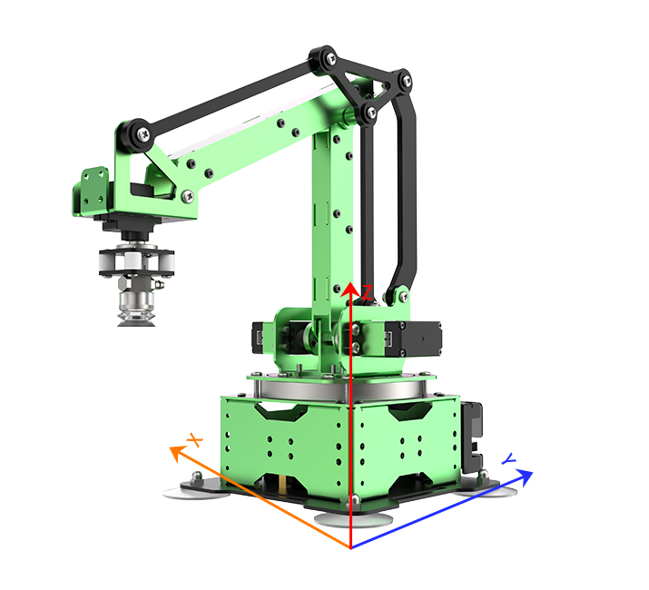
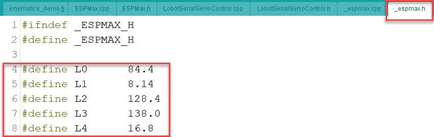
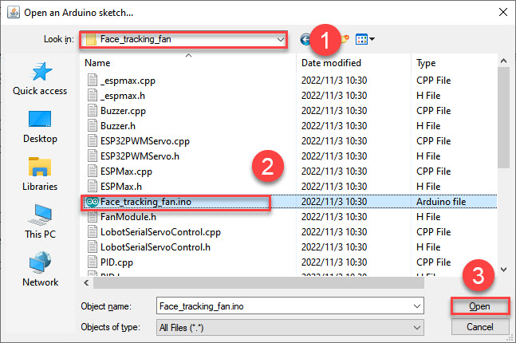
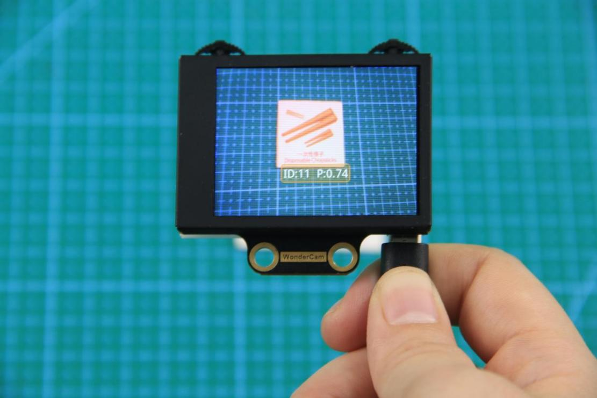
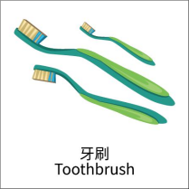
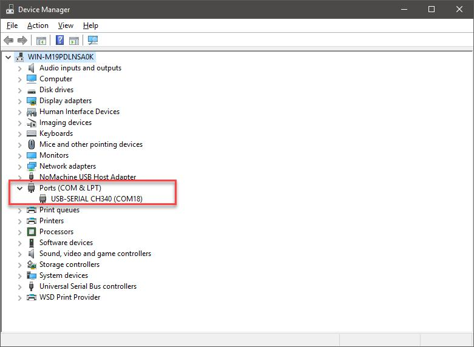
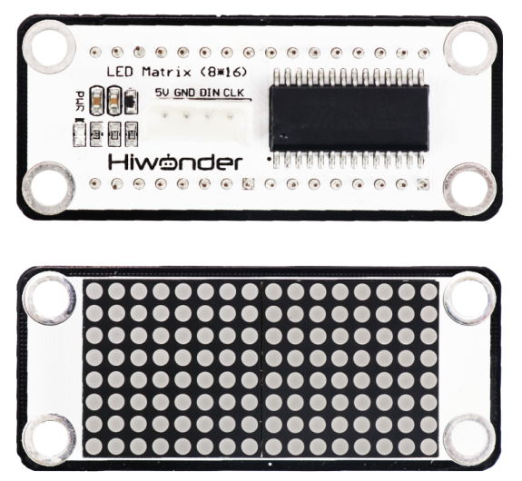
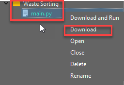
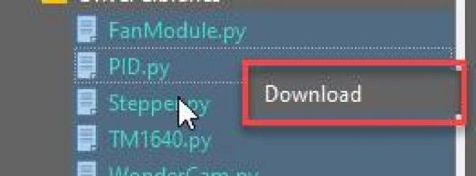

# 7. AI Vision Game

## 7.1 WonderCam AI Vision Module Learning

### 7.1.1 Introducing WonderCam

* **Instructions**

WonderCam is an user-friendly AI visual module with eight built-in functions: Color Recognition, Facial Recognition, AprilTag Recognition, Visual Line Following, Numeric Recognition, Landmark Recognition, Image Classification and Feature Learning.

WonderCam make learning AI fun and easy to comprehend. With 1-Click Training feature, it can readily program many creative AI visual projects.

WonderCam IIC connector works seamlessly with many global leading controllers like micro:bit, Arduino, Raspberry Pi etc. By sending the recognized result output to the controller, you can focus on project creativity without the programming complexity.


* **Operation Overview**


* **IIC Connectors Specification**

| S/N | Name | Function |
|:---:|:----:|:---:|
| 1 | SCL | IIC Serial Clock Pin |
| 2 | SDA | IIC Serial Data Pin |
| 3 | GND | IIC Negative Pin |
| 4 | 5V | 5V Positive Pin |

* **User Learning Guideline**

(1) Understanding WonderCam module and operating familiarization

Start with **"Lesson 1 Introducing WonderCam"** follow by **"Lesson 2 Getting Started"**.

(2) Step by Step guide to AI Visual Module features and functions

The 8 lessons are: Color Recognition, Facial Recognition, AprilTag Recognition, Visual Line Following, Numeric Recognition, Road Sign Recognition, Image Classification and Feature Learning.

(3) Learn as needed

Upon experiencing all the features and functions, learner can further explore programming each features with the guideline provided for different platform.

### 7.1.2 Operating Instructions

* **Device Power Supply Methods**

(1) Connect to a computer port or a charging adapter via a USB cable.


(2) Powered by a lithium battery through the 4-pin interface on the right side of the back, which can be connected to an expansion board. For example, Hiwonder’s micro:bit expansion board, Arduino expansion board, etc.


:::{Note}
* The WonderCam vision module’s supply voltage must not exceed 5V. Please use a charging adapter or lithium battery that does not exceed 5V.
* Make sure the supply voltage and power are sufficient. Otherwise, the WonderCam vision module may experience screen flickering, incorrect results, and other malfunctions.
:::

* **Operating Instructions**

(1) Basic Operations

① When powered on for the first time, the screen will stay on the **“Color Recognition”** function menu.

② The WonderCam vision module has two levers, and each lever can be flicked left, flicked right, or pressed downward, effectively providing three functions per lever. The two levers are functionally divided into a navigation lever and a function lever. The lever at the top left of the screen serves as the navigation lever, while the one at the top right is the function lever. By flicking the navigation lever to the right, you can switch to the **"Face Recognition"** function menu, as shown in the figure below.


③ In the the default screen after startup, the levers function as follows:

**Navigation lever: Flick left or right to switch between different menu items.**


④ In the main interface, flicking it left or right allows you to switch function menus. The switch will complete the change after the progress circle disappears. Holding the lever continuously enables faster switching.

**Function lever: Used to open function options and confirm selections in dialog boxes. Note: Each function interface has its own specific functions, so the icons will change accordingly.**


⑤ In the main interface, flicking the function lever to the right turns the fill light on or off.


(2) Function Parameter Settings

You can adjust parameters for some functions, such as the detection threshold and NMS threshold in face recognition. If a gear icon appears at the top right corner of the main interface, it indicates that parameter settings are supported for the current function.

① How to enter the parameter settings menu:

Press the button corresponding to the gear icon to enter the parameter settings. For example, in face recognition, if you see a gear icon in the middle of the upper right corner, press down on the function lever to enter the parameter settings for face recognition.


② Setting specific parameters:

Move the navigation lever left or right to select the parameter you want to adjust, then press the button in the direction corresponding to the gear icon again to enter the detailed parameter setting. Inside the setting menu, you can use the navigation lever to move left or right to change parameter values. Long-pressing allows you to change values quickly. After completing the adjustments, press the button corresponding to the OK icon to save and return to the previous menu.


③ Exit settings and return to the main menu:

While in the settings menu, press the navigation lever toward the X icon to bring up the exit dialog. Follow the prompt to move the navigation lever to select **“Yes”** or **“No.”** Selecting **“Yes”** saves the parameter changes, while selecting **“No”** discards the changes and restores the original settings. After making your choice, press down on the function lever to confirm.


(3) System Settings

In addition to function-specific parameter settings, there are also general system settings, such as system language. This section mainly introduces how to adjust these parameters.

① Enter System Settings

In the main interface, move the navigation lever to the rightmost item, which is **“System Settings.”** Then press the gear icon to enter the system settings.


② Settings options:

(1) Screen brightness: Used to adjust the display brightness.

(2) Fill light brightness: Used to adjust the brightness of the fill light.

(3) Menu auto-hide time: Used to set the time before the menu automatically hides. For example, if set to 30, the menu will automatically hide after 30 seconds of inactivity.

(4) I2C address: Used to configure the I2C peripheral address of the WonderCam vision module. The default address is 0x32.

(5) Language: Used to set the system language of the WonderCam vision module. Currently supports English and Simplified Chinese. After setting, the module will automatically reboot to apply the changes.

* **Understanding the Coordinate System**

By understanding the coordinate system, you will be able to better interpret the output data from the WonderCam vision module in subsequent lessons. The WonderCam vision module defines the top-left corner of the image as point O. The horizontal direction to the right is the positive X-axis, and the vertical direction downward is the positive Y-axis. The maximum value of the X-axis within the image is 319, and the maximum value of the Y-axis is 239.


### 7.1.3 WonderCam Assembly


## 7.2 Arduino Development

### 7.2.1 What is the Inverse Kinematics

This lesson aims at helping users basically learning about the principle of inverse kinematics. The further learning and practical application of the inverse kinematics of robotic arm is available in the folder **“7. Inverse Kinematics Lesson”**

* **What is it?**

Forward kinematics refers to process of obtaining position and velocity of end effector, given the known joint angles and angular velocities. In other word, the position information of end effector can be obtained when then joint angle and linkages parameters are known.

Inverse Kinematics is the inverse function or algorithm of Forward Kinematics. According to the position and post of the end effector along with linkages parameters, the joint position can be calculated, i.e., Given the robot’s end-effector positions, inverse kinematics can determine an appropriate joint configuration.

* **Establish Coordinate System**

A coordinate system must be established to describe the motion of an object. MaxArm uses x-y-z axes coordinate system (unit:mm) and takes the the base centre of robotic arm as original point (0,0,0), as the figure shown below.



The correspondence relationship between the movement orientation of end effector and the values of x-y-z axes is shown below (user per se as reference):

| Coordinate axis | control orientation |
|:---:|:---|
| x | Control the end effector of robotic arm to move left or right (As the x value is positive, it moves to the right. As the x value is negative, it moves to the left. ) |
| y | Control the end effector of robotic arm to move forward and backward. (As the y value is negative,it moves backward. As the y value is positive, it moves forward.) |
| z | Control the end effector of robotic arm to move up and down (As the z value is negative, it moves up. As the z value is positive, it moves down.) |

* **Project Operation**

After learning about the principle and spatial concept of inverse kinematics, the control method of inverse kinematics can be mastered by a simple routine. You can follow the steps below to run the game.

(1) Install and connect Arduino. (Please refer to the tutorial in folder **“4. Underlying Files Learning/ Arduino Development/ Lesson 1 Set Development Environment”**)

(2) Double click to open Arduino IDE .


(3) Click **“File--Open”**.


(4) Select the program **“kinematics_demo.ino”** in the folder [5.MaxArm Hardware Basics Learning/ Arduino Development/ Game Programs/ Program Files/ kinematics_demo](), and click **“Open”**.


(5) Check the board model. Click **“Tools--Board”** and select **“ESP 32 Dev Module”**. (If the model of development board has been configured when setting the development environment, you can skip this step.)


(6) Select the corresponding port of ESP32 controller in **“Tools--Port”**. (Here take the port **“COM5”** as example. Please select the port based on your computer. If COM1 appears, please do not select because it is the system communication port but not the actual port of the development port.)


(7) If you are not sure the port number, please open the **“This PC”** and click **“Properties--Device Manger”** in turns to check the corresponding port number (the device is with CH340).


(8) After selecting, confirm the board **“ESP32 Dev Module”** in the lower right corner and the port number **“COM5”** (it is an example here, please refer to the actual situation).


(9) Then click on  icon to verify the program. If no error, the status area will display **“Compiling--Compile complete”** in turn. After compiling, the information such as the current used bytes, and occupied program storage space will be displayed.


(10) After compiling, click on  icon to upload the program to the development board. The status area will display **“Compiling--Uploading--Complete”** in turn. After uploading, the status area will stop printing the uploading information.


* **Project Analysis**

[Source Code]()

The complete program is as follow:

{lineno-start=1}
```c++
#include "ESPMax.h"
#include "_espmax.h"

// Inverse kinematics basic example 

void setup(){
    ESPMax_init();
    go_home(2000); // Move the robotic arm back to the initial position 
    Serial.begin(9600);
    Serial.println("start...");
}

bool start_en = true;
void loop(){
  if(start_en){
    float x,y,z;
    float pos[3];
    // XYZ position of the robotic arm’s initial pose 
    x = 0;
    y = -(L1 + L3 + L4);
    z = (L0 + L2);
    // Print XYZ position via serial, unit: millimeter 
```
{lineno-start=23}
```c++
    Serial.print(x);
    Serial.print("; ");
    Serial.print(y);
    Serial.print("; ");
    Serial.println(z);

    // Since the initial position of the robotic arm is already at the edge of its reachable workspace, it must first move downward along the Z-axis. Otherwise, the arm will not be able to 
    // move along the X or Y axes.
    // set_position(pos,t), pos={x,y,z}; x: X-axis coordinate, y: Y-axis coordinate, z: Z-axis coordinate, t: total movement time (the longer the time, the slower the speed) 
    
    pos[0] = x; pos[1] = y; pos[2] = z-100;
    set_position(pos,2000); // Move Z-axis 100mm down relative to the initial position 
    delay(2000);
    pos[0] = x; pos[1] = y; pos[2] = z;
    set_position(pos,2000); // Reset robotic arm to initial pose 
    delay(1000);

    start_en = false;
  }
  else{
    delay(500); // Delay 500 ms 
  }
}
```
(1) Import function library

Before the robotic arm starts to move, the encapsulation library and underlying library of inverse kinematics need to be imported.

{lineno-start=1}
```c++
#include "ESPMax.h"
#include "_espmax.h"
```
(2) Calculate the initial position of robotic arm

According to the linkage parameters of L0-L4 defined in kinematics underlying library.

{lineno-start=1}
```
#ifndef _ESPMAX_H
#define _ESPMAX_H

#define L0      84.4
#define L1      8.14
#define L2      128.4
#define L3      138.0
#define L4      16.8
```


Calculate the initial position of the end effector. (Use the L0-L4 values to get x=0, y=162.94, z=212.8)

{lineno-start=18}
```c++
    // XYZ position of the robotic arm’s initial pose 
    x = 0;
    y = -(L1 + L3 + L4);
    z = (L0 + L2);
```
(3) Control robotic arm

Use the function `set_position()` to control the end effector to move.

Take the code `set_position(pos,2000)` as example.

{lineno-start=34}
```c++
    pos[0] = x; pos[1] = y; pos[2] = z-100;
    set_position(pos,2000); // Move Z-axis 100mm down relative to the initial position 
    delay(2000);
    pos[0] = x; pos[1] = y; pos[2] = z;
    set_position(pos,2000); // Reset robotic arm to initial pose 
    delay(1000);
```
The first parameter `pos` is a set of valuea representing the position values of the end effector on x-y-z axis.

Among them, `pos[0]` represents the x-axis value of the initial position of the end-effector.

`pos[1]` represents the the y-axis value of the initial position of the end-effector.

`pos[2]` represents the end-effector moves down to 100mm. And the position of the end effector can be set by modifying the x,y and z values.

For example, if want to control the end-effector to move 200mm to the left. (its position relative to the original moves to 200mm to the left), set x value plus 200. If want to move to 200 to the right, set x-200.

If want to directly move to the set position, for example, move to 200mm on x axis, you just need to set x=200.

The second parameter `2000` is the running time and the unit is ms.

* **Inverse kinematics library analysis**

The path to the inverse kinematics library: [Appendix--8. Controller Underlying Files--Arduino Development--espmax.py]()


(1) Import head file and define pin

{lineno-start=1}
```c++
#include "ESPMax.h"
#include "_espmax.h"
#include "LobotSerialServoControl.h"
```
Import the inverse kinematics and servo head files.

{lineno-start=5}
```c++
#define SERVO_SERIAL_RX   35
#define SERVO_SERIAL_TX   12
#define receiveEnablePin  13
#define transmitEnablePin 14
HardwareSerial HardwareSerial(2);
LobotSerialServoControl BusServo(HardwareSerial,receiveEnablePin,transmitEnablePin);
```
Define the serial communication pin.

(2) Initialization

{lineno-start=12}
```c++
float ORIGIN[3] ={ 0, -(L1 + L3 + L4), (L0 + L2)};
float positions[3];

void ESPMax_init(){
    BusServo.OnInit();
    HardwareSerial.begin(115200,SERIAL_8N1,SERVO_SERIAL_RX,SERVO_SERIAL_TX);
}
```
`ORIGIN[3]` is the initial position of the end effector calculating from the linkage length.

The function `ESPMax_init()` is used for initialization

The function `BusServo.OnInit()` is the servo configuration initialization. `HardwareSerial.begin()` is serial communication configuration. “115200” is the baud rate. `SERIAL_8N1` refers to the working mode. `SERVO_SERIAL_RX` is the pin number of RX port. `SERVO_SERIAL_TX` is the pin number of TX port.

(3) Control a single servo

{lineno-start=20}
```c++
int set_servo_in_range(int servo_id, int p, int duration){
    if(servo_id == 3 & p < 470) p = 470;
    if(servo_id == 2 & p > 700) p = 700;
    BusServo.LobotSerialServoMove(servo_id, p, duration);
    return int(1);
}
```
The function `set_servo_in_range()` is used to control the movement of a single servo, and limit the position of servo ID2 and ID3. The ID3 Servo can not be less than 470 impulse and the No.4 can not be less than 700. The parameter `servo_id` is servo ID number and the parameter `p` is servo impulse. The parameter `duration` is the running time.

The function `BusServo.LobotSerialServoMove()` in BusServo library controls a single servo to move.

(4) Calculate servo pulse

{lineno-start=27}
```c++
float* position_to_pulses(float pos[3], float* pul){
    float angles[3];
    inverse(pos,angles);
    deg_to_pulse(angles,pul);
    return pul;
}
```
The function `position_to_pulses()` is used to calculate the servo pulse. The parameter `position` is position coordinate. `angles` is servo angle. `pulse` is servo pulse. Then the value of servo pulse will be returned.

The function `inverse()` is used to calculate the servo angle according to the coordinates.

The function `deg_to_pulse()` is used to calculate the servo pulse according to the servo angle.

(5) Calculate robotic arm position

{lineno-start=34}
```c++
float* pulses_to_position(float pul[3], float* pos){
    float joints[3];
    pulse_to_deg(pul,joints);
    forward(joints,pos);
    return pos;
}
```
The function `pulses_to_position()` is used to calculate the coordinate of robotic arm position. The parameter `pul[3]` is servo pulse. The coordinate of robotic arm is calculated according to the servo pulses, and then the coordinate value is returned.

(6) The movement of robotic arm

{lineno-start=41}
```c++
int set_position(float pos[3], int duration){
    float x = pos[0];
    float y = pos[1];
    float z = pos[2];
    if(z > 255) z = 255;
    if(sqrt(x*x + y*y) < 50) return int(0);
    float angles[3];
    inverse(pos,angles);
    float pul[3];
    deg_to_pulse(angles,pul);
    for(int i=0; i<3; i++){
        positions[i] = pul[i];
        BusServo.LobotSerialServoMove(i+1,pul[i],duration);
        delay(2);
    }
    return int(1);
}
```
The function `set_position()` is used to control the robotic arm to move, and add the position limit. The parameter `position` is the position coordinate and the `duration` is the running time.

Use judgement statement to limit the robotic arm position. The coordinate of z-axis can not be greater than 225. The root of the sum of the squares of the x and y axes coordinates should be greater than 50, which means the end effector should be outside the circle with the coordinate origin as the center and the radius of 50. The unit is millimeter.

Then use `for` to control the ID1, ID2 and ID3 servos to rotate.

(7) Back to the initial position

{lineno-start=83}
```c++
void go_home(int duration){
    set_position(ORIGIN, duration);
}
```
The function `go_home()` is used to get robotic arm back to the initial position. The parameter `duration` is the running time and the parameter `self.set_position()` is to control robotic arm to move. The parameter `ORIGIN` is the coordinate of the initial position set in program.

(8) Read position coordinate

{lineno-start=93}
```c++
float* read_position(float* pos){
    float pul[3];
    for(int i=0; i<3; i++){
        pul[i] = BusServo.LobotSerialServoReadPosition(i+1);
    }
    pulses_to_position(pul,pos);
}
```
Use the function `self.bus_servo.get_position()` to get the pulse value of servo ID1, ID2, and ID3.

Get the x,y,z position coordinate by calculating the robotic arm position function `pulses_to_position()`. Then the x, y and z values are obtained.

## 7.3 AI Fan

### 7.3.1 Facial Recognition

The images under the same directory can be used directly.

* **Instructions**

Before starting this game, please read and follow the notices below, otherwise, the outcome of this game will be influenced.

(1) To learn face, point the **“+”** on WonderCam (AI vision module) at the the center of face for higher accuracy in learning.

(2) Use proper front face photograph for Face Template.

(3) Ensure environment is bright enough or use Fill Light on WonderCam when required.

* **Facial Recognition Introduction**

Through face detection and facial recognition on the screen display, WonderCam provides data such as Face position and size etc.

* **Facial Recognition Operations**

(1) Enter Function

Push Navigation button to Facial Recognition menu.


(2) Face Detection

Once WonderCam is in Facial Recognition mode, face detection will automatically be activated. When face is detected, a white frame will appear on screen to enclose the detected face.


(3) Learn and Recognize Face

To recognize a specific face, WonderCam need to learn to recognize the face first.

① Learn a Single Face

**Step 1: Left push Function button to enter Learning mode.**


After entering Learning model, the mark **“+”** will appear in the middle of screen, and the menu bar will show **“Face ID:1”**, **“Face ID:2“** etc. The ID is to tag and save different Faces.

**Step 2: Point the mark “+” on screen to the center of Face. Take note of the given instructions.**


**Step 3: When face is centered, left push Function button to the camera icon to learn the face. When learning is successful, push Function button down once to select OK and complete the learning process. If the learning is successful, when the face is detected, WonderCam will display the corresponding ID on screen.**

② Learn Multiple Faces

To learn more faces, when in Learning mode, right push Navigation button to another ID number and repeat earlier process.


③ Recognizing Faces

After the learning is completed, when the same face is recognized again, the face will be framed in different color, and the corresponding ID will be displayed.


(4) Delete Face

To delete Face ID that is no longer required. In Face Recognition Learning mode, push Navigation button to the Face ID number targeted to delete. Push Function button to the right toward Bin icon, push Function button down to OK to delete.


* **Facial Recognition Function Settings**

In Facial Recognition main menu, press Function button down toward Gear icon to enter Settings interface.


Available for configurations are: Detecting Threshold, NMS Threshold, Recognition Threshold and Reset.

* **Detecting Threshold:** To set threshold for face detection. Higher value will have higher accuracy rate. However, too high a value will also resulted in lower face detection rate, or even failure face detection
* **NMS Threshold:** Non- Maximum Suppression is a computer vision method. Leave it at default value.
* **Recognition Threshold:** Settings for specific Face ID. Higher value will have higher accuracy rate. However, higher value may result in unable to recognize or only recognize at specific part or angle of the face.
* **Reset:** This will erase all previous records and reset to factory defaults. Please take care to Save the settings so that the reset settings take effect.

### 7.3.2 Module Assembly


### 7.3.3 AI Fan

:::{Note}
If the face models have been burnt to WonderCam in advance, you can start this game directly.

If fail to recognize face, please re-burn the firmware according to **“4. Firmware (including method)”** in [Appendix/ WonderCam AI Vision Module /3.Appendix /4.Firmware (Installation method included)]().
:::

* **Project Principle**

In this game, when face is detected by WonderCam module, fan module will turn on and dot matrix module will display a smiley expression, and then robotic arm will track the face,

The tracking function is implemented by PID algorithm which controls robotic arm to move within a certain area.

PID control algorithm combines Proportional (P), Integral (I), and Derivative (D). The controller attempts to correct the error between a measured process variable and desired setpoint by calculating the difference.

Based on the position information obtained in face recognition, and the coordinates of the center point of the vision module are compared to calculate the distance between robot arm and target position.

The path of program file is [7. AI Vision Game/ Arduino Development/ Program Files/ AI Fan/Face_tracking_fan/ Face_tracking_fan.ino]()

{lineno-start=39}

```c++
void loop() {
  float pos[3];
  pos[0] = 0;
  pos[1] = -120;
  pos[2] = 150;
  set_position(pos, 1500);
  delay(1500);
  bool display_st = false;

  while (true) {
    cam.updateResult();           // Update WonderCam results 
    if (cam.anyFaceDetected()) {  // Face detected
      if (!display_st) {          // Check if fan was previously off to avoid frequent ON commands  
        display_st = true;
        FanModule_on();                      // Turn on fan module 
        Matrix.setDisplay(smiling_buf, 16);  // Display smiling face on LED matrix 
      }
      WonderCamFaceDetectResult p;  // Get face coordinates 
      cam.getFaceOfIndex(1, &p);
```

* **Preparation**

(1) Hardware

Please refer to **“Lesson 2 Module Assembly”** to assemble fan module to the corresponding position on MaxArm (WonderCam AI vision module has been assembled by default).

(2) Software

Please refer to **“4. Underlying Program Learning/ Arduino Development/ Lesson 1 Set Development Environment”** to connect MaxArm to Arduino.

* **Program Download**

[Source Code]()

(1) Double click to open Arduino IDE .


(2) Click **“File -- Open”**.


(3) Open the program **“Face_tracking_fan.ino”** in the folder [7. AI Vision Games/ Arduino Development/ Program Files/ AI Fan/ Face_tracking_fan]().



(4) Select the corresponding board model. Click **“Tool -- Board”** and select **“ESP 32 Dev Module”** (If the board model has been configured when setting development environment, you can skip this step.)


(5) Select the corresponding port in **“Tools--Port”**. (Here take the port **“COM5”** as example. Please select the port based on your computer. If COM1 appears, please do not select because it is the system communication port but not the actual port of the development port.)


(6) If you’re not sure about the port number, please open the **“This PC”** and click **“Properties--Device Manger”** in turns to check the corresponding port number (the device is with CH340).


(7) After selecting, confirm the board **“ESP32 Dev Module”** in the lower right corner and the port number **“COM5”** (it is an example here, please refer to the actual situation).


(8) Then click on  icon to verify the program. If no error, the status area will display **“Compiling--Compile complete”** in turn. After compiling, the information such as the current used bytes, and occupied program storage space will be displayed.


(9) After compiling, click on  icon to upload the program to the development board. The status area will display **“Compiling--Uploading--Complete”** in turn. After uploading, the status area will stop printing the uploading information.


* **Project Outcome**

After the game is started, MaxArm keeps searching human face within a certain range. When a human face is detected, fan will turn on and a smile expression will display on dot matrix module. If the human face disappears, the fan will stop and dot matrix module will go black.

* **Program Analysis**

[Source Code]()

(1) Import Function Library

The path of the program file: [7. AI Vision Game/ Arduino Development/ Program Files/ AI Fan/ Face_tracking_fan/ Face_tracking_fan.ino]()

Before the program is executed, I2C protocol, recognition module, buzzer, inverse kinematics, PWM servo, bus servo, air pump and other related function libraries are required to be imported first.

{lineno-start=1}
```c++
#include "PID.h"
#include "ESPMax.h"
#include "Buzzer.h"
#include "TM1640.h"
#include "WonderCam.h"
#include "FanModule.h"
#include "SuctionNozzle.h"
#include "ESP32PWMServo.h"
```


(2) Initialization

Initialize the required module and set WonderCam vision module as facial recognition mode.

{lineno-start=22}
```
void setup() {
  cam.begin();
  Buzzer_init();
  ESPMax_init();
  Nozzle_init();
  PWMServo_init();
  FanModule_init();
  Valve_on();
  SetPWMServo(1, 1500, 1000); // Set nozzle angle to 0 (吸嘴角度置0)
  Valve_off();
  setBuzzer(100);  // Sound buzzer for 100ms (设置蜂鸣器响100ms)
  Serial.begin(115200);
  Serial.println("start...");
  Matrix.setDisplay(empty_buf, 16);        // Clear LED matrix (点阵清屏)
  cam.changeFunc(APPLICATION_FACEDETECT);  // Set to face detection mode (设置为人脸识别功能)
```


The program uses `Valve_on()` function to turn on fan, and `Valve_off()` function to turn off fan, as the figure shown below.

{lineno-start=29}
```c+
  Valve_on();
```


{lineno-start=31}
```c++
  Valve_off();
```


Next, use `setBuzzer()` function to control buzzer. The parameter 100 represents the sound duration is 100ms, as the figure shown below.

{lineno-start=32}
```c++
  setBuzzer(100);  // Sound buzzer for 100ms 
```


Then, use `Matrix.setDisplay(empty_buf, 16)` function to clear the screen of the dot matrix module, as the figure shown below.

{lineno-start=35}
```c++
  Matrix.setDisplay(empty_buf, 16);        // Clear LED matrix 
```


And set WonderCam vision module as facial recognition mode.

{lineno-start=36}
```c++
  cam.changeFunc(APPLICATION_FACEDETECT);  // Set to face detection mode 
```


Robot arm is controlled to turn through the inverse kinematics function `set_position()`, as the figure shown below.

{lineno-start=39}
```c++
void loop() {
  float pos[3];
  pos[0] = 0;
  pos[1] = -120;
  pos[2] = 150;
  set_position(pos, 1500);
  delay(1500);
  bool display_st = false;
```


Take `set_position(pos, 1500)` above as example:

The first parameter `pos` is the position coordinate of the suction nozzle. Assign pos. The first parameter **"pos"** is the position coordinates of the suction nozzle. Assign pos as 0, -120, 150, that is, the position coordinates of the end-effector of the robot arm are (0, -120, 150). (About the determination of the spatial coordinate system and position, please go to **" 6 Secondary Development/ Arduino Development/ Inverse Kinematics Learning (must-see!!!)"**)

The second parameter `1500` is the running time and the unit is ms.

(3) Face Detection

Robotic arm rotates continuously, and constantly detects a human face through WonderCam AI vision module, and keeps updating the data of the vision module .

Then judge the returned data, as the figure shown below:

{lineno-start=49}
```c++
    cam.updateResult();           // Update WonderCam results 
    if (cam.anyFaceDetected()) {  // Face detected
```


If a human face is recognized, then determine whether the fan is turned off. If it is off, use the `fan.on()` function to turn on fan and display smile expression on the dot matrix module.

{lineno-start=51}
```c++
      if (!display_st) {          // Check if fan was previously off to avoid frequent ON commands  
        display_st = true;
        FanModule_on();                      // Turn on fan module 
        Matrix.setDisplay(smiling_buf, 16);  // Display smiling face on LED matrix 
      }
```


Compared with the data returned by vision module, if no human face is detected, the fan will turn off and the screen of dot matrix will go black through the `tm.update_display()` function, as the figure shown below:

{lineno-start=}
```c++
      if (display_st) {
        display_st = false;
        FanModule_off();                   // Turn off fan module 
        Matrix.setDisplay(empty_buf, 16);  // Clear LED matrix 
      }
    }
    delay(50);
```


(4) Search Human Face

Use PID algorithm to set the x, y and z values of end-effector to search human face to realize the tracking function.

{lineno-start=61}
```c++
      if (abs(face_x - 160) < 15) {  // X-axis PID tracking 
        face_x = 160;
      }
      x_pid.setTarget(160);
      x_pid.setInput(face_x);
      pos[0] -= x_pid.getOutput();

      if (abs(face_y - 120) < 10) {  // Y-axis PID tracking 
        face_y = 120;
      }
      y_pid.setTarget(120);
      y_pid.setInput(face_y);
      pos[2] += y_pid.getOutput();

      if (pos[0] > 100) pos[0] = 100;  // Limit arm X-axis range 
      if (pos[0] < -100) pos[0] = -100;
      if (pos[2] > 180) pos[2] = 180;  // Limit arm Z-axis range 
      if (pos[2] < 100) pos[2] = 100;
      set_position(pos, 50);  // Move the arm 
    } else {                  // Face not detected 
```


Firstly, obtain the coordinate of the human face on vision module, as the figure shown below:

{lineno-start=56}
```c++
      WonderCamFaceDetectResult p;  // Get face coordinates 
      cam.getFaceOfIndex(1, &p);
      int face_x = p.x;
      int face_y = p.y;
```


Calculate the coordinates of the human face and center point obtained from vision module. If the calculated x-axis value satisfies the following conditions, PID algorithm is used to calculate the distance between the robot arm and the face coordinate.

{lineno-start=61}
```c++
      if (abs(face_x - 160) < 15) {  // X-axis PID tracking 
        face_x = 160;
```


The specific calculation method is as follow:

{lineno-start=64}
```c++
      x_pid.setTarget(160);
      x_pid.setInput(face_x);
      pos[0] -= x_pid.getOutput();
```


Because the movement of the robot arm on space coordinate has a certain range, it is necessary to set a movement range for the x and z.

{lineno-start=75}
```c++
      if (pos[0] > 100) pos[0] = 100;  // Limit arm X-axis range 
      if (pos[0] < -100) pos[0] = -100;
      if (pos[2] > 180) pos[2] = 180;  // Limit arm Z-axis range 
      if (pos[2] < 100) pos[2] = 100;
```


The calculation method of y and z axes is the same.

After calculating the coordinate position of the face on screen, substitute the value into the inverse kinematics function to achieve the tracking function as the figure shown below.

{lineno-start=79}
```c++
      set_position(pos, 50);  // Move the arm 
```


Among them,

The first parameter `pos` represents the coordinate values of x, y and z axes of end effector.(The difference between the center coordinate of the face and the center coordinates of screen).

The second parameter `50` represents the time it takes for the robot arm to move to the coordinate position.

## 7.4 Color Tracking and Display

### 7.4.1 Color Recognition

:::{Note}
Do not skip the operations in this lesson, otherwise, WonderCam cannot realize color recognition function. You can also refer to the video tutorial.
:::

* **Introduction to Color Recognition function**

WonderCam recognizes and identifies the various colors in the white frame shown within the display. It provides data such as object position and size etc to perform color recognition, color tracking etc.

* **Instructions**

(1) Use bright and high saturated color. Example red, green or blue.

(2) Targeted object color and its background must be distinctive. Example if target object is Yellow, avoid yellow background.

(3) Do not learn White color or Composite color. Ensure environment is bright enough or use Fill Light on WonderCam when required.

(4) Adjusting light condition and the focus angle can help to stabilize and improve the color recognition process in the white frame within the display panel.

(5) **Wiring**

Use the provided cable to connect WonderCam vision module to the power supply.

* **Color Recognition Operations**

(1) Enter Function

The default start-up function on WonderCam is Color Recognition. If not, push Navigation button on WonderCam to left or right to select to Color Recognition menu.

(2) Learning new color and recognizing new color

To use Color Recognition function, program WonderCam to learn about the color first.

Steps are as follows

① Step 1: When in the Color Recognition Menu, push Function button to the left once to enter Learning mode.


② Step 2: In Learning mode, a red + sign will be shown in center of display with menu showing **“Color ID:1”**, **“Color ID:2”**.

③ Step 3: Focus red + on to the targeted colored object. When target is in focus, a white frame on screen will encapsulate the object.


Reminder:

(1) Use bright and high saturated color. Example red, green or blue.

(2) Targeted object color and its background must be distinctive. Example if target object is Yellow, avoid yellow background.

(3) Do not Learn White color or Composite color. Ensure lighting condition is bright enough or use Fill Light on WonderCam when required.

(4) Adjusting light condition and the focus angle can help to stabilize and improve the color recognition process in the white frame within the display panel.

④ Step 4: Push Function button to the left for WonderCam to Learn the color. Wait for Learning successful message display. Push Function button down to OK to complete. If Learning fail, try adjusting lighting condition or change to more distinctive color. Ensure the White frame is stabilized when in focus and push top right button to the left to Learn.


⑤ Step 5: When learning is successful and WonderCam detected corresponding color to the ID number it had learned previously, the ID number of the object will be shown on display.


(3) Delete Color

To delete an ID color, enter Color Recognition mode and move to the selected ID by using Navigation button. Select Color ID to delete and push Function button to the right towards Bin icon. Push Function button down to select OK to delete.

(4) Color Recognition Function Settings

In the Color Recognition main menu, press Function button down to enter Settings interface.


Available for configurations are: Color Range and Reset.

* **Color Range:** This controls the White Frame parameter size in detecting the target object color variation. Higher value will enlarge White Frame size and will cover wider range of color variation on the display. Lower value will reduce White Frame size and focus on smaller portion of color. Range value at 20 is optimum in most situation.
* **Reset.** This will reset to factory default value. Do note to Save settings to effective the reset settings.

### 7.4.2 Module Assembly


### 7.4.3 Color Tracking and Display

:::{Note}
Before starting this game, please make sure the colors including red, green, blue to be recognized are learned as ID1, ID2 and ID3 in sequence with WonderCam module. The specific content refer to **“Lesson 1 Color Recognition Learning”** under the same directory.

If you skip the step above, WonderCam module can not recognize the colors and complete this game.
:::

* **Project Principle**

This game uses WonderCam to identify the object color. After the color is recognized, the initial letter of corresponding color will display on dot matrix module, as the figure shown below:

| Color | Red | Green | Blue |
|---|---|---|---|
| Display content | R | G | B |

The following picture shows WonderCam AI vision module:


The following picture shows the dot matrix module:


The module is composed of two red 8x8 LED dot-matrix screens, which can be controlled by driving the control chip.

The display content of the dot matrix is realized by setting the high and low levels of the two pins of the diodes. When the corresponding line is set to 1 level and a column is set to 0 level, the corresponding diodes light up, that is, 0 represents on and 1 represents off.

The program controls the display pattern with a set of hexadecimal data, a total of 16 data. Each data controls a column of LED lights, and the pattern is displayed by setting individual point.

To explain more clearer, the rows and columns of dot matrix are marked with corresponding numbers, as the figure shown below:


x: The specific origin position of the bitmap x-axis coordinate and the value is from 0 to 15. The set in the program is 0.

y: The specific origin position of the bitmap y-axis coordinate and the value is from 0 to -7. The set in the program is 0.

If want the LED at position (0, 0) to light up first, we need to set the binary (from top to bottom) of the first column to 01111111, which translates to 0x7f in hexadecimal.

The path of the program file: [7.AI Vision Game/ Arduino Development/ Program Files/ Color Tracking and Display/ Color_tracking/Color_tracking.ino]()

* **Preparation**

(1) Hardware

Please refer to **“Lesson 1 Module Assembly”** to assemble module to the corresponding position on MaxArm (WonderCam AI vision module has been assembled to robotic arm. The specific assembly tutorial for WonderCam module refers to [7. AI Vision Games/ WonderCam AI Vision Module Learning(Must read!)/ Lesson 3 Assembly]()).

(2) Software

Please refer to **“4. Underlying Program Learning/ Arduino Development/ Lesson 1 Set Development Environment”** to connect MaxArm to Arduino.

* **Program Download**

[Source Code]()

(1) Double click to open Arduino IDE .


(2) Click **“File -- Open”**.


(3) Open the program **“Color_tracking.ino”** in the folder [7. AI Vision Game/ Arduino Development/ Program Files/Color Tracking and Display/ Color_tracking]().


(4) Select the corresponding board model. Click **“Tool -- Board”** and select **“ESP 32 Dev Module”** (If the board model has been configured when setting development environment, you can skip this step.)


(5) Select the corresponding port in **“Tools--Port”**. (Here take the port **“COM5”** as example. Please select the port based on your computer. If COM1 appears, please do not select because it is the system communication port but not the actual port of the development port.)


(6) If you’re not sure about the port number, please open the **“This PC”** and click **“Properties--Device Manger”** in turns to check the corresponding port number (the device is with CH340).


(7) After selecting, confirm the board **“ESP32 Dev Module”** in the lower right corner and the port number **“COM5”** (it is an example here, please refer to the actual situation).


(8) Then click on  icon to verify the program. If no error, the status area will display **“Compiling--Compile complete”** in turn. After compiling, the information such as the current used bytes, and occupied program storage space will be displayed.


(9) After compiling, click on  icon to upload the program to the development board. The status area will display **“Compiling--Uploading--Complete”** in turn. After uploading, the status area will stop printing the uploading information.


* **Project Outcome**

Hold red, green or blue block within module recognition area. After color is recognized, MaxArm will move with the block and the initial letter of corresponding color will be displayed on dot matrix module.

| Color | Red | Green | Blue |
|---|---|---|---|
| Display content | R | G | B |

* **Program Analysis**

[Source Code]()

(1) **Import function library**

The path of the program file: [7. AI Vision Game/ Arduino Development/ Program Files/ Color Tracking and Display/ Color_tracking/Color_tracking.ino]().

Before the program is executed, the PID, vision module, buzzer, dot matrix module, PWM servo, bus servo, air pump and other related function libraries are required to be import.

{lineno-start=1}
```c++
#include "PID.h"
#include "ESPMax.h"
#include "Buzzer.h"
#include "TM1640.h"
#include "WonderCam.h"
#include "SuctionNozzle.h"
#include "ESP32PWMServo.h"
```
(2) **Initialization**

Then, initialize the corresponding modules and set the vision module to color recognition mode.

{lineno-start=22}
```c++
void setup() {
  cam.begin();
  Buzzer_init();
  ESPMax_init();
  Nozzle_init();
  PWMServo_init();
  Valve_on();
  SetPWMServo(1, 1500, 1000);  // Set nozzle angle to 0 
  Valve_off();
  setBuzzer(100);  // Set buzzer for 100ms 
  Serial.begin(115200);
  Serial.println("start...");
  Matrix.setDisplay(empty_buf, 16);         // Clear LED matrix 
  cam.changeFunc(APPLICATION_COLORDETECT);  // Set to color detection function 
```
Set PID parameters (Proportional, Integral and Derivative). Through PID algorithm, the difference between the center coordinate of image and the centre coordinate of screen can be calculated and thus robot arm can be controlled to track the target object.

{lineno-start=13}
```c++
arc::PID<double> x_pid(0.030, 0.001, 0.0012);  // Set PID parameters 
arc::PID<double> y_pid(0.030, 0.001, 0.0002);
```
The set the hexadecimal address character of LED dot matrix module enable the module display the corresponding letter according to the recognized color, as the figure shown below:

{lineno-start=16}
```c++
TM1640 Matrix(32, 33);
uint8_t empty_buf[16] = { 0x0, 0x0, 0x0, 0x0, 0x0, 0x0, 0x0, 0x0, 0x0, 0x0, 0x0, 0x0, 0x0, 0x0, 0x0, 0x0 };
uint8_t red_buf[16] = { 0x0, 0x0, 0x0, 0x0, 0x0, 0xff, 0x19, 0x29, 0x49, 0x86, 0x0, 0x0, 0x0, 0x0, 0x0, 0x0 };
uint8_t green_buf[16] = { 0x0, 0x0, 0x0, 0x0, 0x0, 0x3c, 0x42, 0x81, 0x81, 0xa1, 0x62, 0x0, 0x0, 0x0, 0x0, 0x0 };
uint8_t blue_buf[16] = { 0x0, 0x0, 0x0, 0x0, 0x0, 0xff, 0x89, 0x89, 0x89, 0x76, 0x0, 0x0, 0x0, 0x0, 0x0, 0x0 };
```
(3) **Recognize and Display color**

Use While statement to constantly update the color data detected by vision module. (WonderCam vision module must first learn the color before recognizing, please refer to **“Lesson 1 Color Recognition Learning”** under the same file directory), as the figure shown below:

{lineno-start=47}
```c++
  while (true) {
    int color_x = 160;
    int color_y = 120;
    cam.updateResult();            // Update WonderCam result data 
```
Then use if condition statement to display the corresponding letter according to the recognized color. If it is not red, green or blue, the dot matrix module displays no content, as the figure shown below:

{lineno-start=53}
```c++
      if (cam.colorIdDetected(1)) {  // Check if color ID 1 detected 
        cam.colorId(1, &p);          // Get color ID 1 position data 
        color_x = p.x;
        color_y = p.y;
        if (display_st != 1) {
          display_st = 1;
          Matrix.setDisplay(red_buf, 16);  // Display 'R' on LED matrix 
        }
      } else if (cam.colorIdDetected(2)) {  // Check if color ID 2 detected 
        cam.colorId(2, &p);                 // Get color ID 2 position data 
        color_x = p.x;
        color_y = p.y;
        if (display_st != 2) {
          display_st = 2;
          Matrix.setDisplay(green_buf, 16);  // Display 'G' on LED matrix 
        }
      } else if (cam.colorIdDetected(3)) {  // Check if color ID 3 detected 
        cam.colorId(3, &p);                 // Get color ID 3 position data 
        color_x = p.x;
        color_y = p.y;
        if (display_st != 3) {
          display_st = 3;
          Matrix.setDisplay(blue_buf, 16);  // Display 'B' on LED matrix 
        }
        }
```
{lineno-start=101}
```c++
    } else {
      if (display_st != 0) {
        display_st = 0;
        Matrix.setDisplay(empty_buf, 16);  // Clear LED matrix (点阵清屏)
```
(4) **Robotic arm tracking**

Color tracking uses PID algorithm to set x, y, and z values of end effector to achieve the tracking effect, as the figure shown below:

{lineno-start=79}
```c++
      if (abs(color_x - 160) < 15) {  // PID tracking on X axis 
        color_x = 160;
      }
      x_pid.setTarget(160);
      x_pid.setInput(color_x);
      pos[0] -= x_pid.getOutput();

      if (abs(color_y - 120) < 10) {  // PID tracking on Y axis 
        color_y = 120;
      }
      y_pid.setTarget(120);
      y_pid.setInput(color_y);
      pos[2] += y_pid.getOutput();

      if (pos[0] > 100) pos[0] = 100;  // Limit X axis range of robotic arm 
      if (pos[0] < -100) pos[0] = -100;
      if (pos[2] > 180) pos[2] = 180;  // Limit Z axis range of robotic arm 
      if (pos[2] < 100) pos[2] = 100;
```
Firstly, obtain the coordinate data of the target color on screen (take red for example), as the figure shown below:

{lineno-start=55}
```c++
        color_x = p.x;
        color_y = p.y;
```
Calculate the coordinates of the target color and center point obtained from vision module. If the calculated x-axis value satisfies the following conditions, PID algorithm is used to calculate the distance between the target color and the robot arm coordinate.

{lineno-start=80}
```c++
      if (abs(color_x - 160) < 15) {  // PID tracking on X axis 
        color_x = 160;
      }
      x_pid.setTarget(160);
      x_pid.setInput(color_x);
      pos[0] -= x_pid.getOutput();
```
The specific calculation method is as follow:

{lineno-start=83}
```c++
      x_pid.setTarget(160);
      x_pid.setInput(color_x);
      pos[0] -= x_pid.getOutput();
```
Because the movement of the robot arm on space coordinate has a certain range, it is necessary to set a movement range for x.

{lineno-start=93}
```c++
      if (pos[0] > 100) pos[0] = 100;  // Limit X axis range of robotic arm 
      if (pos[0] < -100) pos[0] = -100;
```
The same calculation method for y and z axes.

After calculating the coordinate position of the target color on screen, substitute the value into the inverse kinematics function to achieve the tracking function, as the figure shown below,

{lineno-start=98}
```c++
      set_position(pos, 50);  // Drive robotic arm 
```
The first parameter `pos` represents the coordinate values of x, y and z axes of end effector. (The difference between the coordinate of the center of the target color and the coordinates of the center of the screen).

The second parameter `50` represents the time it takes for the robot arm to move to the coordinate position.

## 7.5 Color Tracking and Sorting

### 7.5.1 Color Recognition

:::{Note}
Do not skip the operations in this lesson, otherwise, WonderCam cannot realize color recognition function. You can also refer to the video tutorial.
:::

* **Introduction to Color Recognition function**

WonderCam recognizes and identifies the various colors in the white frame shown within the display. It provides data such as object position and size etc to perform color recognition, color tracking etc.

* **Instructions**

(1) Use bright and high saturated color. Example red, green or blue.

(2) Targeted object color and its background must be distinctive. Example if target object is Yellow, avoid yellow background.

(3) Do not learn White color or Composite color. Ensure environment is bright enough or use Fill Light on WonderCam when required.

(4) Adjusting light condition and the focus angle can help to stabilize and improve the color recognition process in the white frame within the display panel.

* **Wiring**

Use the provided cable to connect WonderCam vision module to the power supply.

* **Color Recognition Operations**

(1) Enter Function

The default start-up function on WonderCam is Color Recognition. If not, push Navigation button on WonderCam to left or right to select to Color Recognition menu.

(2) Learning new color and recognizing new color

To use Color Recognition function, program WonderCam to learn about the color first.

Steps are as follows

① Step 1: When in the Color Recognition Menu, push Function button to the left once to enter Learning mode.


② Step 2: In Learning mode, a red + sign will be shown in center of display with menu showing “Color ID:1”, “Color ID:2”.

③ Step 3: Focus red + on to the targeted colored object. When target is in focus, a white frame on screen will encapsulate the object.


Reminder:

* Use bright and high saturated color. Example red, green or blue.

* Targeted object color and its background must be distinctive. Example if target object is Yellow, avoid yellow background.

* Do not Learn White color or Composite color. Ensure lighting condition is bright enough or use Fill Light on WonderCam when required.

* Adjusting light condition and the focus angle can help to stabilize and improve the color recognition process in the white frame within the display panel.

④ Step 4: Push Function button to the left for WonderCam to Learn the color. Wait for Learning successful message display. Push Function button down to OK to complete. If Learning fail, try adjusting lighting condition or change to more distinctive color. Ensure the White frame is stabilized when in focus and push top right button to the left to Learn.


⑤ Step 5: When learning is successful and WonderCam detected corresponding color to the ID number it had learned previously, the ID number of the object will be shown on display.


(3) Delete Color

To delete an ID color, enter Color Recognition mode and move to the selected ID by using Navigation button. Select Color ID to delete and push Function button to the right towards Bin icon. Push Function button down to select OK to delete.

(4) Color Recognition Function Settings

In the Color Recognition main menu, press Function button down to enter Settings interface.


Available for configurations are: Color Range and Reset.

* **Color Range:** This controls the White Frame parameter size in detecting the target object color variation. Higher value will enlarge White Frame size and will cover wider range of color variation on the display. Lower value will reduce White Frame size and focus on smaller portion of color. Range value at 20 is optimum in most situation.
* **Reset.** This will reset to factory default value. Do note to Save settings to effective the reset settings.

### 7.5.2 WonderCam Module Assembly (Top view)


### 7.5.3 Color Tracking and Sorting

:::{Note}
Before starting this game, please make sure the colors including red, green, blue to be recognized are learned as ID1, ID2 and ID3 in sequence with WonderCam module. The specific content refer to **“Lesson 1 Color Recognition Learning”** under the same directory.

WonderCam vision module must face down when assembling on MaxArm. The specific assembly tutorial refers to **“Lesson 2 WonderCam Module Assembly (Top View)”** in the same directory.
:::

* **Project Principle**

This game uses WonderCam vision module to recognize color. After the color is recognized, robot arm is controlled to suck up object and sort it into the corresponding position by calling the functions in kinematics library.

The color tracking and sorting mainly use WonderCam module to recognize color, as the figure shown below:


The path of the program file: [7. AI Vision Game/ Arduino Development/ Program Files/ Color Tracking and Sorting/ Tracking_Sorting/ Tracking_Sorting.ino ]()

* **Preparation**

(1) Hardware

Please refer to **“Lesson 2 WonderCam Module Assembly (Top view)”** in folder [7. AI Vision Game/ Arduino Development/ Lesson 3 Color Tracking and Sorting]() to assemble WonderCam to the corresponding position on MaxArm.

(2) Software

Please refer to **“4. Underlying Program Learning/ Arduino Development/ Lesson 1 Set Development Environment”** to connect MaxArm to Arduino.

* **Program Download**

[Source Code]()

(1) Double click to open Arduino IDE .


(2) Click **“File -- Open”**.


(3) Open the program **“Tracking_Sorting.ino”** in the folder [6. Secondary Development/ Arduino Development/ Sensor-extension Game/Program Files/ Color Tracking and Sorting/ Tracking_Sorting]().


(4) Select the corresponding board model. Click **“Tool -- Board”** and select **“ESP 32 Dev Module”** (If the board model has been configured when setting development environment, you can skip this step.)


(5) Select the corresponding port in **“Tools--Port”**. (Here take the port **“COM5”** as example. Please select the port based on your computer. If COM1 appears, please do not select because it is the system communication port but not the actual port of the development port.)


(6) If you’re not sure about the port number, please open the **“This PC”** and click **“Properties--Device Manger”** in turns to check the corresponding port number (the device is with CH340).


(7) After selecting, confirm the board **“ESP32 Dev Module”** in the lower right corner and the port number **“COM5”** (it is an example here, please refer to the actual situation).


(8) Then click on  icon to verify the program. If no error, the status area will display **“Compiling--Compile complete”** in turn. After compiling, the information such as the current used bytes, and occupied program storage space will be displayed.


(9) After compiling, click on  icon to upload the program to the development board. The status area will display **“Compiling--Uploading--Complete”** in turn. After uploading, the status area will stop printing the uploading information.


* **Project Outcome**

Hold red, green or blue block within module recognition area. After color is recognized, MaxArm will move with the block. When the block stop moving, robotic arm will suck and sort it into the corresponding area.

* **Program Analysis**

[Source Code]()

(1) Import function library

The path of the program file: [7. AI Vision Game/ Arduino Development/ Program Files/ Color Tracking and Sorting/ Tracking_Sorting/ Tracking_Sorting.ino]().

Before the program is executed, the PID, vision module, buzzer, dot matrix module, PWM servo, bus servo, air pump and other related function libraries are required to import.

{lineno-start=1}
```c++
#include "PID.h"
#include "ESPMax.h"
#include "Buzzer.h"
#include "WonderCam.h"
#include "SuctionNozzle.h"
#include "ESP32PWMServo.h"
```
(2) Initialization

Then, initialize the corresponding modules and set the vision module to color recognition mode.

Set PID parameters (Proportional, Integral and Derivative). Through PID algorithm, the difference between the center coordinate of image and the centre coordinate of screen can be calculated and thus robot arm can be controlled to track the target object, as the figure shown below：

{lineno-start=10}
```c++
WonderCam cam;

arc::PID<double> x_pid(0.045, 0.0001, 0.0001);  // Set PID parameters (设置PID参数)
arc::PID<double> y_pid(0.045, 0.0001, 0.0001);
```
{lineno-start=15}
```c++
void setup() {
  cam.begin();
  Buzzer_init();
  ESPMax_init();
  Nozzle_init();
  PWMServo_init();
  Valve_on();
  SetPWMServo(1, 1500, 1000);  // Set nozzle angle to 0 (吸嘴角度置0)
  Valve_off();
  setBuzzer(100);  // Set buzzer for 100ms (设置蜂鸣器响100ms)
  Serial.begin(115200);
  Serial.println("start...");
  cam.changeFunc(APPLICATION_COLORDETECT);  // Set to color detection function (设置为颜色识别功能)
```
(3) Color Recognition

Use While statement to constantly update the color data and position coordinate detected by vision module. (WonderCam vision module must first learn the color before recognizing, please refer to **“Lesson 1 Color Recognition Learning”** under the same file directory), as the figure shown below:

{lineno-start=41}
```c++
  while (true) {
    int color_x = 160;
    int color_y = 120;
    cam.updateResult();            // Update WonderCam result data (更新小幻熊结果数据)
    if (cam.anyColorDetected()) {  // Color detected (识别到颜色)
      WonderCamColorDetectResult p;
      if (cam.colorIdDetected(1)) {  // Check if color ID 1 detected (判断是否识别id1颜色)
        cam.colorId(1, &p);          // Get color ID 1 position data (获取id1颜色位置数据)
        color_x = p.x; color_y = p.y;
        angle_pwm = 2100;
        place[0] = -120; place[1] = -140; place[2] = 85;
```
(4) Color Tracking

The tracking function is realized by PID algorithm. Due to a certain movement range to robotic arm on space coordinate, so the coordinate limit of x, y and z axes needs to be set first, as the figure shown below:

{lineno-start=82}
```c++
      if (pos[0] > 100) pos[0] = 100;  // Limit X axis range of robotic arm (机械臂X轴范围限幅)
      if (pos[0] < -100) pos[0] = -100;
      if (pos[1] > -60) pos[1] = -60;  // Limit Y axis range of robotic arm (机械臂Y轴范围限幅)
      if (pos[1] < -240) pos[1] = -240;
      set_position(pos, 50);  // Drive robotic arm (驱动机械臂)
```
Then save the coordinate value of x and y axes obtained for vision module to these two variables `color_x` and `color_y`, as the figure shown below:

{lineno-start=49}
```c++
        color_x = p.x; color_y = p.y;
```
Next, the s-axis coordinate value of the color block is subtracted from the x-axis coordinate value of the center point of the vision module screen to obtain the distance between the color block and the center of the screen (take x-axis for example), which is calculated as follows.

{lineno-start=66}
```c++
      if (abs(color_x - 160) < 15) {  // PID tracking on X axis (X轴PID算法追踪)
        color_x = 160;
      }
      x_pid.setTarget(160);
      x_pid.setInput(color_x);
      float dx = x_pid.getOutput();
      pos[0] -= dx;
```
The same calculation method for y axis is shown below.

{lineno-start=74}
```c++
      if (abs(color_y - 120) < 10) {  // PID tracking on Y axis (Y轴PID算法追踪)
        color_y = 120;
      }
      y_pid.setTarget(120);
      y_pid.setInput(color_y);
      float dy = y_pid.getOutput();
      pos[1] -= dy;
```
After calculating the coordinate position of the target color on screen, substitute the value into the inverse kinematics function to achieve the tracking function, as the figure shown below,

{lineno-start=86}
```c++
      set_position(pos, 50);  // Drive robotic arm (驱动机械臂)
```
The first parameter `(x, y, z)` represents the coordinate of the end effector. (The difference between the coordinate of the center of the target color and the coordinates of the center of the screen).

The second parameter `50` represents the time it takes for the robot arm to move to the coordinate position.

(5) Sorting

The sorting function is implemented by inverse kinematics function, as the figure shown below:

{lineno-start=97}
```c++
          set_position(pos, 1000); //Move above color block (移动到色块上方)
          delay(1000);
          pos[2] = 85;
          set_position(pos, 600); //Suction the color block (吸取色块)
          Pump_on();  //Turn on the pump (打开气泵)
          delay(1000);
          pos[2] = 150;
          set_position(pos, 1000); //Lift robotic arm (机械臂抬起来)
          delay(1000);
          pos[0] = place[0]; pos[1] = place[1];
          set_position(pos, 1200);  //Move above placement area (移动到放置区上方)
          delay(1200);
          SetPWMServo(1, angle_pwm, 800); //Set angle compensation (设置角度补偿)
          delay(200);
          set_position(place, 1000);  //Move to placement area (移动到放置区)
          delay(1000);
          Valve_on();   //Open valve to release block (打开电磁阀释放色块)
          place[2] = 150;
          set_position(place, 1000); //Lift robotic arm (机械臂抬起来)
          delay(1000);
          Valve_off();   //Close valve (关闭电磁阀)
          pos[0] = 0; pos[1] = -120; pos[2] = 150;
          set_position(pos, 1500);; //Reset robotic arm (机械臂复位)
          SetPWMServo(1, 1500, 800); // Set nozzle angle to 0 (吸嘴角度置0)
```
When module detects that the block stops moving, robot arm will execute sorting action, as the figure shown below:

{lineno-start=88}
```c++
      if ((abs(dx) < 0.1) & (abs(dy) < 0.1)) {
```
To avoid wrong recognition, the program will detect ten times, and then start a new round of detection.

Then set coordinate parameter to sort the block into corresponding position. To make the block place in a right direction, a compensation angle will be set.

{lineno-start=109}
```c++
          SetPWMServo(1, angle_pwm, 800); //Set angle compensation (设置角度补偿)
```
The specific sorting process is as follow:

{lineno-start=118}
```c++
          setBuzzer(100);  // Set buzzer for 100ms (设置蜂鸣器响100ms)
          float d_x = pos[0] / 2.3;
          float d_y = 68 - abs(d_x / 3);

          pos[0] += d_x; pos[1] -= d_y;
          set_position(pos, 1000); //Move above color block (移动到色块上方)
          delay(1000);
          pos[2] = 85;
          set_position(pos, 600); //Suction the color block (吸取色块)
          Pump_on();  //Turn on the pump (打开气泵)
          delay(1000);
          pos[2] = 150;
          set_position(pos, 1000); //Lift robotic arm (机械臂抬起来)
          delay(1000);
          pos[0] = place[0]; pos[1] = place[1];
          set_position(pos, 1200);  //Move above placement area (移动到放置区上方)
          delay(1200);
          SetPWMServo(1, angle_pwm, 800); //Set angle compensation (设置角度补偿)
          delay(200);
          set_position(place, 1000);  //Move to placement area (移动到放置区)
          delay(1000);
          Valve_on();   //Open valve to release block (打开电磁阀释放色块)
          place[2] = 150;
          set_position(place, 1000); //Lift robotic arm (机械臂抬起来)
          delay(1000);
          Valve_off();   //Close valve (关闭电磁阀)
          pos[0] = 0; pos[1] = -120; pos[2] = 150;
```
The coordinates of the center of block and screen according to PID algorithm.

{lineno-start=93}
```c++
          float d_x = pos[0] / 2.3;
          float d_y = 68 - abs(d_x / 3);
```
Next, use kinematics function to control robot arm, as the figure shown below:

{lineno-start=96}
```c++
          pos[0] += d_x; pos[1] -= d_y;
          set_position(pos, 1000); //Move above color block (移动到色块上方)
```
The first parameter **"pos"** represents the coordinates of the block, i.e. the coordinates of the block (dx, dy, dz) is calculated by pid algorithm.

The second parameter `1000` is the running time and the unit is ms.

Then reduce the value of the z-axis, i.e., Z = 86, which lower the block in preparation for sucking the block, as shown below.

{lineno-start=99}
```c++
          pos[2] = 85;
          set_position(pos, 600); //Suction the color block (吸取色块)
```
Then turn on air pump to suck the block, as the figure shown below:

{lineno-start=101}
```c++
          Pump_on();  //Turn on the pump (打开气泵)
```
Increase z-axis value, e.i., z=150, to raise robot arm, as the figure shown below:

{lineno-start=103}
```c++
          pos[2] = 150;
          set_position(pos, 1000); //Lift robotic arm (机械臂抬起来)
```
Then place the block at the specific position, as the figure shown below:

{lineno-start=106}
```c++
          pos[0] = place[0]; pos[1] = place[1];
          set_position(pos, 1200);  //Move above placement area (移动到放置区上方)
```
Finally, robot arm returns to the initial position and wait for the next round of game.

{lineno-start=118}
```c++
          pos[0] = 0; pos[1] = -120; pos[2] = 150;
          set_position(pos, 1500);; //Reset robotic arm (机械臂复位)
          SetPWMServo(1, 1500, 800); // Set nozzle angle to 0 (吸嘴角度置0)
```
## 7.6 Waste Sorting

### 7.6.1 Image Classification (Mask Recognition)

* **Instructions**

Distance from Card to WonderCam camera should be between 15cm to 20cm. Ensure sufficient lighting in the surrounding and use white background for better recognition results.

* **Introduction to Image Classification Function**

Using the programmed Image Classification model to recognize and classify pictures. This function can be used to classify garbage and etc.

:::{Note}
WonderCam module has a built-in 12 card sorting model at factory default setting, which can be used with the waste template provided.
:::

* **Number Recognition Operations**

(1) Enter Function

Push Navigation button to Image Classification menu.

(2) Recognizing Landmark

When in Image Classification mode and using the templates provided, WonderCam is able to recognized the mark and present the corresponding ID number on its display. When in operation, a value will also be shown to signify the trust value. The highest value is 1.0 being closest matched.

 

Distance from Card to WonderCam camera should be between 15cm to 20cm. Ensure sufficient lighting in the surrounding and use white background for better recognition results.

| **Card** | **ID** | **Card** | **ID** |
|:---:|:---:|:---:|:---:|
| White background | 1 |  | 2 |
|  | 3 |  | 4 |
|  | 5 |  | 6 |
|  | 7 |  | 8 |
|  | 9 |  | 10 |
|  | 11 |  | 12 |
|  | 13 | | |

### 7.6.2 WonderCam Module Assembly (Top view)


### 7.6.3 Waste Sorting

:::{Note}
If the mask recognition models have been burnt, please re-download the firmware of WonderCam vision module before starting this game. The specific operation refers to **“WonderCam Firmware (Installation method included)”**.
:::

* **Project Principle**

Using image classification function, robot arm is able to recognize waste cards, and then sort them into the corresponding position.

Waste classification is mainly implemented by the trained waste models, and the sorting function is implemented by inverse kinematics function to control robotic arm. The specific control method refers to **“5. Program Instruction”** in this lesson.

The path of the program file: [7. AI Vision Game/ Arduino Development/ AI Vision Game/ Program Files/ Waste Sorting/Garbage_Sorting/ Garbage_Sorting.ino]()

{lineno-start=41}

```c++
  while (true) {
    num += 1;
    cam.updateResult();                     // Update detection result (更新检测结果)
    result_data += cam.classIdOfMaxProb();  // Cache ID with max probability (获得当前置信度最大的id,并缓存起来)
    if (num == 30) {                        // Multiple detections (多次检测)
      float class_id = result_data / num;  // Average result (结果取平均值)
      result_data = 0;
      num = 0;

      if (class_id != int(class_id)) {    // Check if the result is an integer, if not it means the recognition is unstable (判断结果是不是整数，不是整数说明识别不稳定)
        class_id = 0;
        continue; // Skip this loop and re-detect (跳过这一次循环，重新识别)
      }
      if ((2 <= class_id) & (class_id <= 4)) { // Hazardous waste (有害垃圾)
        Serial.println("Hazardous waste"); 
        angle_pwm = 1900; // Set placement compensation angle (设置放置补偿角度)
        move_time = 1000; // Set movement time (设置运动时间)
        place[0] = -120; place[1] = -170; place[2] = 60; // Set placement coordinates (设置放置坐标)
      }
      else if ((5 <= class_id) & (class_id <= 7)) { // Recyclable material (可回收物)
        Serial.println("Recyclable material");
        angle_pwm = 2100;
        move_time = 1200;
        place[0] = -120; place[1] = -120; place[2] = 60;
      }
      else if ((8 <= class_id) & (class_id <= 10)) { // Kitchen garbage (厨余垃圾)
```

* **Preparation**

(1) Hardware

Please refer to [7.AI Vision Game/ WonderCam AI Vision Module (must read!)/ Lesson 3 Aassembly]() to assemble WonderCam module to the corresponding position on MaxArm

(2) Software

Please refer to **“4. Underlying Program Learning/ Arduino Development/ Lesson 1 Set Development Environment”** to connect MaxArm to Arduino.

* **Program Download**

[Source Code]()

(1) Double click to open Arduino IDE .


(2) Click **“File -- Open”**.


(3) Open the program **“Masks_identify.ino”** in the folder [7. AI Vision Game/ Arduino Development/ Sensor-extension Game/ Program Files/ Mask Recognition/ Masks_identify]().


(4) Select the corresponding board model. Click **“Tool -- Board”** and select **“ESP 32 Dev Module”** (If the board model has been configured when setting development environment, you can skip this step.)


(5) Select the corresponding port in **“Tools--Port”**. (Here take the port **“COM5”** as example. Please select the port based on your computer. If COM1 appears, please do not select because it is the system communication port but not the actual port of the development port.)


(6) If you’re not sure about the port number, please open the **“This PC”** and click **“Properties--Device Manger”** in turns to check the corresponding port number (the device is with CH340).


(7) After selecting, confirm the board **“ESP32 Dev Module”** in the lower right corner and the port number **“COM5”** (it is an example here, please refer to the actual situation).


(8) Then click on  icon to verify the program. If no error, the status area will display **“Compiling--Compile complete”** in turn. After compiling, the information such as the current used bytes, and occupied program storage space will be displayed.


(9) After compiling, click on  icon to upload the program to the development board. The status area will display **“Compiling--Uploading--Complete”** in turn. After uploading, the status area will stop printing the uploading information.


(10) After download is completed, click **“reset”** or the reset button on controller to run program.


* **Project Outcome**

After the program is downloaded, press reset button according to the operation steps in **“3. Program Download”**. Then robot arm will be in preparation for recognition.

Then place a waste card to the recognition area. When the card is recognized, MaxArm will suck and transfer it to the corresponding position according to the card category.

* **Program Instruction**

[Source Code]()

The path of the program file: [7. AI Vision Game/ Arduino Development/ Program Files/Garbage_Sorting/Garbage_Sorting.ino](). You can find the backup program file in Appendix if the original program file is modified.

(1) **Import function library and Initialization**

Firstly, import the inverse kinematics library, WonderCam driver library, buzzer library, PWM servo library, suction nozzle library and other function libraries corresponding to this game.

{lineno-start=1}
```c++
#include "ESPMax.h"
#include "Buzzer.h"
#include "WonderCam.h"
#include "SuctionNozzle.h"
#include "ESP32PWMServo.h"
```
Then initialize each modules, as the figure shown below:

{lineno-start=14}
```c++
  cam.begin();
  Buzzer_init();
  ESPMax_init();
  Nozzle_init();
  PWMServo_init();
  Valve_on();  // Open suction nozzle (打开吸嘴)
  SetPWMServo(1, 1500, 1000);
  Valve_off();     // Close suction nozzle (关闭吸嘴)
  setBuzzer(100);  // Set buzzer for 100ms (设置蜂鸣器响100ms)
  Serial.begin(115200);
  Serial.println("start...");
  cam.changeFunc(APPLICATION_CLASSIFICATION);  // Set image classification function (设置图像分类功能)
```
Set the coordinate of the initial position of the end effector, as the figure shown below:

{lineno-start=28}
```c++
void loop() {
  float num = 0;          // Accumulated count (累计量)
  float result_data = 0;  // Result cache (结果缓存量)
  float pos[3];
  float place[3];
  int angle_pwm = 1500;
  int move_time = 1500;
  pos[0] = 0;
  pos[1] = -120;
  pos[2] = 150;
  set_position(pos, 1500);
  delay(1500);
```
(2) **Image Classification Recognition**

Call the `cam.updateResult()` function to update the recognized result, and call the `cam.classIdOfMaxProb()` function to obtain ID number the save it to result_data. (Each waste card has a specific ID number)

{lineno-start=41}
```c++
  while (true) {
    num += 1;
    cam.updateResult();                     // Update detection result (更新检测结果)
    result_data += cam.classIdOfMaxProb();  // Cache ID with max probability (获得当前置信度最大的id,并缓存起来)
```
To prevent misidentification, we take the average value of 30 detections and assign it to result.

{lineno-start=45}
```c++
    if (num == 30) {                        // Multiple detections (多次检测)
      float class_id = result_data / num;  // Average result (结果取平均值)
```
If the result is not an integer value, it means the test result is unstable and the program needs to restart the next round of testing.

{lineno-start=50}
```c++
      if (class_id != int(class_id)) {    // Check if the result is an integer, if not it means the recognition is unstable (判断结果是不是整数，不是整数说明识别不稳定)
        class_id = 0;
        continue; // Skip this loop and re-detect (跳过这一次循环，重新识别)
      }
```
Then the card into the corresponding category according to ID result.

{lineno-start=54}
```c++
      if ((2 <= class_id) & (class_id <= 4)) { // Hazardous waste (有害垃圾)
        Serial.println("Hazardous waste"); 
        angle_pwm = 1900; // Set placement compensation angle (设置放置补偿角度)
        move_time = 1000; // Set movement time (设置运动时间)
        place[0] = -120; place[1] = -170; place[2] = 60; // Set placement coordinates (设置放置坐标)
      }
      else if ((5 <= class_id) & (class_id <= 7)) { // Recyclable material (可回收物)
        Serial.println("Recyclable material");
        angle_pwm = 2100;
        move_time = 1200;
        place[0] = -120; place[1] = -120; place[2] = 60;
      }
      else if ((8 <= class_id) & (class_id <= 10)) { // Kitchen garbage (厨余垃圾)
```


(3) **Suck Card**

After the card is recognized, buzzer makes sound and MaxArm sucks and place the block to the corresponding card category, as the figure shown below:

{lineno-start=54}
```c++
      if ((2 <= class_id) & (class_id <= 4)) { // Hazardous waste (有害垃圾)
        Serial.println("Hazardous waste"); 
        angle_pwm = 1900; // Set placement compensation angle (设置放置补偿角度)
        move_time = 1000; // Set movement time (设置运动时间)
        place[0] = -120; place[1] = -170; place[2] = 60; // Set placement coordinates (设置放置坐标)
      }
      else if ((5 <= class_id) & (class_id <= 7)) { // Recyclable material (可回收物)
        Serial.println("Recyclable material");
        angle_pwm = 2100;
        move_time = 1200;
        place[0] = -120; place[1] = -120; place[2] = 60;
      }
      else if ((8 <= class_id) & (class_id <= 10)) { // Kitchen garbage (厨余垃圾)
```


Use the `setBuzzer()` function to control buzzer, as the figure shown below. Among them, the parameter 100 represents the sound duration of buzzer and its unit is ms.

{lineno-start=22}
```c++
  setBuzzer(100);  // Set buzzer for 100ms (设置蜂鸣器响100ms)
```
Use the `set_position()` function to control MaxArm to locate above the card, as the figure shown below:

{lineno-start=82}
```c++
      int d_y = 65;
      pos[1] -= d_y; pos[2] = 100;
      set_position(pos, 1000); //Move above object (到色块上方)
```
Among them,

The `62` in `d_y=65` refers to the x-axis value of suction nozzle.

Then set the value of `pos[2]` as 100, i.e., the value of y-axis is 100.

Keep the value of z-axis unchanged to keep robot in recognition posture, as the figure shown below:

{lineno-start=35}
```c++
  pos[0] = 0;
  pos[1] = -120;
  pos[2] = 150;
```


The parameter **"1000"** represents the time in milliseconds it takes for the robot arm to move to this coordinate.

When the suction nozzle moves to above the card, robotic arm will bend down and ready for sucking it up, as the figure shown below:

{lineno-start=86}
```c++
      pos[2] = 50;
      set_position(pos, 600); //Suction the color block (吸取色块)
      Pump_on();  //Turn on the pump (打开气泵)
```
Among them,

**"50"** in **"pos[2] = 50"** represents the value of the z-axis. Compared to 150, this value indicates that the robot is in a bent pose.

`set_position(pos, 600)` represents the coordinate of the suction nozzle, which is (0，65，50).

Then use `Pump_on()` function to turn on air pump to suck the card.

(4) **Sorting**

Set up card placement areas and sort the card into the corresponding area according to the card category. However, the sorting function is implemented by the inverse kinematics function, as the figure shown below:

{lineno-start=1}
```c++
#ifndef ESPMAX_H
#define ESPMAX_H

void ESPMax_init(void);
int set_servo_in_range(int servo_id, int p, int duration);
float* position_to_pulses(float pos[3], float* pul);
float* pulses_to_position(float pul[3], float* pos);
int set_position(float pos[3], int duration);
void set_position_with_speed(float pos[3], int speeds);
int set_position_relatively(float values[3], int duration);
void go_home(int duration);
void teaching_mode(void);
float* read_position(float* pos);

#endif
```
Then set the coordinate parameter of the placement position (take hazardous waste for example), as the figure show below:

{lineno-start=54}
```c++
      if ((2 <= class_id) & (class_id <= 4)) { // Hazardous waste (有害垃圾)
        Serial.println("Hazardous waste"); 
        angle_pwm = 1900; // Set placement compensation angle (设置放置补偿角度)
        move_time = 1000; // Set movement time (设置运动时间)
        place[0] = -120; place[1] = -170; place[2] = 60; // Set placement coordinates (设置放置坐标)
```


After the block is placed, robotic arm will turn off air pump, and then return to recognition posture for next round of recognition, as the figure shown below:

{lineno-start=95}
```c++
  delay(move_time);
      SetPWMServo(1, angle_pwm, 800); //Set servo angle compensation (设置角度补偿)
      delay(200);
      set_position(place, 1000);  //Move to placement area (到放置区)
      delay(1000);
      Valve_on();   //Close pump, open valve (关闭气泵，打开电磁阀)
      place[2] = 150;
      set_position(place, 1000); //Lift arm (机械臂抬起来)
      delay(1000);
      Valve_off();   //Close valve (关闭电磁阀)
      pos[0] = 0; pos[1] = -120; pos[2] = 150;
      set_position(pos, move_time);; //Reset robotic arm (机械臂复位)
      SetPWMServo(1, 1500, move_time); // Reset nozzle angle (吸嘴角度置0)
      delay(move_time);
```
Use `Valve_on()` function to turn off air pump.

* **Function Extension**

The program defaults to place the cards in a row in front of the left side of the robot arm. In this section, you can learn how to modify the placement position of cards. Take placing the cards around robotic arm for example.

Firstly, take robotic arm as the first person view. The positive direction of x axis corresponds to the right side of robotic arm; the positive direction of y axis is the rear of robotic arm; the positive direction of z axis is the top of robotic arm. All position adjustment is based on this coordinate system.

The specific coordinate system refers to the following figure:


Firstly, open program file and configure port according to the steps 1-7 in **“3. Program Download”**. Next find the following codes:

{lineno-start=54}
```c++
  if (class_id != int(class_id)) {    // Check if the result is an integer, if not it means the recognition is unstable (判断结果是不是整数，不是整数说明识别不稳定)
        class_id = 0;
        continue; // Skip this loop and re-detect (跳过这一次循环，重新识别)
      }
      if ((2 <= class_id) & (class_id <= 4)) { // Hazardous waste (有害垃圾)
        Serial.println("Hazardous waste"); 
        angle_pwm = 1900; // Set placement compensation angle (设置放置补偿角度)
        move_time = 1000; // Set movement time (设置运动时间)
        place[0] = -120; place[1] = -170; place[2] = 60; // Set placement coordinates (设置放置坐标)
      }
      else if ((5 <= class_id) & (class_id <= 7)) { // Recyclable material (可回收物)
        Serial.println("Recyclable material");
        angle_pwm = 2100;
        move_time = 1200;
        place[0] = -120; place[1] = -120; place[2] = 60;
      }
      else if ((8 <= class_id) & (class_id <= 10)) { // Kitchen garbage (厨余垃圾)
        Serial.println("Kitchen garbage");
        angle_pwm = 2300;
        move_time = 1400;
        place[0] = -120; place[1] = -70; place[2] = 60;
      }
      else if ((11 <= class_id) & (class_id <= 13)) { // Other garbage (其他垃圾)
        Serial.println("Other garbage");
        angle_pwm = 2500;
        move_time = 1600;
        place[0] = -120; place[1] = -20; place[2] = 60;
      }
```


{lineno-start=87}
```c++
  set_position(pos, 600); //Suction the color block (吸取色块)
      Pump_on();  //Turn on the pump (打开气泵)
      delay(1000);
      pos[2] = 150;
```


{lineno-start=100}
```c++
  Valve_on();   //Close pump, open valve (关闭气泵，打开电磁阀)
      place[2] = 150;
```
Take modifying the codes in red box as example. The parametrer `place_x`, `place_y` and `place_z` represents the coordinate of x, y, and z axes of the card placement position.

Change the codes in red box to the following codes:

{lineno-start=100}
```c++
  Valve_on();   //Close pump, open valve (关闭气泵，打开电磁阀)
      place[2] = 150;
```


{lineno-start=}
```c++
  if (class_id != int(class_id)) {    // Check if the result is an integer, if not it means the recognition is unstable (判断结果是不是整数，不是整数说明识别不稳定)
        class_id = 0;
        continue; // Skip this loop and re-detect (跳过这一次循环，重新识别)
      }
      if ((2 <= class_id) & (class_id <= 4)) { // Hazardous waste (有害垃圾)
        Serial.println("Hazardous waste"); 
        angle_pwm = 1900; // Set placement compensation angle (设置放置补偿角度)
        move_time = 1000; // Set movement time (设置运动时间)
        place[0] = -120; place[1] = -170; place[2] = 60; // Set placement coordinates (设置放置坐标)
      }
      else if ((5 <= class_id) & (class_id <= 7)) { // Recyclable material (可回收物)
        Serial.println("Recyclable material");
        angle_pwm = 2100;
        move_time = 1200;
        place[0] = -120; place[1] = -120; place[2] = 60;
      }
      else if ((8 <= class_id) & (class_id <= 10)) { // Kitchen garbage (厨余垃圾)
        Serial.println("Kitchen garbage");
        angle_pwm = 2300;
        move_time = 1400;
        place[0] = -120; place[1] = -70; place[2] = 60;
      }
      else if ((11 <= class_id) & (class_id <= 13)) { // Other garbage (其他垃圾)
        Serial.println("Other garbage");
        angle_pwm = 2500;
        move_time = 1600;
        place[0] = -120; place[1] = -20; place[2] = 60;
      }
```


{lineno-start=87}
```c++
  set_position(pos, 600); //Suction the color block (吸取色块)
      Pump_on();  //Turn on the pump (打开气泵)
      delay(1000);
      pos[2] = 150;
```


{lineno-start=100}
```c++
  Valve_on();   //Close pump, open valve (关闭气泵，打开电磁阀)
      place[2] = 150;
```


Take the code of hazardous card for example:

`place[0]` is modified from -120 to 120, which corresponds to the adjustment of the card position from -120 to 120 on x-axis, i.e. the card position is changed from the right to the left and the robot arm moves to the left.

`place[1]` is modified from -170 to -120, which corresponds to the adjustment of the card position from -170 to -120 on y-axis, i.e. the robot arm moves backwards.

`place[2]` is modified from 60 to 200, which corresponds to the adjustment of the card position from 60 to 200 on z-axis. Thus robotic arm will lift up.

Therefore, the position of the hazardous card will be adjusted from (-120，-170，60) to (120，-120，200).

The parameters of `pos[2]` and `place[2]` are modified from 150 to 200 which represents the height of the robot arm after it picks up the card and the height after it moves to the placement area, respectively.

If want to modify the placement position of other cards, you can refer to the following table to modify the corresponding coordinate parameters:

| | Parameter Adjustment | Robot Movement Direction |
|:---:|:---:|:---:|
| **X axis** | Increase | left |
| | Decrease | Right |
| **Y axis** | Increase | Backward |
| | Decrease | Forward |
| **Z axis** | Increase | Upward |
| | Decrease | Downward |

:::{Note}
Take yourself as the first person view to determine the movement direction.
:::

After modification, please refer to the steps 8-10 in **“3. Program Download”** to check the effect.

After the cards are recognized, the kitchen waste will be placed to the rear of robotic arm, the other waste card will be placed to the right rear of the robot arm, the hazardous waste card will be placed to the left front of the robot arm, the recyclable waste will be placed to the right front of the robot arm. Please refer to the following image:


**（The props in image just for demonstration）**

The specific parameters of the codes are as follow:

Recyclable Waste：`place[0] = -120; place[1] = -120; place[2] = 60;`

——》 `place[0] = -120; place[1] = -120; place[2] = 200;`

Kitchen Waste：`place[0] = -120; place[1] = -70; place[2] = 60;`

——》 `place[0] = 120; place[1] = 60; place[2] =200;`

Other Waste：`place[0] = -120; place[1] = -20; place[2] = 60;`

——》 `place[0] = -120; place[1] = 60; place[2] = 200;`

Hazardous Waste：`place[0] = -120; place[1] = -170; place[2] = 60;`

——》 `place[0] = 120; place[1] = -120; place[2] = 200;`

### 7.6.4 Firmware installation method

* **Firmware installation method**

WonderCam firmware need to be reinstall for factory setting or to obtain the latest system


It is user-friendly to update firmware using Windows 10 system recommended. In this lesson, 0.6.5.kfpkg firmware will be used as example to demonstrate.

(1) Connect WonderCam vision module to one of the computer USB port with USB cable.

(2) Open K-Flash software in the folder of 4. Firmware. If fail to open K- Flash, please install first and then run K-Flash.

(3) Run K-FLASH software and then click button “ ...” to load the firmware.

(4) Please set K-Flash software according to the following parameters:

* Device: select the COM port that contains **“USB-SERIAL CH340”** on your computer
* Baud rage2000000
* Chip：In-Chip
* Do not select **"Open terminal after flash"**


(5) Click the button **“Flash”** . The firmware installation takes about 5 min.

During downloading process, do not disconnect or change USB cable. WonderCam will restart after installation. Please set the system language to English.

## 7.7 Mask Recognition

### 7.7.1 Image Classification Learning

* **Image Classification**


:::{Note}
The firmware for waste sorting has been burnt into WonderCam module. If you want to learn mask recognition, please refer to this lesson to download the firmware for make recognition.
:::

(1) Burn Classification Models

Firmware burning method is as follow:

It is recommended to use Windows 10 to download model.

① Connect WonderCam module to computer through USB cable.


② Open K-Flash software in the same directory. (If fail to open K-Flash, please install K-Flash first and then run it)

(2) Run K-Flash software, and then click **“ ...”** . Find and load the model file **“facemask.kfpkg”** .


(3) Set the parameters in K-Flash according to the following parameters:

* Device: Select the corresponding COM port of your computer. The port name contains **“USB-SERIAL CH340”** .
* Baud rage：2000000
* Chip：In-Chip
* It is not recommended to check this option **“Open terminal after flash”** .


(4) Click **“Flash”** to start burning. It takes about 5 minutes.

:::{Note}
During this process, do not disconnect or move the USB cable.
:::


(5) After the burning is completed, the prompt **“ Flash completed”** will appear.


:::{Note}
If want to burn the firmware for waste sorting, you can following the steps above. The specific operation refers to the content in [Appendix/WonderCam Module Learning/3. Appendix/4. Firmware (Installation method included)]() .
:::

(6) Notices for Image Classification

The distance between human face and camera should be 20-30cm and the ambient light should be light enough. It is recommended to use white background foe better realization effect.

(7) Introduction to Image Classification Function

Image Classification Function: Image classification can use the trained MobileNet model to classify images according to different features reflected in different images.

This function can be applied in mask recognition, image detection, waste sorting and etc.

(8) Operation

① Enter Function

Push Navigation button to Image Classification menu.


② Image Classification

After starting the image classification function, the face with or

without a mask can be recognized. The ID with a mask corresponds to ID2 and the ID without a mask corresponds to ID3. The closer the confidence level is to 1.0, the more reliable the recognition result is.


### 7.7.2 Module Assembly


### 7.7.3 Mask Recognition

:::{Note}
Please refer to **“Lesson 1 Image Classification Learning”** to burn mask recognition model into WonderCam AI vision module.

If do not finish this step, please burn the models first according to Lesson 1, otherwise, you will fail to start this game.
:::

* **Project Principle**

When WonderCam recognizes a human wearing a mask, dot matrix module will display a smiley face, and when it recognizes a face without a mask, the dot matrix module displays a cross mark.

The function of image classification is used to identify the ID number with the highest confidence, and then judge whether it is a human face and whether the face is wearing a mask, and finally combine with the dot matrix module to set the prompt feedback.

The path of program: [7. AI Vision Game/ Arduino Development/ Program Files/ Mask Recognition /Masks_identify/Masks_identify.ino]().

{lineno-start=19}

```c++
void setup() {
  // Initialization (初始化)
  cam.begin();
  Buzzer_init();
  ESPMax_init();
  Nozzle_init();
  PWMServo_init();
  Valve_on();  // Open suction nozzle (打开吸嘴)
  SetPWMServo(1, 1500, 1000);
  Valve_off();     // Close suction nozzle (关闭吸嘴)
  setBuzzer(100);  // Set buzzer for 100ms (设置蜂鸣器响100ms)
  Serial.begin(115200);
  Serial.println("start...");
  Matrix.setDisplay(empty_buf, 16);            // Clear LED matrix (点阵清屏)
  cam.changeFunc(APPLICATION_CLASSIFICATION);  // Set image classification function (设置图像分类功能)
}
```

* **Preparation**

(1) Hardware

Please refer to **“Lesson 1 Module Assembly”** under the same directory to assemble module to the corresponding position on MaxArm

(2) Software

Please refer to **“4. Underlying Program Learning/ Arduino Development/ Lesson 1 Set Development Environment”** to connect MaxArm to Arduino.

* **Program Download**

[Source Code]()

(1) Double click to open Arduino IDE .


(2) Click **“File -- Open”**.


(3) Open the program **“Masks_identify.ino”** in the folder [7. AI Vision Games/ Arduino Development/ Program Files/ Mask Recognition/Masks_identify]().


(4) Select the corresponding board model. Click **“Tool -- Board”** and select **“ESP 32 Dev Module”** (If the board model has been configured when setting development environment, you can skip this step.)


(5) Select the corresponding port in **“Tools--Port”**. (Here take the port **“COM5”** as example. Please select the port based on your computer. If COM1 appears, please do not select because it is the system communication port but not the actual port of the development port.)


(6) If you’re not sure about the port number, please open the **“This PC”** and click **“Properties--Device Manger”** in turns to check the corresponding port number (the device is with CH340).


(7) After selecting, confirm the board **“ESP32 Dev Module”** in the lower right corner and the port number **“COM5”** (it is an example here, please refer to the actual situation).


(8) Then click on  icon to verify the program. If no error, the status area will display **“Compiling--Compile complete”** in turn. After compiling, the information such as the current used bytes, and occupied program storage space will be displayed.


(9) After compiling, click on  icon to upload the program to the development board. The status area will display **“Compiling--Uploading--Complete”** in turn. After uploading, the status area will stop printing the uploading information.


* **Project Outcome**

After the program is downloaded completely, turn on robot and LED dot matrix will display a smiley face.

When detecting a face wearing no mask, robot will rotate left and right, all RGB lights will light up red and buzzer will alarm. After wearing a mask, all RGB lights will light up green.

* **Program Analysis**

[Source Code]()

The path of program: [7. AI Vision Game/ Arduino Development/ Program Files/ Mask Recognition /Masks_identify/Masks_identify.ino](). You can find the backup program file in Appendix if the original program file is modified.

(1) Import function library and Initialization

Firstly, import the kinematics package library, buzzer library, dot matrix driver library, WonderCam driver library, suction nozzle library, PWM servo library and other related function library files for mask recognition.

{lineno-start=1}
```c++
#include "ESPMax.h"
#include "Buzzer.h"
#include "TM1640.h"
#include "WonderCam.h"
#include "SuctionNozzle.h"
#include "ESP32PWMServo.h"

// WonderCam mask detection and display (小幻熊口罩识别并显示)
```
Next, instantiate WonderCam module and dot matrix driver library file.

{lineno-start=11}
```c++
WonderCam cam;
// Instantiate Matrix library (实例化点阵库)
TM1640 Matrix(32, 33);
// Define LED matrix display data (定义点阵显示数据)
uint8_t empty_buf[16] = { 0x0, 0x0, 0x0, 0x0, 0x0, 0x0, 0x0, 0x0, 0x0, 0x0, 0x0, 0x0, 0x0, 0x0, 0x0, 0x0 };
uint8_t cross_buf[16] = { 0x0, 0x0, 0x0, 0x81, 0xc3, 0xe7, 0x7e, 0x3c, 0x3c, 0x7e, 0xe7, 0xc3, 0x81, 0x0, 0x0, 0x0 };
uint8_t smiling_buf[16] = { 0x0, 0xc, 0x2, 0x19, 0x21, 0x42, 0x80, 0x80, 0x80, 0x80, 0x42, 0x21, 0x19, 0x2, 0xc, 0x0 };.
```
Then, initialize robotic arm.

{lineno-start=19}
```c++
void setup() {
  // Initialization (初始化)
  cam.begin();
  Buzzer_init();
  ESPMax_init();
  Nozzle_init();
  PWMServo_init();
  Valve_on();  // Open suction nozzle (打开吸嘴)
  SetPWMServo(1, 1500, 1000);
  Valve_off();     // Close suction nozzle (关闭吸嘴)
  setBuzzer(100);  // Set buzzer for 100ms (设置蜂鸣器响100ms)
  Serial.begin(115200);
  Serial.println("start...");
  Matrix.setDisplay(empty_buf, 16);            // Clear LED matrix (点阵清屏)
  cam.changeFunc(APPLICATION_CLASSIFICATION);  // Set image classification function (设置图像分类功能)
```
(2) Image classification Recognition

Set the accumulation amount (`num`) to store the number of tests and the result cache amount (`result_data`) to store the test results.

{lineno-start=36}
```c++
void loop() {
  float num = 0;          // Accumulated count (累计量)
  float result_data = 0;  //Result cache (结果缓存量)

```
For each detection, `num+1`, call `cam.updateResult()` function to update the detection result, call `cam.classIdOfMaxProb()` function to get the maximum ID detected and stored in `result_data` (the ID for mask wearing is 2.0 and for no mask is 3.0).

{lineno-start=40}
```c++
  while (true) {
    num += 1;
    cam.updateResult();                     // Update detection result (更新检测结果)
    result_data += cam.classIdOfMaxProb();  // Get ID with max probability and cache (获得当前置信度最大的id,并缓存起来)
```
In order to prevent wrong detection, we take the average value after 5 times of detection and assign it to `class_id` to determine whether the person detected is wearing a mask or not, at this time the value of `class_id` is (2.0, 3.0, not equal to 2.0 or 3.0).

{lineno-start=45}
```c++
    if (num == 5) {                        // Multiple detections (多次检测)
      float class_id = result_data / num;  // Average result (结果取平均值)
      result_data = 0; 
      num = 0;
```
If `class_id == 2.0`, the face detected wears a mask. Then call the `setDisplay()` function in the TM1640.h library file to display a smiley face on dot matrix module .

{lineno-start=50}
```c++
      if (class_id == 2.0) {                 // ID=2: wearing mask (id=2，则是戴口罩的)
        Matrix.setDisplay(smiling_buf, 16);  // Display smiling face on LED matrix (点阵显示笑脸)
```
If `class_id == 3.0`, it means the person detected does not put on a mask. At this time, dot matrix module display ❌ .

{lineno-start=53}
```c++
      } else if (class_id == 3.0) {        // ID=3: not wearing mask (id=3，则是不戴口罩的)
        Matrix.setDisplay(cross_buf, 16);  // Display cross on LED matrix (点阵显示叉)
```
Otherwise, it is assumed that the background is detected and the dot module is cleared.

{lineno-start=55}
```c++

      } else {                             // Background (背景)
        Matrix.setDisplay(empty_buf, 16);  // Clear LED matrix (点阵清屏)
      }
```
* **Function Extension**

In the program, three display states of the LED dot matrix module are set, which are off, smiley, and cross. If want to change the display pattern, you can refer to the following operations:

The LED dot matrix module has 8 rows and 16 columns, each column represents an 8-bit binary number, when it is 0, the LED is off, when it is 1, the LED is on. To facilitate writing, we will convert it into hexadecimal numbers to record **"cross_buf[16] = { 0x0, 0x0, 0x0, 0x81, 0xc3, 0xe7, 0x7e, 0x3c, 0x3c, 0x7e, 0xe7, 0xe7, 0xc3, 0x81, 0x0, 0x0, 0x0, 0x0 };"**. Take displaying “❌ ” for example, as shown in the following table, coded from the bottom up.

| 1 | 2 | 3 | 4 | 5 | 6 | 7 | 8 | 9 | 10 | 11 | 12 | 13 | 14 | 15 | 16 |
|---|---|---|---|---|---|---|---|---|---|---|---|---|---|---|---|
| 0x0 | 0x0 | 0x0 | 0x81 | 0xc3 | 0xe7 | 0x7e | 0x3c | 0x3c | 0x7e | 0xe7 | 0xc3 | 0x81 | 0x0 | 0x0 | 0x0 |
| 0 | 0 | 0 | 1 | 1 | 1 | 0 | 0 | 0 | 0 | 1 | 1 | 1 | 0 | 0 | 0 |
| 0 | 0 | 0 | 0 | 1 | 1 | 1 | 0 | 0 | 1 | 1 | 1 | 0 | 0 | 0 | 0 |
| 0 | 0 | 0 | 0 | 0 | 1 | 1 | 1 | 1 | 1 | 1 | 0 | 0 | 0 | 0 | 0 |
| 0 | 0 | 0 | 0 | 0 | 0 | 1 | 1 | 1 | 1 | 0 | 0 | 0 | 0 | 0 | 0 |
| 0 | 0 | 0 | 0 | 0 | 0 | 1 | 1 | 1 | 1 | 0 | 0 | 0 | 0 | 0 | 0 |
| 0 | 0 | 0 | 0 | 0 | 1 | 1 | 1 | 1 | 1 | 1 | 0 | 0 | 0 | 0 | 0 |
| 0 | 0 | 0 | 0 | 1 | 1 | 1 | 0 | 0 | 1 | 1 | 1 | 0 | 0 | 0 | 0 |
| 0 | 0 | 0 | 1 | 1 | 1 | 0 | 0 | 0 | 0 | 1 | 1 | 1 | 0 | 0 | 0 |

Here is an example of changing the ❌ displayed by `cross_buf` to a sad expression. The specific steps are shown below.

(1) First calculate the hexadecimal numbers of the sad expressions, which are { 0x0, 0x0, 0x2, 0x2, 0x22, 0x12, 0x8, 0x8, 0x8, 0x8, 0x12, 0x22, 0x2, 0x2, 0x0, 0x0 } as shown in the table below, coded from the bottom up.

| 1 | 2 | 3 | 4 | 5 | 6 | 7 | 8 | 9 | 10 | 11 | 12 | 13 | 14 | 15 | 16 |
|---|---|---|---|---|---|---|---|---|---|---|---|---|---|---|---|
| 0x0 | 0x0 | 0x2 | 0x2 | 0x22 | 0x12 | 0x8 | 0x8 | 0x8 | 0x8 | 0x12 | 0x22 | 0x2 | 0x2 | 0x0 | 0x0 |
| 0 | 0 | 0 | 0 | 0 | 0 | 0 | 0 | 0 | 0 | 0 | 0 | 0 | 0 | 0 | 0 |
| 0 | 0 | 1 | 1 | 1 | 1 | 0 | 0 | 0 | 0 | 1 | 1 | 1 | 1 | 0 | 0 |
| 0 | 0 | 0 | 0 | 0 | 0 | 0 | 0 | 0 | 0 | 0 | 0 | 0 | 0 | 0 | 0 |
| 0 | 0 | 0 | 0 | 0 | 0 | 1 | 1 | 1 | 1 | 0 | 0 | 0 | 0 | 0 | 0 |
| 0 | 0 | 0 | 0 | 0 | 1 | 0 | 0 | 0 | 0 | 1 | 0 | 0 | 0 | 0 | 0 |
| 0 | 0 | 0 | 0 | 1 | 0 | 0 | 0 | 0 | 0 | 0 | 1 | 0 | 0 | 0 | 0 |
| 0 | 0 | 0 | 0 | 0 | 0 | 0 | 0 | 0 | 0 | 0 | 0 | 0 | 0 | 0 | 0 |
| 0 | 0 | 0 | 0 | 0 | 0 | 0 | 0 | 0 | 0 | 0 | 0 | 0 | 0 | 0 | 0 |

(2) Find the following code.


(3) Use `//` to comment it out and input `uint8_t cross_buf[16] = { 0x0, 0x0, 0x2, 0x2, 0x22, 0x12, 0x8, 0x8, 0x8, 0x8, 0x12, 0x22, 0x2, 0x2, 0x0, 0x0 };` in the next line.


(4) After inputting, press `Ctrl+S` to save program and refer to **“3. Program Download”** to compile and upload. After the game starts, when a human face wearing no mask is detected, the module will display a sad expression.

## 7.8 Python Development

### 7.8.1 What is the Inverse Kinematics

This lesson aims at helping users basically learning about the principle of inverse kinematics. The further learning and practical application of the inverse kinematics of robotic arm is available in the folder “7. Inverse Kinematics Lesson”

* **What is it?**

Forward kinematics refers to process of obtaining position and velocity of end effector, given the known joint angles and angular velocities. In other word, the position information of end effector can be obtained when then joint angle and linkages parameters are known.

Inverse Kinematics is the inverse function or algorithm of Forward Kinematics. According to the position and post of the end effector along with linkages parameters, the joint position can be calculated, i.e., Given the robot’s end-effector positions, inverse kinematics can determine an appropriate joint configuration.

* **Establish Coordinate System**

A coordinate system must be established to describe the motion of an object. MaxArm uses x-y-z axes coordinate system (unit:mm) and takes the the base centre of robotic arm as original point (0,0,0), as the figure shown below.


The correspondence relationship between the movement orientation of end effector and the values of x-y-z axes is shown below (user per se as reference):

| Coordinate axis | control orientation |
|:---:|:---|
| x | Control the end effector of robotic arm to move left or right (As the x value is positive, it moves to the right. As the x value is negative, it moves to the left. ) |
| y | Control the end effector of robotic arm to move forward and backward. (As the y value is negative,it moves backward. As the y value is positive, it moves forward.) |
| z | Control the end effector of robotic arm to move up and down (As the z value is negative, it moves up. As the z value is positive, it moves down.) |

* **Project Operation**

After learning about the principle and spatial concept of inverse kinematics, the control method of inverse kinematics can be mastered by a simple routine. You can follow the steps below to run the game.

(1) Install and connect Ard uino. (Please refer to the tutorial in folder [4. Underlying Files Learning/ Ard uino Development/ Lesson 1 Set Development Environment]())

(2) Double click to open Ard uino IDE  .


(3) Click **“File--Open”** .


(4) Select the program **“kinematics_demo.ino”** in the folder [5.MaxArm Hardware Basics Learning/ Ard uino Development/ Game Programs/ Program Files/ kinematics_demo](), and click **“Open”** .

(5) Check the board model. Click **“Tools--Board”** and select **“ ESP 32 Dev Module”** . (If the model of development board has been configured when setting the development environment, you can skip this step.)


(6) Select the corresponding port of ESP32 controller in **“Tools--Port”** . (Here take the port **“COM5”** as example. Please select the port based on your computer. If COM1 appears, please do not select because it is the system communication port but not the actual port of the development port.)


(7) If you are not sure the port number, please open the **“This PC”** and click **“Properties--Device Manger”** in turns to check the corresponding port number (the device is with CH340).



(8) After selecting, confirm the board **“ESP32 Dev Module”** in the lower right corner and the port number **“COM5”** (it is an example here, please refer to the actual situation).


(9) Then click on  icon to verify the program. If no error, the status area will display **“Compiling--Compile complete”** in turn. After compiling, the information such as the current used bytes, and occupied program storage space will be displayed.


(10) After compiling, click on  icon to upload the program to the development board. The status area will display **“Compiling--Uploading--Complete”** in turn. After uploading, the status area will stop printing the uploading information.


* **Project Analysis**

[Source Code]()

The complete program is as follow:

{lineno-start=23}
```c++
    Serial.print(x);
    Serial.print("; ");
    Serial.print(y);
    Serial.print("; ");
    Serial.println(z);

    // Since the initial position of the robotic arm is already at the edge of its reachable workspace, it must first move downward along the Z-axis. Otherwise, the arm will not be able to 
    // move along the X or Y axes.（机械臂初始位置已经是处于机械臂可移动空间的边缘了，所以要先下移，否则机械臂是无法在X、Y轴上移动的）
    // set_position(pos,t), pos={x,y,z}; x: X-axis coordinate, y: Y-axis coordinate, z: Z-axis coordinate, t: total movement time (the longer the time, the slower the speed) 
    //（set_position(pos,t), pos={x,y,z}; x: x轴坐标, y: y轴坐标, z: z轴坐标, t: 移动的总时间（时间越长，速度越慢））
    
    pos[0] = x; pos[1] = y; pos[2] = z-100;
    set_position(pos,2000); // Move Z-axis 100mm down relative to the initial position (Z轴相对初始位置下移100毫米)
    delay(2000);
    pos[0] = x; pos[1] = y; pos[2] = z;
    set_position(pos,2000); // Reset robotic arm to initial pose (机械臂恢复初始姿态)
    delay(1000);

    start_en = false;
  }
  else{
    delay(500); // Delay 500 ms (延时500毫秒)
```
(1) Import function library

Before the robotic arm starts to move, the encapsulation library and underlying library of inverse kinematics need to be imported.

{lineno-start=1}
```c++
#include "ESPMax.h"
#include "_espmax.h"
```
(2) **Calculate the initial position of robotic arm**

According to the linkage parameters of L0-L4 defined in kinematics underlying library.

Calculate the initial position of the end effector. (Use the L0-L4 values to get x=0, y= 162.94, z=212.8)

{lineno-start=18}
```c++
    // XYZ position of the robotic arm’s initial pose (机械臂初始位置的XYZ位置)
    x = 0;
    y = -(L1 + L3 + L4);
    z = (L0 + L2);
```
(3) Control robotic arm

Use the function `set_position()` to control the end effector to move. Take the code `set_position(pos,2000)` as example.

{lineno-start=34}
```c++
    pos[0] = x; pos[1] = y; pos[2] = z-100;
    set_position(pos,2000); // Move Z-axis 100mm down relative to the initial position (Z轴相对初始位置下移100毫米)
    delay(2000);
    pos[0] = x; pos[1] = y; pos[2] = z;
    set_position(pos,2000); // Reset robotic arm to initial pose (机械臂恢复初始姿态)
    delay(1000);
```
The first parameter `pos` is a set of valuea representing the position values of the end effector on x-y-z axis.

Among them, `pos[0]` represents the x-axis value of the initial position of the end-effector.

`pos[1]` represents the the y-axis value of the initial position of the end-effector. `pos[2]` represents the end-effector moves down to 100mm. And the position of the end effector can be set by modifying the x,y and z values.

For example, if want to control the end-effector to move 200mm to the left. (its position relative to the original moves to 200mm to the left), set x value plus 200. If want to move to 200 to the right, set x-200.

If want to directly move to the set position, for example, move to 200mm on x axis, you just need to set x=200.

The second parameter `2000` is the running time and the unit is ms.

* **Inverse kinematics library analysis**

The path to the inverse kinematics library: [Appendix/8. Controller Underlying Files/ Ard uino Development/ espmax.py]()


(1) Import head file and define pin

{lineno-start=1}
```c++
#include "ESPMax.h"
#include "_espmax.h"
#include "LobotSerialServoControl.h"
```
Import the inverse kinematics and servo head files.

{lineno-start=5}
```c++
#define SERVO_SERIAL_RX   35
#define SERVO_SERIAL_TX   12
#define receiveEnablePin  13
#define transmitEnablePin 14
HardwareSerial HardwareSerial(2);
LobotSerialServoControl BusServo(HardwareSerial,receiveEnablePin,transmitEnablePin);
```
Define the serial communication pin.

(2) Initialization

{lineno-start=12}
```c++
float ORIGIN[3] ={ 0, -(L1 + L3 + L4), (L0 + L2)};
float positions[3];

void ESPMax_init(){
    BusServo.OnInit();
    HardwareSerial.begin(115200,SERIAL_8N1,SERVO_SERIAL_RX,SERVO_SERIAL_TX);
}
```
`ORIGIN[3]` is the initial position of the end effector calculating from the linkage length.

The function `ESPMax_init()` is used for initialization

The function `BusServo.OnInit()` is the servo configuration initialization.

`HardwareSerial.begin()` is serial communication configuration. “ 115200” is the baud rate. `SERIAL_8N1` refers to the working mode. `SERVO_SERIAL_RX` is the pin number of RX port. `SERVO_SERIAL_TX` is the pin number of TX port.

(3) Control a single servo

{lineno-start=20}
```c++
int set_servo_in_range(int servo_id, int p, int duration){
    if(servo_id == 3 & p < 470) p = 470;
    if(servo_id == 2 & p > 700) p = 700;
    BusServo.LobotSerialServoMove(servo_id, p, duration);
    return int(1);
}
```
The function `set_servo_in_range()` is used to control the movement of a single servo, and limit the position of servo ID2 and ID3. The ID3 Servo can not be less than 470 impulse and the No.4 can not be less than 700. The parameter `servo_id` is servo ID number and the parameter `p` is servo impulse. The parameter `duration` is the running time.

The function `BusServo.LobotSerialServoMove()` in BusServo library controls a single servo to move.

(4) Calculate servo pulse

{lineno-start=27}
```c++
float* position_to_pulses(float pos[3], float* pul){
    float angles[3];
    inverse(pos,angles);
    deg_to_pulse(angles,pul);
    return pul;
}
```
The function `position_to_pulses()` is used to calculate the servo pulse. The parameter `position` is position coordinate. `angles` is servo angle. `pulse` is servo pulse. Then the value of servo pulse will be returned.

The function `inverse()` is used to calculate the servo angle according to the coordinates.

The function `deg_to_pulse()` is used to calculate the servo pulse according to the servo angle.

(5) Calculate robotic arm position

{lineno-start=34}
```c++
float* pulses_to_position(float pul[3], float* pos){
    float joints[3];
    pulse_to_deg(pul,joints);
    forward(joints,pos);
    return pos;
}
```
The function `pulses_to_position()` is used to calculate the coordinate of robotic arm position. The parameter `pul[3]` is servo pulse. The coordinate of robotic arm is calculated according to the servo pulses, and then the coordinate value is returned.

(6) The movement of robotic arm

The function `set_position()` is used to control the robotic arm to move, and add the position limit. The parameter `position` is the position coordinate and the `duration` is the running time.

Use judgement statement to limit the robotic arm position. The coordinate of z-axis can not be greater than 225. The root of the sum of the squares of the x and y axes coordinates should be greater than 50, which means the end effector should be outside the circle with the coordinate origin as the center and the radius of 50. The unit is millimeter.

Then use `for` to control the ID1, ID2 and ID3 servos to rotate.

(7) Back to the initial position

{lineno-start=83}
```c++
void go_home(int duration){
    set_position(ORIGIN, duration);
}
```
The function `go_home()` is used to get robotic arm back to the initial position. The parameter `duration` is the running time and the parameter `self.set_position()` is to control robotic arm to move. The parameter `ORIGIN` is the coordinate of the initial position set in program.

(8) Read position coordinate

{lineno-start=93}
```c++
float* read_position(float* pos){
    float pul[3];
    for(int i=0; i<3; i++){
        pul[i] = BusServo.LobotSerialServoReadPosition(i+1);
    }
    pulses_to_position(pul,pos);
}
```
Use the function `self.bus_servo.get_position()` to get the pulse value of servo ID1, ID2, and ID3.

Get the x,y,z position coordinate by calculating the robotic arm position function `pulses_to_position()`. Then the x, y and z values are obtained.

## 7.9 AI Fan

### 7.9.1 Facial Recognition


 The images under the same directory can be used directly.


* **Instructions**

Before starting this game, please read and follow the notices below, otherwise, the outcome of this game will be influenced.

(1) To learn face, point the **“ +”** on WonderCam (AI vision module) at the the center of face for higher accuracy in learning.

(2) Use proper front face photograph for Face Template.

(3) Ensure environment is bright enough or use Fill Light on WonderCam when required.

* **Facial Recognition Introduction**

Through face detection and facial recognition on the screen display, WonderCam provides data such as Face position and size etc.

* **Facial Recognition Operations**

(1) Enter Function

Push Navigation button to Facial Recognition menu.


(2) Face Detection

Once WonderCam is in Facial Recognition mode, face detection will automatically be activated. When face is detected, a white frame will appear on screen to enclose the detected face.


(3) Learn and Recognize Face

To recognize a specific face, WonderCam need to learn to recognize the face first.

① Learn a Single Face

Step 1: Left push Function button to enter Learning mode.


After entering Learning model, the mark **“+”** will appear in the middle of screen, and the menu bar will show **“Face ID:1”** , **“Face ID:2“** etc. The ID is to tag and save different Faces.

Step 2: Point the mark **“+”** on screen to the center of Face. Take note of the given instructions.


Step 3: When face is centered, left push Function button to the camera icon to learn the face. When learning is successful, push Function button down once to select OK and complete the learning process. If the learning is successful, when the face is detected,


WonderCam will display the cor screen.


② Learn Multiple Faces

To learn more faces, when in Learning mode, right push Navigation button to another ID number and repeat earlier process.


③ Recognizing Faces

After the learning is completed, when the same face is recognized again, the face will be framed in different color, and the corresponding ID will be displayed.


(4) Delete Face

To delete Face ID that is no longer required. In Face Recognition Learning mode, push Navigation button to the Face ID number targeted to delete. Push Function button to the right toward Bin icon, push Function button down to OK to delete.


* **Facial Recognition Function Settings**

In Facial Recognition main menu, press Function button down toward Gear icon to enter Settings interface.


Available for configurations are: Detecting Threshold, NMS Threshold, Recognition Threshold and Reset.

* **Detecting Threshold:** To set threshold for face detection. Higher value will have higher accuracy rate. However, too high a value will also resulted in lower face detection rate, or even failure face detection
* **NMS Threshold:** Non- Maximum Suppression is a computer vision method. Leave it at default value.
* **Recognition Threshold:** Settings for specific Face ID. Higher value will have higher accuracy rate. However, higher value may result in unable to recognize or only recognize at specific part or angle of the face.
* **Reset:** This will erase all previous records and reset to factory defaults. Please take care to Save the settings so that the reset settings take effect.

### 7.9.2 Module Assembly


### 7.9.3 AI Fan

:::{Note}
The face models have been burnt to WonderCam in advance, you can start this game directly.

If fail to recognize face, please re-burn the firmware according to **“WonderCam** **Module Learning/3. Appendix/4. Firmware (Installation method included)”**.
:::

* **Project Principle**

In this game, when face is detected by WonderCam, fan module will turn on and dot matrix module will display a smile expression, and then robotic arm will keep tracking the face,

The tracking function is implemented by PID algorithm which controls robotic arm to move within a certain area.

PID control algorithm combines Proportional (P), Integral (I), and Derivative (D). The controller attempts to correct the error between a measured process variable and desired setpoint by calculating the difference.

Based on the position information obtained in face recognition, and the coordinates of the center point of the vision module are compared to calculate the distance between robot arm and target position.

The path of program file: [7. AI Vision Game/ Python Development/ Program Files/ AI Fan/main.py]()

{lineno-start=49}

```python
        tm.write(smiling_buf) # Display smile on dot matrix (点阵显示笑脸)
        
      center_x = face_data[0]
      center_y = face_data[1]
      
      if abs(center_x - 160) < 15: # PID tracking for X axis (X轴PID算法追踪)
        center_x = 160
      x_pid.SetPoint = 160
      x_pid.update(center_x)
      x -= x_pid.output
      x = 100 if x > 100 else x # Limit X axis range (机械臂X轴范围限幅)
      x = -100 if x < -100 else x
      
      if abs(center_y - 120) < 5: # PID tracking for Y axis (Y轴PID算法追踪)
        center_y = 120
      z_pid.SetPoint = 120
      z_pid.update(center_y)
      z += z_pid.output
      z = 100 if z < 100 else z # Limit Z axis range (机械臂Z轴范围限幅)
      z = 180 if z > 180 else z
      
      arm.set_position((x,y,z),50) #  Move the arm (驱动机械臂)
      
    else: # Face not detected (未识别到人脸)
      if fan_st:
        fan.off() # Turn off the fan module (关闭风扇模块)
        fan_st = False
        tm.update_display() # Clear the dot matrix display (点阵清屏)
        
    time.sleep_ms(50) # Delay 50ms (延时50毫秒)
```

* **Preparation**

(1) Hardware

Please refer to **“Lesson 2 Module Assembly”** under the same directory to assemble fan module to the corresponding position on MaxArm (WonderCam AI vision module has been assembled by default).

(2) Software

Please connect MaxArm to Python editor according to the tutorial in folder [4. Underlying Program Learning/Python Development/Lesson 1 Set Development Environment]().

* **Program Download**

[Source Code]()

(1) After connecting, change the path of Workspace to **“7. AI Vision Game/ Python Development”**, and select **“Program Files”**.


(2) Then double click **“Drive Library”** folder, and select all library files, and right click and select **“Download”** to download the library files to the controller. (If you have downloaded this library file before, please skip this step.)


(3) Then double click **“AI Fan”** folder and select **“main.py”** folder. Then right click and select **“Download”** to download all the program files to the controller.


When the terminal prints the prompt as shown in the image below, it means download completed.


(4) After downloading, click on the reset icon or press the reset button on ESP32 controller to run program.


* **Project Outcome**

After the game is started, MaxArm keeps searching human face within a certain range. When a human face is detected, fan will turn on and a smile expression will display on dot matrix module. If the human face disappears, the fan will stop and dot matrix module will go black.

* **Program Analysis**

[Source Code]()

(1) Import function library

The path of program file: [7. AI Vision Game/ Python Development/ Program Files/ AI Fan/main.py]().

Before the program is executed, I2C protocol, recognition module, buzzer, inverse kinematics, PWM servo, bus servo, air pump and other related Python libraries are required to be imported first.

{lineno-start=1}
```python
import time
import TM1640
from machine import Pin, I2C
from PID import PID
from WonderCam import *
from Buzzer import Buzzer
from espmax import ESPMax
from FanModule import FAN
from PWMServo import PWMServo
from BusServo import BusServo
from SuctionNozzle import SuctionNozzle
```
(2) Initialization

Initialize the required module and set WonderCam vision module as facial recognition mode.

{lineno-start=15}
```python
# Initialization (初始化)
fan = FAN()
pwm = PWMServo()
buzzer = Buzzer()
pwm.work_with_time()
bus_servo = BusServo()
arm = ESPMax(bus_servo)
nozzle = SuctionNozzle()
tm = TM1640.TM1640(clk=Pin(33), dio=Pin(32))
i2c = I2C(0, scl=Pin(16), sda=Pin(17), freq=400000)
cam = WonderCam(i2c)
cam.set_func(WONDERCAM_FUNC_FACE_DETECT)  # Set to face detection function (设置为人脸识别功能)
```
{lineno-start=28}
```python
if __name__ == '__main__':
  fan.off() # Turn off the fan module (关闭风扇模块)
  fan_st = False # Fan status flag (风扇状态量)
  x, y, z = 0, -120, 150
  buzzer.setBuzzer(100) #Set buzzer to beep 100ms (设置蜂鸣器响100ms)
  nozzle.set_angle(0,1000) #Set nozzle angle to 0 (吸嘴角度置0)
  arm.set_position((x, y, z), 2000)
  time.sleep_ms(2000)
  x_pid = PID(0.026, 0.001, 0.0008) # Set PID parameters(设置PID参数)
  z_pid = PID(0.030, 0.001, 0.0001)
  tm.update_display() # Clear the dot matrix display (点阵清屏)
  
  smiling_buf = [0x0,0xc,0x2,0x19,0x21,0x42,0x80,0x80,0x80,0x80,0x42,0x21,0x19,0x2,0xc,0x0]
```
The program uses the `fan.off()` function to turn off fan and set a status for the fan which is true when turned on and false when turned off. The values of x, y, and z axes of the initial position are 0, -120, 150 respectively, as the figure shown below:

{lineno-start=29}
```python
  fan.off() # Turn off the fan module (关闭风扇模块)
  fan_st = False # Fan status flag (风扇状态量)
  x, y, z = 0, -120, 150
```
Next, use `setBuzzer()` function to control buzzer. The parameter 100 represents the sound duration is 100ms, as the figure shown below.

{lineno-start=}
```python
paste source code here.
```


The use `nozzle.set_angle（）function` to control the rotation angel of the suction nozzle, as the figure shown below:

{lineno-start=32}
```python
  buzzer.setBuzzer(100) #Set buzzer to beep 100ms (设置蜂鸣器响100ms)
```
Among them, the first parameter “0” represents the rotation angle of the suction nozzle is 0.

The second parameter “1000” represents the duration of rotation.

Then use the inverse kinematics function `arm.set_position` ( ) to control robot arm to move, as the figure shown below:

{lineno-start=34}
```python
  arm.set_position((x, y, z), 2000)
```
The first parameter `(x, y, z)` represents the coordinate of end effector, which are calculated by PID algorithm. The specific calculation method refers to **“5.5 Search Human Face”**.

The second parameter `2000` represents the duration of rotation.

Then use `x_pid = PID ()` and `z_pid = PID()` to calculate the offset value of end effector so that robot arm can constantly adjust its position and makes the recognized face coincide with the center of screen, thus calculate the coordinate of the human face, as the figure shown below:

{lineno-start=36}
```python
  x_pid = PID(0.026, 0.001, 0.0008) # Set PID parameters(设置PID参数)
  z_pid = PID(0.030, 0.001, 0.0001)
```
The use `tm.update_display()` function to clear the screen of the dot matrix module, as the figure shown below:

{lineno-start=38}
```python
  tm.update_display() # Clear the dot matrix display (点阵清屏)
```
A smiley face is displayed on dot matrix module by setting address character.

{lineno-start=40}
```python
  smiling_buf = [0x0,0xc,0x2,0x19,0x21,0x42,0x80,0x80,0x80,0x80,0x42,0x21,0x19,0x2,0xc,0x0]
```
(3) Recognize Human Face

Robot arm keeps rotating to recognize a human face through vision module, and updating the module data.

The judge the returned data, as the figure shown below:

{lineno-start=44}
```python
    face_data = cam.get_face(1, 2) # Get coordinates of unlearned face (获取未学习人脸坐标数据)
```
Among them, the first parameter `1` represents that the human face recognized has been learned by vision module.

Among them, the first parameter `1` represents that the human face recognized has not learned by vision module.

If a human face is recognized, then determine whether the fan is turned off. If it is off, use the `fan.on()` function to turn on fan and display smile expression on the dot matrix module.

{lineno-start=42}
```python
  while True:
    cam.update_result() # Update WonderCam result data (更新小幻熊结果数据)
    face_data = cam.get_face(1, 2) # Get coordinates of unlearned face (获取未学习人脸坐标数据)
    if face_data: # Face detected (识别到人脸)
      if not fan_st: # Check if fan was previously off to avoid frequent commands (判断风扇之前是否是关闭状态，避免频繁发送开启指令)
        fan.on() # Turn on the fan module (开启风扇模块)
        fan_st = True
        tm.write(smiling_buf) # Display smile on dot matrix (点阵显示笑脸)
```
Compared with the data returned by vision module, if no human face is detected, the fan will turn off and the screen of dot matrix will go black through the `tm.update_display()` function, as the figure shown below:

{lineno-start=72}
```python
    else: # Face not detected (未识别到人脸)
      if fan_st:
        fan.off() # Turn off the fan module (关闭风扇模块)
        fan_st = False
        tm.update_display() # Clear the dot matrix display (点阵清屏)
        
    time.sleep_ms(50) # Delay 50ms (延时50毫秒)
```
(4) Search Human Face

Use PID algorithm to set the x, y and z values of end-effector to search human face to realize the tracking function.

{lineno-start=54}
```python
      if abs(center_x - 160) < 15: # PID tracking for X axis (X轴PID算法追踪)
        center_x = 160
      x_pid.SetPoint = 160
      x_pid.update(center_x)
      x -= x_pid.output
      x = 100 if x > 100 else x # Limit X axis range (机械臂X轴范围限幅)
      x = -100 if x < -100 else x
      
      if abs(center_y - 120) < 5: # PID tracking for Y axis (Y轴PID算法追踪)
        center_y = 120
      z_pid.SetPoint = 120
      z_pid.update(center_y)
      z += z_pid.output
      z = 100 if z < 100 else z # Limit Z axis range (机械臂Z轴范围限幅)
      z = 180 if z > 180 else z
      
      arm.set_position((x,y,z),50) #  Move the arm (驱动机械臂)
      
    else: # Face not detected (未识别到人脸)
      if fan_st:
        fan.off() # Turn off the fan module (关闭风扇模块)
        fan_st = False
        tm.update_display() # Clear the dot matrix display (点阵清屏)
        
    time.sleep_ms(50) # Delay 50ms (延时50毫秒)
```
Firstly, obtain the coordinate of the human face on vision module, as the figure shown below:

{lineno-start=51}
```python
      center_x = face_data[0]
      center_y = face_data[1]
```
Calculate the coordinates of the human face and center point obtained from vision module. If the calculated x-axis value satisfies the following conditions, PID algorithm is used to calculate the distance between the robot arm and the face coordinate.

{lineno-start=54}
```python
      if abs(center_x - 160) < 15: # PID tracking for X axis (X轴PID算法追踪)
        center_x = 160
```
The specific calculation method is as follow:

{lineno-start=56}
```python
      x_pid.SetPoint = 160
      x_pid.update(center_x)
      x -= x_pid.output
```
Because the movement of the robot arm on space coordinate has a certain range, it is necessary to set a movement range for the x and z.

{lineno-start=59}
```python
      x = 100 if x > 100 else x # Limit X axis range (机械臂X轴范围限幅)
      x = -100 if x < -100 else x
```
The calculation method of y and z axes is the same.

After calculating the coordinate position of the face on screen, substitute the value into the inverse kinematics function to achieve the tracking function as the figure shown below.

{lineno-start=34}
```python
  arm.set_position((x, y, z), 2000)
```
The first parameter `（x, y, z）` represents the coordinate values of x, y and z axes of end effector.(The difference between the center coordinate of the face and the center coordinates of screen).

The second parameter“2000” represents the movement time.

## 7.10 Color Tracking and Display

### 7.10.1 Color Recognition


:::{Note}
Do not skip the operations in this lesson, otherwise, WonderCam cannot realize color recognition function. You can also refer to the video tutorial.
:::


* **Introduction to Color Recognition function**

WonderCam recognizes and identifies the various colors in the white frame shown within the display. It provides data such as object position and size etc to perform color recognition, color tracking etc.

* **Instructions**

(1) Use bright and high saturated color. Example red, green or blue.

(2) Targeted object color and its background must be distinctive. Example if target object is Yellow, avoid yellow background.

(3) Do not learn White color or Composite color. Ensure environment is bright enough or use Fill Light on WonderCam when required.

(4) Adjusting light condition and the focus angle can help to stabilize and improve the color recognition process in the white frame within the display panel.

(5) Wiring

Use the provided cable to connect WonderCam vision module to the power supply.

* **Color Recognition Operations**

(1) Enter Function

The default start-up function on WonderCam is Color Recognition. If not, push Navigation button on WonderCam to left or right to select to Color Recognition menu.

(2) Learning new color and recognizing new color

To use Color Recognition function, program WonderCam to learn about the color first.

Steps are as follows

① Step 1: When in the Color Recognition Menu, push Function button to the left once to enter Learning mode.


② Step 2: In Learning mode, a red + sign will be shown in center of display with menu showing **“Color ID:1”**, **“Color ID:2”** .

Step 3: Focus red + on to the targeted colored object. When target is in focus, a white frame on screen will encapsulate the object.


Reminder:

(1) Use bright and high saturated color. Example red, green or blue.

(2) Targeted object color and its background must be distinctive. Example if target object is Yellow, avoid yellow background.

(3) Do not Learn White color or Composite color. Ensure lighting condition is bright enough or use Fill Light on WonderCam when required.

(4) Adjusting light condition and the focus angle can help to stabilize and improve the color recognition process in the white frame within the display panel.

③ Step 4: Push Function button to the left for WonderCam to Learn the color. Wait for Learning successful message display. Push Function button down to OK to complete. If Learning fail, try adjusting lighting condition or change to more distinctive color. Ensure the White frame is stabilized when in focus and push top right button to the left to Learn.


④ Step 5: When learning is successful and WonderCam detected corresponding color to the ID number it had learned previously, the ID number of the object will be shown on display.


(3) Delete Color

To delete an ID color, enter Color Recognition mode and move to the selected ID by using Navigation button. Select Color ID to delete and push Function button to the right towards Bin icon. Push Function button down to select OK to delete.

(4) Color Recognition Function Settings

In the Color Recognition main menu, press Function button down to enter Settings interface.


Available for configurations are: Color Range and Reset.

* Color Range: This controls the White Frame parameter size in detecting the target object color variation. Higher value will enlarge White Frame size and will cover wider range of color variation on the display. Lower value will reduce White Frame size and focus on smaller portion of color. Range value at 20 is optimum in most situation.
* Reset. This will reset to factory default value. Do note to Save settings to effective the reset settings.

### 7.10.2 Module Assembly


### 7.10.3 Color Tracking and Display

:::{Note}
Before starting this game, please make sure the colors including red, green, blue to be recognized are learned as ID1, ID2 and ID3 in sequence with WonderCam module. The specific content refer to **“Lesson 1 Color Recognition”** under the same directory.

If you skip the step above, WonderCam can not recognize the colors and complete this game.
:::

* **Project Principle**

This game uses WonderCam to identify the object color. After the color is recognized, the initial letter of corresponding color will display on dot matrix module, as the figure shown below:

| Color | Red | Green | Blue |
|---|---|---|---|
| Display content | R | G | B |

The following picture shows WonderCam AI vision module:


The following picture shows the dot matrix module:



The module is composed of two red 8x8 LED dot-matrix screens, which can be controlled by driving the control chip.

The display content of the dot matrix is realized by setting the high and low levels of the two pins of the diodes. When the corresponding line is set to 1 level and a column is set to 0 level, the corresponding diodes light up, that is, 0 represents on and 1 represents off.

The program controls the display pattern with a set of hexadecimal data, a total of 16 data. Each data controls a column of LED lights, and the pattern is displayed by setting individual point.

To explain more clearer, the rows and columns of dot matrix are marked with corresponding numbers, as the figure shown below:


x: The specific origin position of the bitmap x-axis coordinate and the value is from 0 to 15. The set in the program is 0.

y: The specific origin position of the bitmap y-axis coordinate and the value is from 0 to -7. The set in the program is 0.

If want the LED at position (0, 0) to light up first, we need to set the binary (from top to bottom) of the first column to 01111111, which translates to 0x7f in hexadecimal.

The path of the program file: [7.AI Vision Game/ Python Development/ Program Files/ Color Tracking and Display/ main.py]()

{lineno-start=40}

```python
while True:
    cam.update_result() # Update WonderCam result data (更新小幻熊结果数据)
    if cam.get_color_blob(1): # Check if color ID1 is detected (判断是否识别id1颜色)
      tm.write(red_buf) # Display 'R' on dot matrix (点阵显示‘R’)
      color_data = cam.get_color_blob(1) # Get position data of ID1 color (获取id1颜色位置数据)
    elif cam.get_color_blob(2): # Check if color ID2 is detected (判断是否识别id2颜色)
      tm.write(green_buf) # Display 'G' on dot matrix (点阵显示‘G’)
      color_data = cam.get_color_blob(2) # Get position data of ID2 color (获取id2颜色位置数据)
    elif cam.get_color_blob(3): # Check if color ID3 is detected (判断是否识别id3颜色)
      tm.write(blue_buf) # Display 'B' on dot matrix (点阵显示‘B’)
      color_data = cam.get_color_blob(3) # Get position data of ID3 color (获取id3颜色位置数据)
    else:
      tm.update_display # Clear dot matrix (点阵清屏)
      color_data = None
      
    if color_data:
      center_x = color_data[0] 
      center_y = color_data[1]
```

* **Preparation**

(1) Hardware

Please refer to **“Lesson 2 Dot Matrix Module Assembly”** in folder [7. AI Vision Game/ Python Development/ Lesson 2 Color Tracking and Display]() to assemble module to the corresponding position on MaxArm (WonderCam AI vision module has been assembled to robotic arm. The specific assembly tutorial for WonderCam module refers to [7. AI Vision Games/ WonderCam AI Vision Module Learning(Must read!)/ Lesson 3 Assembly]()).

(2) Software

Please connect MaxArm to Python editor according to the tutorial in folder [4. Underlying Program Learning/Python Development/Lesson 1 Set Development Environment]().

* **Program Download**

[Source Code]()

(1) After connecting, change the path of Workspace to **“7. AI Vision Game/ Python Development”**, and select **“Program Files”**.


(2) Then double click **“Drive Library”** folder, and select all library files, and right click and select **“Download”** to download the library files to the controller. (If you have downloaded this library file before, please skip this step.)


(3) Then double click **“Color Tracking and Display”** folder and select **“main.py”** folder. Then right click and select **“Download”** to download all the program files to the controller.


When the terminal prints the prompt as shown in the image below, it means download completed.


(4) After downloading, click on the reset icon or press the reset button on ESP32 controller to run program.


* **Project Outcome**

Hold red, green or blue block within module recognition area. After color is recognized, MaxArm will move with the block and the initial letter of corresponding color will be displayed on dot matrix module.

| Color | Red | Green | Blue |
|---|---|---|---|
| Display content | R | G | B |

* **Program Analysis**

[Source Code]()

(1) Import function library

The path of the program file: [7. AI Vision Game/ Python Development/ Program Files/ Color Tracking and Display/main.py]().

Before the program is executed, the PID, vision module, buzzer, dot matrix module, PWM servo, bus servo, air pump and other related Python function libraries are required to import.

{lineno-start=1}
```python
import time
import TM1640
from machine import Pin, I2C
from PID import PID
from WonderCam import *
from Buzzer import Buzzer
from espmax import ESPMax
from PWMServo import PWMServo
from BusServo import BusServo
from SuctionNozzle import SuctionNozzle
```
(2) Initialization

Then, initialize the corresponding modules and set the vision module to color recognition mode.

{lineno-start=15}
```python
pwm = PWMServo()
buzzer = Buzzer()
pwm.work_with_time()
bus_servo = BusServo()
arm = ESPMax(bus_servo)
nozzle = SuctionNozzle()
tm = TM1640.TM1640(clk=Pin(33), dio=Pin(32))
i2c = I2C(0, scl=Pin(16), sda=Pin(17), freq=400000)
cam = WonderCam(i2c)
cam.set_func(WONDERCAM_FUNC_COLOR_DETECT)  # Set to color detection function (设置为颜色识别功能)
```
(3) Main Program Analysis

Come to the part main program analysis. Set PID parameters (Proportional, Integral and Derivative). Through PID algorithm, the difference between the center coordinate of image and the centre coordinate of screen can be calculated and thus robot arm can be controlled to track the target object.

The set the hexadecimal address character of LED dot matrix module enable the module display the corresponding letter according to the recognized color, as the figure shown below:

{lineno-start=26}
```python
if __name__ == '__main__':
  x, y, z = 0, -120, 150
  buzzer.setBuzzer(100) #Set buzzer to beep 100ms (设置蜂鸣器响100ms)
  nozzle.set_angle(0,1000) #Set nozzle angle to 0 (吸嘴角度置0)
  arm.set_position((x, y, z), 2000)
  time.sleep_ms(2000)
  x_pid = PID(0.026, 0.001, 0.0008) # Set PID parameters (设置PID参数)
  z_pid = PID(0.030, 0.001, 0.0001)
  tm.update_display() # Clear the dot matrix display (点阵清屏)
  
  red_buf = [0x0,0x0,0x0,0x0,0x0,0xff,0x19,0x29,0x49,0x86,0x0,0x0,0x0,0x0,0x0,0x0]
  green_buf = [0x0,0x0,0x0,0x0,0x0,0x3c,0x42,0x81,0x81,0xa1,0x62,0x0,0x0,0x0,0x0,0x0]
  blue_buf = [0x0,0x0,0x0,0x0,0x0,0xff,0x89,0x89,0x89,0x76,0x0,0x0,0x0,0x0,0x0,0x0]
```
(4) Recognize and Display color

Use While statement to constantly update the color data detected by vision module. (WonderCam vision module must first learn the color before recognizing, please refer to **“Lesson 1 Color Recognition”** under the same file directory), as the figure shown below:

{lineno-start=40}
```python
while True:
    cam.update_result() # Update WonderCam result data (更新小幻熊结果数据)
```
Then use if condition statement to display the corresponding letter according to the recognized color. If it is not red, green or blue, the dot matrix module displays no content, as the figure shown below:

{lineno-start=42}
```python
    if cam.get_color_blob(1): # Check if color ID1 is detected (判断是否识别id1颜色)
      tm.write(red_buf) # Display 'R' on dot matrix (点阵显示‘R’)
      color_data = cam.get_color_blob(1) # Get position data of ID1 color (获取id1颜色位置数据)
    elif cam.get_color_blob(2): # Check if color ID2 is detected (判断是否识别id2颜色)
      tm.write(green_buf) # Display 'G' on dot matrix (点阵显示‘G’)
      color_data = cam.get_color_blob(2) # Get position data of ID2 color (获取id2颜色位置数据)
    elif cam.get_color_blob(3): # Check if color ID3 is detected (判断是否识别id3颜色)
      tm.write(blue_buf) # Display 'B' on dot matrix (点阵显示‘B’)
      color_data = cam.get_color_blob(3) # Get position data of ID3 color (获取id3颜色位置数据)
    else:
      tm.update_display # Clear dot matrix (点阵清屏)
      color_data = None
```
(5) Robotic arm tracking

Color tracking uses PID algorithm to set x, y, and z values of end effector to achieve the tracking effect, as the figure shown below:

{lineno-start=55}
```python
    if color_data:
      center_x = color_data[0] 
      center_y = color_data[1]
      
      if abs(center_x - 160) < 15: # PID tracking for X axis (X轴PID算法追踪)
        center_x = 160 
      x_pid.SetPoint = 160
      x_pid.update(center_x)
      x -= x_pid.output
      x = 100 if x > 100 else x # Limit X axis range (机械臂X轴范围限幅)
      x = -100 if x < -100 else x
      
      if abs(center_y - 120) < 5: # PID tracking for Y axis (Y轴PID算法追踪)
        center_y = 120
      z_pid.SetPoint = 120
      z_pid.update(center_y)
      z += z_pid.output
      z = 100 if z < 100 else z # Limit Z axis range (机械臂Z轴范围限幅)
      z = 180 if z > 180 else z
      
      arm.set_position((x,y,z),50)  # Move the arm (驱动机械臂)
      
    time.sleep_ms(50) # Delay 50ms (延时50毫秒)
```
Firstly, obtain the coordinate data of the target color on screen, as the figure shown below:

{lineno-start=56}
```python
      center_x = color_data[0] 
      center_y = color_data[1]
```
Calculate the coordinates of the target color and center point obtained from vision module. If the calculated x-axis value satisfies the following conditions, PID algorithm is used to calculate the distance between the target color and the robot arm coordinate.

{lineno-start=59}
```python
      if abs(center_x - 160) < 15: # PID tracking for X axis (X轴PID算法追踪)
        center_x = 160 
      x_pid.SetPoint = 160
      x_pid.update(center_x)
      x -= x_pid.output
      x = 100 if x > 100 else x # Limit X axis range (机械臂X轴范围限幅)
      x = -100 if x < -100 else x
```
The specific calculation method is as follow:

{lineno-start=61}
```python
      x_pid.SetPoint = 160
      x_pid.update(center_x)
      x -= x_pid.output
```
Because the movement of the robot arm on space coordinate has a certain range, it is necessary to set a movement range for x.

{lineno-start=64}
```python
      x = 100 if x > 100 else x # Limit X axis range (机械臂X轴范围限幅)
      x = -100 if x < -100 else x
```
The same calculation method for y and z axes.

{lineno-start=67}
```python
      if abs(center_y - 120) < 5: # PID tracking for Y axis (Y轴PID算法追踪)
        center_y = 120
      z_pid.SetPoint = 120
      z_pid.update(center_y)
      z += z_pid.output
      z = 100 if z < 100 else z # Limit Z axis range (机械臂Z轴范围限幅)
      z = 180 if z > 180 else z
```
After calculating the coordinate position of the target color on screen, substitute the value into the inverse kinematics function to achieve the tracking function, as the figure shown below,

{lineno-start=75}
```python
      arm.set_position((x,y,z),50)  # Move the arm (驱动机械臂)
```
The first parameter `（x, y, z）` represents the coordinate of the end effector. (The difference between the coordinate of the center of the target color and the coordinates of the center of the screen).

The second parameter `50` represents the movement time and its unit is millisecond.

## 7.11 Color Tracking and Sorting

### 7.11.1 Color Recognition


:::{Note}
Do not skip the operations in this lesson, otherwise, WonderCam cannot realize color recognition function. You can also refer to the video tutorial.
:::


* **Introduction to Color Recognition function**

WonderCam recognizes and identifies the various colors in the white frame shown within the display. It provides data such as object position and size etc to perform color recognition, color tracking etc.

* **Instructions**

(1) Use bright and high saturated color. Example red, green or blue.

(2) Targeted object color and its background must be distinctive. Example if target object is Yellow, avoid yellow background.

(3) Do not learn White color or Composite color. Ensure environment is bright enough or use Fill Light on WonderCam when required.

(4) Adjusting light condition and the focus angle can help to stabilize and improve the color recognition process in the white frame within the display panel.

(5) Wiring

Use the provided cable to connect WonderCam vision module to the power supply.

* **Color Recognition Operations**

(1) Enter Function

The default start-up function on WonderCam is Color Recognition. If not, push Navigation button on WonderCam to left or right to select to Color Recognition menu.

(2) Learning new color and recognizing new color

To use Color Recognition function, program WonderCam to learn about the color first.

Steps are as follows

① Step 1: When in the Color Recognition Menu, push Function button to the left once to enter Learning mode.


② Step 2: In Learning mode, a red + sign will be shown in center of display with menu showing **“Color ID:1”**, **“Color ID:2”** .

Step 3: Focus red + on to the targeted colored object. When target is in focus, a white frame on screen will encapsulate the object.


Reminder:

(1) Use bright and high saturated color. Example red, green or blue.

(2) Targeted object color and its background must be distinctive. Example if target object is Yellow, avoid yellow background.

(3) Do not Learn White color or Composite color. Ensure lighting condition is bright enough or use Fill Light on WonderCam when required.

(4) Adjusting light condition and the focus angle can help to stabilize and improve the color recognition process in the white frame within the display panel.

③ Step 4: Push Function button to the left for WonderCam to Learn the color. Wait for Learning successful message display. Push Function button down to OK to complete. If Learning fail, try adjusting lighting condition or change to more distinctive color. Ensure the White frame is stabilized when in focus and push top right button to the left to Learn.


④ Step 5: When learning is successful and WonderCam detected corresponding color to the ID number it had learned previously, the ID number of the object will be shown on display.


(3) Delete Color

To delete an ID color, enter Color Recognition mode and move to the selected ID by using Navigation button. Select Color ID to delete and push Function button to the right towards Bin icon. Push Function button down to select OK to delete.

(4) Color Recognition Function Settings

In the Color Recognition main menu, press Function button down to enter Settings interface.


Available for configurations are: Color Range and Reset.

* Color Range: This controls the White Frame parameter size in detecting the target object color variation. Higher value will enlarge White Frame size and will cover wider range of color variation on the display. Lower value will reduce White Frame size and focus on smaller portion of color. Range value at 20 is optimum in most situation.
* Reset. This will reset to factory default value. Do note to Save settings to effective the reset settings.

### 7.11.2 WonderCam Assembly (Top view)


### 7.11.3 Color Tracking and Sorting

:::{Note}
Before starting this game, please make sure the colors including red, green, blue to be recognized are learned as ID1, ID2 and ID3 in sequence with WonderCam module. The specific content refer to **“Lesson 1 Color Recognition Learning”** under the same directory. If you skip the step above, WonderCam can not recognize the colors and complete this game.

Please refer to the tutorial in folder [7. AI Vision Game/ Python Development/ Lesson 3 Color Tracking and Sorting/ Lesson 2 WonderCam Assembly (Top view) ]() to assemble WonderCam module to MaxArm”.
:::

* **Project Principle**

This game uses WonderCam vision module to recognize color. After the color is recognized, robot arm is controlled to suck up object and sort it into the corresponding position by calling the functions in kinematics library.

The color tracking and sorting mainly use WonderCam module to recognize color, as the figure shown below:


The path of the program file: [7. AI Vision Game/ Python Development/ Program Files/ Color Tracking and Sorting/main.py]()

{lineno-start=35}

```python
while True:
    cam.update_result() # Update WonderCam result data (更新小幻熊结果数据)
    if cam.get_color_blob(1): # Check if color ID1 is detected (判断是否识别id1颜色)
      color_num = 1
      color_data = cam.get_color_blob(1) # Get position data of ID1 color (获取id1颜色位置数据)
    elif cam.get_color_blob(2): # Check if color ID2 is detected (判断是否识别id2颜色)
      color_num = 2
      color_data = cam.get_color_blob(2) # Get position data of ID2 color (获取id2颜色位置数据)
    elif cam.get_color_blob(3): # Check if color ID3 is detected (判断是否识别id3颜色)
      color_num = 3
      color_data = cam.get_color_blob(3) # Get position data of ID3 color (获取id3颜色位置数据)
    else:
      color_num = 0
      color_data = None
      
    if color_data:
      center_x = color_data[0] 
      center_y = color_data[1]
```

* **Preparation**

(1) Hardware

Please refer to **“Lesson 2 WonderCam Assembly (Top view)”** in folder [7. AI Vision Game/ Python Development/ Lesson 3 Color Tracking and Sorting]() to assemble WonderCam to the corresponding position on MaxArm.

(2) Software

Please connect MaxArm to Python editor according to the tutorial in folder [4. Underlying Program Learning/Python Development/Lesson 1 Set Development Environment]().

* **Program Download**

[Source Code]()

(1) After connecting, change the path of Workspace to **“7. AI Vision Game/ Python Development”**, and select **“Program Files”**.


(2) Then double click **“Drive Library”** folder, and select all library files, and right click and select **“Download”** to download the library files to the controller. (If you have downloaded this library file before, please skip this step.)


(3) Then double click **“Color Tracking and Sorting”** folder and select **“main.py”** folder. Then right click and select **“Download”** to download all the program files to the controller.


(4) When the terminal prints the prompt as shown in the image below, it means download completed.


(5) After downloading, click on the reset icon or press the reset button on ESP32 controller to run program.


* **Project Outcome**

Hold red, green or blue block within module recognition area. After color is recognized, MaxArm will move with the block. When the block stop moving, robotic arm will suck and sort it into the corresponding area.

* **Program Analysis**

[Source Code]()

(1) **Import function library**

The path of the program file: [7. AI Vision Game/ Python Development/ Program Files/ Color Tracking and Sorting/main.py]().

Before the program is executed, the PID, vision module, buzzer, dot matrix module, PWM servo, bus servo, air pump and other python function libraries are required to import.

{lineno-start=1}
```python
import time
from machine import Pin, I2C
from PID import PID
from WonderCam import *
from Buzzer import Buzzer
from espmax import ESPMax
from PWMServo import PWMServo
from BusServo import BusServo
from SuctionNozzle import SuctionNozzle
```
(2) **Initialization**

Then, initialize the corresponding modules and set the vision module to color recognition mode.

{lineno-start=14}
```python
pwm = PWMServo()
buzzer = Buzzer()
pwm.work_with_time()
bus_servo = BusServo()
arm = ESPMax(bus_servo)
nozzle = SuctionNozzle()
i2c = I2C(0, scl=Pin(16), sda=Pin(17), freq=400000)
cam = WonderCam(i2c)
cam.set_func(WONDERCAM_FUNC_COLOR_DETECT)  # Set to color detection function (设置为颜色识别功能)
cam.set_led(False)
```
Set PID parameters (Proportional, Integral and Derivative). Through PID algorithm, the difference between the center coordinate of image and the centre coordinate of screen can be calculated and thus robot arm can be controlled to track the target object, as the figure shown below：

{lineno-start=27}
```python
  x, y, z = 0, -120, 150
  buzzer.setBuzzer(100) #Set buzzer to beep 100ms (设置蜂鸣器响100ms)
  nozzle.set_angle(0,1000) #Set nozzle angle to 0 (吸嘴角度置0)
  arm.set_position((x, y, z), 2000)
  time.sleep_ms(2000)
  x_pid = PID(0.08, 0.003, 0.0003) # Set PID parameters (设置PID参数)
  y_pid = PID(0.08, 0.003, 0.0003)
```
(3) **Color Recognition**

Use While statement to constantly update the color data and position coordinate detected by vision module. (WonderCam vision module must first learn the color before recognizing, please refer to **“Lesson 1 Color Recognition Learning”** under the same file directory), as the figure shown below:

{lineno-start=35}
```python
 while True:
    cam.update_result() # Update WonderCam result data (更新小幻熊结果数据)
    if cam.get_color_blob(1): # Check if color ID1 is detected (判断是否识别id1颜色)
      color_num = 1
      color_data = cam.get_color_blob(1) # Get position data of ID1 color (获取id1颜色位置数据)
    elif cam.get_color_blob(2): # Check if color ID2 is detected (判断是否识别id2颜色)
      color_num = 2
      color_data = cam.get_color_blob(2) # Get position data of ID2 color (获取id2颜色位置数据)
    elif cam.get_color_blob(3): # Check if color ID3 is detected (判断是否识别id3颜色)
      color_num = 3
      color_data = cam.get_color_blob(3) # Get position data of ID3 color (获取id3颜色位置数据)
    else:
      color_num = 0
      color_data = None
```
After the color is recognized, the buzzer will sound and the recognized color will be displayed on terminal, as the figure shown below:

{lineno-start=78}
```python
          buzzer.setBuzzer(100) #Buzzer beep once (蜂鸣器响一下)
          if color_num == 1: # Red block detected (检测到红色块)
            print('color: red')
            angle = 45 # Set placement compensation angle (设置放置补偿角度)
            (place_x, place_y, place_z) = (-120,-140,85) # Set placement coordinates (设置放置坐标位置)
          elif color_num == 2: # # Green block detected (检测到绿色块)
            print('color: green')
            angle = 62
            (place_x, place_y, place_z) = (-120,-80,85)
          elif color_num == 3: # Blue block detected (检测到蓝色块)
            print('color: blue')
            angle = 90
            (place_x, place_y, place_z) = (-120,-20,85)
```
(4) **Color Tracking**

The tracking function is realized by PID algorithm. Due to a certain movement range to robotic arm on space coordinate, so the coordinate limit of x, y and z axes needs to be set first, as the figure shown below:

{lineno-start=54}
```python
      if abs(center_x - 160) < 15: # PID tracking for X axis (X轴PID算法追踪)
        center_x = 160 
      x_pid.SetPoint = 160
      x_pid.update(center_x)
      dx = x_pid.output
      x -= dx
      x = 100 if x > 100 else x # Limit X axis range (机械臂X轴范围限幅)
      x = -100 if x < -100 else x
      
      if abs(center_y - 120) < 5: # PID tracking for Y axis (Y轴PID算法追踪)
        center_y = 120
      y_pid.SetPoint = 120
      y_pid.update(center_y)
      dy = y_pid.output
      y -= dy
      y = -60 if y > -60 else y # Limit Y axis range (机械臂Y轴范围限幅)
      y = -200 if y < -200 else y 
      
      arm.set_position((x,y,z),50)  # Move the arm (驱动机械臂)
```
Then save the coordinate value of x and y axes obtained for vision module to these two variables `color_x` and `color_y`, as the figure shown below:

{lineno-start=50}
```python
    if color_data:
      center_x = color_data[0] 
      center_y = color_data[1]
```
Next, the s-axis coordinate value of the color block is subtracted from the x-axis coordinate value of the center point of the vision module screen to obtain the distance between the color block and the center of the screen (take x-axis for example), which is calculated as follows.

{lineno-start=54}
```python
      if abs(center_x - 160) < 15: # PID tracking for X axis (X轴PID算法追踪)
        center_x = 160 
      x_pid.SetPoint = 160
      x_pid.update(center_x)
      dx = x_pid.output
      x -= dx
      x = 100 if x > 100 else x # Limit X axis range (机械臂X轴范围限幅)
      x = -100 if x < -100 else x
```
The same calculation method for the value of z and y axes is shown below.

{lineno-start=63}
```python
      if abs(center_y - 120) < 5: # PID tracking for Y axis (Y轴PID算法追踪)
        center_y = 120
      y_pid.SetPoint = 120
      y_pid.update(center_y)
      dy = y_pid.output
      y -= dy
      y = -60 if y > -60 else y # Limit Y axis range (机械臂Y轴范围限幅)
      y = -200 if y < -200 else y 
```
After calculating the coordinate position of the target color on screen, substitute the value into the inverse kinematics function to achieve the tracking function, as the figure shown below,

{lineno-start=72}
```python
      arm.set_position((x,y,z),50)  # Move the arm (驱动机械臂)
```
The first parameter `(x, y, z)` represents the coordinate of the end effector. (The difference between the coordinate of the center of the target color and the coordinates of the center of the screen).

The second parameter `50` represents the time it takes for the robot arm to move to the coordinate position.

(5) **Sorting**

The sorting function is implemented by inverse kinematics function, as the figure shown below:

{lineno-start=95}
```python
          d_y = (68-abs(d_x/3))
          arm.set_position((x+d_x,y-d_y,100),1000) # Move arm above pick-up position (机械臂移动到吸取位置上方)
          time.sleep_ms(1000)
          arm.set_position((x+d_x,y-d_y,86),600) # Suction the color block (吸取色块)
          nozzle.on() # Turn on the pump (打开气泵)
          time.sleep_ms(1000)
          arm.set_position((x+d_x,y-d_y,150),1000) # Lift the arm (机械臂抬起来)
          time.sleep_ms(1000)
          arm.set_position((place_x,place_y,150),1500) # Move above placement area (移动到放置位置上方)
          nozzle.set_angle(angle,1500) # Set angle compensation (设置角度补偿，使木块放正)
          time.sleep_ms(1500)
          arm.set_position((place_x,place_y,place_z),1000) # Place the block (放置木块)
          time.sleep_ms(1200)
          nozzle.off() # Turn off pump (关闭气泵)
          arm.set_position((place_x,place_y,150),1000) # Lift the arm (机械臂抬起来)
          time.sleep_ms(1000)
          
          x, y, z = 0, -120, 150
          arm.set_position((x, y, z), 2000) # Reset arm to initial position (机械臂复位，回到初始位置)
          nozzle.set_angle(0,1800) # Reset nozzle angle (吸嘴角度置0)
          time.sleep_ms(2000)
```
When module detects that the block stops moving, robot arm will execute sorting action, as the figure shown below:

{lineno-start=74}
```python
      if abs(dx) < 0.1 and abs(dy) < 0.1:
```
To avoid wrong recognition, the program will detect ten times, and then start a new round of detection.

{lineno-start=75}
```python
        i += 1
        if i > 10:
          i = 0
```
Then set coordinate parameter to sort the block into corresponding position. To make the block place in a right direction, a compensation angle will be set.

{lineno-start=81}
```python
            angle = 45 # Set placement compensation angle (设置放置补偿角度)
            (place_x, place_y, place_z) = (-120,-140,85) # Set placement coordinates (设置放置坐标位置)
```
The specific sorting process is as follow:

{lineno-start=95}
```python
    	  d_y = (68-abs(d_x/3))
          arm.set_position((x+d_x,y-d_y,100),1000) # Move arm above pick-up position (机械臂移动到吸取位置上方)
          time.sleep_ms(1000)
          arm.set_position((x+d_x,y-d_y,86),600) # Suction the color block (吸取色块)
          nozzle.on() # Turn on the pump (打开气泵)
          time.sleep_ms(1000)
          arm.set_position((x+d_x,y-d_y,150),1000) # Lift the arm (机械臂抬起来)
          time.sleep_ms(1000)
          arm.set_position((place_x,place_y,150),1500) # Move above placement area (移动到放置位置上方)
          nozzle.set_angle(angle,1500) # Set angle compensation (设置角度补偿，使木块放正)
          time.sleep_ms(1500)
          arm.set_position((place_x,place_y,place_z),1000) # Place the block (放置木块)
          time.sleep_ms(1200)
          nozzle.off() # Turn off pump (关闭气泵)
          arm.set_position((place_x,place_y,150),1000) # Lift the arm (机械臂抬起来)
          time.sleep_ms(1000)
          
          x, y, z = 0, -120, 150
          arm.set_position((x, y, z), 2000) # Reset arm to initial position (机械臂复位，回到初始位置)
          nozzle.set_angle(0,1800) # Reset nozzle angle (吸嘴角度置0)
          time.sleep_ms(2000)
```
The coordinates of the center of block and screen according to PID algorithm.

{lineno-start=94}
```python
          d_x = x/2.3
          d_y = (68-abs(d_x/3))
```
Next, use kinematics function to control robot arm, as the figure shown below:

{lineno-start=96}
```python
          arm.set_position((x+d_x,y-d_y,100),1000) # Move arm above pick-up position (机械臂移动到吸取位置上方)
```
Among them:

The first parameter `x+d_x` represents x position.

The second parameter `y-d_y` represents y position.

The third parameter `100` represents z position.

The fourth parameter `1000` is the movement time and its unit is ms.

The decrease the value of z axis, e.i., z=86, to lower robotic arm.

{lineno-start=98}
```python
          arm.set_position((x+d_x,y-d_y,86),600) # Suction the color block (吸取色块)
```
Then open air pump to suck the block, as the figure shown below：

{lineno-start=99}
```python
          nozzle.on() # Turn on the pump (打开气泵)
```
Increase the value of z axis, e,i. z=150 to raise robotic up, as the figure shown below:

{lineno-start=}
```python
          arm.set_position((x+d_x,y-d_y,150),1000) # Lift the arm (机械臂抬起来)
```
Then place the block to the corresponding position, as the figure shown below:

{lineno-start=106}
```python
          arm.set_position((place_x,place_y,place_z),1000) # Place the block (放置木块)
```
Then robot arm returns to the initial position for the next detection

{lineno-start=112}
```python
          x, y, z = 0, -120, 150
          arm.set_position((x, y, z), 2000) # Reset arm to initial position (机械臂复位，回到初始位置)
          nozzle.set_angle(0,1800) # Reset nozzle angle (吸嘴角度置0)
          time.sleep_ms(2000)
```
* **Function Extension**

By default, the corresponding red, green and blue blocks are arranged closely in a row. Here we take the example of increasing the placement distance between the blocks and modify the position of the red, green and blue blocks after they are recognized and sucked.

First of all, the xyz coordinate system described here and their corresponding coordinates all take your own as the first person view. The positive direction of the x-axis corresponds to the right side of the robot arm, the positive direction of the y-axis is the rear of the robot arm, and the positive direction of the z-axis is the top of the robot arm.

Taking x-axis as an example, the similar expressions about the robot arm moving to the right and so on mentioned below actually correspond to the robot arm moving to the negative direction of x-axis, and we will use this as the basis to adjust its position.

The specific coordinate system representation can be referred to the following figure.


Please connect the port according to steps 1-2 in **“2.Preparation and 3. Program Download”**. Then open the corresponding file and download library file, and find the code in **“main.py”**, as the figure shown below:

{lineno-start=77}
```python
          i = 0
          buzzer.setBuzzer(100) #Buzzer beep once (蜂鸣器响一下)
          if color_num == 1: # Red block detected (检测到红色块)
            print('color: red')
            angle = 45 # Set placement compensation angle (设置放置补偿角度)
            (place_x, place_y, place_z) = (-120,-140,85) # Set placement coordinates (设置放置坐标位置)
          elif color_num == 2: # # Green block detected (检测到绿色块)
            print('color: green')
            angle = 62
            (place_x, place_y, place_z) = (-120,-80,85)
          elif color_num == 3: # Blue block detected (检测到蓝色块)
            print('color: blue')
            angle = 90
            (place_x, place_y, place_z) = (-120,-20,85)
```


Take the codes in red box for example. `place_x`、`place_y`、`place_z` presents the coordinate of x, y and z axes of block placement position.

Modify the codes in red box to the following codes :

{lineno-start=82}
```python
            (place_x, place_y, place_z) = (-120,-140,85) # Set placement coordinates (设置放置坐标位置)
          elif color_num == 2: # # Green block detected (检测到绿色块)
            print('color: green')
            angle = 62
            (place_x, place_y, place_z) = (-120,-80,85)
          elif color_num == 3: # Blue block detected (检测到蓝色块)
            print('color: blue')
            angle = 90
            (place_x, place_y, place_z) = (-120,-20,85)
```


Take the ID1 block in the first red box of the above figure as an example, its `place_x` is modified from -120 to -150, which corresponds to the placement position of the block changed from -120 to -150 on x-axis, i.e. the robot arm moves to the right; `place_y` is modified from -140 to -200 to the placement position of the block changed from -140 to -200 on y-axis, i.e. the robot arm moves to the front, which plays a role of increasing the distance of the color block.

Finally, the placement position of red block is adjusted from (-120，-140，85) to (-150，-200，85).

If want to adjust the placement position of other blocks, you can refer to the following list to modify the corresponding coordinate of the block.

| | Parameter | Rotation Direction |
|:---:|:---:|:---:|
| **X axis** | Increase | Move to left |
| | Decrease | Move to right |
| **Y axis** | Increase | Move backwards |
| | Decrease | Move forwards |
| **Z axis** | Increase | Move up |
| | Decrease | Move down |

:::{Note}
The rotation direction takes your own as the first person view.
:::

After modification, please proceed to the next step according to the steps 3-5 in **“3. Program Download”** to check the effect. Robotic arm will move with the block. When the block stops moving, robotic arm will suck and transfer the block to the corresponding coordinate position and there is a gap between the color blocks.

Red block（ID1）：`(place_x, place_y, place_z) = (-120,-140,85)`

——》 `(place_x, place_y, place_z) = (-150,-200,85)`

Green block（ID2）：`(place_x, place_y, place_z) = (-120,-80,85)`

——》 `(place_x, place_y, place_z) = (-150,-100,85)`

Blue block（ID3）：`(place_x, place_y, place_z) = (-120,-20,85)`

——》 `(place_x, place_y, place_z) = (-150,-0,85)`

## 7.12 Waste Sorting

### 7.12.1 Image Classification (Mask Recognition)

* **Instructions**

Distance from Card to WonderCam camera should be between 15cm to 20cm. Ensure sufficient lighting in the surrounding and use white background for better recognition results.

* **Introduction to Image Classification Function**

Using the programmed Image Classification model to recognize and classify pictures. This function can be used to classify garbage and etc.

:::{Note}
WonderCam module has a built-in 12 card sorting model at factory default setting, which can be used with the waste template provided.
:::

* **Number Recognition Operations**

(1) Enter Function

Push Navigation button to Image Classification menu.

(2) Recognizing Landmark

When in Image Classification mode and using the templates provided, WonderCam is able to recognized the mark and present the corresponding ID number on its display.

When in operation, a value will also be shown to signify the trust value. The highest value is 1.0 being closest matched.


Distance from Card to WonderCam camera should be between 15cm to 20cm. Ensure sufficient lighting in the surrounding and use white background for better recognition results.

| **Card** | **ID** | **Card** | **ID** |
|:---:|:---:|:---:|:---:|
| White background | 1 |  | 2 |
|  | 3 |  | 4 |
|  | 5 |  | 6 |
|  | 7 |  | 8 |
|  | 9 |  | 10 |


| | | | |
|:---:|:---:|:---:|:---:|
|  | 11 |  | 12 |
|  | 13 | | |


### 7.12.2 WonderCam AI Vision Module Assembly (Top view)


### 7.12.3 Waste Sorting

:::{Note}
If the mask recognition models have been burnt, please re-download the firmware of WonderCam vision module before starting this game. The specific operation refers to **“WonderCam Firmware (Installation method included)”**.
:::

* **Project Principle**

Using image classification function, robot arm is able to recognize waste cards, and then sort them into the corresponding position.

Waste classification is mainly implemented by the trained waste models, and the sorting function is implemented by inverse kinematics function to control robotic arm. The specific control method refers to **“5. Program Instruction”** in this lesson.

The path of the program file: [7. AI Vision Game/ Python Development/ Sensor-extension Game/ Program Files/ Waste Sorting/main.py]()

{lineno-start=34}

```python
while True:
    cam.update_result() # Update WonderCam result data (更新小幻熊结果数据)
    result_data.append(cam.most_likely_id()) # Get the ID with highest confidence and cache it (获得当前置信度最大的id,并缓存起来)
    if len(result_data) == 30: # Multiple detections (多次检测)
      result = sum(result_data) / 30.0 # Take average as result (结果取平均值)
      result_data = []
      
      if result != int(result): # Check if result is integer; non-integer means unstable recognition (判断结果是不是整数，不是整数说明识别不稳定)
        result = 0
        continue # Skip this loop and re-recognize (跳过这一次循环，重新识别)
      
      if 2 <= result and result <= 4: # Hazardous waste (有害垃圾)
        print('id:',int(result),' Hazardous waste')
        angle = 38 # Set placement compensation angle (设置放置补偿角度)
        move_time = 1000
        (place_x, place_y, place_z) = (-120,-170,60) # Set placement coordinates (设置放置坐标位置)
        
      elif 5 <= result and result <= 7: # Recyclable material (可回收物)
        print('id:',int(result),' Recyclable material')
        angle = 52
        move_time = 1200
        (place_x, place_y, place_z) = (-120,-120,60)
        
      elif 8 <= result and result <= 10: # Kitchen garbage (厨余垃圾)
        print('id:',int(result),' Kitchen garbage')
        angle = 68
```

* **Preparation**

(1) Hardware

Please refer to [7. AI Vision Game/ WonderCam AI Vision Module Learning (Must read!!)/ Lesson 3 Assembly]() to assemble WonderCam to the corresponding position on MaxArm.

(2) Software

Please connect MaxArm to Python editor according to the tutorial in folder [4. Underlying Program Learning/Python Development/Lesson 1 Set Development Environment]().

* **Program Download**

[Source Code]()

(1) After connecting, change the path of Workspace to **“7. AI Vision Game/ Python Development”**, and select **“Program Files”**.


(2) Then double click **“Driver Library”** folder, and select all library files, and right click and select **“Download”** to download the library files to the controller. (If you have downloaded this library file before, please skip this step.)


(3) Then double click **“Waste Sorting”** folder and select **“main.py”** folder. Then right click and select **“Download”** to download all the program files to the controller.



When the terminal prints the prompt as shown in the image below, it means download completed.


(4) After downloading, click on the reset icon or press the reset button on ESP32 controller to run program.


* **Project Outcome**

After the program is downloaded, press reset button according to the operation steps in **“3. Program Download”**. Then robot arm will be in preparation for recognition.

Then place a waste card to the recognition area. When the card is recognized, MaxArm will suck and transfer it to the corresponding position according to the card category.

* **Program Instruction**

[Source Code]()

The path of the program file: [7. AI Vision Game/ Python Development/ Sensor-extension Game/ Program Files/ Waste Sorting/main.py](). You can find the backup program file in Appendix if the original program file is modified.

(1) Import function library and Initialization

Firstly, import the inverse kinematics library, WonderCam driver library, buzzer library, PWM servo library, suction nozzle library and other function library files corresponding to this game.

{lineno-start=1}
```python
import time
from machine import Pin, I2C
from PID import PID
from WonderCam import *
from Buzzer import Buzzer
from espmax import ESPMax
from PWMServo import PWMServo
from BusServo import BusServo
from SuctionNozzle import SuctionNozzle
```
Then initialize each modules, as the figure shown below:

{lineno-start=14}
```python
pwm = PWMServo()
buzzer = Buzzer()
pwm.work_with_time()
bus_servo = BusServo()
arm = ESPMax(bus_servo)
nozzle = SuctionNozzle()
i2c = I2C(0, scl=Pin(16), sda=Pin(17), freq=400000)
cam = WonderCam(i2c)
cam.set_func(WONDERCAM_FUNC_CLASSIFICATION)  # Set to color recognition function (设置为颜色识别功能)
cam.set_led(True)

if __name__ == '__main__':
  x, y, z = 0, -120, 150
  buzzer.setBuzzer(100) #Set buzzer to beep for 100ms (设置蜂鸣器响100ms)
  nozzle.set_angle(0,1000) # Set suction nozzle angle to 0 (吸嘴角度置0)
  arm.set_position((x, y, z), 2000)
  time.sleep_ms(2000)
  result_data = []
  result = 0
```
(2) Image Classification Recognition

Call the `cam.updateResult()` function to update the recognized result, and call the `cam.classIdOfMaxProb()` function to obtain ID number the save it to result_data. (Each waste card has a specific ID number).

{lineno-start=34}
```python
 while True:
    cam.update_result() # Update WonderCam result data (更新小幻熊结果数据)
    result_data.append(cam.most_likely_id()) # Get the ID with highest confidence and cache it (获得当前置信度最大的id,并缓存起来)
```
To prevent misidentification, we take the average value of 30 detections and assign it to result.

{lineno-start=37}
```python
    if len(result_data) == 30: # Multiple detections (多次检测)
      result = sum(result_data) / 30.0 # Take average as result (结果取平均值)
      result_data = []
```
If the result is not an integer value, it means the test result is unstable and the program needs to restart the next round of testing.

{lineno-start=41}
```python
      if result != int(result): # Check if result is integer; non-integer means unstable recognition (判断结果是不是整数，不是整数说明识别不稳定)
        result = 0
        continue # Skip this loop and re-recognize (跳过这一次循环，重新识别)
```
Then sort the card into corresponding card category according to the result ID.

{lineno-start=45}
```python
      if 2 <= result and result <= 4: # Hazardous waste (有害垃圾)
        print('id:',int(result),' Hazardous waste')
        angle = 38 # Set placement compensation angle (设置放置补偿角度)
        move_time = 1000
        (place_x, place_y, place_z) = (-120,-170,60) # Set placement coordinates (设置放置坐标位置)
        
      elif 5 <= result and result <= 7: # Recyclable material (可回收物)
        print('id:',int(result),' Recyclable material')
        angle = 52
        move_time = 1200
        (place_x, place_y, place_z) = (-120,-120,60)
```


(3) Suck Card

After the card is recognized, buzzer makes sound and MaxArm sucks and place the block to the corresponding card category, as the figure shown below:

{lineno-start=72}
```python
      d_y = 65
      buzzer.setBuzzer(100) #Buzzer beep once (蜂鸣器响一下)
      arm.set_position((x,y-d_y,100),1000) # Move arm above suction position, wait 2s (机械臂移动到吸取位置上方，等待2秒后吸取)
      time.sleep_ms(1000)
      arm.set_position((x,y-d_y,50),600) # Suction the card (吸取卡片)
      nozzle.on() # Turn on pump (打开气泵)
      time.sleep_ms(1000)
      arm.set_position((x,y-d_y,150),800) # Raise robotic arm (机械臂抬起来)
      time.sleep_ms(1000)
      arm.set_position((place_x,place_y,150),move_time) # Move above placement position (移动到放置位置上方)
      nozzle.set_angle(angle,move_time) # Set angle compensation to place card correctly (设置角度补偿，使卡片放正)
      time.sleep_ms(move_time)
      arm.set_position((place_x,place_y,place_z),800) # Place the card (放置卡片)
      time.sleep_ms(1000)
      nozzle.off() # Turn off pump (关闭气泵)
      arm.set_position((place_x,place_y,150),800) # Raise robotic arm (机械臂抬起来)
      time.sleep_ms(1000)
      
      x, y, z = 0, -120, 150
      arm.set_position((x, y, z), move_time) # Reset robotic arm to initial position (机械臂复位，回到初始位置)
      nozzle.set_angle(0,move_time) # Reset nozzle angle to 0 (吸嘴角度置0)
      time.sleep_ms(move_time)
```
Use the `setBuzzer()` function to control buzzer, as the figure shown below. Among them, the parameter 100 represents the sound duration of buzzer and its unit is ms.

{lineno-start=73}
```python
      buzzer.setBuzzer(100) #Buzzer beep once (蜂鸣器响一下)
```
Use the `arm.set_position()` function to control MaxArm to locate above the card, as the figure shown below:

{lineno-start=74}
```python
      arm.set_position((x,y-d_y,100),1000) # Move arm above suction position, wait 2s (机械臂移动到吸取位置上方，等待2秒后吸取)
```
The parameter `(x,y-d_y,100) ` represents the coordinate of the target position. The value of x, y-d_y, 100 respectively represents the value of x, y and z.

(4) Sorting

Set up card placement areas and sort the card into the corresponding area according to the card category. However, the sorting function is implemented by the inverse kinematics function, as the figure shown below:

{lineno-start=6}
```python
from espmax import ESPMax
```
{lineno-start=45}
```python
      if 2 <= result and result <= 4: # Hazardous waste (有害垃圾)
        print('id:',int(result),' Hazardous waste')
        angle = 38 # Set placement compensation angle (设置放置补偿角度)
        move_time = 1000
        (place_x, place_y, place_z) = (-120,-170,60) # Set placement coordinates (设置放置坐标位置)
```


Among them, `(place_x, place_y, place_z)` represents the coordinate of end- effector (suction nozzle). Here the coordinate of end effector is **“(-120,-170,60)”**, which means robotic arm needs to transfer the hazardous card to (-120,-170,60).

* **Function Extension**

The program defaults to place the cards in a row in front of the left side of the robot arm. In this section, you can learn how to modify the placement position of cards. Take placing the cards around robotic arm for example.

Firstly, take robotic arm as the first person view. The positive direction of x axis corresponds to the right side of robotic arm; the positive direction of y axis is the rear of robotic arm; the positive direction of z axis is the top of robotic arm. All position adjustment is based on this coordinate system.

The specific coordinate system refers to the following figure:


After connecting to the ports according to the steps 1-2 in **“2.Preparation and 3. Program Download”**, open and download the corresponding program files of Waste Sorting. Then find the codes in **“main.py”**:

{lineno-start=43}
```python
      continue # Skip this loop and re-recognize (跳过这一次循环，重新识别)
      
      if 2 <= result and result <= 4: # Hazardous waste (有害垃圾)
        print('id:',int(result),' Hazardous waste')
        angle = 38 # Set placement compensation angle (设置放置补偿角度)
        move_time = 1000
        (place_x, place_y, place_z) = (-120,-170,60) # Set placement coordinates (设置放置坐标位置)
        
      elif 5 <= result and result <= 7: # Recyclable material (可回收物)
        print('id:',int(result),' Recyclable material')
        angle = 52
        move_time = 1200
        (place_x, place_y, place_z) = (-120,-120,60)
        
      elif 8 <= result and result <= 10: # Kitchen garbage (厨余垃圾)
        print('id:',int(result),' Kitchen garbage')
        angle = 68
        move_time = 1400
        (place_x, place_y, place_z) = (-120,-70,60)
        
      elif 11 <= result and result <= 13: # Other garbage (其他垃圾)
        print('id:',int(result),' Other garbage')
        angle = 90
        move_time = 1600
        (place_x, place_y, place_z) = (-120,-20,60)
```
{lineno-start=72}
```python
    d_y = 65
      buzzer.setBuzzer(100) #Buzzer beep once (蜂鸣器响一下)
      arm.set_position((x,y-d_y,100),1000) # Move arm above suction position, wait 2s (机械臂移动到吸取位置上方，等待2秒后吸取)
      time.sleep_ms(1000)
      arm.set_position((x,y-d_y,50),600) # Suction the card (吸取卡片)
      nozzle.on() # Turn on pump (打开气泵)
      time.sleep_ms(1000)
      arm.set_position((x,y-d_y,150),800) # Raise robotic arm (机械臂抬起来)
      time.sleep_ms(1000)
      arm.set_position((place_x,place_y,150),move_time) # Move above placement position (移动到放置位置上方)
      nozzle.set_angle(angle,move_time) # Set angle compensation to place card correctly (设置角度补偿，使卡片放正)
      time.sleep_ms(move_time)
      arm.set_position((place_x,place_y,place_z),800) # Place the card (放置卡片)
      time.sleep_ms(1000)
      nozzle.off() # Turn off pump (关闭气泵)
      arm.set_position((place_x,place_y,150),800) # Raise robotic arm (机械臂抬起来)
      time.sleep_ms(1000)
```


Take modifying the codes in red box as example. The parametrer `place_x`, `place_y` and `place_z` represents the coordinate of x, y, and z axes of the card placement position.

Change the codes in red box to the following codes:

{lineno-start=45}
```python
    if 2 <= result and result <= 4: # Hazardous waste (有害垃圾)
        print('id:',int(result),' Hazardous waste')
        angle = 38 # Set placement compensation angle (设置放置补偿角度)
        move_time = 1000
        (place_x, place_y, place_z) = (-120,-170,60) # Set placement coordinates (设置放置坐标位置)
        
      elif 5 <= result and result <= 7: # Recyclable material (可回收物)
        print('id:',int(result),' Recyclable material')
        angle = 52
        move_time = 1200
        (place_x, place_y, place_z) = (-120,-120,60)
        
      elif 8 <= result and result <= 10: # Kitchen garbage (厨余垃圾)
        print('id:',int(result),' Kitchen garbage')
        angle = 68
        move_time = 1400
        (place_x, place_y, place_z) = (-120,-70,60)
        
      elif 11 <= result and result <= 13: # Other garbage (其他垃圾)
        print('id:',int(result),' Other garbage')
        angle = 90
        move_time = 1600
        (place_x, place_y, place_z) = (-120,-20,60)
```


{lineno-start=79}
```python
      arm.set_position((x,y-d_y,150),800) # Raise robotic arm (机械臂抬起来)
      time.sleep_ms(1000)
      arm.set_position((place_x,place_y,150),move_time) # Move above placement position (移动到放置位置上方)
      nozzle.set_angle(angle,move_time) # Set angle compensation to place card correctly (设置角度补偿，使卡片放正)
      time.sleep_ms(move_time)
      arm.set_position((place_x,place_y,place_z),800) # Place the card (放置卡片)
      time.sleep_ms(1000)
      nozzle.off() # Turn off pump (关闭气泵)
      arm.set_position((place_x,place_y,150),800) # Raise robotic arm (机械臂抬起来)
      time.sleep_ms(1000)
```


Take the code of hazardous card for example:

`place_x` is modified from -120 to 120, which corresponds to the adjustment of the card position from -120 to 120 on x-axis, i.e. the card position is changed from the right to the left and the robot arm moves to the left.

`place_y` is modified from -170 to -120, which corresponds to the adjustment of the card position from -170 to -120 on y-axis, i.e. the robot arm moves backwards.

`place_z` is modified from 60 to 200, which corresponds to the adjustment of the card position from 60 to 200 on z-axis. Thus robotic arm will lift up.

Therefore, the position of the hazardous card will be adjusted from (-120，-170，60) to (120，-120，200).

The parameters of `arm.set_position()` functions are modified from 150 to 200 which represents the height of the robot arm after it picks up the card and the height after it moves to the placement area, respectively.

If want to modify the placement position of other cards, you can refer to the following table to modify the corresponding coordinate parameters:

| | Parameter Adjustment | Robot Movement Direction |
|:---:|:---:|:---:|
| **X axis** | Increase | left |
| | Decrease | Right |
| **Y axis** | Increase | Backward |
| | Decrease | Forward |
| **Z axis** | Increase | Upward |
| | Decrease | Downward |

:::{Note}
Take yourself as the first person view to determine the movement direction.
:::

After modification, please refer to the steps 8-10 in **“3. Program Download”** to check the effect.

After the cards are recognized, the kitchen waste will be placed to the rear of robotic arm, the other waste card will be placed to the right rear of the robot arm, the hazardous waste card will be placed to the left front of the robot arm, the recyclable waste will be placed to the right front of the robot arm. Please refer to the following image:


**（The props in image just for demonstration）**

The specific parameters of the codes are as follow:

Recyclable Waste：`place_x= -120; place_y = -120; place_z = 60;`

——》 `place_x = -120; place_y = -120; place_z = 200;`

Kitchen Waste：`place_x = -120; place_y = -70; place_z = 60;`

——》 `place_x = 120; place_y = 60; place_z =200;`

Other Waste：`place_x = -120; place_y = -20; place_z = 60;`

——》`place_x = -120; place_y = 60; place_z = 200;`

Hazardous Waste：`place_x= -120; place_y = -170; place_z = 60;`

——》`place_x = 120; place_y = -120; place_z = 200;`

### 7.12.4 Firmware installation method

* **Firmware installation method**

WonderCam firmware need to be reinstall for factory setting or to obtain the latest system


It is user-friendly to update firmware using Windows 10 system recommended. In this lesson, 0.6.5.kfpkg firmware will be used as example to demonstrate.

(1) Connect WonderCam vision module to one of the computer USB port with USB cable.

(2) Open K-Flash software in the folder of 4. Firmware. If fail to open K- Flash, please install first and then run K-Flash.

(3) Run K-FLASH software and then click button “ ...” to load the firmware.

(4) Please set K-Flash software according to the following parameters:

* Device: select the COM port that contains **“USB-SERIAL CH340”** on your computer
* Baud rage2000000
* Chip：In-Chip
* Do not select **"Open terminal after flash"**


(5) Click the button **“Flash”** . The firmware installation takes about 5 min.

During downloading process, do not disconnect or change USB cable. WonderCam will restart after installation. Please set the system language to English.

## 7.13 Mask Recognition

### 7.13.1 Image Classification Learning

* **Image Classification**


:::{Note}
The firmware for waste sorting has been burnt into WonderCam module. If you want to learn mask recognition, please refer to this lesson to download the firmware for make recognition.
:::

(1) **Burn Classification Models**

Firmware burning method is as follow:

It is recommended to use Windows 10 to download model.

① Connect WonderCam module to computer through USB cable.


② Open K-Flash software in the same directory. (If fail to open K-Flash, please install K-Flash first and then run it)

(2) Run K-Flash software, and then click **“ ...”** . Find and load the model file **“facemask.kfpkg”** .


(3) Set the parameters in K-Flash according to the following parameters:

* Device: Select the corresponding COM port of your computer. The port name contains **“USB-SERIAL CH340”** .
* Baud rage：2000000
* Chip：In-Chip
* It is not recommended to check this option **“Open terminal after flash”** .


(4) Click **“Flash”** to start burning. It takes about 5 minutes.

:::{Note}
During this process, do not disconnect or move the USB cable.
:::


(5) After the burning is completed, the prompt **“ Flash completed”** will appear.


:::{Note}
If want to burn the firmware for waste sorting, you can following the steps above. The specific operation refers to the content in [Appendix/WonderCam Module Learning/3. Appendix/4. Firmware (Installation method included)]() .
:::

(6) **Notices for Image Classification**

The distance between human face and camera should be 20-30cm and the ambient light should be light enough. It is recommended to use white background foe better realization effect.

(7) **Introduction to Image Classification Function**

Image Classification Function: Image classification can use the trained MobileNet model to classify images according to different features reflected in different images.

This function can be applied in mask recognition, image detection, waste sorting and etc.

(8) **Operation**

① Enter Function

Push Navigation button to Image Classification menu.


② Image Classification

After starting the image classification function, the face with or

without a mask can be recognized. The ID with a mask corresponds to ID2 and the ID without a mask corresponds to ID3. The closer the confidence level is to 1.0, the more reliable the recognition result is.


### 7.13.2 Module Assembly


### 7.13.3 Mask Recognition

:::{Note}
Please refer to **“Lesson 1 Image Classification Learning”** to burn mask recognition model into WonderCam AI vision module.

If do not finish this step, please burn the models first according to [7. AI Vision Game/ Python Development/ Lesson 5 Mask Recognition/ Lesson 1 Image Classification]() otherwise, you will fail to start this game.
:::

* **Project Principle**

When WonderCam recognizes a human wearing a mask, dot matrix module will display a smiley face, and when it recognizes a face without a mask, the dot matrix module displays a cross mark.

The function of image classification is used to identify the ID number with the highest confidence, and then judge whether it is a human face and whether the face is wearing a mask, and finally combine with the dot matrix module to set the prompt feedback.

The path of the program file: [7. AI Vision Game/ Python Development/ Sensor-extension Game/ Program Files/ Mask Recognition/ main.py]()

{lineno-start=25}

```python
if __name__ == '__main__':
  # Initialization (初始化)
  arm.go_home()
  buzzer.setBuzzer(100)
  nozzle.set_angle(0,1000)
  time.sleep_ms(2000)

  tm.update_display()
  # Define dot-matrix display data (定义点阵显示数据)
  cross_buf = [0x0,0x0,0x0,0x81,0xc3,0xe7,0x7e,0x3c,0x3c,0x7e,0xe7,0xc3,0x81,0x0,0x0,0x0]
  smiling_buf = [0x0,0xc,0x2,0x19,0x21,0x42,0x80,0x80,0x80,0x80,0x42,0x21,0x19,0x2,0xc,0x0]
  result_data = []
  
  while True:
    cam.update_result() # Update detection result (更新检测结果)
    result_data.append(cam.most_likely_id()) # Get the ID with highest confidence and cache it (获得当前置信度最大的id,并缓存起来)
    if len(result_data) == 5: # Multiple detections (多次检测)
      result = sum(result_data) / 5.0 # Take average as result (结果取平均值)
      result_data = []
      if result == 2.0: # id=2 means wearing mask (id=2，则是戴口罩的)
        tm.update_display(smiling_buf) # Display smiling face on dot-matrix (点阵显示笑脸)
      elif result == 3.0: # id=3 means not wearing mask (id=3，则是不戴口罩的)
        tm.update_display(cross_buf) # Display cross on dot-matrix (点阵显示叉)
      else: # Background (背景)
        tm.update_display() # Clear dot-matrix (点阵清屏)
        
    time.sleep(0.05) # Delay 50ms (延时50ms)
```

* **Preparation**

(1) **Hardware**

Please refer to the tutorial in [7. AI Vision Game/ WonderCamAI Vision Module Learning (Must Read!!)/ Lesson 3 WonderCam Assembly]() and **“Lesson 2 Module Assembly”** in the same directory to assemble WonderCam and dot matrix modules to the corresponding position on MaxArm.

(2) **Software**

Please connect MaxArm to Python editor according to the tutorial in folder [4. Underlying Program Learning/Python Development/Lesson 1 Set Development Environment]() .

* **Program Download**

[Source Code]()

(1) After connecting, change the path of Workspace to **“7. AI Vision Game/ Python Development”**, and select **“Program Files”** .


Then double click **“Driver Library”** folder, and select all library files, and right click and select **“Download”** to download the library files to the controller. (If you have downloaded this library file before, please skip this step.)



Then double click **“Mask Recognition”** folder and select **“main.py”** folder. Then right click and select **“Download”** to download all the program files to the controller.


When the terminal prints the prompt as shown in the image below, it means download completed.


After downloading, click on the reset icon or press the reset button on ESP32 controller to run program.


* **Project Outcome**

After program is downloaded, turn on robotic arm. At this time, LED dot matrix is off.

When detecting a face wearing no mask, the dot matrix module will display “ × ”. After wearing a mask, the matrix module will display a smiley face.

* **Program Instruction**

[Source Code]()

The path of the program file: [7. AI Vision Game/ Python Development/ Sensor-extension Game/ Program Files/ Mask Recognition/main.py]()

You can find the backup program file in Appendix if the original program file is modified.

(1) **Import Function Library and Initialization**

Firstly, import the dot matrix library, WonderCam driver library, buzzer library, PWM servo library and other related function libraries for mask recognition.

{lineno-start=1}
```python
import time
import TM1640
from machine import Pin, I2C
from WonderCam import *
from Buzzer import Buzzer
from espmax import ESPMax
from PWMServo import PWMServo
from BusServo import BusServo
from SuctionNozzle import SuctionNozzle
```
Next, instantiate library files.

{lineno-start=14}
```python
pwm = PWMServo()
buzzer = Buzzer()
pwm.work_with_time()
bus_servo = BusServo()
arm = ESPMax(bus_servo)
nozzle = SuctionNozzle()
tm = TM1640.TM1640(clk=Pin(33), dio=Pin(32)) # Instantiate dot-matrix library (实例化点阵库)
i2c = I2C(0, scl=Pin(16), sda=Pin(17), freq=400000)
cam = WonderCam(i2c) # Instantiate WonderCam camera library (实例化小幻熊库)
cam.set_func(WONDERCAM_FUNC_CLASSIFICATION)  # Set to image classification function (设置为图像分类功能)
```
Then, initialize robotic arm.

{lineno-start=25}
```python
if __name__ == '__main__':
  # Initialization (初始化)
  arm.go_home()
  buzzer.setBuzzer(100)
  nozzle.set_angle(0,1000)
  time.sleep_ms(2000)

  tm.update_display()
  # Define dot-matrix display data (定义点阵显示数据)
  cross_buf = [0x0,0x0,0x0,0x81,0xc3,0xe7,0x7e,0x3c,0x3c,0x7e,0xe7,0xc3,0x81,0x0,0x0,0x0]
  smiling_buf = [0x0,0xc,0x2,0x19,0x21,0x42,0x80,0x80,0x80,0x80,0x42,0x21,0x19,0x2,0xc,0x0]
  result_data = []
```
Among them,

`cross_buf = [ ]` arrya stores the data of the displayed cross mark

`smiling_buf = [ ]` array stores the data of the displayed smiley expression. `result_data = [ ]` array stores the data of the detection result.

(2) **Image classification Recognition**

Call `cam.update_result()` function to update the detection result, call `cam.most_likely_id()` function to get the maximum ID detected and stored in `result_data` (the ID for mask wearing is 2.0 and for no mask is 3.0).

{lineno-start=38}
```python
  while True:
    cam.update_result() # Update detection result (更新检测结果)
    result_data.append(cam.most_likely_id()) # Get the ID with highest confidence and cache it (获得当前置信度最大的id,并缓存起来)
```
In order to prevent wrong detection, we take the average value after 5 times of detection and assign it to `class_id` to determine whether the person detected is wearing a mask or not, at this time the value of `class_id` is (2.0, 3.0, not equal to 2.0 or 3.0).

{lineno-start=41}
```python
    if len(result_data) == 5: # Multiple detections (多次检测)
      result = sum(result_data) / 5.0 # Take average as result (结果取平均值)
      result_data = []
```
If `result == 2.0`, the face detected wears a mask. Then call the `update_display()` function in the TM1640.h library file to display a smiley face on dot matrix module.

{lineno-start=44}
```python
      if result == 2.0: # id=2 means wearing mask (id=2，则是戴口罩的)
        tm.update_display(smiling_buf) # Display smiling face on dot-matrix (点阵显示笑脸)
```
If `class_id == 3.0`, it means the person detected does not put on a mask. At this time, dot matrix module display “ × ” .

{lineno-start=45}
```python
        tm.update_display(smiling_buf) # Display smiling face on dot-matrix (点阵显示笑脸)
      elif result == 3.0: # id=3 means not wearing mask (id=3，则是不戴口罩的)
```
Otherwise, it is assumed that the background is detected and the dot module is cleared.

{lineno-start=48}
```python
      else: # Background (背景)
        tm.update_display() # Clear dot-matrix (点阵清屏)
        
    time.sleep(0.05) # Delay 50ms (延时50ms)
```
* **Function Extension**

In the program, three display states of the LED dot matrix module are set, which are off, smiley, and cross. If want to change the display pattern, you can refer to the following operations:

The LED dot matrix module has 8 rows and 16 columns, each column represents an 8-bit binary number, when it is 0, the LED is off, when it is 1, the LED is on. To facilitate writing, we will convert it into hexadecimal numbers to record **"cross_buf[16] = { 0x0, 0x0, 0x0, 0x81, 0xc3, 0xe7, 0x7e, 0x3c, 0x3c, 0x7e, 0xe7, 0xe7, 0xc3, 0x81, 0x0, 0x0, 0x0, 0x0 };"**. Take displaying “ × ” for example, as shown in the following table, coded from the bottom up.

| 1 | 2 | 3 | 4 | 5 | 6 | 7 | 8 | 9 | 10 | 11 | 12 | 13 | 14 | 15 | 16 |
|:---:|:---:|:---:|:---:|:---:|:---:|:---:|:---:|:---:|:---:|:---:|:---:|:---:|:---:|:---:|:---:|
| 0x0 | 0x0 | 0x0 | 0x81 | 0xc3 | 0xe7 | 0x7e | 0x3c | 0x3c | 0x7e | 0xe7 | 0xc3 | 0x81 | 0x0 | 0x0 | 0x0 |

| 0 | 0 | 0 | 1 | 1 | 1 | 0 | 0 | 0 | 0 | 1 | 1 | 1 | 0 | 0 | 0 |
|:---:|:---:|:---:|:---:|:---:|:---:|:---:|:---:|:---:|:---:|:---:|:---:|:---:|:---:|:---:|:---:|
| 0 | 0 | 0 | 0 | 1 | 1 | 1 | 0 | 0 | 1 | 1 | 1 | 0 | 0 | 0 | 0 |
| 0 | 0 | 0 | 0 | 0 | 1 | 1 | 1 | 1 | 1 | 1 | 0 | 0 | 0 | 0 | 0 |
| 0 | 0 | 0 | 0 | 0 | 0 | 1 | 1 | 1 | 1 | 0 | 0 | 0 | 0 | 0 | 0 |
| 0 | 0 | 0 | 0 | 0 | 0 | 1 | 1 | 1 | 1 | 0 | 0 | 0 | 0 | 0 | 0 |
| 0 | 0 | 0 | 0 | 0 | 1 | 1 | 1 | 1 | 1 | 1 | 0 | 0 | 0 | 0 | 0 |
| 0 | 0 | 0 | 0 | 1 | 1 | 1 | 0 | 0 | 1 | 1 | 1 | 0 | 0 | 0 | 0 |
| 0 | 0 | 0 | 1 | 1 | 1 | 0 | 0 | 0 | 0 | 1 | 1 | 1 | 0 | 0 | 0 |

Here is an example of changing the × displayed by `cross_buf` to a sad expression. The specific steps are shown below.

(1) First calculate the hexadecimal numbers of the sad expressions, which are { 0x0, 0x0, 0x2, 0x2, 0x22, 0x12, 0x8, 0x8, 0x8, 0x8, 0x12, 0x22, 0x2, 0x2, 0x0, 0x0 } as shown in the table below, coded from the bottom up.

| 1 | 2 | 3 | 4 | 5 | 6 | 7 | 8 | 9 | 10 | 11 | 12 | 13 | 14 | 15 | 16 |
|:---:|:---:|:---:|:---:|:---:|:---:|:---:|:---:|:---:|:---:|:---:|:---:|:---:|:---:|:---:|:---:|
| 0x0 | 0x0 | 0x2 | 0x2 | 0x22 | 0x12 | 0x8 | 0x8 | 0x8 | 0x8 | 0x12 | 0x22 | 0x2 | 0x2 | 0x0 | 0x0 |
| 0 | 0 | 0 | 0 | 0 | 0 | 0 | 0 | 0 | 0 | 0 | 0 | 0 | 0 | 0 | 0 |
| 0 | 0 | 1 | 1 | 1 | 1 | 0 | 0 | 0 | 0 | 1 | 1 | 1 | 1 | 0 | 0 |
| 0 | 0 | 0 | 0 | 0 | 0 | 0 | 0 | 0 | 0 | 0 | 0 | 0 | 0 | 0 | 0 |

| 0 | 0 | 0 | 0 | 0 | 0 | 1 | 1 | 1 | 1 | 0 | 0 | 0 | 0 | 0 | 0 |
|:---:|:---:|:---:|:---:|:---:|:---:|:---:|:---:|:---:|:---:|:---:|:---:|:---:|:---:|:---:|:---:|
| 0 | 0 | 0 | 0 | 0 | 1 | 0 | 0 | 0 | 0 | 1 | 0 | 0 | 0 | 0 | 0 |
| 0 | 0 | 0 | 0 | 1 | 0 | 0 | 0 | 0 | 0 | 0 | 1 | 0 | 0 | 0 | 0 |
| 0 | 0 | 0 | 0 | 0 | 0 | 0 | 0 | 0 | 0 | 0 | 0 | 0 | 0 | 0 | 0 |
| 0 | 0 | 0 | 0 | 0 | 0 | 0 | 0 | 0 | 0 | 0 | 0 | 0 | 0 | 0 | 0 |

Find the following code.


(2) Use `#` to comment it out and input `cross_buf = [0x0, 0x0, 0x2, 0x2, 0x22, 0x12, 0x8, 0x8, 0x8, 0x8, 0x12, 0x22, 0x2, 0x2, 0x0, 0x0]` in the next line.


(3) After inputting, press **“Ctrl+S”** to save program and refer to **“3. Program Download”** to upload. After the game starts, when a human face wearing no mask is detected, the module will display a sad expression.