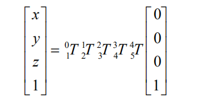

# 8. Inverse Kinematics Basic and Application

## 8.1 Arduino Developement

### 8.1.1 Establish robotic Arm Coordinate System

* **Coordinate System Introduction**

The Cartesian coordinate system is mostly used to describe the spatial position, speed and acceleration, which is well known as a coordinate system composed of three mutually perpendicular coordinate axes. When talking about how many angles of rotation around a given axis, the positive direction is determined over the right-hand rule, as shown below:


* **Position, Translation Swap**

The position is represented by a three-dimensional vector, and the translation transformation is the transformation of the coordinate system space position, which can be represented by the position vector of the coordinate system origin O, as shown in the figure below. Multiple translation transformations are also very simple. You can find the coordinates of a point in space in the coordinate system {B} after translation transformation by adding directly between vectors.


* **Angle/Direction, Rotation Transformation**

Compared with the position, the representation method of the bearing is relatively troublesome. Before discussing the bearing , it is necessary to explain one point: the three-dimensional position and orientation of an object are usually "attached" to the object with a coordinate system that moves and rotates with it, and then by describing the coordinate system and the reference coordinate system Relationship to describe this object.

Describing the position and orientation of an object in the coordinate system can be equivalently understood as describing the relationship between the coordinate systems. We talk about angle/direction notation here, as long as we talk about the relationship between two coordinate systems. To know how and how much a coordinate system is rotated relative to another coordinate system, what should be done? Let's start with the two-dimensional situation:


By coordinate axis unit vector with the reference coordinate system expressing, though reference the picture we can directly written the following formula:


We define a 2x2 matrix:


Obviously, each column of this matrix is the representation of the coordinate axis unit vector of coordinate system B in the coordinate system. With this matrix, we can draw the x-axis and y-axis of coordinate system B and determine the unique orientation of B.

* **Rotation Matrix**

The three-dimensional orientation of space is relatively more complicated, because the orientation of the coordinates on the plane can only have one degree of freedom, that is, to rotate around the axis of the vertical plane. The orientation of objects in space will have three degrees of freedom. However, if we start from the first method in the figure above, we can easily write a 3×3 R matrix, which we call the rotation matrix:


This formula shows that in the rotation matrix from the coordinate system {B} to the coordinate system {A}, each column is the representation of the coordinate axis unit vector of the coordinate system {B} in the coordinate system {A}.

### 8.1.2 Brief Analysis of Forward Kinematics

* **DH Parameter Introduction**

The DH parameter is a mechanical arm mathematical model and coordinate system determination system that uses four parameters to express the position and angle relationship between two pairs of joint links. As we will see below, it artificially reduces two degrees of freedom by limiting the position of the origin and the direction of the X axis, so it only needs four parameters to define a coordinate system with six degrees of freedom.

The four parameters selected by DH have very clear physical meanings, as follows:

(1) link length : The length of the common normal between the axes of the two joints (Rotation axis of rotation joint, translation axis of translation joint)

(2) link twist: The angle at which the axis of one joint rotates around their common normal relative to the axis of the other joint

(3) link offset: The common normal of one joint and the next joint and the distance between the common normal of one joint and the previous joint along this joint axis

(4) joint angle: The common normal of one joint and the next joint and the angle of rotation around the joint axis with the common normal of the previous joint

The above definition is very complicated, but it will be much clearer when combined with the coordinate system.

First of all you should pay attention to the two most important "lines": the joint axis, and the common normal between the axis joint and the adjacent joint.

In the DH parameter system, we set axis as the z axis; common normal as the x axis, and the direction of the x axis is: from this joint to the next joint.

Of course, these two rules alone are not enough to completely determine the coordinate system of each joint. Let's talk about the steps to determine the coordinate system in detail below.

In applications such as the simulation of the robotic arm, we often adopt other methods to establish the coordinate system, but mastering the methods mentioned here is necessary for you to understand the mathematical expression of the robotic arm and understand our subsequent analysis.

The figure below shows two typical robot joints. Although such joints and links are not necessarily similar to the joints and links of any actual robot, they are very common and can easily represent any joint of the actual robot.


* **Determine the Coordinate System**

To determine the coordinate system, there are generally the following steps:

In order to model the robot with DH notation, the first thing is to specify a local ground reference coordinate system for each joint, so a Z axis and an X axis must be specified for each joint.

Specify the Z axis. If the joint is rotating, the Z axis is in the direction of rotation according to the right-hand rule. The rotation angle around the Z axis is a variable of the joint; if the joint is a sliding joint, the Z axis is the direction of movement along a straight line. The link length d along the Z axis is the joint variable.

Specify the X axis.When the two joints are not parallel or intersect, the Z axis is usually a diagonal line, but there is always a common vertical line with the shortest distance, which is orthogonal to any two diagonal lines. Define the X axis of the local reference coordinate system in the direction of the common perpendicular. If an represents the common perpendicular between Zn1, the direction of Xn will be along an.

Of course there are special circumstances. When the Z axes of the two joints are parallel, there will be countless common perpendiculars. At this time, you can select the one that is collinear with the common perpendicular of the previous joint, which can simplify the model; if two joints intersect, there is no common perpendicular between them. In this case, the line perpendicular to the plane formed by the two axes can be defined as X Shaft can simplify the model.

After attaching the corresponding coordinate system to each joint, as shown in the following figure:


After determining the coordinate system, we can express the above four parameters in a more concise way:

link length *αi*− 1: the distance from *Zi*−1 to *Zi* along *Xi*−1

link twist *αi*−1 : *Zi* the angle of *Zi* relative to *Zi*−1 to rotate around *Xi*−1

link offset *i d :*the distance from *Xi*−1 to *Xi*−1 along *Zi*

joint angle *θi : Xi* relative to *Xi*−1 around *Zi*

Next we can write the DH parameter table of the robotic arm:


According to the formula: 

We can calculate each joint at once, and finally get the positive kinematics formula of the robotic arm:


After obtaining the rotation matrix of each joint, the coordinates of the end can be obtained according to the following formula:



### 8.1.3 Brief Analysis of Inverse Kinematics

* **Inverse Kinematics Introduction**

Inverse kinematics is the process of determining the parameters of the robot joints to be set to reach a desired position.

The inverse kinematics of the robotic arm is an crucial foundation for the trajectory planning and control. Whether the inverse kinematics is fast and accurate to get solution will directly affect the accuracy of the robotic arm's trajectory planning and control. Therefore, for the six-degree-of-freedom robotic arm, a fast and accurate inverse kinematics solution method is very important.

* **Brief Analysis of Inverse Kinematics**

For robotic arm, given the position and the orientation of the end-effector, the rotation angle of each joint can be calculated. The three-dimensional motion of robotic arm is relatively complex. To simplify the model, we remove the rotation joint of the below pan-tilt so that the kinematic analysis can be performed in a two-dimensional plane.

Performing inverse kinematic analysis generally involves a large number of matrix operations, which is a complex and computationally intensive process and therefore difficult to implement. In order to better fit our needs, we use the geometric method to analyze the robotic arm.


We can consider the MaxArm robotic arm as a special 3-link robotic arm. According to the above figure, we simplify the inverse motion of the robotic arm to the solution of two angles α, β.

Given `l1` and `l2`, according to `S2`=`rx2`+`ry2`

∠α=arccos\[(`l1`2+`l2`2-`S2`)/2`l1``l2`\]

∠β=arccos\[(`l1`2+`S2`-`l2`2)/2`l1``S`\]

∠c=π-∠α-∠β

∠b1=arcsin(`rx`/`S`)

∠c1=π/2-arcsin(`rx`/`S`)

∠β=∠b1+∠b

Through calculation,

∠α=arccos\[`l1`2+`l2`2-(`rx`2+`ry`2)/2`l1``l2`\]

∠β=arccos\[`l1`2-`l2`2+`rx`2+`ry`2/2`l1`√`rx`2+`ry`2\]

Calculate the angle of ∠α and ∠β, and ∠β is the rotation angle of ID2.

Then get from the figure above,


The angle of rotation of the ID3 servo, ∠c, is obtained by the parallelogram relationship for ∠α.

∠b=∠α

∠c=180°-∠β -∠α


Based on the above figure, the angle of ID1 servo is θ. Thus,

θ=arctan(`x`/`y`)

Finally, the final angle is determined by determining the quadrant in which the position is located based on the positive and negative relationship between `x` and `y`.

* **The path of inverse kinematics program**

You can view the inverse kinematics encapsulation library in [**"Appendix/ 8. Controller Underlying Files/ Arduino Development"**](Appendix.md). The code instructions can refer to the annotation of corresponding program.


### 8.1.4 Move on XYZ Axis

* **Working Principle**

Call the related kinematics functions by calling `espmax` kinematics encapsulation library to realize the movement of robotic arm on xyz axes.

The path to the program of the source code is [7. Inverse Kinematics Basics and Application/Arduino Development/Lesson 4 The Movement on XYZ Axes/Program File/kinematics_move/kinematics_move.ino](../_static/source_code/AI_Vision.zip)

{lineno-start=1}

```c++
#include "ESPMax.h"
#include "_espmax.h"

// Inverse kinematics three-axis movement example (逆运动学三轴移动例程)

void setup(){
    ESPMax_init();
    go_home(2000); // Move arm to home position (机械臂回到初始位置)
    Serial.begin(9600);
    Serial.println("start...");
}

bool start_en = true;
void loop(){
  if(start_en){
    float x,y,z;
    float pos[3];
    // XYZ coordinates of the arm's initial position (机械臂初始位置的XYZ位置)
    x = 0;
    y = -(L1 + L3 + L4);
    z = (L0 + L2);
    // Print XYZ coordinates via serial, unit: mm (串口打印XYZ位置，单位毫米)
    Serial.print(x);
    Serial.print("; ");
    Serial.print(y);
    Serial.print("; ");
    Serial.println(z);

    // The initial position is at the edge of the arm's workspace, so move down first， otherwise the arm cannot move along X and Y axes（机械臂初始位置已经是处于机械臂可移动空间的边缘了，所以要先下移，否则机械臂是无法在X、Y轴上移动的）
    // set_position(pos,t), pos={x,y,z}; x: x coordinate, y: y coordinate, z: z coordinate, t: total movement time (longer time = slower speed) (设置机械臂位置函数，pos={x,y,z}，t为移动总时间（时间越长，速度越慢）)
```

* **Preparation**

(1) Hardware

MaxArm robotic arm, power adapter, USB cable.

(2) Software

Please connect MaxArm to Arduino editor according to the tutorial in folder [4. MaxArm Underlying Program/Python Development/Lesson 1 Set Development Environment](4.Underlying_Program_Learning_checked.md#anchor_4_3).

* **Program Download**

[Source Code](../_static/source_code/Inverse_Kinematics_Basic_and_Application.zip)

(1) Click on  icon to open Arduino IDE.


(2) Click **"File--Open"** in turn.


(3) Select the program **"kinematics_move.ino"** in the folder [**"7. Inverse Kinematics Basics and Application/Arduino Development/Lesson 4 The Movement on XYZ Axes/Program File/kinematics_move"**](../_static/source_code/AI_Vision.zip).


(4) Select the model of the development board. Click **"Tools-- Board"** and select **"ESP 32 Dev Module"** (If the model of the development board has been configured when setting the development environment, you can skip this step).


(5) Select the corresponding port of Arduino controller in **"Tools--Port"**. (Here take the port **"COM5"** as example. Please select the port based on your computer. If COM1 appears, please do not select because it is the system communication port but not the actual port of the development port.)


(6) If you're not sure about the port number, please open the **"This PC"** and click **"Properties--Device Manger"** in turns to check the corresponding port number (the device is with CH340). Then select the correct port on Arduino editor.


(7) After selecting, confirm the board **"ESP32 Dev Module"** in the lower right corner and the port number **"COM5"** (it is an example here, please refer to the actual situation).


(8) Then click on  icon to verify the program. If no error, the status area will display **"Compiling--Compile complete"** in turn. After compiling, the information such as the current used bytes, and occupied program storage space will be displayed.


(9) After compiling, click on  icon to upload the program to the development board. The status area will display **"Compiling--Uploading--Complete"** in turn. After uploading, the status area will stop printing the uploading information.


* **Project Outcome**

When running the program, the robotic arm will move up and down along z axis, then move to the left and the right along x axis, and then move forwards and backwards along y axis. After the program stops, exit automatically.

* **Program Analysis**

(1) Import Library File

Before the robotic arm starts to move, the Python function libraries related to the kinematics and bus servo need to be imported.

{lineno-start=1}
```c++
#include "ESPMax.h"
#include "_espmax.h"
```
(2) Read position

The initial position xyz of the robotic arm is calculated, and the value of `xyz` is printed.

{lineno-start=19}
```cpp
   x = 0;
    y = -(L1 + L3 + L4);
    z = (L0 + L2);
    // Print XYZ coordinates via serial, unit: mm (串口打印XYZ位置，单位毫米)
    Serial.print(x);
    Serial.print("; ");
    Serial.print(y);
    Serial.print("; ");
    Serial.println(z);
```
(3) Control Robotic Arm

Robotic arm starts to move on xyz axes.

{lineno-start=32}
```cpp
  pos[0] = x; pos[1] = y; pos[2] = z-100;
    set_position(pos,2000); // Move down 100mm along Z axis from initial position (Z轴相对初始位置下移100毫米)
    delay(2000);
    pos[0] = x; pos[1] = y; pos[2] = z-50;
    set_position(pos,1000); // Move down 50mm along Z axis from initial position (Z轴相对初始位置下移50毫米)
    delay(1000);

    pos[0] = x-50; pos[1] = y; pos[2] = z-50;
    set_position(pos,1000); // Move 50mm left along X axis from initial position (X轴相对初始位置左移50毫米)
    delay(1000);
```
The robotic arm is controlled by `set_position()` function. Take the code `set_position(pos,2000)` as example:

The first parameter `pos` represents the position of the robotic arm on x, y and z axes. Among them, `pos[0]` represents the coordinate of x axis, `pos[1]` represents the coordinate of y axis, and `pos[2]` represents the coordinate of z-axis.

The second parameter `200` represents the running time and the unit is ms.

### 8.1.5 Drawing Cross

* **Working Principle**

Call the related kinematics functions by calling `espmax` kinematics encapsulation library so that the robotic arm can realize the path planning for drawing **"cross"**.

The path to the program of the source code is [7. Inverse Kinematics Basics and Application/Arduino Development/Lesson 5 Drawing Cross/Program File/cross/cross.ino](../_static/source_code/AI_Vision.zip).

{lineno-start=1}

```cpp
#include "ESPMax.h"
#include "_espmax.h"

// Inverse kinematics cross drawing example (逆运动学画十字例程)

void setup(){
    ESPMax_init();
    go_home(2000); // Move arm to home position (机械臂回到初始位置)
    Serial.begin(9600);
    Serial.println("start...");
}

bool start_en = true;
void loop(){
  if(start_en){
    float pos[3];
    // set_position(pos,t), pos[0]: x coordinate, pos[1]: y coordinate, pos[2]: z coordinate, t: total movement time (longer time = slower speed) (设置机械臂位置函数，pos[0]: x轴坐标, pos[1]: y轴坐标, pos[2]: z轴坐标, t: 移动的总时间（时间越长，速度越慢）)

    // Draw vertical line (画竖边)
    pos[0] = 0; pos[1] = -120; pos[2] = 80;
    set_position(pos,1500); 
    delay(1500);

    pos[0] = 0; pos[1] = -280; pos[2] = 75;
    set_position(pos,1000); 
    delay(1200);

    pos[0] = 0; pos[1] = -280; pos[2] = 150;
    set_position(pos,500); 
```

* **Preparation**

(1) Hardware

MaxArm robotic arm, power adapter, USB cable.

(2) Software

Please connect MaxArm to the Arduino editor according to the tutorial in folder [4. MaxArm Underlying Program/Python Development/Lesson 1 Set Development Environment](4.Underlying_Program_Learning_checked.md#anchor_4_3).

* **Program Download**

[Source Code](../_static/source_code/Inverse_Kinematics_Basic_and_Application.zip)

(1) Click on  icon to open Arduino IDE.


(2) Click **"File--Open"** in turn.


(3) Select the program **"cross.ino"** in the folder [**"7. Inverse Kinematics Basics and Application/Arduino Development/Lesson 5 Drawing Cross/Program File/cross"**](../_static/source_code/AI_Vision.zip).


(4) Select the model of the development board. Click **"Tools-- Board"** and select **"ESP 32 Dev Module"** (If the model of the development board has been configured when setting the development environment, you can skip this step).


(5) Select the corresponding port of Arduino controller in **"Tools--Port"**. (Here take the port **"COM5"** as example. Please select the port based on your computer. If COM1 appears, please do not select because it is the system communication port but not the actual port of the development port.)


(6) If you're not sure about the port number, please open the **"This PC"** and click **"Properties--Device Manger"** in turns to check the corresponding port number (the device is with CH340). Then select the correct port on Arduino editor.


(7) After selecting, confirm the board **"ESP32 Dev Module"** in the lower right corner and the port number **"COM5"** (it is an example here, please refer to the actual situation).


(8) Then click on  icon to verify the program. If no error, the status area will display **"Compiling--Compile complete"** in turn. After compiling, the information such as the current used bytes, and occupied program storage space will be displayed.


(9) After compiling, click on  icon to upload the program to the development board. The status area will display **"Compiling--Uploading--Complete"** in turn. After uploading, the status area will stop printing the uploading information.


* **Project Outcome**

When running program, the robotic arm will be controlled to draw **"cross"**. After stopping, exit the program automatically.

* **Program Analysis**

(1) Import Function File

Before the robotic arm starts to move, the kinematics, bus servo and other related library function need to be called.

{lineno-start=1}
```cpp
#include "ESPMax.h"
#include "_espmax.h"
```
(2) Return to the Initial Position

Firstly, use `go_home()` function in function library to control the robotic arm to move to the initial position. The specific program is as follow:

{lineno-start=7}
```cpp
    ESPMax_init();
    go_home(2000); // Move arm to home position (机械臂回到初始位置)
    Serial.begin(9600);
    Serial.println("start...");
}
```
(3) Control Robotic Arm

Robotic arm starts to move on xyz axes.

{lineno-start=20}
```cpp
    pos[0] = 0; pos[1] = -120; pos[2] = 80;
    set_position(pos,1500); 
    delay(1500);

    pos[0] = 0; pos[1] = -280; pos[2] = 75;
    set_position(pos,1000); 
    delay(1200);
```
The robotic arm is controlled by `set_position()` function. Take the code `set_position(pos，1500)` as example:

The first parameter `pos` represents the position of the robotic arm on x, y and z axes. Among them, `pos[0]` represents the coordinate of x axis, `pos[1]` represents the coordinate of y axis, and `pos[2]` represents the coordinate of z-axis.

The second parameter `1500` represents the running time and the unit is ms.

### 8.1.6 Drawing Square

* **Working Principle**

Call the related kinematics functions by calling `espmax` kinematics encapsulation library so that the robotic arm can realize the path planning for drawing **"square"**.

The path to the program of the source code is [7. Inverse Kinematics Basics and Application/Arduino Development/Lesson 6 Drawing Square/ square/square.ino](../_static/source_code/AI_Vision.zip)

{lineno-start=1}

```cpp
#include "ESPMax.h"
#include "_espmax.h"

// Inverse kinematics square drawing example (逆运动学画正方形例程)

void setup(){
    ESPMax_init();
    go_home(2000); // Move arm to home position (机械臂回到初始位置)
    Serial.begin(9600);
    Serial.println("start...");
}

bool start_en = true;
void loop(){
  if(start_en){
    float pos[3];
    // set_position(pos,t), pos[0]: x coordinate, pos[1]: y coordinate, pos[2]: z coordinate, t: total movement time (longer time = slower speed) （set_position(pos,t), pos[0]: x轴坐标, pos[1]: y轴坐标, pos[2]: z轴坐标, t: 移动的总时间（时间越长，速度越慢））

    // Move arm to starting point (机械臂运行到起始点)
    pos[0] = 50; pos[1] = -260; pos[2] = 80;
    set_position(pos,2000); 
    delay(3000);

    // Draw top horizontal edge (画上横边)
    for(int i=50; i > -50; i -= 5){
      pos[0] = i; pos[1] = -260; pos[2] = 80;
      set_position(pos,30); 
      delay(30);
    }
    delay(500);
```

* **Preparation**

(1) Hardware

MaxArm robotic arm, power adapter, USB cable.

(2) Software

Please connect MaxArm to the Arduino editor according to the tutorial in folder [4. MaxArm Underlying Program/Python Development/Lesson 1 Set Development Environment](4.Underlying_Program_Learning_checked.md#anchor_4_3).

* **Program Download**

[Source Code](../_static/source_code/Inverse_Kinematics_Basic_and_Application.zip)

(1) Click on  icon to open Arduino IDE.


(2) Click **"File--Open"** in turn.


(3) Select the program `square.ino` in the folder [7. Inverse Kinematics Basics and Application/Arduino Development/Lesson 6 Drawing Square/Program File/square](../_static/source_code/AI_Vision.zip).


(4) Select the model of the development board. Click **"Tools-- Board"** and select **"ESP 32 Dev Module"** (If the model of the development board has been configured when setting the development environment, you can skip this step).


(5) Select the corresponding port of Arduino controller in **"Tools--Port"**. (Here take the port **"COM5"** as example. Please select the port based on your computer. If COM1 appears, please do not select because it is the system communication port but not the actual port of the development port.)


(6) If you're not sure about the port number, please open the **"This PC"** and click **"Properties--Device Manger"** in turns to check the corresponding port number (the device is with CH340). Then select the correct port on Arduino editor.


(7) After selecting, confirm the board **"ESP32 Dev Module"** in the lower right corner and the port number **"COM5"** (it is an example here, please refer to the actual situation).


(8) Then click on  icon to verify the program. If no error, the status area will display **"Compiling--Compile complete"** in turn. After compiling, the information such as the current used bytes, and occupied program storage space will be displayed.


(9) After compiling, click on  icon to upload the program to the development board. The status area will display **"Compiling--Uploading--Complete"** in turn. After uploading, the status area will stop printing the uploading information.


* **Project Outcome**

When running program, the robotic arm will be controlled to draw **"square"**. After stopping, exit the program automatically.

* **Program Analysis**

(1) Import Function File

Before the robotic arm starts to move, the kinematics, bus servo and other related library function need to be called.

{lineno-start=1}
```cpp
#include "ESPMax.h"
#include "_espmax.h"
```
(2) Return to the Initial Position

Firstly, use `go_home()` function in function library to control the robotic arm to move to the initial position. The specific program is as follow:

{lineno-start=7}
```cpp
    ESPMax_init();
    go_home(2000); // Move arm to home position (机械臂回到初始位置)
    Serial.begin(9600);
    Serial.println("start...");
}
```

(3) Control Robotic Arm

Robotic arm starts to move on xyz axes.

{lineno-start=20}
```cpp
    pos[0] = 50; pos[1] = -260; pos[2] = 80;
    set_position(pos,2000); 
    delay(3000);

    // Draw top horizontal edge (画上横边)
    for(int i=50; i > -50; i -= 5){
      pos[0] = i; pos[1] = -260; pos[2] = 80;
      set_position(pos,30); 
      delay(30);
```

The robotic arm is controlled by `set_position()` function. Take the code `set_position(pos,2000)` as example:

The first parameter `pos` represents the position of the robotic arm on x, y and z axes. Among them, `pos[0]` represents the coordinate of x axis, `pos[1]` represents the coordinate of y axis, and `pos[2]` represents the coordinate of z-axis.

The second parameter **"2000"** represents the running time and the unit is ms.

## 8.2 Python Development

### 8.2.1 Establish robotic Arm Coordinate System

* **Coordinate System Introduction**

Most of the descriptions of spatial position, speed and acceleration are in Cartesian coordinate system, which is well known as a coordinate system composed of three mutually perpendicular coordinate axes.When we say how many angles to rotate around a certain axis, the right-hand rule is used to determine the positive direction, as shown below:


* **Position, Translation Swap**

The position is represented by a three-dimensional vector, and the translation transformation is the transformation of the coordinate system space position, which can be represented by the position vector of the coordinate system origin O, as shown in the figure below. Multiple translation transformations are also very simple. You can find the coordinates of a point in space in the coordinate system {B} after translation transformation by adding directly between vectors.


* **Angle/Direction, Rotation Transformation**

Compared with the position, the representation method of the bearing is relatively troublesome. Before discussing the bearing , it is necessary to explain one point: the three-dimensional position and orientation of an object are usually "attached" to the object with a coordinate system that moves and rotates with it, and then by describing the coordinate system and the reference coordinate system Relationship to describe this object.

Describing the position and orientation of an object in the coordinate system can be equivalently understood as describing the relationship between the coordinate systems. We talk about angle/direction notation here, as long as we talk about the relationship between two coordinate systems. To know how and how much a coordinate system is rotated relative to another coordinate system, what should be done? Let's start with the two-dimensional situation:


By coordinate axis unit vector with the reference coordinate system expressing, though reference the picture we can directly written the following formula:


We define a 2x2 matrix:


Obviously, each column of this matrix is the representation of the coordinate axis unit vector of coordinate system B in the coordinate system. With this matrix, we can draw the x-axis and y-axis of coordinate system B and determine the unique orientation of B.

* **Rotation Matrix**

The three-dimensional orientation of space is relatively more complicated, because the orientation of the coordinates on the plane can only have one degree of freedom, that is, to rotate around the axis of the vertical plane. The orientation of objects in space will have three degrees of freedom. However, if we start from the first method in the figure above, we can easily write a 3×3 R matrix, which we call the rotation matrix:


This formula shows that in the rotation matrix from the coordinate system {B} to the coordinate system {A}, each column is the representation of the coordinate axis unit vector of the coordinate system {B} in the coordinate system {A}.

### 8.2.2 Brief Analysis of Forward Kinematics

* **DH Parameter Introduction**

The DH parameter is a mechanical arm mathematical model and coordinate system determination system that uses four parameters to express the position and angle relationship between two pairs of joint links. As we will see below, it artificially reduces two degrees of freedom by limiting the position of the origin and the direction of the X axis, so it only needs four parameters to define a coordinate system with six degrees of freedom.

The four parameters selected by DH have very clear physical meanings, as follows:

(1) link length : The length of the common normal between the axes of the two joints (Rotation axis of rotation joint, translation axis of translation joint)

(2) link twist: The angle at which the axis of one joint rotates around their common normal relative to the axis of the other joint

(3) link offset: The common normal of one joint and the next joint and the distance between the common normal of one joint and the previous joint along this joint axis

(4) joint angle: The common normal of one joint and the next joint and the angle of rotation around the joint axis with the common normal of the previous joint

The above definition is very complicated, but it will be much clearer when combined with the coordinate system.

First of all you should pay attention to the two most important "lines": the joint axis, and the common normal between the axis joint and the adjacent joint.

In the DH parameter system, we set axis as the z axis; common normal as the x axis, and the direction of the x axis is: from this joint to the next joint.

Of course, these two rules alone are not enough to completely determine the coordinate system of each joint. Let's talk about the steps to determine the coordinate system in detail below.

In applications such as the simulation of the robotic arm, we often adopt other methods to establish the coordinate system, but mastering the methods mentioned here is necessary for you to understand the mathematical expression of the robotic arm and understand our subsequent analysis.

The figure below shows two typical robot joints. Although such joints and links are not necessarily similar to the joints and links of any actual robot, they are very common and can easily represent any joint of the actual robot.


* **Determine the Coordinate System**

To determine the coordinate system, there are generally the following steps:

In order to model the robot with DH notation, the first thing is to specify a local ground reference coordinate system for each joint, so a Z axis and an X axis must be specified for each joint.

Specify the Z axis. If the joint is rotating, the Z axis is in the direction of rotation according to the right-hand rule. The rotation angle around the Z axis is a variable of the joint; if the joint is a sliding joint, the Z axis is the direction of movement along a straight line. The link length d along the Z axis is the joint variable.

Specify the X axis.When the two joints are not parallel or intersect, the Z axis is usually a diagonal line, but there is always a common vertical line with the shortest distance, which is orthogonal to any two diagonal lines. Define the X axis of the local reference coordinate system in the direction of the common perpendicular. If an represents the common perpendicular between Zn1, the direction of Xn will be along an.

Of course there are special circumstances. When the Z axes of the two joints are parallel, there will be countless common perpendiculars. At this time, you can select the one that is collinear with the common perpendicular of the previous joint, which can simplify the model; if two joints intersect, there is no common perpendicular between them. In this case, the line perpendicular to the plane formed by the two axes can be defined as X Shaft can simplify the model.

After attaching the corresponding coordinate system to each joint, as shown in the following figure:


After determining the coordinate system, we can express the above four parameters in a more concise way:

link length *αi*− 1: the distance from *Zi*−1 to *Zi* along *Xi*−1

link twist *αi*−1 : *Zi* the angle of *Zi* relative to *Zi*−1 to rotate around *Xi*−1

link offset *i d :*the distance from *Xi*−1 to *Xi*−1 along *Zi*

joint angle *θi : Xi* relative to *Xi*−1 around *Zi*

Next we can write the DH parameter table of the robotic arm:


According to the formula: 

We can calculate each joint at once, and finally get the positive kinematics formula of the robotic arm:


After obtaining the rotation matrix of each joint, the coordinates of the end can be obtained according to the following formula:


### 8.2.3 Brief Analysis of Inverse Kinematics

* **Inverse Kinematics Introduction**

Inverse kinematics is the process of determining the parameters of the robot joints to be set to reach a desired position.

The inverse kinematics of the robotic arm is an crucial foundation for the trajectory planning and control. Whether the inverse kinematics is fast and accurate to get solution will directly affect the accuracy of the robotic arm's trajectory planning and control. Therefore, for the six-degree-of-freedom robotic arm, a fast and accurate inverse kinematics solution method is very important.

* **Brief Analysis of Inverse Kinematics**

For robotic arm, given the position and the orientation of the end-effector, the rotation angle of each joint can be calculated. The three-dimensional motion of robotic arm is relatively complex. To simplify the model, we remove the rotation joint of the below pan-tilt so that the kinematic analysis can be performed in a two-dimensional plane.

Performing inverse kinematic analysis generally involves a large number of matrix operations, which is a complex and computationally intensive process and therefore difficult to implement. In order to better fit our needs, we use the geometric method to analyze the robotic arm.


We can consider the MaxArm robotic arm as a special 3-link robotic arm. According to the above figure, we simplify the inverse motion of the robotic arm to the solution of two angles α, β.

Given `l1` and `l2`, according to `S2`=`rx2`+`ry2`

∠α=arccos\[(`l1`2+`l2`2-`S2`)/2`l1``l2`\]

∠β=arccos\[(`l1`2+`S2`-`l2`2)/2`l1``S`\]

∠c=π-∠α-∠β

∠b1=arcsin(`rx`/`S`)

∠c1=π/2-arcsin(`rx`/`S`)

∠β=∠b1+∠b

Through calculation,

∠α=arccos\[`l1`2+`l2`2-(`rx`2+`ry`2)/2`l1``l2`\]

∠β=arccos\[`l1`2-`l2`2+`rx`2+`ry`2/2`l1`√`rx`2+`ry`2\]

Calculate the angle of ∠α and ∠β, and ∠β is the rotation angle of ID2.

Then get from the figure above,


The angle of rotation of the ID3 servo, ∠c, is obtained by the parallelogram relationship for ∠α.

∠b=∠α

∠c=180°-∠β -∠α


Based on the above figure, the angle of ID1 servo is θ. Thus,

θ=arctan(`x`/`y`)

Finally, the final angle is determined by determining the quadrant in which the position is located based on the positive and negative relationship between `x` and `y`.

* **The path of inverse kinematics program**

You can view the inverse kinematics encapsulation library in [**"Appendix/ 8. Controller Underlying Files/ Arduino Development"**](Appendix.md). The code instructions can refer to the annotation of corresponding program.


### 8.2.4 Move on XYZ Axis

* **Preparation**

(1) Software

Please connect MaxArm to Python editor according to the tutorial in folder [4. MaxArm Underlying Program Learning/Python Development/Lesson 1 Set Development Environment](4.Underlying_Program_Learning_checked.md#anchor_4_3).

* **Working Principle**

Call the function related to the kinematics by calling `espmax` kinematics encapsulation library to realize the movement of robotic arm on xyz axes.

**The path to the kinematics encapsulation library** is [**"Appendix/8.Underlying File/Python Development/espmax.py"**](Appendix.md).

* **Program Download**

[Source Code](../_static/source_code/Inverse_Kinematics_Basic_and_Application.zip)

After connecting, change the path of Workspace to [8. Inverse Kinematics Basic and Application/ Lesson 4 The Movement on XYZ Axes/Program File](../_static/source_code/Inverse_Kinematics_Basic_and_Application.zip).


(1) Double click **"Workshop"** folder, and then double click **"main.py"** to open the program.


(2) Then right click to download the program files to the controller.


(3) When the terminal prints the prompt as shown in the image below, it means download completed.


(4) After downloading, click on the reset icon or press the reset button on ESP32 controller to run program.


* **Project Outcome**

When running the program, the robotic arm will move up and down along z axis, then move to the left and the right along x axis, and then move forwards and backwards along y axis. After the program stops, exit automatically.

* **Program Analysis**

(1) Import Library File

Before the robotic arm starts to move, the Python function libraries related to the kinematics and bus servo need to be imported.

{lineno-start=1}
```python
import time
from espmax import ESPMax
from BusServo import BusServo
```
(2) Read Position

Use `arm.ORIGIN` function of the bus servo to read the xyz position corresponding to the initial position of the robotic arm.

{lineno-start=14}
```python
  (x,y,z) = arm.ORIGIN  # Read the initial XYZ position of the arm (读取机械臂初始位置的XYZ坐标)
  print(x,y,z)          # Print XYZ to serial, units in millimeters (串口打印XYZ位置，单位毫米)
```
(3) Control Robotic Arm

Start to move on xyz axes.

{lineno-start=20}
```python
  arm.set_position((x,y,z-100),2000) # Move Z axis down 100 mm relative to initial position (Z轴相对初始位置下移100毫米)
  time.sleep_ms(2000)
  arm.set_position((x,y,z-50),1000)  # Move Z axis down 50 mm relative to initial position (Z轴相对初始位置下移50毫米)
  time.sleep_ms(1000)
  
  arm.set_position((x-50,y,z-50),1000) # Move X axis left 50 mm (X轴相对初始位置左移50毫米)
  time.sleep_ms(1000)
  arm.set_position((x+50,y,z-50),2000) # Move X axis right 50 mm (X轴相对初始位置右移50毫米)
  time.sleep_ms(2000)
  arm.set_position((x,y,z-50),1000)    # Move X axis back to initial position (X轴回到初始位置)
  time.sleep_ms(1000)
  
  arm.set_position((x,y-50,z-50),1000) # Move Y axis backward 50 mm (Y轴相对初始位置后移50毫米)
  time.sleep_ms(1000)
  arm.set_position((x,y+50,z-50),2000) # Move Y axis forward 50 mm (Y轴相对初始位置前移50毫米)
  time.sleep_ms(2000)
  arm.set_position((x,y,z-50),1000)    # Move Y axis back to initial position (Y轴回到初始位置)
  time.sleep_ms(1000)
```
Take the code `arm.set_position((x,y,z-100),2000)` as example:

The first parameter `(x,y,z-100)` represents the position of the suction nozzle on xyz axes.

The second parameter `200` represents the running time and the unit is ms.

### 8.2.5 Drawing Cross

* **Preparation**

(1) Software

Please connect MaxArm to Python editor according to the tutorial in folder [4. Underlying Program Learning/Python Development/Lesson 1 Set Development Environment](4.Underlying_Program_Learning_checked.md#anchor_4_3).

* **Working Principle**

Firstly, import the kinematics encapsulation library `espmax` and instantiate the library function.

**The path to the kinematics encapsulation library** is [**"Appendix/8.Underlying File/Python Development/espmax.py"**](Appendix.md).

Then, specify the initial position of the robot arm and do the path planning for drawing **"cross"**.

Finally, call the `arm.set_position()` function. According to the position of xyz axes in space and kinematics, get the servo angle and complete the path planning for drawing **"cross"**.

* **Program Download**

[Source Code](../_static/source_code/Inverse_Kinematics_Basic_and_Application.zip)

(1) After connecting, change the path of Workspace to [8. Inverse Kinematics Basic and Application/ Lesson 5 Drawing Cross/Program File](../_static/source_code/Inverse_Kinematics_Basic_and_Application.zip).


(2) Double click **"Workshop"** folder, and then double click **"main.py"** to open the program.


(3) Then right click to download the program files to the controller.


(4) When the terminal prints the prompt as shown in the image below, it means download completed.


(5) After downloading, click on the reset icon or press the reset button on ESP32 controller to run program.


* **Project Outcome**

When running program, the robotic arm will be controlled to draw **"cross"**. After stopping, exit the program automatically.

* **Program Analysis**

(1) Import Function File

Before the robotic arm starts to move, the function libraries `espmax` and `BusSerb` need to be imported.

{lineno-start=1}
```python
import time
from espmax import ESPMax
from BusServo import BusServo
```
(2) Instantiate library function

Instantiate the functions importing to the function library for later debugging.

{lineno-start=7}
```python
# Instantiate library objects (实例化库函数)
bus_servo = BusServo()
arm = ESPMax(bus_servo)
```
(3) Return to the initial position

Firstly, use `go_home()` function in function library to control the robotic arm to move to the initial position. The specific program is as follow:

{lineno-start=11}
```python
if __name__ == '__main__':
  # Move arm to home position (机械臂到初始位置)
  arm.go_home()
  time.sleep(2)
```
(4) Control Robotic Arm

{lineno-start=15}
```python
  # Draw vertical line (画竖边)
  arm.set_position((0,-120,80),1500)
  time.sleep(1.6)

  arm.set_position((0,-280,75),1000)
  time.sleep(1.2)

  arm.set_position((0,-280,150),500)
  time.sleep(0.8)
  # Move to upper-left of horizontal line (切换到横边的左端上方)
  arm.set_position((100,-200,150),1000)
  time.sleep(1.2)
  # Move to start of horizontal line (切换到横边的左端)
  arm.set_position((100,-200,80),500)
  time.sleep(0.6)
  # Draw horizontal line (画横边)
  for i in range(100,-101,-2):
    arm.set_position((i,-200,80),5)
    time.sleep_ms(5)
```
Use `arm.set_position()` function to control robotic arm to draw cross in space. Take the code `arm.set_position((0,-120,80),1500)` as example.

The first parameter `(0,-120,80)` is the position of the suction nozzle on xyz axes.

The second parameter `2000` is the running time and the unit is ms.

### 8.2.6 Drawing Square

* **Preparation**

(1) Software

Please connect MaxArm to Python editor according to the tutorial in folder

[4. Underlying Program Learning/Python Development/Lesson 1 Set Development Environment](4.Underlying_Program_Learning_checked.md#anchor_4_3).

* **Working Principle**

Firstly, import the kinematics encapsulation library `espmax` and instantiate the library function.

**The path to the kinematics encapsulation library** is [**"Appendix/8. Underlying File/Python Development/espmax.py"**](Appendix.md).

Then, specify the initial position of the robot arm and do the path planning for drawing **"square"**.

Finally, call the `arm.set_position()` function. According to the position of xyz axes in space and kinematics, get the servo angle and complete the path planning for drawing **"square"**.

* **Program Download**

[Source Code](../_static/source_code/Inverse_Kinematics_Basic_and_Application.zip)

(1) After connecting, change the path of Workspace to [8. Inverse Kinematics Basic and Application/Python Development/Lesson 6 Drawing Square/Program File](../_static/source_code/Inverse_Kinematics_Basic_and_Application.zip).


(2) Double click **"Workshop"** folder, and then double click **"main.py"** to open the program.


(3) Then right click to download the program files to the controller.


(4) When the terminal prints the prompt as shown in the image below, it means download completed.


(5) After downloading, click on the reset icon or press the reset button on ESP32 controller to run program.


* **Project Outcome**

When running program, the robotic arm will be controlled to draw **"square"**. After stopping, exit the program automatically.

* **Program Analysis**

(1) Import function file

Before the robotic arm starts to move, the function libraries `espmax` and `BusSerb` need to be imported.

{lineno-start=1}
```python
import time
from espmax import ESPMax
from BusServo import BusServo
```
(2) Instantiate library function

Instantiate the functions importing to the function library for later debugging.

{lineno-start=7}
```python
# Instantiate library functions (实例化库函数)
bus_servo = BusServo()
arm = ESPMax(bus_servo)
```
(3) Return to the initial position

Firstly, use `go_home()` function in function library to control the robotic arm to move to the initial position. The specific program is as follow:

{lineno-start=12}
```python
if __name__ == '__main__':
  # Move arm to home position (机械臂复位)
  arm.go_home()
  time.sleep(2)
```
(4) Control Robotic Arm

{lineno-start=17}
```python
  # Move arm to starting point (机械臂运行到起始点)
  arm.set_position((50,-260,80),2000)
  time.sleep(3)

  # Draw top horizontal line (画上横边)
  for i in range(50,-52,-5):
    arm.set_position((i,-260,80),30)
    time.sleep_ms(30)
  time.sleep(0.5)

  # Draw right vertical line (画右竖边)
  for i in range(-260,-158,5):
    arm.set_position((-50,i,80-(26+i/10)),30)
    time.sleep_ms(30)
  time.sleep(0.5)
```
Use `arm.set_position()` function to control robotic arm to draw cross in space. Take the code `arm.set_position((50,-260,80),2000)` as example.

The first parameter `(50,-260,80)` is the position of the suction nozzle on xyz axes.

The second parameter `2000` is the running time and the unit is ms.