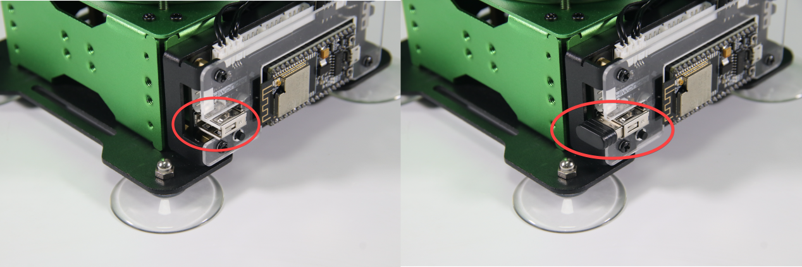
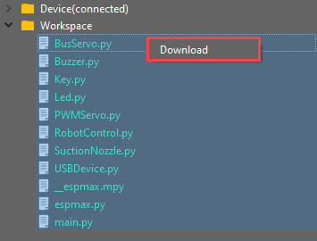

# 9. Sliding Rail Control

## 9.1 Sliding Rail Introduction and Assembly


## 9.2 Sliding Rail Control

### 9.2.1 Preparation

* **Rail Sliding Assembly**

There are two cables including `4PIN` and `3PIN` on sliding rail. The `4PIN` cable is required to connect to `IIC` interface of robot arm and `3PIN` cable to `3PIN` interface for supplying power. The specific wiring tutorial refers to [“Lesson Sliding Rail Introduction and Assembly”]() under the same directory path.

(1) Handle Receiver and Battery

① Insert the handle receiver to the controller, as the figure shown below:



② Prepare your own two tripe-A batteries. Remove the back shell of handle and load the batteries. Pay attention to the negative and positive poles of the batteries.


### 9.2.2 Operation

In this game, MaxArm will be assembled on sliding and controlled by wireless handle.

You can check the program in folder [“9. Sliding Rail Control/ Program Files/ main.py”]()

{lineno-start=145}

```python
    elif msg == PSB_UP | PSB_PRESS: # Robotic arm move along Y-axis negative direction (机械臂Y轴负方向移动)
      if arm.set_position((x, y+de, z),s): # Solve kinematics, move arm if solution exists (运动学求解，有解则移动机械臂)
        y += de   
        which_button_press = msg
      else: buzzer.setBuzzer(20)  # If no solution, buzzer alert (无解则蜂鸣器提示)
      
    elif msg == PSB_DOWN | PSB_PRESS:  # Move robotic arm in positive Y direction (机械臂Y轴正方向移动)
      if arm.set_position((x, y-de, z),s):
        y -= de
        which_button_press = msg
      else: buzzer.setBuzzer(20)
    
    elif msg == PSB_LEFT | PSB_PRESS: # Move robotic arm in positive X direction (机械臂X轴正方向移动)
      if arm.set_position((x-de, y, z),s):
        x += de
        which_button_press = msg
      else: buzzer.setBuzzer(20)
      
    elif msg == PSB_RIGHT | PSB_PRESS: # Move robotic arm in negative X direction (机械臂X轴负方向移动)
      if arm.set_position((x+de, y, z),s):
        x -= de
        which_button_press = msg
      else: buzzer.setBuzzer(20)  
      
    elif msg == PSB_L1 | PSB_PRESS: # Move robotic arm upwards along Z axis (机械臂Z轴上移动)
      if arm.set_position((x, y, z+de),s):
        z += de
        which_button_press = msg
      else: buzzer.setBuzzer(20)
      
    elif msg == PSB_L2 | PSB_PRESS: # Move robotic arm downwards along Z axis (机械臂Z轴下移动)
      if arm.set_position((x, y, z-de),s):
        z -= de
        which_button_press = msg
      else: buzzer.setBuzzer(20)
```

### 9.2.3 Program Download

[Source Code]()

Please connect MaxArm to Python editor according to the tutorial in folder [“4. MaxArm Underlying Program/Python Development/Lesson 1 Set Development Environment”]().

(1) After connecting, change the path of `Workspace` to [“9. Sliding Rail Control”]() and select the folder [“Handle Control Program”]().


① First click the folder [“Handle Control Program”]() and then select all the program files in the folder.


② Right click your mouse, and click **"Download"** to download all program files into the controller.



③ When the terminal prints the following prompt, it means download completed.


④ After downloading, click on the reset icon or press the reset button on `ESP32` controller to run program.


### 9.2.4 Wireless Handle Instruction

(1) Turn on MaxArm.

① Turn on handle. In the meantime, two LED lights (red and green) on the handle will flash simultaneously.

② Wait for a moment, MaxArm will pair with the handle automatically, and then LED light keeps on.

③ If fail to connect, please turn off the robotic arm and handle, and then repeat the steps above.

Sleep Mode: Do not connect with the handle after turning on within 30s or no operation on the handle within 5 min after connecting, it will enter the sleep mode. If want to **"wake it up"**, please press **"Start"** button.

The following list is the corresponding function of handle button (take robotic arm as the first person view).


| **Button** | **Function** | **Servo** |
|:---:|:---:|:---:|
| START | Return to the initial position | — |
| L1 | Suction nozzle moves up along z axis | ID2, ID3 servo |
| L2 | The suction nozzle moves down along z axis | |
| R1 | Turn on air pump | — |
| R2 | Turn off air pump | |
| **↑** | Suction nozzle moves forwards along y axis | ID2, ID3 servo |
| ↓ | Suction nozzle moves backwards along y axis | |
| **←** | suction nozzle moves to the left along x axis | ID4 servo |
| **→** | Suction nozzle moves to the right along x axis | |
| **□** | The suction nozzle moves to the right | — |
| **○** | Robotic arm moves to the left | |
| **△** | Air pump rotates clockwise | ID1 servo |
| **×** | Air pump rotates counterclockwise | ID1 servo |

:::{Note}
* The buttons in the left side (up, down, left, right) have same control effect as the left joystick. The buttons in the right side (□○△×) have same control effect as the right joystick.
* When robotic arm moves to the limit position, the buzzer will make sound to remind you. At this time, you need to reset MaxArm or control it to move in the opposite direction, otherwise, the device may be damaged.
:::